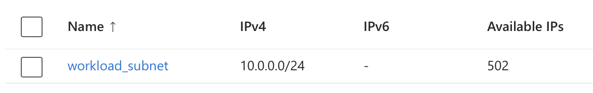

---

title: "Multiple prefixes on a subnet"
authors: simonpainter
tags:
  - azure
  - networks
  - cloud
date: 2025-03-07

---

I've been exploring a pretty niche feature preview that you can [find documented here](https://learn.microsoft.com/en-us/azure/virtual-network/how-to-multiple-prefixes-subnet?tabs=powershell). In some cases, you might want to expand the size of a subnet, but if you have a constrained IP space, you might not have contiguous space available. Here's what I've found you can do.
<!-- truncate -->

## Subnetting is such a pain

[Compared to AWS, there is a lot of flexibility in Azure](pint-of-cidr.md) around how you can add and remove CIDR ranges and subnets in a VNet. This lifts some of the burden on cloud network architects to get their IP addressing schema _just right_ the first time around. I say this because quite often they don't. 

The received wisdom is to allocate your application spokes with a single CIDR range like you have to in AWS. You want to account for everything you might need in that application spoke, so you pick out a suitable sized range to accommodate all of the things you're going to need.

- You'll need a Bastion subnet, unless you have a better (or cheaper) solution. Everything in Azure is a VM scale set if you look close enough, so you'll need an AzureBastionSubnet which is a /26 minimum.
- You're security conscious, so you'll want a firewall in there. It's another VM scale set, so you'll need AzureFirewallSubnet with another /26.
- You'll want your application to have an App Gateway. If you're using a WAF, then that puts more of a burden on the (you guessed it) VM scale set, so that's a /24 if you're following the guidance or a /25 if you aren't.

Either way, you've probably burned through at the very least a /24 before you've even landed a single VM into your application spoke. In reality, you've probably started off with a /23 and then carved that up to give everything what they need. 

If you're sharing more than one application in a spoke, then you'll have traded some economy of scale for having lots of applications in the same spoke and running your cloud network like you did your on-premise network. 

A /23 for an application spoke seems fine until you put that application in multiple regions, have it replicated in multiple environments, and then have hundreds of applications. Even in a single environment in a single region, you can scale out your application spokes to 500 on a single hub (although you probably won't want to), and that means you're looking at a /18 for each environment in each region.

## Time to expand that subnet

So you've been sensible and come up with your strict schema; you've avoided the complexity of t-shirt sizing, and you've allowed for all your various use cases with a single allocation. Then you need to expand it. What are your options?

First of all, you can add in another IP address range into your application vnet. You can do that with AWS too. That means you then need to create another application subnet and juggle things around. 

You could also make the subnet a bit bigger, but that's going to be troublesome if you don't have contiguous space in your allocation to expand into. If you don't have contiguous space, then your options have been a little limited and probably mean splitting things across two subnets and hoping for the best.

Now you can just add another prefix to the subnet, and so long as your automation can handle adding the necessary firewall rules, UDRs, and all that jazz, then it means you can expand the subnet with non-contiguous space from a completely different IP range.

## Once more unto the lab, dear friend

The documentation for this is linked right at the very top and contains a nice contrived example which I'll play with a little. First of all, you need to register the feature preview; _don't do this in a production subscription_.

```powershell
Register-AzProviderFeature 
    -FeatureName AllowMultipleAddressPrefixesOnSubnet 
    -ProviderNamespace Microsoft.Network
```

```powershell
Register-AzProviderFeature
    -FeatureName AllowDeletionOfIpPrefixFromSubnet 
    -ProviderNamespace Microsoft.Network
```

Once you have registered the feature, you're good to go. It won't work in the GUI yet, so you'll have to stay in the Cloud Shell for most of this. Actually, for this first bit, we're just creating a simple vnet with a subnet in an address range.

```powershell
$rg = @{
    Name = 'rg-test'
    Location = 'uksouth'
}
New-AzResourceGroup @rg

$subnet = @{
    Name = 'workload_subnet'
    AddressPrefix = '10.0.0.0/24'
}
$subnetConfig = New-AzVirtualNetworkSubnetConfig @subnet 

$net = @{
    Name = 'vnet-1'
    ResourceGroupName = 'rg-test'
    Location = 'uksouth'
    AddressPrefix = '10.0.0.0/23'
    Subnet = $subnetConfig
}
New-AzVirtualNetwork @net
```

Nothing special here - the subnet has the expected number of hosts available:


You can add your extra IP range as normal if you like, but you can also now add an additional prefix to the existing subnet. Adding the IP range can be done in the GUI if you like, but it will be a Cloud Shell job to add the secondary prefix.

```powershell
$rg = @{
    Name = 'rg-test'
    Location = 'uksouth'
}
New-AzResourceGroup @rg

$subnet = @{
    Name = 'workload_subnet'
    AddressPrefix = '10.0.0.0/24', '10.1.0.0/24'
}
$subnetConfig = New-AzVirtualNetworkSubnetConfig @subnet 

$net = @{
    Name = 'vnet-1'
    ResourceGroupName = 'rg-test'
    Location = 'uksouth'
    AddressPrefix = '10.0.0.0/23','10.1.0.0/23'
    Subnet = $subnetConfig
}
New-AzVirtualNetwork @net
```

Because the GUI isn't really set up for this preview, you won't see a lot of change, but it's there, and it's very subtle. 



Do you see it? The number of hosts is more than what you would expect for a /24. It gets even better if you start spinning up a few VMs. The first one I fired up came up with the expected 10.0.0.4 IP, but the second VM in that same subnet got 10.1.0.4. Before you ask, yes, they could ping each other quite happily.

I know what you're going to ask next. Is it disruptive to do this on a subnet that has VMs already in it? I added a second prefix to the subnet with a running VM, and there was absolutely no disruption; something that is less surprising when you realize that VNets aren't a real thing and are all in the imagination of the virtual NIC.

This is great news for expanding existing subnets that you provisioned too small. It's also an incentive to be conservative on sizing those subnets in the first place; why not start small and add addressing as you need it now that you don't even need to care if it's contiguous? I'll come back to why you need to break the summary as well and start being a bit more free with your IP address ranges, but that's for another day.

## Conclusion

I believe the ability to add multiple address prefixes to a subnet in Azure is a game-changer for network administrators working with constrained IP spaces. This feature provides several key benefits:

- You can now expand subnets without requiring contiguous IP space
- Subnet expansion can be done non-disruptively, even with running VMs
- It enables more conservative initial subnet sizing, knowing you can easily expand later
- You gain more flexibility in IP address management across your Azure environment

While still in preview, this capability addresses a big limitation in cloud networking and gives Azure another advantage in network flexibility compared to other cloud providers.

Have you faced challenges with subnet sizing in your cloud environments? I'd love to hear how you've handled IP address constraints in the past and whether you think this new feature will help.