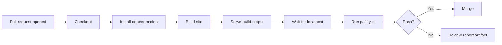

I had one of those mildly awkward moments that only bloggers and other people who publish opinions on the internet seem able to engineer for themselves.

I had just been accepted on the Microsoft MVP Accessibility Vanguard, a new MVP engagement group for people who care deeply about building more accessible technology. The scope is exactly the sort of thing I want more of in the community: product accessibility, AI and disability, and the way disabled people are represented in technology systems. It is a space for MVPs to compare notes, hear directly from Microsoft product teams, and, hopefully, nudge things in a better direction.

Then, this morning, somewhere between jetwashing the patio and enjoying the sunshine on a rare day off, I had the uncomfortable thought: I should probably make sure my own blog is not an accessibility bin fire before I start sounding clever about any of this.

That thought was annoyingly well aimed. I had already written about [visiting the Microsoft Inclusive Tech Lab](https://www.simonpainter.com/microsoft-inclusive-tech-lab), and more recently about [writing inclusive language rules in Copilot instructions](https://www.simonpainter.com/inclusive-language-copilot-instructions). Both posts were sincere. Both made arguments I still stand by. Neither would carry much weight if the site they lived on was quietly doing the web equivalent of mumbling into the carpet whenever a screen reader turned up.

So I ran an audit on simonpainter.com.

It was not catastrophic. Nobody had committed an autoplaying carousel with white text on a yellow background. But it also was not good enough. I had contrast failures, links that relied on colour alone, a missing level-one heading, vague "Read more" links, and Mermaid diagrams that looked fine to sighted readers while saying next to nothing to assistive tech.

This is how I went about fixing that lot, and of putting a GitHub Actions check in front of the site so future Simon does not casually undo present Simon's work the next time I get overconfident with a theme tweak.

<!-- truncate -->

## Why this matters for a technical blog

Technical blogs are read by technical people. Technical people have different abilities, and we shouldn't assume otherwise. That should not be a radical statement in 2026, but the industry still behaves as if accessibility is mainly a public sector procurement checkbox or something only "consumer" products need to care about.

If you publish technical content, your readers could include screen reader users, people with low vision, people with colour blindness, people who navigate by keyboard, people using voice control, and people with cognitive differences who benefit from clearer structure and more predictable presentation. They will also include people reading on a cracked phone in bright sunlight on a train, which is not a disability category but something you can help with all the same.

The trap is the same one we fall into with any other sort of debt. You tell yourself you'll do it later because the post is live, the code works, the diagram is pretty enough, and nobody has complained. Then "later" becomes a theme refresh, two dozen new posts, and a much larger clean-up than the one you could have done in an afternoon. Accessibility debt compounds just like technical debt. Quietly, consistently, and always at the worst possible moment.

There are selfish reasons too. Better contrast and clearer structure help search engines understand the page. Proper headings improve summaries and indexing. Descriptive links make skim reading easier on mobile. If you publish anything in or around Europe, it is also increasingly foolish to assume accessibility regulation is somebody else's problem. The [UK government's introduction to making a service accessible](https://www.gov.uk/service-manual/helping-people-to-use-your-service/making-your-service-accessible-an-introduction) is worth reading even if you are not in government, and the [W3C WCAG quick reference](https://www.w3.org/WAI/WCAG22/quickref/) is still the best place to ground yourself in the actual criteria rather than in folklore.

## The audit

I started with [Accessibility Checker](https://www.accessibilitychecker.org/), mainly because it was quick, free, and very willing to tell me things I would rather not have heard. On the first pass it found 7 contrast failures, 80 links relying on colour alone, and at least one page missing a proper `<h1>`.

Those numbers were useful because they turned a vague feeling of "I should probably tidy this up" into a proper engineering problem. I did not need to guess whether there was work to do. I had a short list and some counts.

For anyone new to the standards side of this: WCAG 2 AA is the practical target most teams aim for. Level A is better than nothing but leaves a lot of very real barriers in place. AAA is excellent when you can reach it, but it is not realistic for every page, every component, or every content type. AA is the level that usually maps to "a reasonable person tried to build an accessible site rather than merely hoping for one".

It is also worth saying out loud that automated tools do not finish the job. Depending on who you ask, they catch perhaps 30 to 40 percent of real accessibility issues. That sounds low until you remember that the issues they do catch are often the obvious, repetitive, high-volume ones that would otherwise sit in your site for months. They are a forcing function, not a finish line.

## The five fixes

### 4.1 Links that relied on colour alone

This was the loudest failure in the report: 80 elements flagged under WCAG 1.4.1. In plain English, if the only clue that something is a link is "it's blue", you are making the user do extra work, and some users simply will not get that clue at all.

The Docusaurus-specific gotcha here is Infima, the default theme layer underneath Docusaurus. It is quite keen on removing underlines from in-content links because, visually, that gives you the sort of clean blog aesthetic designers often like. The problem is that underlines are not some embarrassing relic of 1997. They are the accessible default because they work.

My fix was deliberately boring. I underlined links inside markdown content and article bodies, then left the site chrome alone so the navbar, footer, tags, and breadcrumbs did not suddenly look like a legal disclaimer.

```css
.markdown a {
  text-decoration: underline;
  text-underline-offset: 0.12em;
}

.blog-list-page h2 a,
.tag,
.pagination-nav__link {
  text-decoration: none;
}
```

That solved the audit result without repainting the whole site. It also reminded me that "dated" is usually designer code for "familiar enough that users do not have to think about it".

### 4.2 Contrast failures

The second batch was 7 contrast failures under WCAG 1.4.3. These are usually the ones people notice only after an automated tool highlights them, because on a good monitor in a comfortable room they can look fine right up until you measure them properly.

The fastest way I found to track them down was axe DevTools in the browser. It will point at the actual element and selector, which matters because Docusaurus and Infima rely heavily on CSS custom properties. You often are not changing one hard-coded colour in one component; you are changing a token that quietly flows through half the theme.

The main culprits for me were tokens such as `--ifm-color-content-secondary`, the primary colour scale used for links and active states, and the syntax highlighting palette. Dark mode was worse, which is common. Plenty of colour choices that scrape by in light mode fail once you put them on a darker surface.

I ended up nudging the dark mode primary palette lighter and replacing a few Prism token colours with ones that actually clear AA:

```css
html[data-theme='dark'] {
  --ifm-color-content-secondary: #94a3b8;
  --ifm-color-primary: #60a5fa;
  --ifm-color-primary-dark: #3b82f6;
  --ifm-color-primary-light: #93c5fd;
}
```

For code blocks, it is worth knowing that some Prism themes are much closer to compliance than others. I kept the spirit of GitHub and Dracula, but used adjusted variants rather than pretending the defaults were fine. If you want something closer to off-the-shelf, `oneLight` and `vsDark` are generally better starting points than the older, more decorative themes.

This is one of those fixes where "looks basically the same" is the correct outcome. Accessibility work is often like network maintenance: if it is obvious afterwards, you may have done too much.

### 4.3 The missing level-one heading

One page in the audit had no proper `<h1>`, which trips WCAG 1.3.1 and makes a mess of WCAG 2.4.6 for headings and labels. The immediate practical problem is simple: screen readers use headings to summarise and navigate pages. Search engines do too. A page without a clear level-one heading is starting on the back foot before anyone even reads the content.

In my case the missing heading was the blog list page. The visible design did not really need a giant title because the page layout already made it clear where you were. The document structure, however, absolutely did.

The fix was to swizzle Docusaurus's blog list component and add a proper `<h1>`, visually hidden so the page layout stayed as intended:

```jsx
function BlogListPageContent(props) {
  const {metadata, items, sidebar} = props;
  const {blogTitle, permalink} = metadata;
  const h1Text = permalink === '/' ? 'Simon Painter' : blogTitle;

  return (
    <BlogLayout sidebar={sidebar}>
      <Heading as="h1" className={styles.srOnly}>{h1Text}</Heading>
      <BlogPostItems items={items} />
      <BlogListPaginator metadata={metadata} />
    </BlogLayout>
  );
}
```

That was enough to satisfy both the machine and the much more important human using assistive tech. It also reinforced a good writing habit for long markdown posts: do not skip heading levels because you like how a smaller heading looks. If the structure is `##`, the next step is probably `###`, not `####` because you fancy the font size.

### 4.4 Non-descriptive "Read more" links

If you have never used a screen reader's links list, this problem is easy to miss. Sighted readers see the card, the title, the date, the excerpt, and then the "Read more" link in context. A screen reader user pulling up the links list gets: "Read more. Read more. Read more. Read more."

That fails WCAG 2.4.4 because the link purpose is not clear from the link text alone. Once you have heard the problem phrased that way, the fix is obvious.

Again, Docusaurus made this straightforward once I swizzled the right component. I kept the visible text short and injected the post title into the accessible name:

```jsx
export default function BlogPostItemFooterReadMoreLink(props) {
  const {blogPostTitle, ...linkProps} = props;
  const ariaLabel =
    linkProps['aria-label'] ??
    (blogPostTitle ? `Read more about ${blogPostTitle}` : undefined);

  return (
    <Link {...linkProps} aria-label={ariaLabel}>
      <b>Read more</b>
    </Link>
  );
}
```

That is one of my favourite categories of fix: tiny diff, large improvement. Nobody reading visually notices much difference. Somebody navigating by assistive tech suddenly gets a list of links that means something.

### 4.5 Mermaid diagrams

This was the one I liked most, partly because I use Mermaid a lot and partly because [I have already written about bad diagrams](https://www.simonpainter.com/bad-diagrams) and [gone to the trouble of adding custom Mermaid icons to the site](https://www.simonpainter.com/mermaid-icons). It would have been especially silly if the diagrams were good-looking but semantically useless.

The issue is that Mermaid renders diagrams to SVG. Out of the box, that SVG may have no accessible name and no meaningful description. To a screen reader, your lovingly crafted architecture diagram can be basically invisible.

The fix is simple enough once you know it: every Mermaid block needs `accTitle` and `accDescr`, and the surrounding prose needs to summarise the diagram in normal language because not every reader wants, or can use, the SVG at all.

I now treat this as mandatory:



Summary: the pipeline builds the static site, serves it locally, runs accessibility checks against that built output, and keeps the report available even when the job fails.

Automated scanners will not reliably tell you to do this. That is exactly why it matters. For a diagram-heavy blog, Mermaid accessibility is not a nice extra. It is core content accessibility.

## Keeping it that way: CI with pa11y-ci and GitHub Actions

Fixing a site once is satisfying. Keeping it fixed is the real work.

Accessibility regressions are wonderfully easy to introduce and wonderfully hard to notice if you are the person who caused them. A theme update changes a token. A component override drops an attribute. A new landing page ships with one too many visual shortcuts. Nobody notices until a user hits the problem, and by that point you are no longer "iterating", you are apologising.

That is why I wanted a CI guard rail, not just a one-off clean-up. I already had some experience with build checks on the site from [capturing Docusaurus build output in pull requests](https://www.simonpainter.com/s3-pull-request-build-log). Accessibility deserved the same treatment.

For this sort of static site, I chose [Pa11y](https://pa11y.org/) rather than running axe-core on its own.

The minimal install is:

```bash
npm install --save-dev pa11y-ci pa11y-ci-reporter-html http-server wait-on
```

I started with a short list of representative URLs while I stabilised the fixes. That keeps the feedback loop quick and avoids turning your first accessibility workflow into a multi-minute archaeology dig.

Here is the configuration shape:

```json
{
  "defaults": {
    "standard": "WCAG2AA",
    "timeout": 30000,
    "wait": 500,
    "chromeLaunchConfig": {
      "args": ["--no-sandbox", "--disable-dev-shm-usage"]
    },
    "reporters": [
      "cli",
      ["pa11y-ci-reporter-html", { "destination": "./pa11y-report" }]
    ]
  },
  "urls": [
    "http://localhost:3000/",
    "http://localhost:3000/tags",
    "http://localhost:3000/cname-rules"
  ]
}
```

The workflow itself is straightforward and, importantly, close to production:

```yaml
name: Accessibility

on:
  pull_request:
    branches: [main]
  push:
    branches: [main]
  workflow_dispatch:

jobs:
  pa11y:
    runs-on: ubuntu-latest
    timeout-minutes: 15
    steps:
      - uses: actions/checkout@v4
      - uses: actions/setup-node@v4
        with:
          node-version: '20'
          cache: 'npm'
      - run: npm ci
      - run: npm run build
      - run: npx http-server build -p 3000 --silent &
      - run: npx wait-on http://localhost:3000 --timeout 30000
      - run: npx pa11y-ci --config .pa11yci.json
      - if: always() && github.event_name == 'pull_request'
        uses: actions/github-script@v7
        with:
          github-token: ${{ secrets.GITHUB_TOKEN }}
          script: |
            const fs = require('node:fs');
            const marker = '<!-- pa11y-report -->';
            const body = fs.existsSync('pa11y-report.md')
              ? `${marker}\n${fs.readFileSync('pa11y-report.md', 'utf8')}`
              : `${marker}\n## Accessibility report\n\nNo report was generated.`;

            const { data: comments } = await github.rest.issues.listComments({
              owner: context.repo.owner,
              repo: context.repo.repo,
              issue_number: context.issue.number
            });

            const existing = comments.find(comment => comment.body && comment.body.includes(marker));
            if (existing) {
              await github.rest.issues.updateComment({
                owner: context.repo.owner,
                repo: context.repo.repo,
                comment_id: existing.id,
                body
              });
            } else {
              await github.rest.issues.createComment({
                owner: context.repo.owner,
                repo: context.repo.repo,
                issue_number: context.issue.number,
                body
              });
            }
```

There are a few details here worth calling out.

First, build the site and then serve the generated output. Do not point your scanner at `npm start` unless you have a very specific reason. Dev mode brings extra noise, hot reload behaviour, and differences from what actually gets deployed. If the point of the check is "does the published site meet a baseline", then scan the published site.

Second, `http-server` is deliberately dull. Docusaurus can serve its own build output, but for CI I prefer the smaller moving part. The less your accessibility check depends on framework-specific behaviour, the easier it is to reason about when something fails.

Third, `wait-on` saves you from an irritating class of flaky failure. Cold starts happen. Containers get busy. If your scan begins before the local server is listening, you do not have an accessibility problem, you have a race condition pretending to be one.

Fourth, I no longer upload the report as a downloadable artifact. PR 396 now turns the accessibility output into a sticky pull request comment instead. That keeps the results in the review thread where people are already looking, and it means each new run updates the same comment rather than creating yet another file to click through.

Once you trust the workflow, I think the better long-term pattern is to swap the static URL list for the generated sitemap:

```json
{
  "urls": ["http://localhost:3000/sitemap.xml"]
}
```

That is the point where the automation becomes genuinely protective rather than merely illustrative. New posts get swept up automatically. Forgotten landing pages do not hide off to one side. If I were setting this up from scratch for a larger site, I would go there quickly.

I would also add a status badge to the README, partly because it is useful and partly because mild public embarrassment is one of the best ways to keep yourself honest.

Even then, CI is not magic. `pa11y-ci` will catch a lot of structural and contrast issues. It will not tell you whether your Mermaid diagram meaningfully explains itself. It will not spot vague writing, muddy alt text, or that your "simple" explanation of BGP somehow assumes the reader has already been running MPLS for ten years. The manual fixes still need human review on every pull request.

That combination is the real lesson: automated checks for the repeatable failures, human review for the contextual ones.

## Reflections, and what happens next

The whole exercise took me roughly an hour, which is much less than I had built it up to in my head. As usual Agentic AI did a lot of the heavy lifting. That seems to be true of a lot of accessibility work once you stop treating it as a mysterious specialist discipline and start treating it like any other quality problem.

The CI guard rail was the smaller change, but it is the bigger win. Fixing the existing issues was satisfying. Knowing the next theme tweak or component override is less likely to quietly reintroduce them is much more valuable.

It also reinforced something I already suspected: accessibility is not a checklist, it is a practice. The audit caught the obvious stuff. The Mermaid fix needed more thought. Proper screen reader testing is still on my to-do list, because there is no substitute for using the thing the way people actually use it.

That, really, is why the Microsoft MVP Accessibility Vanguard matters. It is not about collecting another worthy badge and then carrying on as before. It is about people holding themselves, and each other, to a higher standard; sharing what works; and having harder conversations about topics such as AI and disability that are only going to become more important.

And if you spot accessibility issues on this blog, please open a GitHub issue or send me a message on LinkedIn. Accountability is the point. If you want more context on why I care about this area, [my write-up from the Microsoft Inclusive Tech Lab visit](https://www.simonpainter.com/microsoft-inclusive-tech-lab) and [my guide to inclusive language rules for Copilot](https://www.simonpainter.com/inclusive-language-copilot-instructions) are good places to start.
