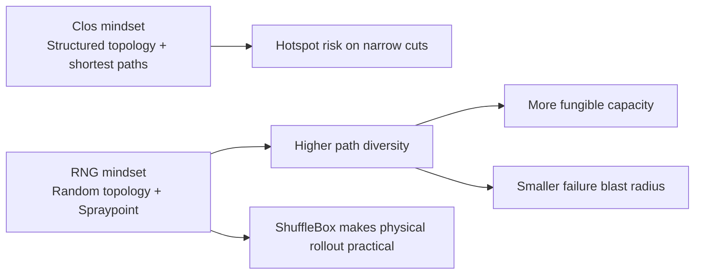

---

title: "Random by design: how AWS made expander-graph data centre fabrics work"
authors: simonpainter
tags:
  - aws
  - networking
  - datacentres
  - architecture
  - routing
date: 2026-06-03

---

AWS is now running production data centre networks that are wired at random and still deliver strong performance. That sounds wrong at first, but the paper *Expanding into Reality: Random Graphs for Datacenter Networks* shows why it works.

The key idea is simple: move from rigid hierarchy to high-connectivity randomness, then design routing and operations around that choice.
<!-- truncate -->

## Why Clos fabrics hit a wall

A Clos fabric gives a trade-off. I can build for low oversubscription and pay for capacity I rarely use, or I can save money and accept hotspots when traffic lines up in awkward ways.

The deeper issue is that capacity in a Clos is not fully fungible. Traffic between any two ToRs can only use a narrow subset of links, so some paths saturate while other links sit idle. Failures can also hurt in a concentrated way: lose a spine and many pairs lose a big chunk of usable bandwidth.

## What an expander gives AWS

AWS uses a flat topology based on quasi-random graphs. In plain terms, each router connects to a random set of neighbours with a fixed degree.

That randomness creates strong edge expansion: for almost any group of routers, many links still leave that group. There is no easy narrow cut to choke traffic, which makes capacity more fungible and failure impact more local.

## Why this took so long to ship

Expanders looked good on paper for years, but three practical problems blocked production use:

1. **Routing:** shortest-path ECMP does not spread well on random graphs, while *k*-shortest-paths needs too much forwarding state.
2. **Cabling:** random physical connectivity is hard to build and painful to evolve.
3. **Predictability:** operators still need target-driven planning for oversubscription and growth.

AWS RNG addresses all three.

## The three pieces that unlocked it

### 1) Spraypoint routing

Spraypoint does two things. First, ingress sprays packets across random neighbours. Then routers point packets towards destination-adjacent waypoints. This gives high path diversity without explosive table growth.

It stays distributed and link-state driven, and it fits commodity switch memory. In AWS's evaluation, it found far more edge-disjoint paths than *k*-shortest-path baselines.

### 2) ShuffleBox cabling

AWS introduces a passive optical element called **ShuffleBox**. Routers connect into ShuffleBoxes, and the boxes handle internal shuffling and inter-room connectivity.

This keeps logical randomness while making physical cabling manageable. It also makes expansion safer, because many changes happen in a controlled optical layer rather than through widespread manual recabling.

### 3) Planning models

AWS built analytical models for path length, path diversity, and oversubscription. Operators can choose fabric parameters to meet target server counts and oversubscription goals, much like established Clos planning workflows.

Random does not mean unpredictable here. It means statistically stable at scale.

## The architectural shift in one picture

## What AWS says it gains

The paper reports **9–45% fewer switches** than comparable fat-tree designs at the same oversubscription targets, with the biggest savings at moderate oversubscription. It also reports performance that matches or exceeds fat trees across several traffic patterns, while improving failure resilience.

Those are big numbers, and AWS has pushed RNG to become the default fabric for most workloads.

## What still costs effort

This is not free wins forever. Operations need to adapt. Tooling and procedures that assumed hierarchy need rework, and maintenance planning must account for richer interdependencies between ToRs.

But the core pattern is clear: AWS moved complexity out of rigid physical structure and into smarter routing plus a practical optical layer.

## Takeaway

The mental model changes from **design a perfect hierarchy** to **design for connectivity and let routing exploit it**. AWS shows that random graph fabrics can be predictable, operable, and cheaper in real production networks.

If you work on large-scale infrastructure, this is a strong signal that flat expander-based fabrics have crossed from theory into mainstream practice.

---

**Source:** Bernardi et al., *Expanding into Reality: Random Graphs for Datacenter Networks*, arXiv:2604.15261, 2026. https://arxiv.org/abs/2604.15261
