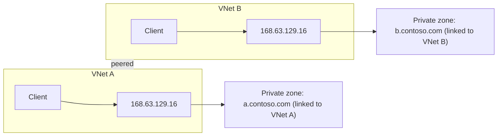
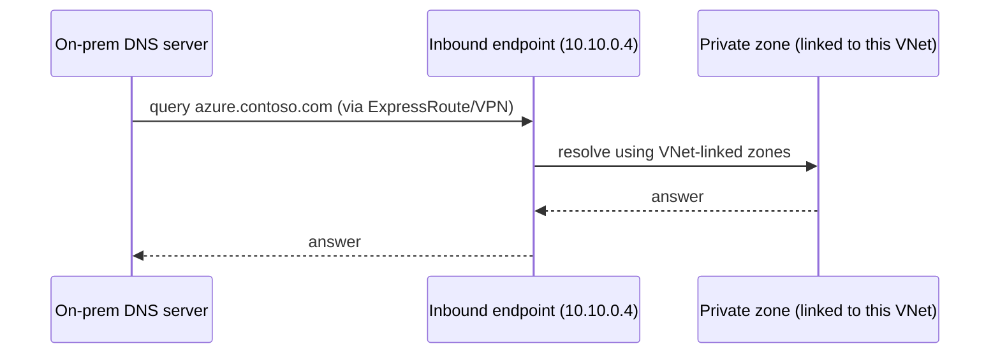
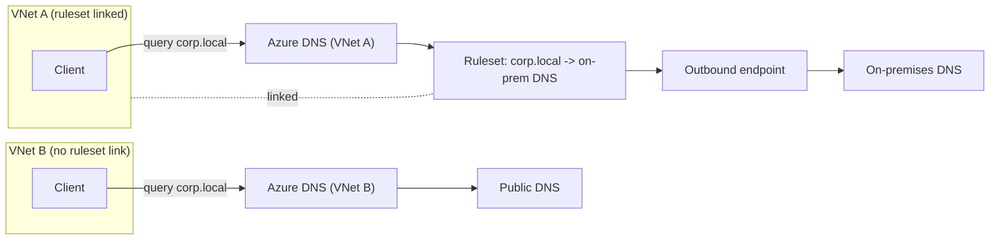
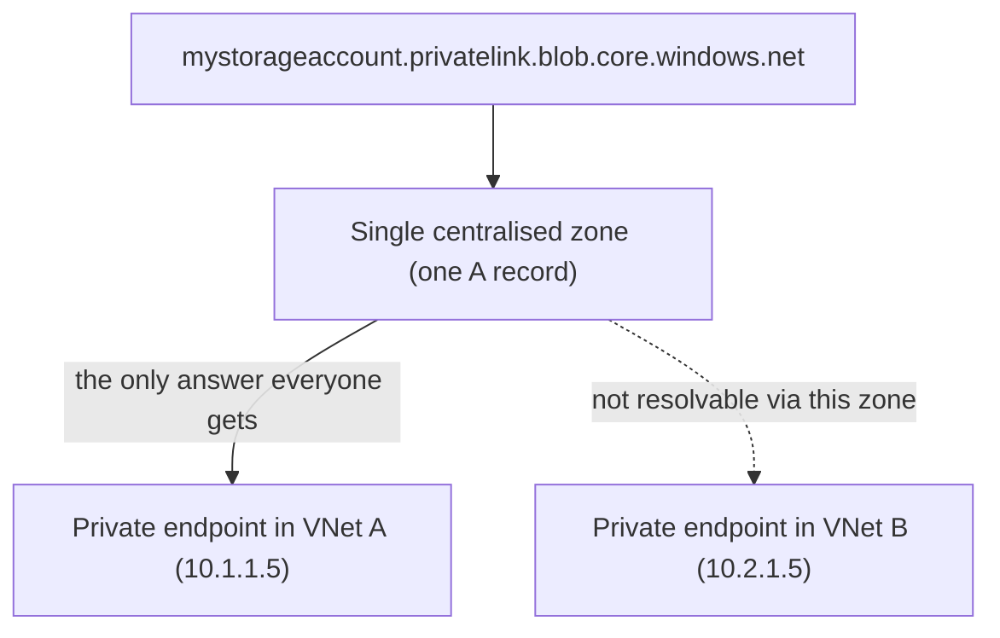
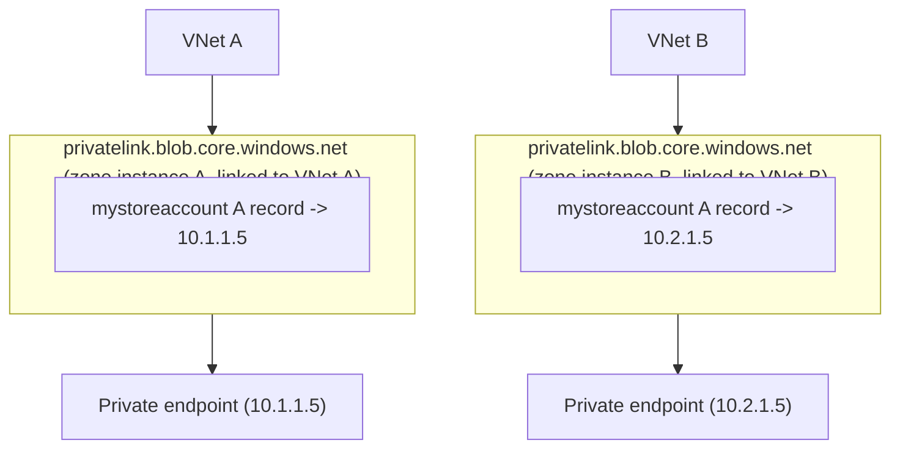
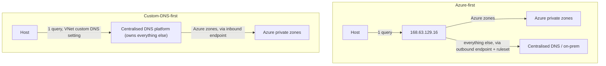

I wrote about [168.63.129.16, Azure's magic IP](azure-magic-ip.md), a while back, and one detail buried in there deserves its own post: queries to that address only ever come from inside the VNet that's asking, and whatever private DNS zones are linked to that VNet are the only ones it can see. That locality is the whole model. Everything else in Azure DNS - inbound resolvers, outbound resolvers, Private Link zones - is either working with that locality or working around it.
<!-- truncate -->

## The magic IP only knows its own VNet

When a VNet uses Azure-provided DNS, its VMs receive 168.63.129.16 as the default DNS server. When a query hits that address, Azure answers using whatever private DNS zones are linked to the VNet the query came from. A zone linked to VNet A is invisible to a query from VNet B, even if the two VNets are peered and can otherwise talk to each other freely.

Peering moves packets. It doesn't move DNS zone links. That trips people up constantly - the network path exists, so surely the name resolves - but zone links are a separate, explicit configuration, and the magic IP only ever consults the ones attached to the VNet of the client asking.

For years this meant that if you wanted on-premises machines to resolve Azure private zones, you needed a DNS server sitting inside the VNet, forwarding queries it received on-premises onward to 168.63.129.16 on their behalf. The server was in the VNet, so its queries to the magic IP carried that VNet's locality, and on-premises got an answer by proxy. It worked, but it meant running and patching a VM just to be a relay.

## Inbound endpoints borrow the VNet's identity

An inbound endpoint gives you an IP address, inside your VNet's own address space, that external resolvers can query directly. Point your on-premises conditional forwarder at it, and queries land in Azure exactly as if a client inside that VNet had asked. The private zones linked to that VNet become resolvable from outside it, without a relay VM in the path.

The endpoint is still scoped to one VNet - it can only answer with zones linked to the VNet it's deployed in - but it removes the need for a resolver appliance of your own. You're pointing a conditional forwarder at a managed Azure IP instead of a VM you have to keep alive.

## Outbound endpoints are what give a VNet forwarding rules at all

Inbound endpoints solve resolution into Azure. Outbound endpoints solve the opposite direction: a VNet needing to resolve something Azure doesn't know about, like an on-premises domain or another cloud's private zone.

An outbound endpoint doesn't do anything by itself. It egresses queries that match a rule in a DNS forwarding ruleset. For workloads using Azure-provided DNS, that ruleset only applies to VNets it's explicitly linked to. VNets using custom DNS send queries to those servers first, so a ruleset link alone doesn't put their queries through the endpoint. No link, no platform-applied rules.

Same query, same domain name, two completely different outcomes depending on which VNet asked. VNet A gets a forwarded answer from on-premises DNS. VNet B, with no ruleset link, falls through to public DNS and probably gets NXDOMAIN or a wildcard certificate warning page, because `corp.local` means nothing to the outside world. This is the pattern I went into in more detail in [two rulesets, one outbound endpoint](two-rulesets-one-outbound-endpoint.md), where I used exactly this scoping to give one third party visibility of a handful of domains without exposing everything else behind the same egress point.

## Private Link is where centralised DNS runs out of road

Private endpoints expose supported services at private IP addresses; DNS then makes clients use those addresses. For example, a zone such as `privatelink.blob.core.windows.net` holds a record that resolves a storage account's private-link hostname to the private endpoint's IP. That override lives in a private DNS zone, and a private DNS zone - like everything else here - is linked to specific VNets.

The limitation shows up when two VNets need the *same* Private Link hostname to resolve to *different* private endpoints. Say VNet A has its own private endpoint for a storage account, and VNet B has a completely separate one. If there's a single centralised DNS zone for `privatelink.blob.core.windows.net`, it can only hold one A record for that hostname. Whichever endpoint's address lands in that zone is the one every VNet gets, whether that's correct for them or not.

> Why would two VNets want separate endpoints for the same service in the first place? Cost and bandwidth, usually. Traffic over a Private Link connection often works out cheaper than routing it through VNet peering and a hub firewall, and the gap gets noticeable fast on high-volume traffic crossing regions. If every spoke-to-spoke byte is also being inspected and charged for by a hub firewall, a dedicated private endpoint per spoke can be the difference between a sensible bill and a surprising one - and it sidesteps the firewall's own bandwidth ceiling too.

Azure Private DNS makes the fix straightforward: create a separate `privatelink.blob.core.windows.net` zone per VNet (or per group of VNets that should share an answer), each linked only to the VNets that should see it. Same hostname, same zone name, different zone resources, each scoped by its own VNet links - so VNet A's query resolves through its zone to its endpoint, and VNet B's resolves through a different zone instance to a different endpoint entirely.

Azure Private DNS supports this directly because the zone-to-VNet link is a first-class resource you can create as many times as you need. It gets considerably harder with a centralised third-party DNS platform (Infoblox, BIND, whatever) acting as the single source of truth, because now you need that platform to serve different answers for the identical zone name depending on which VNet asked - which usually means views, split-horizon configuration, or some other layer of complexity the platform may or may not support cleanly. Centralising DNS authority is often the right call for corporate zones, but Private Link zones are a case where per-VNet locality is the feature, not a limitation to engineer around.

> You probably don't want to just put multiple records in here and have your central DNS round robin traffic to both private endpoints. That would be horrible. You could put some rules in your DNS server, if it supports it, to send traffic from some sources to one endpoint and traffic from other sources to the other endpoint. That would all be a bit of a kludge though.

There's a wrinkle worth calling out if your centralised platform is holding those privatelink zones instead of Azure Private DNS. Most Azure VMs still use 168.63.129.16 as their resolver by default, and the magic IP has never heard of your centralised DNS platform - it only knows Azure private zones linked to its own VNet. So resolving anything hosted centrally, privatelink zones included, needs a per-VNet outbound endpoint and ruleset link forwarding those queries out to the central platform. Miss that step and the host's query dead-ends at the magic IP with an NXDOMAIN, regardless of how correctly the centralised side is configured. That requirement is really the tell for which of two prevailing DNS architectures a given estate is running, and it's worth setting them side by side.

## Magic IP first, or custom DNS first

Most Azure hybrid DNS designs land on one of two shapes, and the difference is simply which resolver a host asks first.

**Azure-first** keeps the default: VNets use Azure-provided DNS, so every host's first stop is 168.63.129.16. Azure zones resolve natively and immediately. Anything else - on-premises domains, a centralised DNS platform's zones - needs an outbound endpoint and a ruleset, linked per VNet, forwarding those specific namespaces onward. This is the architecture the rest of this post has assumed throughout.

**Custom-DNS-first** flips the order. You set custom DNS servers at the VNet level - the same idea as supplying a custom DHCP option set in AWS - pointing every host at your centralised platform (BIND, Infoblox, AD-integrated DNS) before Azure ever sees the query. That platform becomes responsible for everything, and it conditional-forwards only the namespaces it doesn't own - your Azure private zones - back in through an inbound endpoint.

The practical difference shows up the moment you ask what happens to a plain internet hostname - `www.example.com`, nothing private about it at all. In the Azure-first design, that query falls straight through to Azure-provided DNS and resolves to the public internet without anyone having to think about it. In the custom-DNS-first design, every single one of those queries now depends on the centralised platform having its own working path to the public internet, because every Azure host is asking it first for everything.

That's precisely the risk behind the wildcard rule caveat below, just arrived at from the other direction. A wildcard forwarding rule in an Azure-first design reroutes unauthoritative queries to a platform that needs public resolution. A custom-DNS-first design has made that same dependency permanent and total from day one - there's no fallback path, because Azure-provided DNS was never in the loop to begin with. Neither architecture is wrong, but know which one you've built before an Azure service's hidden public-DNS dependency tells you the hard way.

## The wildcard rule caveat that bites

One more thing worth flagging because it's genuinely dangerous if you miss it. A DNS forwarding rule can use `.` as the domain name - a wildcard that catches anything not matched by a more specific rule, forwarding all otherwise-unauthoritative queries to whatever DNS server you name.

It's tempting to use this to route every non-Azure query through a central DNS platform for logging, policy, or just consistency. The official guidance carries a specific warning about it:

> **If you include a wildcard rule in your ruleset, ensure that the target DNS service can resolve public DNS names. Some Azure services have dependencies on public name resolution.**

Some Azure platform components resolve public hostnames as part of their own internal operation. If your wildcard rule forwards everything to a DNS server that only knows your internal zones and has no path to the public internet, those dependent services start failing in ways that have nothing obviously to do with DNS. Azure does already exclude two-label platform domains like `windows.net` and `azure.com` from wildcard matching specifically to limit this risk, but that exclusion list is narrow and doesn't cover every public-resolution dependency. If you deploy a wildcard rule, confirm the target resolver has working internet DNS resolution before you rely on it, not after something downstream starts throwing unexplained errors.

## Summary

Every one of these mechanisms exists because DNS resolution in Azure is scoped to a VNet by default, and it's scoped to a VNet by default because that's a sane security boundary, not an oversight. Inbound endpoints let something outside a VNet borrow its locality. Outbound endpoints and rulesets let a VNet reach outward, strictly to the VNets a ruleset is linked to. Private Link zones need that same per-VNet locality to let different VNets land on different endpoints for an identical hostname. Design around the locality, don't fight it, and the wildcard caveat is the one place where reaching for convenience can take out something you didn't know depended on it.
