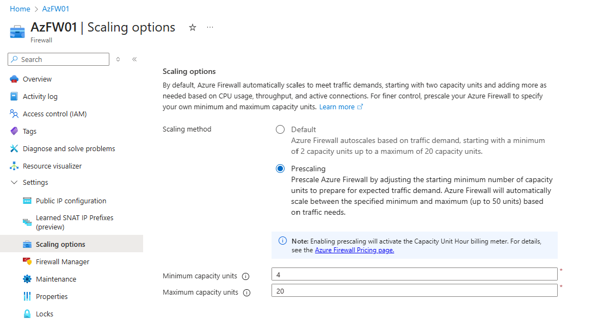

One of the weirdest birthday presents I got this year was from Microsoft - Azure Firewall Prescaling. It's a solution to a problem that has been around for a while and one that quite a lot of people didn't even know existed.
Azure Firewall is a great product, but it's not without its limitations. One of the biggest issues has been around scaling. Azure Firewall can scale up and down based on demand, but this scaling can take time. In high-demand situations, this delay can lead to dropped packets and degraded performance. The scale back in can also cause issues with long lived tcp connections because there has been little control over when the scaling events happen, and which instances are terminated.
<!-- truncate -->
## What's the problem that's being solved?

There are a couple of scenarios where having a bit more control of Azure Firewall scaling would be really useful:

### Scale out

When Azure Firewall scales out, it can take several minutes for new instances to be provisioned and become operational.  [Azure Firewall scales out when the average throughput and CPU consumption is at 60% or if the number of connections usage is at 80%](https://learn.microsoft.com/en-us/azure/firewall/firewall-performance#total-throughput--for-initial-firewall-deployment); these are defined thresholds and do not account for sudden spikes in traffic. Scale out takes five to seven minutes; during this time, if there is a sudden spike in traffic, the existing instances may become overwhelmed, leading to dropped packets and degraded performance.

### Scale in

When Azure Firewall scales in, it terminates instances based on its own internal logic. Azure Firewall gradually scales in when the average throughput, CPU consumption, or number of connections is below 20%. The instances are terminated randomly rather than based on load, or even a FILO or FIFO logic. This can lead to situations where long-lived TCP connections are dropped because the [instance handling those connections is terminated](https://learn.microsoft.com/en-us/azure/firewall/firewall-faq#how-does-azure-firewall-handle-vm-instance-shutdowns-during-virtual-machine-scale-set-scale-in--scale-down--or-fleet-software-upgrades). This can be particularly problematic for applications that rely on persistent connections. There is a 45 second drain down period but this is not always sufficient to gracefully handle long lived connections.

## How does Azure Firewall Prescaling help?

[Azure Firewall Prescaling](https://learn.microsoft.com/en-gb/azure/firewall/prescaling) allows you to define a minimum and maximum number of instances for your Azure Firewall instances. By setting a minimum number of instances, you can raise the floor for your scaling operations, and by raising that floor, you can both scale out proactively and also prevent the scale in operations that terminate instances which are still handling active connections.

## How to use it

Using prescaling introduces a new billing element to Azure Firewall; this makes sense because otherwise we'd all just set it to 50 instances and be done with it!



Prescaling has been exposed via the Azure Portal and via PowerShell. There is support in ARM and Bicep too, however at the time of writing there is no support in the native Terraform AzureRM provider. There is however support via the AzAPI provider.

Terraform AzAPI snippet to enable prescaling looks something like this:

```terraform
      autoscaleConfiguration = {
        maxCapacity = 5
        minCapacity = 2
      }
```
