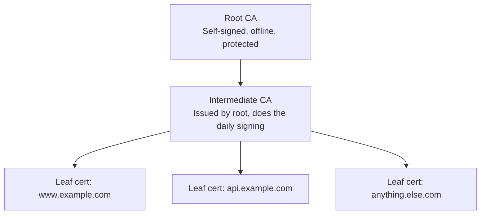
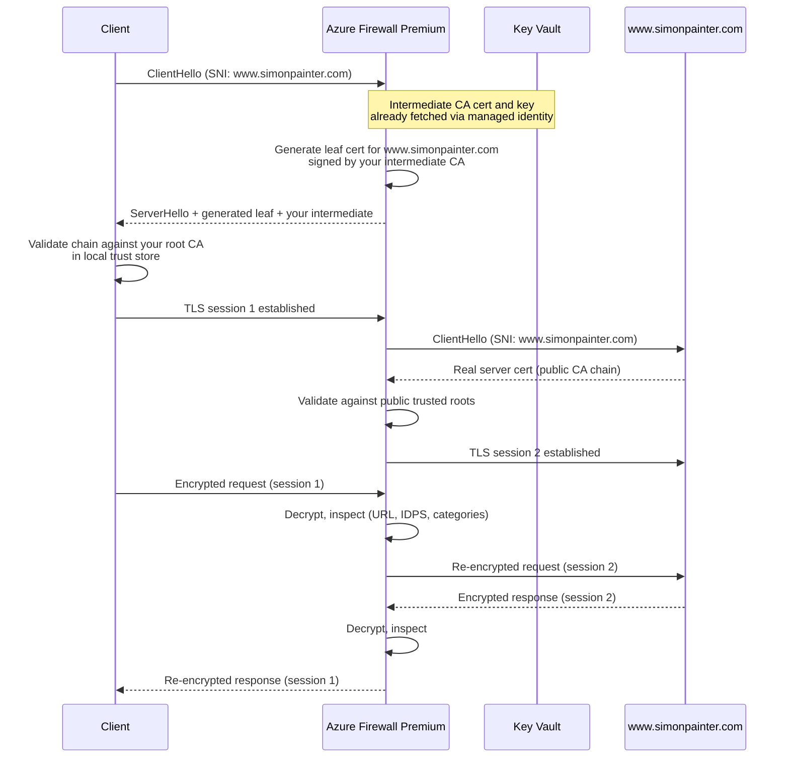
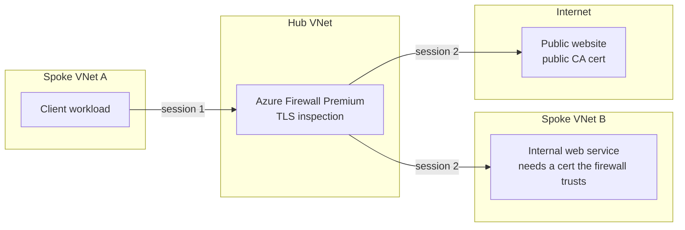
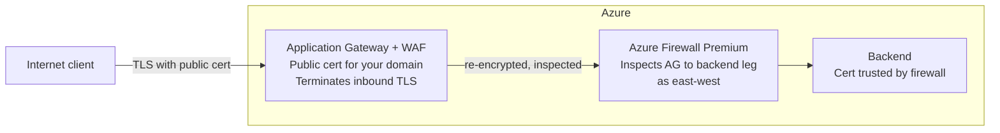

Someone asked me a deceptively simple question the other day: with Azure Firewall TLS inspection enabled, how does traffic get inspected, what certificates do the resources need, and how is the trust chain established? I gave a reasonable answer in a few paragraphs and then realised it was the sort of thing I'd rather write down once than keep reconstructing from memory. So here it is.

This is a summary of how the mechanism works, what you need to have in place, and a curated set of links for when you want the detail. It isn't a click-by-click deployment guide because Microsoft already wrote one and it's fine.

<!-- truncate -->

## The short version

TLS inspection on [Azure Firewall Premium](https://learn.microsoft.com/en-us/azure/firewall/premium-features) is a sanctioned interception. It's the same trick as a man-in-the-middle attack, done on purpose and with your permission. The firewall terminates the client's TLS session, decrypts the traffic, does whatever inspection the policy calls for (URL filtering, IDPS, web categories), and then opens a separate TLS session to the real destination. Two sessions, two certificates, one firewall in the middle pretending to be the website.

For that to work without every browser in the estate screaming about certificate errors, the firewall needs to be able to issue certificates that your clients trust. That means you give it an intermediate CA certificate, complete with private key, from a PKI whose root your devices already trust.

That's it. Everything else is detail about how the trust chain is constructed and where the bits live.

## Three kinds of certificate

It helps to be precise about which certificate is which, because the Azure documentation talks about three of them and they do different jobs.

**Root CA certificate.** The top of the tree. Self-signed, long-lived, and ideally sitting on an offline machine that nobody touches. Its only job is to sign intermediate CA certificates. If this is compromised you rebuild your PKI, so you protect it accordingly.

> I remember an organisation that had its root CA on a server, took the hard drives out (properly labelled in order for the RAID 5 set) and secured them in a fireproof safe that had a whole ceremony around it for access. Someone helpfully cleaned up the server room one day and saw a server with no drives in it that looked a bit old so sent it to the shredder. Hilarity ensued.

**Intermediate CA certificate.** Issued by the root. This is the working certificate that does the day-to-day signing. If it's compromised you revoke it and issue a new one from the root, which is a much smaller disaster. This is the certificate you hand to Azure Firewall. The idea here is compartmentalisation. You limit the blast radius of a compromise by having specific dedicated intermediates for different purposes.

**Server (leaf) certificate.** Issued by an intermediate for a specific hostname. This is what a web server presents to a browser. In the TLS inspection case, the firewall generates these itself, on the fly, for every destination it intercepts.

For a public website the leaf chains up to one of a handful of public roots that ship pre-installed in browsers and operating systems. For an internal service you'd run your own PKI (Active Directory Certificate Services or similar) with a protected root and one or more intermediates. Your managed endpoints trust that root because you pushed it out via Group Policy, Intune, or whatever your fleet management tooling is.

> OK, quick aside. How can the root certificate be super secured and yet still be present on every client device's trust store? The answer here is that certificates are in two parts: the public and the private keys. Asymmetric cryptography allows the public key to be widely distributed for encryption and verification, while the private key remains secret for decryption and signing. The root certificate's public key is what gets installed in trust stores, not the private key.

TLS inspection reuses that second model. Your firewall becomes, in effect, another issuing CA in your private PKI.

## What happens on a connection

Say a client in a spoke VNet browses to `https://www.simonpainter.com` and the route table sends it through the firewall.

1. The client sends a TLS ClientHello with `www.simonpainter.com` in the SNI field.
2. The firewall matches an application rule with TLS inspection enabled and decides to intercept.
3. The firewall generates a leaf certificate for `www.simonpainter.com`, signed by the intermediate CA you gave it. It presents that certificate to the client along with the intermediate.
4. The client validates the chain: leaf signed by your intermediate, intermediate signed by your root, root is in the local trust store. Everything checks out and the client completes the handshake with the firewall.
5. The firewall opens its own TLS session to the real `www.simonpainter.com`, validating the site's real certificate against the public roots it trusts.
6. Decrypted traffic flows through the firewall's inspection engine between the two sessions.

There are two trust decisions happening and you want to keep them separate in your head.

**Client to firewall.** The client must trust *your* root CA. This is the bit you control and the bit that goes wrong most often, usually because the root hasn't been deployed to some device, or the application uses its own certificate store rather than the operating system's.

**Firewall to destination.** The firewall must trust the *destination's* certificate. Azure Firewall validates it against its own list of trusted public roots, and if the destination presents something untrusted the firewall drops the connection as though the server had closed it. Self-signed certificates on internal services will fail here, which brings us to east-west.

## Outbound versus east-west

Outbound is the straightforward case: client inside Azure, destination on the internet, firewall in between. The destination has a proper public certificate and the firewall trusts it without any help.

East-west is the same mechanism applied to traffic between workloads inside Azure, or between Azure and on-premises. The difference is that the destination is now something you own, and it may not have a certificate that chains to a public root.

For east-west inspection the internal service needs a server certificate the firewall can validate. In practice that means a certificate from a public CA, or a certificate from your enterprise CA where the root is trusted by the firewall. The [enterprise CA deployment guide](https://learn.microsoft.com/en-us/azure/firewall/premium-deploy-certificates-enterprise-ca) covers the case where you're issuing everything from Active Directory Certificate Services, and it's the route I'd take for anything beyond a lab.

The client side is unchanged: it still sees a leaf minted by the firewall and still needs to trust your root.

## Inbound is not the firewall's job

The original question asked about inbound as well, and the honest answer is that Azure Firewall Premium doesn't do inbound TLS inspection. It supports outbound and east-west, and [the documentation](https://learn.microsoft.com/en-us/azure/firewall/premium-features) is explicit that the inbound case is handled by Azure Web Application Firewall on Application Gateway. There's also a [Microsoft Q&A thread](https://learn.microsoft.com/en-us/answers/questions/1095951/azure-firewall-inbound-ssl-inspection) confirming the position, and an older [Journey of the Geek post](https://journeyofthegeek.com/2021/07/05/azure-firewall-and-tls-inspection/) that walks through discovering the limitation the hard way.

That isn't a gap so much as a sensible division of labour. Inbound TLS inspection means presenting a certificate to an unknown internet client for a hostname you own, which is a reverse proxy problem, not a forward proxy problem. Application Gateway terminates the public TLS session with a real public certificate for your domain, optionally runs WAF, and then re-encrypts to the backend. If the firewall sits between Application Gateway and the backend, that second leg is just east-west traffic and can be inspected as above.

Philip Street has [written up the certificate wrinkles](https://blog.philipstreet.co.uk/TLS-Inspection-for-DMZ-Azure-Application-Gateway-and-Azure-Firewall/) in exactly this pattern, including a Terraform limitation around setting `BasicConstraints` path length on Key Vault certificates. Read it before you try to automate it.

## What you need to have in place

**Azure Firewall Premium.** Standard SKU doesn't do TLS inspection. If you have Standard, this article is a shopping list.

**An intermediate CA certificate with its private key.** The [requirements](https://learn.microsoft.com/en-us/azure/firewall/premium-certificates) are specific and the firewall will reject anything that doesn't meet them:

- Password-less PFX (PKCS#12) containing the certificate and private key. PEM isn't accepted.
- A single certificate, not the chain.
- RSA key of at least 4096 bits.
- `KeyUsage` extension marked critical with `KeyCertSign` set.
- `BasicConstraints` extension marked critical, `CA=TRUE`, path length of one or more.
- Valid for at least a year forward.
- Exportable.

**A Key Vault holding that certificate.** The firewall reads it through the Secrets interface. You can import via the Certificates blade (which is nicer because you get expiry alerts) and Key Vault will create the backing secret for you, but the firewall's identity needs `Get` and `List` on *secrets* either way. Key Vault access policies only; RBAC authorisation for this integration isn't currently supported. Azure Firewall is a [Key Vault trusted service](https://learn.microsoft.com/en-us/azure/key-vault/general/overview-vnet-service-endpoints#trusted-services) so you can keep the vault's own firewall locked down.

**A user-assigned managed identity** with those Key Vault permissions, attached to the firewall policy.

**Your root CA certificate deployed to every client that will pass through the firewall.** Group Policy, Intune, or configuration management for IaaS. Don't forget applications with their own trust stores: Firefox, Java, Python's `certifi`, and a long tail of others will ignore the operating system store and fail with certificate errors that look nothing like a firewall problem.

**Application rules with TLS inspection enabled.** Inspection is per rule, not global. Enabling it on the policy makes it available; the rule decides whether a given flow is intercepted. This is also how you carve out exceptions for destinations that break under inspection (certificate pinning, mutual TLS, and so on).

One operational note: when you rotate the intermediate certificate in Key Vault, you need to update the TLS setting on the firewall policy yourself. It doesn't pick up the new version on its own.

## Lab shortcuts

For a lab, Microsoft's [certificates page](https://learn.microsoft.com/en-us/azure/firewall/premium-certificates) includes `openssl` scripts that generate a self-signed root and a compliant intermediate PFX in one go. There's also an auto-generation option in the portal that creates a managed identity, a Key Vault, and a self-signed root for you. Both are fine for proving the mechanism and neither is something you should run in production, because the root distribution problem is the hard part and a self-signed root nobody else trusts doesn't solve it.

## Resources

Microsoft documentation:

- [Azure Firewall Premium certificates](https://learn.microsoft.com/en-us/azure/firewall/premium-certificates). The core reference for certificate requirements, Key Vault setup, and the lab scripts.
- [Azure Firewall Premium features](https://learn.microsoft.com/en-us/azure/firewall/premium-features). Covers TLS inspection alongside IDPS, URL filtering, and web categories, and spells out the outbound and east-west scope.
- [Deploy and configure Enterprise CA certificates for Azure Firewall](https://learn.microsoft.com/en-us/azure/firewall/premium-deploy-certificates-enterprise-ca). The production route using Active Directory Certificate Services.
- [Key Vault trusted services](https://learn.microsoft.com/en-us/azure/key-vault/general/overview-vnet-service-endpoints#trusted-services). Why you can lock the vault down and still let the firewall in.

Community write-ups:

- [TLS Inspection for DMZ Azure Application Gateway and Azure Firewall](https://blog.philipstreet.co.uk/TLS-Inspection-for-DMZ-Azure-Application-Gateway-and-Azure-Firewall/) by Philip Street. Certificate options, Terraform limitations, and what breaks when Application Gateway sits in front of the firewall.
- [Azure Firewall and TLS Inspection](https://journeyofthegeek.com/2021/07/05/azure-firewall-and-tls-inspection/) on Journey of the Geek. Older, but a clear account of discovering the inbound limitation and working around it with Application Gateway.
- [Azure Firewall inbound SSL inspection](https://learn.microsoft.com/en-us/answers/questions/1095951/azure-firewall-inbound-ssl-inspection) on Microsoft Q&A. Confirms the inbound position from Microsoft's side.

If you find a resource that should be on this list, let me know and I'll add it.
