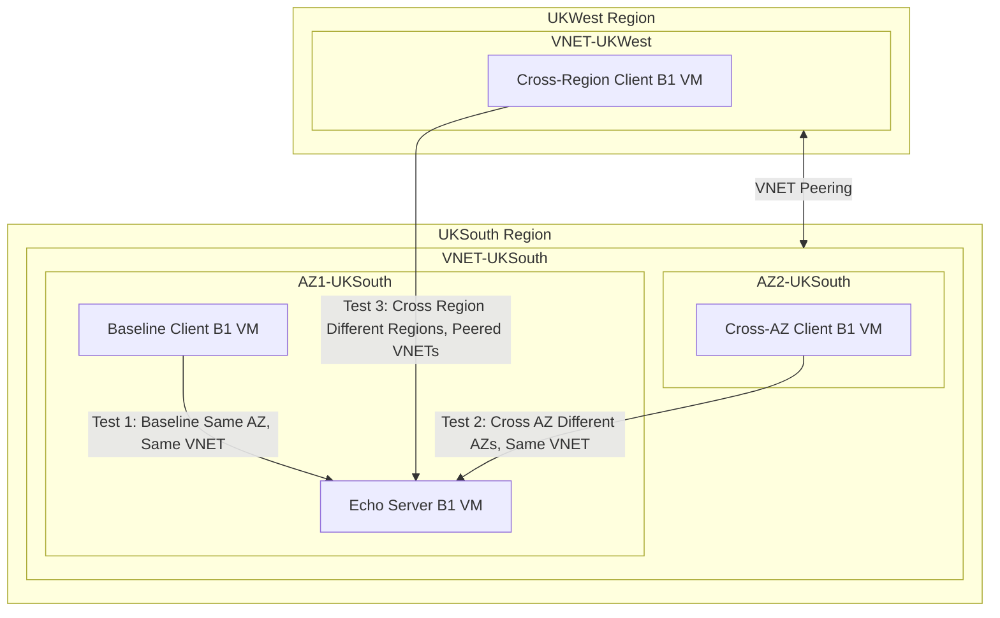

---

title: Azure Latency Part 1
authors: simonpainter
tags:
  - azure
  - networks
  - cloud
date: 2025-03-20

---

## Background

Understanding network latency is important for architects and developers building distributed systems, and especially so in cloud environments. While cloud providers like Microsoft Azure offer significant flexibility and scale, the underlying network topology can have profound impacts on application performance. Microsoft has invested heavily in [low latency hollow core fibre](microsoft-ignite-2024.md), through a [significant technology investment](https://medium.simonpainter.com/optimising-azure-network-architectures-leveraging-microsofts-hollow-core-fibre-innovation-4b0ec39cb33c) and I am sure that where they have innovated, others will follow.
<!-- truncate -->

My main questions were simple: How much slower is traffic between regions compared to within the same data centre? How stable is this performance? And what happens to long-running TCP connections over time?

This baseline work measures the basic network performance in Azure so we can understand what happens when we add more complex components later.

### The Test Setup

I kept things simple. I set up B1 VMs (1 vCPU, 1 GB RAM) in different locations:

- A server and client in the same zone in UK South
- Another client in a different zone but still in UK South
- A third client in UK West

All tests used standard Azure networking without Express Route or other fancy additions. This gave me a clean baseline to work from.

| **Test Setup** | **Details** |
|----------------|-------------|
| VM Size | B1 (1 vCPU, 1 GB RAM) |
| Main Network | UK South Region |
| Second Network | UK West Region (peered with UK South) |
| Availability Zones | AZ1 and AZ2 in UK South |
| Network Features | Standard Azure networking |

### The Test Method

I used a simple approach. An echo server listened on port 7, and each client sent a small 64-byte packet once a second. The client measured how long it took to get a response.

I ran each test for about 11 hours, collecting around 40,000 measurements per scenario. This gave me enough data to spot any patterns or unusual behaviour.

| **Test Scenario** | **Client Location** | **Server Location** | **Network Path** |
|-------------------|---------------------|---------------------|-----------------|
| Baseline | AZ1, UK South | AZ1, UK South | Same AZ, Same VNET |
| Cross AZ | AZ2, UK South | AZ1, UK South | Different AZs, Same VNET |
| Cross Region | UK West | AZ1, UK South | Different Regions, Peered VNETs |

### The Tools

I built [custom tools](https://github.com/simonpainter/echo_test/) for this test. The server used xinetd to run a standard TCP echo service. The client was a Python app that measured time with nanosecond precision.

Each client recorded exact send and receive times, calculated the round-trip time, and saved everything to CSV files. [I've shared all the code in the repo so you can check my work or run your own tests](https://github.com/simonpainter/echo_test/).

## What I Found

### Latency Measurements

The tests showed clear patterns. When the client and server were in the same zone, the average round trip took about 850 microseconds. Moving the client to a different zone pushed this up to 1,425 microseconds. Going all the way to another region meant waiting around 5,300 microseconds for a response.

This creates a clear ranking: Same zone is fastest, cross-zone is slower, and cross-region is slowest—not a surprise, but now we know exactly how much slower each option is.

| **Latency Measurement** | **Same AZ** | **Cross AZ** | **Cross Region** |
|-------------------------|-------------|--------------|------------------|
| Average (Mean) | 850 μs | 1,425 μs | 5,300 μs |
| 95th percentile | 975 μs | 1,950 μs | 6,800 μs |
| 99th percentile | 1,050 μs | 2,250 μs | 8,100 μs |
| Minimum | 726 μs | 1,154 μs | 4,587 μs |
| Maximum | 404,402 μs | 1,099,789 μs | 743,394 μs |

| **Speed Comparison** | **How Much Slower** | **What This Means** |
|----------------------|---------------------|---------------------|
| Cross-AZ vs Same AZ | ~1.7x slower | Traffic between zones takes 70% longer than within a zone |
| Cross-Region vs Same AZ | ~6.2x slower | Cross-region traffic takes over 6 times longer than same-zone |
| Cross-Region vs Cross-AZ | ~3.7x slower | Cross-region is nearly 4 times slower than cross-zone |

### Key Patterns

The performance stayed remarkably stable over time. Each test showed consistent results hour after hour, which tells us Azure's network offers predictable performance under normal conditions.

I also noticed that connections in the same region had less variation in latency (less jitter), while cross-region connections showed more ups and downs. This makes sense—the more network hops involved, the more chances for variation.

Perhaps the most interesting finding was that all TCP connections eventually broke after about 11 hours. The timing of these breaks hints at what might be happening behind the scenes in Azure:

| **Connection** | **Failed At** | **Notes** |
|----------------|---------------|-----------|
| Same AZ | 2025-03-20 10:04:12 | First to fail |
| Cross Region | 2025-03-20 13:23:55 | Failed with Cross AZ |
| Cross AZ | 2025-03-20 13:23:58 | Failed 3 seconds after Cross Region |

## VM Maintenance and Connection Behaviour

### Signs of Infrastructure Changes

When I looked closely at the latency patterns just before connections broke, I found something intriguing.

For the Same AZ test, latency dropped from 955.87 μs to 789.58 μs in the last 100 packets—a drop of 166.29 μs. The Cross AZ test showed the opposite: latency rose from 1403.46 μs to 1473.22 μs (up by 69.76 μs) before failure. The Cross Region test stayed more stable, with only minor changes.

| **Time Period** | **Same AZ (μs)** | **Cross AZ (μs)** | **Cross Region (μs)** |
|-----------------|------------------|-------------------|------------------------|
| Records 500-401 | 813.14 | 1421.41 | 5320.39 |
| Records 400-301 | 888.09 | 1388.25 | 5242.55 |
| Records 300-201 | 925.49 | 1433.61 | 5384.39 |
| Records 200-101 | 955.87 | 1403.46 | 5388.18 |
| Last 100 records | 789.58 | 1473.22 | 5262.40 |
| **Change in final segment** | **Down by 166.29 μs** | **Up by 69.76 μs** | **Down by 125.78 μs** |

These shifts suggest Azure was moving VMs between hosts. The way latency changed differently based on network path shows how VM migration affects different connection types in unique ways.

### Connection Lifecycle

From these tests, I can see that TCP connections in Azure follow a pattern. They work reliably for many hours, but eventually break—even without any firewalls or load balancers in the path.

The connections lasted about 11 hours before breaking. The timing of these breaks, and the latency changes just before, suggest they're related to Azure's maintenance activities rather than network issues.

### Next Steps

This baseline work sets the stage for more research. My next tests will look at:

1. **Adding Azure Firewall**: How much latency does a firewall add, and how does it affect connection stability?

2. **Testing Connection Refresh**: Would reconnecting every few hours prevent disruption?

3. **Trying Different VM Sizes**: Do larger VMs get different treatment during maintenance?

These next tests will build on these baseline results, helping us understand exactly what each additional component does to performance and reliability.

There is also room for exploring how placement groups influence this behaviour, a worthy suggestion from [Zain](https://www.simonpainter.com/authors/zainkhan) who may beat me to that particular exploration.

## Practical Takeaways

Based on these findings, here's how to design for better performance:

Keep chatty services in the same zone when speed matters. My tests show cross-region communication is over 6 times slower than same-zone. For time-sensitive apps, this difference matters.

When planning for high availability across zones, remember you'll pay a speed penalty of about 70%. This trade-off between availability and performance needs careful thought, especially for apps with strict response time needs.

Limit cross-region calls to non-critical operations where possible. The large latency penalty makes cross-region traffic best suited for background tasks rather than user-facing operations.

| **Speed Need** | **Best Location** | **Good Design Patterns** |
|----------------|-------------------|--------------------------|
| Very fast (\<1ms) | Same AZ (~850μs) | Direct synchronous calls |
| Moderate (1-3ms) | Same or Cross AZ (850-1425μs) | Sync with timeouts, Caching |
| Less sensitive (>5ms) | Any location | Async, Replication |
| **Cross-Region Best Used For** | **Not Great For** | |
| Background processing | Interactive user experiences | |
| Data backups | Fast database queries | |
| Batch operations | Real-time features | |

### Making Apps More Resilient

Even with this simple setup, connections eventually break. Here's how to handle that:

Use connection pooling with health checks so your app can quickly recover when a connection drops. Configure your pools to watch for connection problems and replace them right away.

Refresh connections proactively after 6-8 hours. Since my tests showed connections breaking at around 11 hours, refreshing earlier gives you a safety margin.

Implement retry logic with exponential backoff—wait longer between each retry attempt. This helps prevent overwhelming the network during recovery.

| **Resilience Approach** | **How to Do It** | **Why It Helps** |
|-------------------------|------------------|------------------|
| Connection Pooling | Use multiple connections with health checks | Quick recovery when one connection fails |
| Regular Refresh | Replace connections older than 6-8 hours | Avoid unexpected breaks during maintenance |
| Smart Retries | Wait longer between each retry attempt | Prevents flooding systems during issues |
| Circuit Breakers | Stop trying failed operations temporarily | Allows clean degradation instead of cascading failures |

### Performance Boosting Ideas

To get the best speed, place services that talk to each other often in the same zone. My tests confirm this gives you much faster and more consistent performance.

For services that must span regions, think about data replication instead of live cross-region calls. Replicate data to each region so local services can use local data.

Use caching to reduce the need for network calls. This helps most with cross-region traffic, where my tests showed the biggest latency penalty.

Look at async patterns for cross-region operations. Instead of waiting for remote operations to finish, queue the work and continue with other tasks.

| **Speed Boost** | **How to Do It** | **Best For** |
|-----------------|------------------|--------------|
| Keep Related Services Together | Place chatty services in same AZ | Tight integrations, fast responses |
| Split by Region | Minimize cross-region calls | User apps, regional compliance |
| Cache Aggressively | Store frequently accessed data locally | Read-heavy workloads |
| Go Async | Queue requests instead of waiting | Cross-region operations |

## Conclusion

This baseline work gives us solid data on Azure network performance patterns. I've measured exactly how much slower cross-zone and cross-region traffic is compared to same-zone: cross-zone is about 1.7 times slower, while cross-region is about 6.2 times slower.

The tests also revealed that TCP connections have a natural lifespan in Azure, breaking after about 11 hours even without extra network components. The way latency changed just before these breaks suggests Azure was moving VMs between hosts.

These findings give us a clean baseline for understanding Azure networking. In future tests, I'll add components like firewalls and load balancers to see exactly how much overhead each adds to this baseline.
