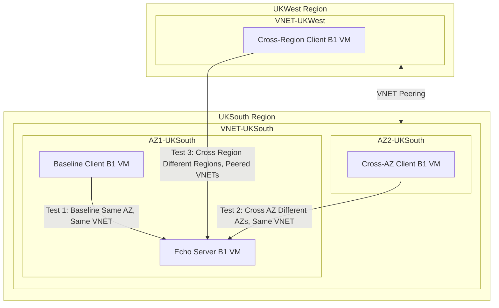

---

title: "Exploring Azure Network Latency: The Fundamentals"
authors: simonpainter
tags:
  - azure
  - networks
  - cloud
date: 2025-03-20

---

When I set out to explore network latency in Azure, I had a simple goal: to understand how physical distance affects performance. After all, we've all heard that farther apart means slower connections. But I wanted specifics - exactly how much slower? And how consistent is that performance? I also wanted to see how long lived TCP connections performed across the Azure network.

I'm sharing what I've learned from my first round of tests, setting a baseline that we can build on later.

## My simple test setup

I kept things straightforward. I set up a few small VMs (B1, 1 vCPU, 1 GB RAM) in different locations and measured how long it took to send data between them:

- Server VM and client VM in the same zone in UK South
- Another client VM in a different zone but still in UK South
- A third client VM all the way in UK West

I connected everything with standard Azure networking - just basic VNET peering between regions, nothing fancy. This gave me a clean slate to work from.

## How I measured things

My approach was pretty simple. I set up an echo server on port 7, and each client sent a small 64-byte packet once per second. The client measured how long it took to get a response.

I ran each test for about 11 hours, collecting roughly 40,000 measurements per scenario. This was enough to spot any patterns or unusual behaviour.

For the curious: I've published all my testing tools [on GitHub](https://github.com/simonpainter/echo_test/). The server uses xinetd to run a standard TCP echo service, and the client is a Python app that measures time with nanosecond precision.

## What I found: the expected (and the surprising)

First, let's look at the numbers:

| Location | Average Latency | Compared to Same AZ |
|----------|----------------|---------------------|
| Same AZ | 908 μs | - |
| Cross AZ | 1,553 μs | 1.7x slower |
| Cross Region | 5,387 μs | 5.9x slower |

The pattern is clear and matches what you'd expect: things that are closer together are faster to communicate. When the client and server sat in the same zone, messages took less than a millisecond to make the round trip. Moving to a different zone pushed that up by about 70%. Going all the way to another region meant waiting over 5 milliseconds.

Pretty boring so far, right? The more distance, the more latency - not exactly breaking news.

But when I looked closer, I found something more interesting...

## The connection lifecycle

All the TCP connections eventually broke after about 11 hours. The timing of these breaks hints at what might be happening behind the scenes in Azure:

| Connection | Failed At | Notes |
|------------|-----------|-------|
| Same AZ | 2025-03-20 10:04:12 | First to fail |
| Cross Region | 2025-03-20 13:23:55 | Failed with Cross AZ |
| Cross AZ | 2025-03-20 13:23:58 | Failed 3 seconds after Cross Region |

Just before the connections broke, I spotted some unusual latency patterns. For the Same AZ test, latency suddenly dropped by about 166 microseconds in the last 100 packets. The Cross AZ test showed the opposite: latency rose by about 70 microseconds before failure.

These shifts suggest Azure was moving VMs between hosts. The connections probably broke during routine maintenance activities rather than due to network issues.

## The bottom line

So what does all this mean if you're building apps in Azure? Here are the practical takeaways:

1. **Keep chatty services in the same zone when speed matters.** My tests show cross-region communication is about 6 times slower than same-zone. For time-sensitive apps, this difference matters.

2. **Plan for high availability with a speed trade-off.** When you spread across zones for redundancy, you'll pay a speed penalty of about 70%.

3. **Make your apps resilient to connection breaks.** Even with this simple setup, connections eventually break. Use connection pooling with health checks, and consider refreshing connections proactively after 6-8 hours (well before the 11-hour mark where mine broke).

4. **Cache aggressively for cross-region operations.** The large latency penalty makes cross-region traffic best suited for background tasks or cached data, rather than real-time operations.

## What's next?

This baseline work sets the stage for more interesting tests. In my next experiments, I'll be looking at:

1. How different connection methods affect latency across very long distances
2. Whether load balancers and private endpoints help or hurt performance
3. How connection patterns change when we go across continents

Stay tuned - the next round of results turned out to be much more surprising!

---

*All tests were performed in March 2025 on B1 Azure VMs across multiple regions. Your results might vary based on network conditions, VM types, and Azure infrastructure changes.*