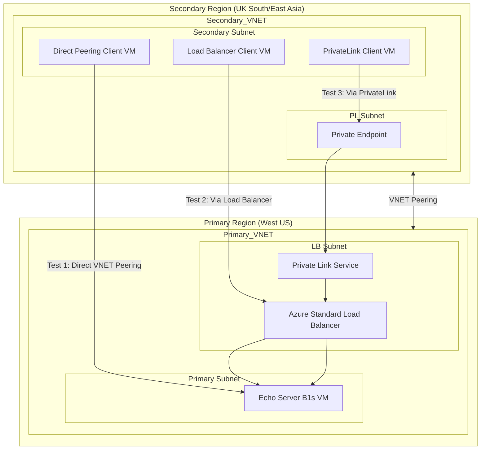

---

title: "Azure Latency Surprise: PrivateLink Outperforms VNET Peering"
authors: simonpainter
tags:
  - azure
  - networks
  - cloud
date: 2025-04-04

---

In [my previous post](azure-latency-1.md), I shared some basic latency tests across Azure networks. The results were pretty predictable: the closer things are physically, the faster they communicate. Not exactly groundbreaking.

But when I expanded my testing to include longer distances and different connection methods, I stumbled onto something genuinely surprising: **PrivateLink connections can actually be faster than direct VNET peering** - sometimes significantly so.
<!-- truncate -->
Let me walk you through what I found, because it might change how you connect your services across Azure regions.

## The expanded test setup

I created a standardised lab environment using Terraform ([available here](https://gist.github.com/simonpainter/05c28f5aae79ca9482dab46854eae320)) to test different connection scenarios:

- Direct VNET peering VM to VM
- Direct VNET peering VM to Azure Load Balancer and then VM
- Azure PrivateLink

I tested these across three different pairs of regions.

1. **UK South to West US**
2. **East Asia to South East Asia**
3. **UK regional, UK West and UK South**

All tests used the same testing methodology: a simple echo server on port 7 with clients sending 64-byte packets and measuring the round-trip time down to the microsecond. I ran these tests for long period - in some cases up to seven days; this was both to gather a huge sample set and also to validate Azure's behaviour with really long lived TCP connections.

> We know that some of the constructs like Azure Firewall and Azure Application Gateway are not designed
> for long lived TCP connections, by virtue of being little more than a managed scale set of VMs, but
> VNet peering, Azure Loadbalancer and Privatelink are very capable of supporting really long lived TCP
> connections although my previous article showed there is likely to be a break in the connection after a host
> migration. If you really need to avoid those connection drops then you will need to look at dedicate
> Azure hosts.

## The results that changed my thinking

When I looked at the UK South to West US trans-Atlantic tests, I saw something unexpected:

| Connection Method | Avg RTT | Compared to Direct Peering |
|-------------------|---------|---------------------------|
| Direct VNET Peering | 145.22 ms | Baseline |
| Load Balancer | 140.61 ms | 4.61 ms faster (3.2% improvement) |
| PrivateLink | 141.14 ms | 4.08 ms faster (2.8% improvement) |

Similar patterns appeared between East Asia and South East Asia tests:

| Connection Method | Avg RTT | Compared to Direct Peering |
|-------------------|---------|---------------------------|
| Direct VNET Peering | 35.87 ms | Baseline |
| Load Balancer | 33.50 ms | 2.37 ms faster (6.6% improvement) |
| PrivateLink | 33.60 ms | 2.27 ms faster (6.3% improvement) |

This was the opposite of what I expected! The "more complex" connection methods - Load Balancer and PrivateLink - were consistently faster than direct VNET peering across long distances.

And when I ran new controlled tests within the UK region, PrivateLink showed an even more dramatic improvement:

| Connection Method | Avg RTT | Compared to Direct Peering |
|-------------------|---------|---------------------------|
| Direct VNET Peering | 6.81 ms | Baseline |
| Load Balancer | 6.93 ms | 0.12 ms slower (1.8% decrease) |
| PrivateLink | 5.62 ms | 1.19 ms faster (17.6% improvement) |

A 17.6% improvement in regional latency is significant - PrivateLink was performing dramatically better than direct peering, even over shorter distances.

## Why is this happening?

I have a few theories about why PrivateLink and Load Balancer connections might outperform direct VNET peering:

1. **Optimized routing** - Microsoft might be prioritising traffic through their managed services over standard VNET peering. Alternatively there may be extra steps in validating traffic through VNet peering that isn't needed for privatelink.

2. **Different network paths** - PrivateLink and Load Balancer traffic might take different physical paths through Microsoft's backbone network.

3. **Connection acceleration** - These services might include some form of transparent acceleration technology.

Without insider knowledge of Azure's network architecture, I can't say for certain which factor is most important. But the data consistently shows these connection methods out performing direct peering.

## Stability patterns

Beyond just average latency, I also analysed the stability of these connections by looking at standard deviation and high-latency events:

| Connection Method | High Latency Events | Pattern |
|-------------------|---------------------|---------|
| Direct VNET Peering | 0.03% of packets | Some clusters of 2-60 consecutive slow packets |
| Load Balancer | 0.007% of packets | Almost always isolated single-packet spikes |
| PrivateLink | 0.01% of packets | Almost always isolated single-packet spikes |

Direct peering showed more periods of sustained high latency (up to 60 consecutive packets with high latency), suggesting potential route instability. By contrast, PrivateLink and Load Balancer showed fewer high-latency events overall, and those events were typically isolated single-packet spikes.

This points to another advantage of these alternative connection methods: they appear to provide more consistent performance with fewer extended periods of degradation.

## What this means for your architecture

Based on these findings, here are some practical recommendations:

1. **Consider PrivateLink for cross-region and even regional connections**. The data shows it can provide significant performance improvements over direct VNET peering, especially for long distances.

2. **Test Load Balancer configurations for long-distance connections**. They consistently showed the best performance for trans-continental communication.

3. **Think beyond just average latency**. The stability improvements from alternative connection methods might be just as valuable as the raw speed improvements.

4. **Test your specific scenario**. While my results consistently showed these patterns, your specific workload and regions might behave differently.

## The bottom line

The conventional wisdom that "simpler is faster" doesn't always hold true in Azure networking. My tests clearly show that PrivateLink and Load Balancer connections can outperform direct VNET peering - sometimes dramatically so.

For applications where every millisecond counts, or where consistent performance is critical, these alternative connection methods are worth considering. The 17.6% improvement I saw with PrivateLink in UK regional tests and the 6.6% improvement with Load Balancer across continents represent real performance gains that could meaningfully impact application responsiveness.

Next time you're connecting services across Azure regions, don't automatically default to VNET peering - you might be leaving performance on the table.

---

*All tests were performed in March-April 2025 on standard Azure VMs across multiple regions. The testing tools and complete data are available at [https://github.com/simonpainter/echo_test/](https://github.com/simonpainter/echo_test/).*
