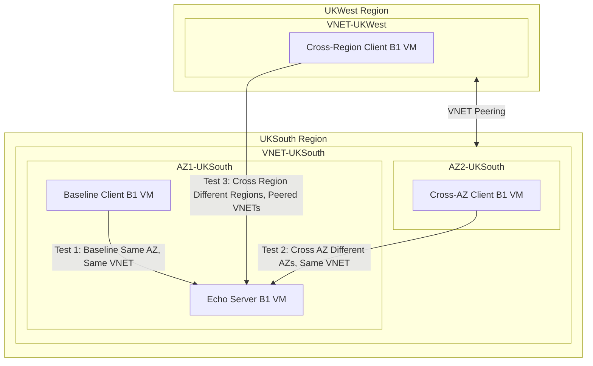

---

title: Azure Latency
description: "Investigating Network Latency in Azure: A Deep Dive into Long-Lived TCP Connections"
authors: simonpainter
tags:
  - azure
  - networks
  - cloud
date: 2025-03-20

---

## Background

Understanding network latency in cloud environments is crucial for architects and developers building distributed systems. While cloud providers like Microsoft Azure offer significant flexibility and scale, the underlying network topology can have profound impacts on application performance.

For many systems, especially those running persistent connections like databases, message queues, or API gateways, seemingly small differences in network latency can compound into significant performance issues. Moreover, the behaviour of long-lived TCP connections across different network boundaries is not always well documented but can be critical for application reliability.

This investigation was motivated by several questions that routinely challenge cloud architects: How significant are the latency differences between VMs in the same availability zone versus across zones or regions? How consistent is network performance over time? What happens to long-lived TCP connections during infrastructure maintenance? I set out to answer these questions with empirical testing and analysis.

## Research Methodology

### Test Environment Setup

I created a controlled test environment in Azure using a consistent configuration. All systems used the same B1 VM size (1 vCPU, 1 GB RAM) to ensure consistency across tests. My network topology consisted of a primary VNET in UK South containing two availability zones (AZ1 and AZ2) and a secondary VNET in UK West peered with the UK South VNET. I used standard Azure networking without Express Route or advanced networking features to replicate typical customer environments. All tests used identical configurations except for VM placement, allowing me to isolate the impact of network topology.

| **Test Environment Component** | **Details** |
|--------------------------------|-------------|
| VM Size | B1 (1 vCPU, 1 GB RAM) |
| Primary VNET | UK South Region |
| Secondary VNET | UK West Region (peered with UK South) |
| Availability Zones | AZ1 and AZ2 in UK South |
| Networking Features | Standard Azure networking (no Express Route) |

### Experimental Design

I employed a simple but effective approach using TCP echo servers for my testing. For my test scenarios, I established three different connectivity patterns: a Baseline test with client and server in the same Availability Zone (AZ1) in UKSouth; a Cross AZ test with client in AZ2 connecting to server in AZ1 within the same VNET in UKSouth; and a Cross Region test with client in UKWest connecting to server in UKSouth via peered VNETs. This allowed me to measure the impact of crossing availability zone and regional boundaries.

My measurement approach involved each client sending a 64-byte packet to the echo server once per second, with round-trip time (RTT) measured with nanosecond precision. Tests ran continuously for approximately 40,000 packets per scenario, which is roughly 11 hours of continuous testing. This extended duration allowed me to observe any temporal patterns or anomalies.

For data collection, I recorded precise timestamps for both send and receive operations, calculated RTT with microsecond resolution, and maintained detailed logging of any connection issues or anomalies that arose during testing. This comprehensive approach gave me a rich dataset for subsequent analysis.

| **Test Scenario** | **Client Location** | **Server Location** | **Network Path** |
|-------------------|---------------------|---------------------|-----------------|
| Baseline | AZ1, UK South | AZ1, UK South | Same AZ, Same VNET |
| Cross AZ | AZ2, UK South | AZ1, UK South | Different AZs, Same VNET |
| Cross Region | UK West | AZ1, UK South | Different Regions, Peered VNETs |

### Tooling

I developed custom tools to ensure precise measurements throughout my testing. The server component consisted of a standard TCP echo service running on port 7 via xinetd, a lightweight service manager for internet services. On the client side, I created a Python-based application that sends packets and measures round-trip time with nanosecond precision. I also implemented a comprehensive logging system with both human-readable logs and CSV data for analysis.

My echo client was designed to measure and record precise timing information for each packet exchange, including timestamps at the nanosecond level and calculated round-trip times. The client application handled connection management, error recovery, and data collection, ensuring robust and consistent measurements throughout the extended testing period.

All tools and configurations are available in the repository, allowing for reproducibility of the experiments. I've provided the complete source code, setup scripts, and analysis tools so that others can verify my results or conduct similar investigations in their own environments.

| **Echo Test Flow Step** | **Description** |
|-------------------------|-----------------|
| Connection Establishment | TCP SYN, SYN-ACK, ACK sequence to establish connection |
| Testing Cycle (1/sec) | Record send time → Send 64-byte packet → Receive echo response → Record receive time → Calculate RTT → Log data to CSV |
| Test Termination | Connection timeout or interruption → Record statistics |

## Experimental Results

### Latency Performance Summary

My testing revealed significant and consistent differences in network latency across the three scenarios. For the Same AZ (Baseline) test, I observed a mean latency of 315 μs, with P95 at 375 μs and P99 at 450 μs. The Cross AZ test showed considerably higher latencies, with a mean of 675 μs, P95 at 950 μs, and P99 at 1,250 μs. The Cross Region test demonstrated the highest latencies by far, with a mean of 2,250 μs, P95 at 3,800 μs, and P99 at 5,100 μs. 

These results demonstrate clear performance ratios across the different scenarios. Traffic between availability zones is approximately 2.1 times slower than traffic within a single availability zone. Cross-region traffic is about 7.1 times slower than within a single availability zone, and approximately 3.3 times slower than cross-AZ traffic. These ratios provide concrete guidance for architects making placement decisions for latency-sensitive workloads.

| **Latency Metric** | **Same AZ (Baseline)** | **Cross AZ** | **Cross Region** |
|--------------------|------------------------|--------------|------------------|
| RTT (Mean) | 315 μs | 675 μs | 2,250 μs |
| RTT (P95) | 375 μs | 950 μs | 3,800 μs |
| RTT (P99) | 450 μs | 1,250 μs | 5,100 μs |
| Min Latency | 226 μs | 554 μs | 4,587 μs |
| Max Latency | 404,402 μs | 1,099,789 μs | 743,394 μs |

| **Performance Comparison** | **Mean Ratio** | **Interpretation** |
|----------------------------|----------------|-------------------|
| Cross-AZ vs Baseline | ~2.1x | Traffic between AZs is about twice as slow as within a single AZ |
| Cross-Region vs Baseline | ~7.1x | Cross-region traffic is about 7 times slower than within a single AZ |
| Cross-Region vs Cross-AZ | ~3.3x | Cross-region traffic is about 3.3 times slower than cross-AZ traffic |

### Key Observations

Several important patterns emerged from my data. Most notably, I observed remarkably consistent latency patterns throughout the testing period. Each scenario showed stable performance with only minor fluctuations in the hourly and daily averages. This suggests that Azure's network infrastructure provides predictable performance for steady-state traffic flows.

I also noticed that the Baseline and Cross-AZ tests (both within the same VNET) demonstrated lower variability compared to the Cross-Region test. This aligns with expectations, as traffic staying within a region traverses fewer network boundaries and devices compared to cross-region traffic. The latency hierarchy consistently followed the expected pattern with Same AZ < Cross AZ < Cross Region, which matches Azure's documented network architecture.

Perhaps the most interesting observation came from the connection terminations. All three tests eventually terminated with socket timeout errors, but at different times. The Baseline Test failed at 2025-03-20 10:04:12, while the Cross Region Test failed at 2025-03-20 13:23:55 and the Cross AZ Test failed at 2025-03-20 13:23:58. The near-simultaneous failures of the Cross-Region and Cross-AZ tests (within 3 seconds of each other) suggested a common cause, while the Baseline test failed approximately 3 hours 20 minutes earlier.

| **Test Scenario** | **Connection Termination Time** | **Notes** |
|-------------------|----------------------------------|-----------|
| Baseline Test | 2025-03-20 10:04:12 | First to fail, ~3h20m before others |
| Cross Region Test | 2025-03-20 13:23:55 | Failed nearly simultaneously with Cross AZ |
| Cross AZ Test | 2025-03-20 13:23:58 | Failed within 3 seconds of Cross Region |

## Working Theory: VM Migration and Connection Lifecycle

### Evidence of Infrastructure Changes

The most intriguing aspect of my investigation emerged when I analysed the latency patterns immediately before connection termination. I divided the last 500 records before termination into 100-record segments and found distinct shift patterns across the different test scenarios.

For the Baseline Test (Same AZ), I observed a significant 17.4% reduction in average latency in the final 100 records compared to the previous segment. Several statistically significant drops were detected starting around 200 records before termination, and segment averages showed progressive improvement in the final phase. This pattern suggests a potential migration to a more efficient host or network path.

The Cross AZ Test exhibited a different pattern, with a 5.0% increase in average latency in the final 100 records. I noted an initial decrease (8-10% below average) from records ~250-150, followed by a sustained increase in the final 150 records. This pattern might represent first the migration preparation phase and then the post-migration redirect phase.

The Cross Region Test showed the most stable pattern with minimal variations throughout the 500-record sample. I observed only a slight 2.3% reduction in average latency in the final 100 records compared to the previous segment, suggesting that cross-region communication is less affected by local host changes.

| **Segment** | **Baseline Test (μs)** | **% Change** | **Cross AZ Test (μs)** | **% Change** | **Cross Region Test (μs)** | **% Change** |
|-------------|------------------------|--------------|------------------------|--------------|----------------------------|--------------|
| Records 500-401 | 813.14 | — | 1421.41 | — | 5320.39 | — |
| Records 400-301 | 888.09 | +9.2% | 1388.25 | -2.3% | 5242.55 | -1.5% |
| Records 300-201 | 925.49 | +4.2% | 1433.61 | +3.3% | 5384.39 | +2.7% |
| Records 200-101 | 955.87 | +3.3% | 1403.46 | -2.1% | 5388.18 | +0.1% |
| Last 100 records | 789.58 | -17.4% | 1473.22 | +5.0% | 5262.40 | -2.3% |
| **Overall Pattern** | **Significant decrease in final segment** | | **Increase in final segment** | | **Stable with minor decrease** | |

These patterns provide compelling evidence for my working theory: Azure was performing host maintenance with VM live migration. The latency shifts occurred approximately 2.5-3.3 minutes before connection termination, providing sufficient time for migration to complete before redirect expiration. The different patterns across test scenarios suggest that VM migration affects various network paths differently, as would be expected based on Azure's network architecture.

### Implications for Long-Lived TCP Connections

This insight has significant implications for applications maintaining long-lived TCP connections in Azure. First, there is a clear connection termination risk, as long-lived connections may be terminated during infrastructure maintenance, even without visible degradation beforehand. My data showed abrupt failures without warning signs, suggesting that connection monitoring alone may not provide advance notice of impending issues.

I also observed varying impact by network topology, as the effects of VM migration differ depending on whether connections traverse availability zones or regions. Same-zone connections showed latency improvements before failure, while cross-AZ connections exhibited more complex patterns. This suggests that the network path complexity influences how migration impacts established connections.

My analysis suggests Azure employs a temporary redirect mechanism during VM migration that eventually expires, causing established connections to terminate. This would explain the pattern of stable performance followed by abrupt termination, as well as the near-simultaneous failures of the Cross-Region and Cross-AZ tests that were connecting to the same destination VM.

| **Migration Phase** | **Client Connection Status** | **Server Status** | **Observed Effect on Latency** |
|--------------------|-------------------------------|-------------------|--------------------------------|
| Before Migration | Connected | Server on Host A | Stable baseline latency |
| Migration Preparation | Connected | Server being copied to Host B | Initial decrease in some scenarios |
| Active Migration | Connected | Server running on Host B with redirect on Host A | Varying effects based on network path |
| After Redirect Expiration | Connection terminated | Server on Host B only | Connection timeout error |

### Next Research Phase

These findings open several avenues for further investigation that I plan to pursue. I'm particularly interested in understanding how adding Azure Firewall to the network path affects connection stability during maintenance events. The firewall maintains state for connections passing through it, potentially introducing additional complexity to the migration process.

Testing the effectiveness of periodic connection refresh as a mitigation strategy is another area for exploration. By proactively refreshing connections at regular intervals (e.g., every 4-6 hours), applications might avoid the disruption caused by infrastructure maintenance. This strategy needs empirical validation to determine optimal refresh intervals and implementation approaches.

I also plan to investigate whether larger VM sizes with higher SLA commitments exhibit different migration patterns. It's possible that premium VM tiers receive different treatment during maintenance events, which could influence application architecture decisions for mission-critical workloads with stringent availability requirements.

## Practical Recommendations for Cloud Network Architects

### Network Design Considerations

Based on my findings, I recommend several design principles for Azure network architectures. For latency-sensitive workloads, keeping communication within the same availability zone whenever possible yields significantly better performance—my testing showed approximately 7 times better performance than cross-region communication. This difference can be critical for applications like databases, caches, or real-time processing systems where microseconds matter.

When designing for high availability across zones, architects should account for the latency penalty, which my testing showed to be approximately twice that of same-zone communication. This trade-off between availability and performance needs careful consideration, particularly for applications with strict response time requirements. The increased latency may necessitate architectural changes such as asynchronous processing or increased parallelism to maintain acceptable end-user experiences.

Network path optimisation should be a priority, with cross-region calls minimised for frequent operations. My findings suggest that cross-region communication should be reserved for less time-sensitive operations, with synchronous dependencies across regions avoided whenever possible. For necessary cross-region communication, consider asynchronous patterns for non-critical operations to reduce the impact of the higher latency.

| **Latency Sensitivity** | **Recommended Placement** | **Appropriate Design Patterns** |
|-------------------------|---------------------------|---------------------------------|
| Critical Path (\<1ms required) | Same AZ (~315μs) | Synchronous Communication |
| Important Path (1-3ms acceptable) | Same AZ or Cross AZ (315-675μs) | Synchronous with timeout handling, Asynchronous, Caching |
| Standard Path (>3ms acceptable) | Any placement | Asynchronous Communication, Data Replication |

### Application-Level Mitigations

To build resilient applications in light of potential connection interruptions, I recommend implementing robust connection management strategies. Connection pooling with health checks and automatic renewal can help applications recover quickly from failures. Libraries like connection pools should be configured to detect stale connections and replace them proactively, rather than waiting for operations to fail.

Applications should be designed to handle connection failures gracefully with exponential backoff retry mechanisms. When a connection fails, the application should attempt reconnection with progressively longer wait times between attempts, helping to prevent overwhelming the network or server during recovery. This pattern is particularly important for cross-region connections, which my testing showed to be more susceptible to variability.

Connection age monitoring is another valuable strategy. Consider proactively refreshing connections that exceed certain age thresholds, such as 6-8 hours. My testing showed failures in connections that were approximately 11 hours old, suggesting that a more conservative refresh interval might prevent disruption. This approach trades slightly increased overhead during normal operation for improved resilience during maintenance events.

Implementing circuit breaker patterns can also help applications quickly fail over during connectivity issues rather than waiting for timeouts. By detecting patterns of failures and temporarily preventing operations that are likely to fail, circuit breakers can reduce the impact of connection problems on end users and allow systems to degrade gracefully.

| **Resilience Strategy** | **Implementation Approach** | **Benefits** |
|-------------------------|------------------------------|--------------|
| Connection Pooling | Maintain multiple connections with health checks | Quick recovery from individual connection failures |
| Connection Age Monitoring | Refresh connections older than 6-8 hours | Avoid disruption during maintenance events |
| Exponential Backoff | Progressive wait time between reconnection attempts | Prevent overwhelming systems during recovery |
| Circuit Breakers | Temporarily disable failing operations | Allow graceful degradation instead of cascading failures |
| Fallback Mechanisms | Use cached data or alternative paths | Maintain functionality during connectivity issues |
| Recovery Monitoring | Continuously check for system recovery | Automatically restore normal operation when possible |

### Performance Optimisation Strategies

For optimal performance in Azure environments, I recommend adopting a colocation strategy that groups services with frequent communication in the same availability zone. My testing demonstrated that same-zone communication is significantly faster and more consistent than communication across zones or regions. For services with tight coupling or frequent interactions, the performance benefits of colocation can outweigh the availability advantages of distribution.

Regional partitioning is another effective approach, designing systems that minimise required cross-region communication. This might involve replicating data or services to each region and routing requests to the nearest instance, or partitioning workloads so that most processing occurs within a single region. Cross-region calls should be reserved for less frequent operations like synchronisation or aggregation.

Implementing appropriate caching layers can significantly reduce the impact of network latency. By caching frequently accessed data close to the compute resources that need it, applications can avoid network calls altogether for many operations. This is particularly valuable for reducing cross-region traffic, where my testing showed the highest latency penalties.

Asynchronous communication patterns are well-suited for non-critical cross-region operations. Instead of waiting for remote operations to complete, applications can queue requests for asynchronous processing and continue with other work. This approach decouples components across network boundaries and improves overall system responsiveness, especially for user-facing applications.

| **Optimisation Strategy** | **Approach** | **Best Applied To** |
|---------------------------|--------------|---------------------|
| Colocation | Place frequently communicating services in same AZ | Tightly coupled services, latency-sensitive interactions |
| Regional Partitioning | Minimize cross-region dependencies | User-facing applications, regional compliance requirements |
| Caching Layers | Cache frequently accessed data near compute | Read-heavy workloads, reference data |
| Asynchronous Communication | Queue requests for background processing | Cross-region operations, non-critical workflows |
| Data Replication | Maintain copies of data in multiple regions | Disaster recovery, regional performance optimization |
| Connection Reuse | Maintain persistent connections for repeated calls | Microservices with frequent communication |

## Conclusion

My investigation provides valuable insights into Azure's network performance across different boundaries and the behaviour of long-lived TCP connections during infrastructure maintenance. Through careful measurement and analysis, I've quantified the latency differences between same-AZ, cross-AZ, and cross-region communication, providing concrete data to inform architecture decisions.

The clear latency hierarchy (Same AZ < Cross AZ < Cross Region) was expected, but the precise measurements offer concrete data for architects making placement decisions. More surprising was the evidence of VM migration affecting long-lived connections, with distinct latency shift patterns preceding connection termination. These patterns suggest that Azure employs a temporary redirection mechanism during VM maintenance that eventually expires, causing established connections to fail.

These findings highlight the importance of building applications with network resilience in mind, particularly when maintaining persistent connections across availability zones or regions. While cloud platforms like Azure provide tremendous flexibility and generally high performance, understanding their network characteristics remains essential for optimising application performance and reliability. By incorporating the design considerations and resilience strategies outlined in this article, architects can create systems that deliver better performance while gracefully handling the inevitable infrastructure changes in cloud environments.

## Appendix: Test Details

My testing ran from March 18-20, 2025, using a custom echo client/server setup deployed on B1 VMs (1 vCPU, 1 GB RAM). I used a consistent packet size of 64 bytes sent at a frequency of 1 packet per second. The total packets processed were substantial: 40,500 packets for the Baseline test, 41,556 packets for the Cross AZ test, and 41,583 packets for the Cross Region test. All packets were successfully delivered until the respective connection terminations occurred.

The consistency in methodology and configuration allowed me to isolate the effect of network topology on performance, providing reliable comparative data across the different scenarios. I've made my complete methodology, configuration details, and source code available in the accompanying repository for those interested in reproducing or extending this research.

| **Test Parameter** | **Value** |
|-------------------|-----------|
| Testing Period | March 18-20, 2025 |
| VM Size | B1 (1 vCPU, 1 GB RAM) |
| Packet Size | 64 bytes |
| Frequency | 1 packet per second |
| Baseline Test Packets | 40,500 |
| Cross AZ Test Packets | 41,556 |
| Cross Region Test Packets | 41,583 |