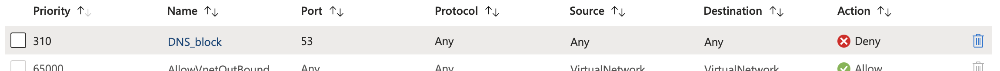
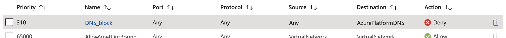
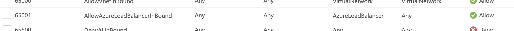

---

title: "168.63.129.16: The Magic IP Address in Azure"
authors: simonpainter
tags:
  - azure
  - networks
  - cloud
date: 2025-10-01

---

From time to time I have a conversation about Azure networking and a topic comes up that I need to dig into a little more. Normally the [documentation is pretty good](https://learn.microsoft.com/en-us/azure/virtual-network/what-is-ip-address-168-63-129-16) but sometimes I just need to bottom out all the behaviour. Today's topic is 168.63.129.16, an IP address that keeps coming up in various places in Azure. 
<!-- truncate -->

Three main uses

- Azure DNS & DHCP
- Azure VM Agent
- Health checks from Azure Loadbalancer


```
simon@lab-simon-mip-vm:~$ journalctl | grep dhcp
Sep 30 20:45:25 ubuntu dhcpcd[585]: dhcpcd-10.0.6 starting
Sep 30 20:45:25 ubuntu dhcpcd[588]: DUID 00:01:00:01:30:6e:fd:e5:00:22:48:3f:97:f1
Sep 30 20:45:25 ubuntu dhcpcd[588]: eth0: IAID 48:3f:97:f1
Sep 30 20:45:26 ubuntu dhcpcd[588]: eth0: soliciting a DHCP lease
Sep 30 20:45:26 ubuntu dhcpcd[588]: eth0: offered 10.0.0.4 from 168.63.129.16 LON240101090863
Sep 30 20:45:26 ubuntu dhcpcd[588]: eth0: leased 10.0.0.4 for infinity
Sep 30 20:45:26 ubuntu dhcpcd[588]: eth0: adding route to 10.0.0.0/24
Sep 30 20:45:26 ubuntu dhcpcd[588]: eth0: adding default route via 10.0.0.1
Sep 30 20:45:26 ubuntu dhcpcd[588]: eth0: adding host route to 168.63.129.16 via 10.0.0.1
Sep 30 20:45:26 ubuntu dhcpcd[588]: eth0: adding host route to 169.254.169.254 via 10.0.0.1
Sep 30 20:45:26 ubuntu dhcpcd[588]: control command: dhcpcd --dumplease --ipv4only eth0
simon@lab-simon-mip-vm:~$ 
```


```
simon@lab-simon-mip-vm:~$ sudo dhcpcd --dumplease eth0
reason=CARRIER
interface=eth0
protocol=link
if_configured=true
ifcarrier=up
ifmetric=1002
ifwireless=0
ifflags=69699
ifmtu=1500

reason=REBOOT
interface=eth0
protocol=dhcp
ip_address=10.0.0.4
subnet_cidr=24
broadcast_address=10.0.0.255
network_number=10.0.0.0
server_name=LON240101090863
subnet_mask=255.255.255.0
classless_static_routes=0.0.0.0/0 10.0.0.1 168.63.129.16/32 10.0.0.1 169.254.169.254/32 10.0.0.1
routers=10.0.0.1
domain_name_servers=168.63.129.16
domain_name=bqonim1o5esurn53inr3kbwdpc.zx.internal.cloudapp.net
dhcp_lease_time=4294967295
dhcp_message_type=5
dhcp_server_identifier=168.63.129.16
dhcp_renewal_time=4294967295
dhcp_rebinding_time=4294967295
simon@lab-simon-mip-vm:~$ 
```




```
simon@lab-simon-mip-vm:~$ dig www.simonpainter.com +short @8.8.8.8
;; communications error to 8.8.8.8#53: timed out
;; communications error to 8.8.8.8#53: timed out
;; communications error to 8.8.8.8#53: timed out

; <<>> DiG 9.18.39-0ubuntu0.24.04.1-Ubuntu <<>> www.simonpainter.com +short @8.8.8.8
;; global options: +cmd
;; no servers could be reached
simon@lab-simon-mip-vm:~$ dig www.simonpainter.com +short @168.63.129.16
104.21.53.33
172.67.208.85
simon@lab-simon-mip-vm:~$ 
```




```
simon@lab-simon-mip-vm:~$ dig www.simonpainter.com +short @168.63.129.16
;; communications error to 168.63.129.16#53: timed out
;; communications error to 168.63.129.16#53: timed out
;; communications error to 168.63.129.16#53: timed out

; <<>> DiG 9.18.39-0ubuntu0.24.04.1-Ubuntu <<>> www.simonpainter.com +short @168.63.129.16
;; global options: +cmd
;; no servers could be reached
simon@lab-simon-mip-vm:~$ dig www.simonpainter.com +short @8.8.8.8
104.21.53.33
172.67.208.85
simon@lab-simon-mip-vm:~$ 
```


```
simon@lab-simon-mip-vm:~$ tail /var/log/apache2/access.log 
168.63.129.16 - - [30/Sep/2025:21:06:07 +0000] "GET / HTTP/1.1" 200 10982 "-" "Load Balancer Agent"
168.63.129.16 - - [30/Sep/2025:21:06:22 +0000] "GET / HTTP/1.1" 200 10982 "-" "Load Balancer Agent"
168.63.129.16 - - [30/Sep/2025:21:06:37 +0000] "GET / HTTP/1.1" 200 10982 "-" "Load Balancer Agent"
simon@lab-simon-mip-vm:~$ 
```




```
simon@lab-simon-mip-vm:~$ sudo netstat -tupn
Active Internet connections (w/o servers)
Proto Recv-Q Send-Q Local Address           Foreign Address         State       PID/Program name    
tcp        0    324 10.0.0.4:22             xxx.xxx.xxx.xxx:52428   ESTABLISHED 1212/sshd: simon [p 
tcp        0    446 10.0.0.4:43546          168.63.129.16:32526     ESTABLISHED 1632/python3 
```
