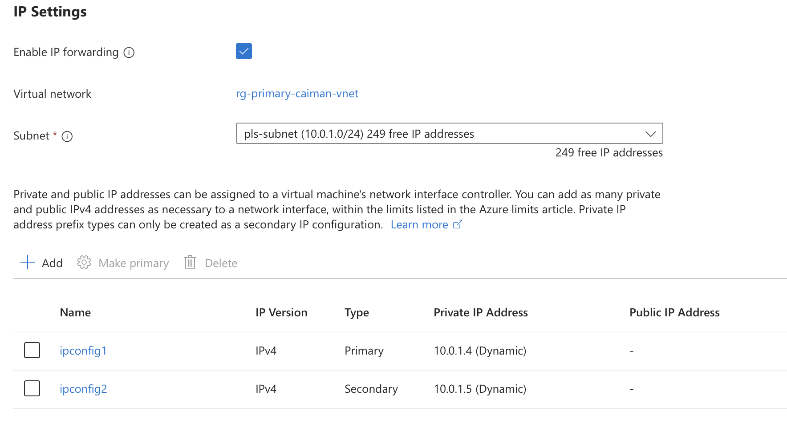
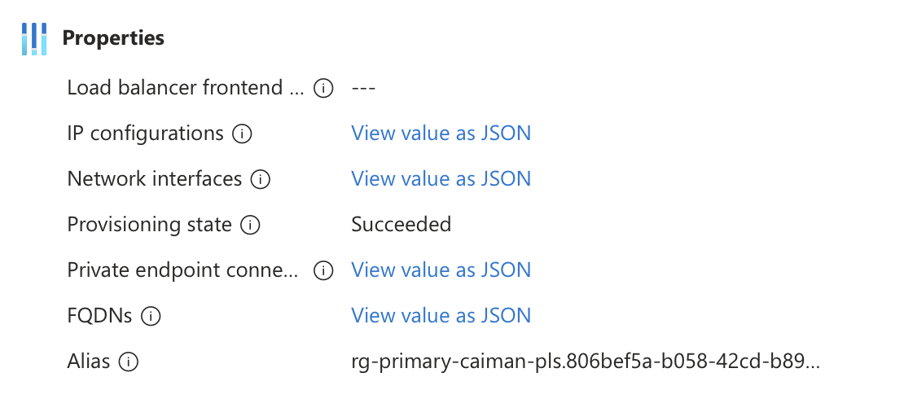

---

title: "Azure Private Link Direct Connect"
authors: simonpainter
tags:
  - cloud
  - azure
  - networks
date: 2025-10-16

---

One of the downsides of private previews is that they are under NDA so you can't really talk about them. However, I can now talk about [Azure Private Link Direct Connect](https://learn.microsoft.com/en-us/azure/private-link/configure-private-link-service-direct-connect) because it's in [public preview](https://azure.microsoft.com/en-us/updates?id=503988) now. It solves one of the problems that has been bugging me for a while with Private Link Services (PLS) which is that you have to use a load balancer or an application gateway in front of the service.
<!-- truncate -->
## Load balancers have limitations

Load balancers are great but in Azure they have some weird limitations. One of the ones that has tripped me up in the past is that you can't use a [Standard Load Balancer in front of a PLS if the backend pool is made up of IPs rather than NICs](https://learn.microsoft.com/en-us/azure/private-link/private-link-service-overview#limitations). Alternatively you can use an Application Gateway that can have a backend pool made up of IPs but that has its own limitations such as not being able to use it for non-HTTP/S traffic. This is solved to some extent by using the [Application Gateway TCP/TLS proxy](https://learn.microsoft.com/en-us/azure/application-gateway/tcp-tls-proxy-overview) but that still adds cost and complexity to something that should be quite simple.

## But what's your use case?

I have a few weird uses cases which mainly revolve around wanting to use PLS for its DNAT and SNAT capabilities. In an organisation I have worked with there were two large heritage organisations merged in an acquisition and not fully integrated. This meant there was a substantial overlap in the RFC 1918 address space used by each heritage organisation so when we were deploying new services into Azure that needed to talk to systems in both heritage organisations we were unable to simply route traffic between them. There are, of course, plenty of centralised NAT solutions and there was one in use by the on premise network team but that was a shared service and not in keeping with our principles of decentralisation and autonomy. For cloud to cloud the private link service is a great solution because all of our services were already behind a load balancer or application gateway but we had some need to reach on-premise systems. The Azure load balancer is perfectly capable of being used to provide an Azure front end for services in a back end pool of IPs that are on-premise, reachable either via VPN or more typically ExpressRoute. However, in this configuration the load balancer can not then also have a private link.

We also had an elegant solution for site to site VPNs where an Azure VPN Gateway is used in an isolated VNet to a third party and then we present services via privatelink to the third party in that VNet. It's modular, repeatable and secure, while also ensuring we can accommodate third party IP schemas without conflicts. This worked fine for ingress but as soon as we had the need for egress we were stuck unless we added the complexity of a proxy into the isolated VNet.

## Enter Private Link Direct Connect

Private Link Direct Connect solves the problem by allowing you to create a private link service which is associated to an IP that can be any private IP either inside or outside of Azure. I tested it with a lab version of both scenarios above and it worked as expected. I'll do a lab build properly but the basic steps are below:

> It's a preview so it's not available in the portal, or all regions. You need to create it via Terraform or via PS/CLI.

```terraform

resource "azurerm_private_link_service" "plsdc" {
  name                = "my-plsdc"
  location            = azurerm_resource_group.rg.location
  resource_group_name = azurerm_resource_group.rg.name

  # Destination IP address for direct routing. 
  # This must be a private IP reachable from
  # the subnet you create the PLSDC in.
  destination_ip_address = "10.1.1.1"

  # Minimum 2 IP configurations required.
  # These are the source NAT IPs.

  nat_ip_configuration {
    name     = "ipconfig1"
    primary  = true
    subnet_id = azurerm_subnet.pls_subnet.id
  }
  nat_ip_configuration {
    name     = "ipconfig2"
    primary  = false
    subnet_id = azurerm_subnet.pls_subnet.id
  }
}
```

Once created you can see constructs like the NIC and the associated IP configurations in the portal.



You can also see the PLS itself although there will be some fields in the portal that are blank because they are not available for this type of PLS. Note below that the load balancer field is empty.



One thing I noticed while playing around was that it would let me create the PLSDC with a destination IP that is a public IP address but didn't actually work when I tried to connect to it. I assume this is a bug in the preview but it's worth noting that the documentation does say it must be a private IP address.
