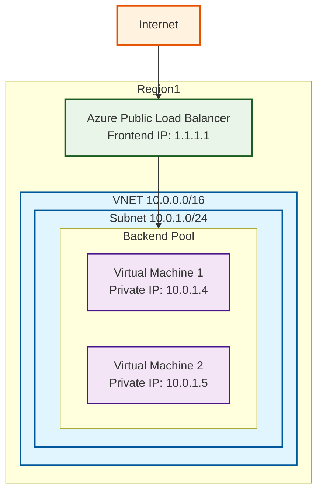
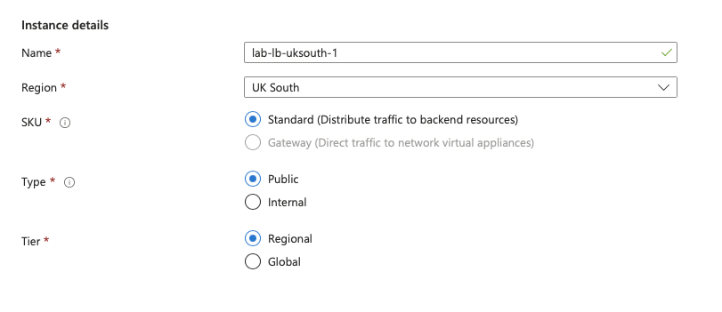
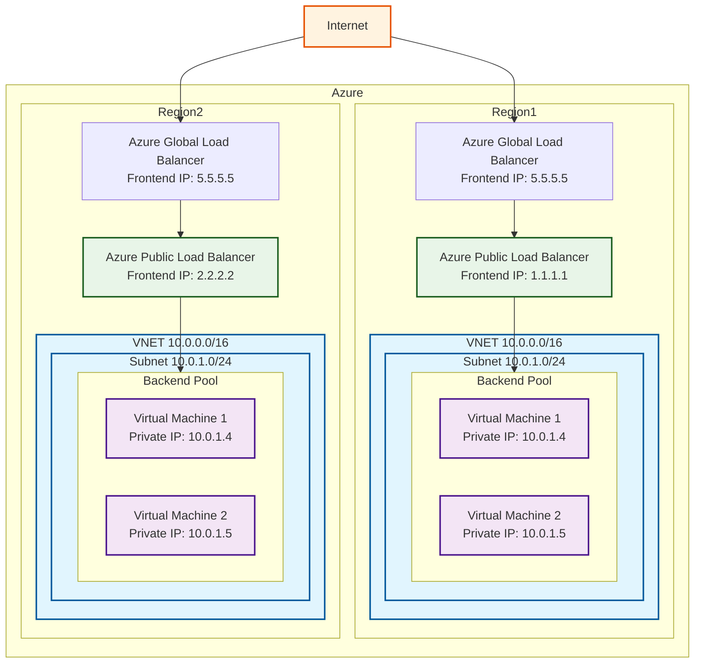
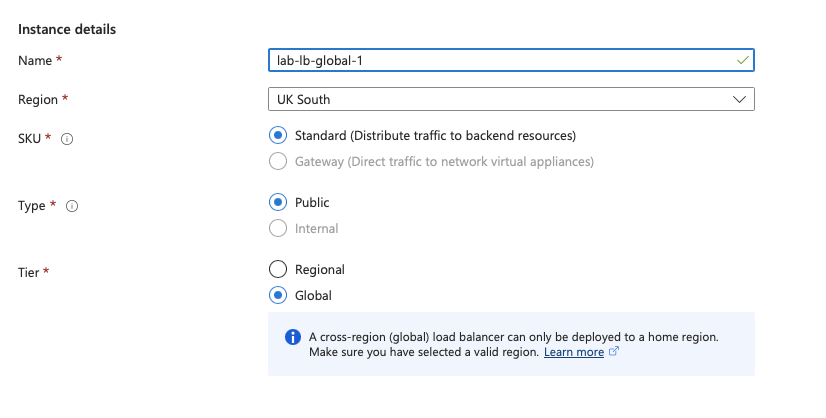
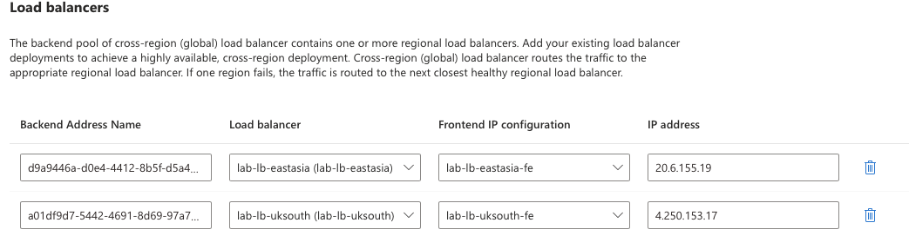

---

title: "Azure Global Load balancer: It's anycast, Jim!"
authors: simonpainter
tags:
  - azure
  - networks
  - cloud
  - anycast
date: 2025-09-13

---

Azure Global Load balancer is often overlooked in favour of Azure Traffic Manager when it comes to global load balancing. Both are very capable options if all you want is to distribute traffic across multiple regions. However, Azure Global Load balancer has a few tricks up its sleeve that make it a more interesting choice in some scenarios. The main one is that it uses Anycast for its frontend IP addresses.
<!-- truncate -->
Azure Traffic Manager is a DNS based load balancing solution. You create a Traffic Manager profile and give it a DNS name, for example `myapp.trafficmanager.net`. You then add endpoints to that profile which can be public IPs, Azure App Services, Azure VMs or even external endpoints. When a client looks up the DNS name they get back the IP address of one of the endpoints based on the load balancing method you have chosen. This is great for distributing traffic across multiple regions but it does have some limitations. The main one is that it relies on DNS for load balancing. This means that if an endpoint goes down, clients that have already cached the DNS response will continue to try and connect to the failed endpoint until the DNS cache expires. This can lead to a poor user experience.

Azure Global Load balancer, on the other hand, is a layer 4 load balancer that uses Anycast for its frontend IP addresses. This means that when you create a Global Load balancer, you get a single IP address that is advertised from multiple participating regions. Traffic is routed to the nearest participating region and then once inside the Azure network it can take advantage of Azure's global backbone which uses lower latency [hollow core fibre](microsoft-ignite-2024.md#hollow-core-fibre) to connect to the nearest healthy region.

As with the private [anycast solution](anycast-route-server.md) I described in a previous post, this means that you can have a single IP address that is used globally and is resilient to regional failures. If one region goes down, traffic is automatically routed to the next nearest healthy region without any need for DNS changes or client-side caching issues. Although things are fairly opaque I would imagine they work in a similar way with the regional Load balancer healthchecks being used to conditionally inject the anycast IP from that region.

## Use cases

Latency matters, and for some applications every millisecond counts. Azure Global Load Balancer really shines when you have applications that need to be globally distributed but need to respond with minimal latency and can't afford the delays introduced by DNS resolution and caching.

Financial services and market data distribution is probably the most obvious example. Market data feeds need to reach traders and algorithmic trading systems with the lowest possible latency - we're talking microseconds, not seconds. With Global Load Balancer's anycast IP, a trader's application connects immediately to the nearest Azure region and then travels over Microsoft's optimised backbone to reach the trading engine.
Live streaming and gaming are other natural fits. The anycast approach means players and viewers connect instantly to their nearest point of presence.

IoT data ingestion at scale is another compelling use case. Imagine you're running a global fleet of sensors - weather stations, industrial monitoring, vehicle telemetrics. These devices might be programmed with a single IP address and need to send data reliably regardless of which Azure region they're closest to.

## So let's get into it

To create a Global Load balancer you need to start with a standard public Load balancer in one or more of your regions. Below is a simple example as used in my lab where I have a single region, two VMs in a backend pool and a public frontend IP address. The Load balancer is configured to use a basic health probe on port 80 and a load balancing rule to distribute TCP traffic on port 80 to the backend pool.
I typically install a web server on the VMs to act like a basic web application and the line `sudo echo $HOSTNAME > /var/www/html/index.html` is enough to make it easy to see which VM is responding to requests.



As you create a public Load balancer in the region of your choice you will see the option to make it regional or global.



We're choosing regional and follow through to create a front end configuration with a new public IP address and a back end pool with the two VMs.

If you want to test the setup you can use curl from a terminal to hit the front end IP address.  During the setup of the inbound rules I selected no session persistence so the expected behaviour is that the responses alternate between the two VMs.


```text
simon@MacBook-Pro my-website % curl 51.142.0.197  
lab-vm-uksouth-1
simon@MacBook-Pro my-website % curl 51.142.0.197
lab-vm-uksouth-2
simon@MacBook-Pro my-website % 
```

You can then repeat this in multiple regions. There are no restrictions on the regions you can use and they don't have to be paired regions. In my lab I used UK South and East Asia.

> A note on paired regions. The main reason for using paired regions is that in the unlikley event of a multi region failure Microsoft will prioritise recovery of one region in each pair. This means that if your application is deployed in both of the regions in a pair then at least one of them is likely to be in the first wave of recovery. It's likely that if you are working at the sort of scale that requites global load balancing then you are already using paired regions.

## Going Global

Once you have your regional instances, each with a separate public IP address on the front end of their regional Load balancers you can create the global Load balancer. You will need to create this in a home region. Although it's a global resource it does need to be created in a specific region. I used UK South as my home region.

> The [list of available home regions](https://learn.microsoft.com/en-us/azure/load-balancer/cross-region-overview#home-regions-in-azure) is fairly short but it appears to have little relevance to the operation of the global Load balancer. The [list of participating regions](https://learn.microsoft.com/en-us/azure/load-balancer/cross-region-overview#participating-regions-in-azure) is somewhat longer but we'll get to what that means in a moment.



The diagram above shows the overall architecture - you'll notice that I have represented the Global Load balancer as two separate entities. This is to illustrate the fact that there does not appear to be central dataplane infrastructure for the global Load balancer and each region advertises the anycast IP, the global Load balancer frontend IP, idependently. This means that traffic from a client is routed to the nearest ingress point to the MSFT Azure backbone and then routed to the closest healthy region.

Creating the global Load balancer is very similar to creating a regional one. The first difference is that you select global rather than regional in the intial creation screen under tier.



The other big difference is that instead of choosing zonal or zone redundant public IP addresses you choose one in the global tier.


The back end pool allows you to add the regional Load balancer front end configurations that you created earlier. You can add public Load balancers from any region.



The Inbound rules are pretty much identical to the regional Load balancer save for the fact that you do not have to specify any health probbes. These are inherited from the regional Load balancers. You can choose to select the floating IP option if you want to, as with a regional Load balancer.

> Floating IP allows you to use loopbacks on the application VMs rather than the main interface address to listen for application traffic. This is particularly useful if you need to have multiple web servers all listening on 443 on the same VM, perhaps with SSL certificates for different domains.

## What were those participating regions again?

When you create a global Load balancer you can use any region to host the resource. However, not all regions will advertise the anycast IP address. The [list of participating regions](https://learn.microsoft.com/en-us/azure/load-balancer/cross-region-overview#participating-regions-in-azure) is fairly long and includes most of the geographical areas where Azure has a presence; there is a notable absence in China, South America and South Africa. If you create a global Load balancer in a non-participating region it will still work but the anycast IP will only be advertised from a participating region. For example a client in South Africa will be routed to the nearest participating region which is likely to be in Europe and then back over the Azure backbone to the nearest which coule be in South Africa.

I've covered the [hollow core fibre](microsoft-ignite-2024.md#hollow-core-fibre) that Microsoft is using to connect its regions in a previous post, and the [apparent latency magic around privatelink](azure-latency-1.md) but the important point is that it uses hot potato routing to the nearest participating Azure region and then uses the low latency, high bandwidth Azure backbone to reach the nearest healthy region.

## A bit of testing

A quick look at a the front end IP for the global Load balancer in a [looking glass tool](https://lg.he.net) showed 23 entries in the BGP table. Given that at time of writing there are 22 participating regions this seems about right. The majority have a next hop in the AS for Azure (8075). It's reasonable to assume that HE peers with MSFT in all of the participating regions.

```text
core3.lax2.he.net> show ip bgp routes detail 51.142.0.197 
  Number of BGP Routes matching display condition : 23
Status A:AGGREGATE B:BEST b:NOT-INSTALLED-BEST C:CONFED_EBGP D:DAMPED
       E:EBGP H:HISTORY I:IBGP L:LOCAL M:MULTIPATH m:NOT-INSTALLED-MULTIPATH
       S:SUPPRESSED F:FILTERED s:STALE x:BEST-EXTERNAL
RPKI State V: Valid I: Invalid N: Not found ?: Undefined
1         Prefix: 51.140.0.0/14, Rx path-id:0x00000000, Tx path-id:0x00d30001, rank:0x00000001,  Status: BMI,  Age: 1d16h17m39s
         NEXT_HOP: 216.218.252.106, Metric: 15, Learned from Peer: 216.218.252.106 (6939)
          LOCAL_PREF: 100,  MED: 0,  ORIGIN: igp,  Weight: 0,  RPKI State: N, GROUP_BEST: 1
         AS_PATH: 8075
            COMMUNITIES: 6939:7312 6939:8840 6939:9001
2         Prefix: 51.140.0.0/14, Rx path-id:0x00000000, Tx path-id:0x01010001, rank:0x00000002,  Status: MI,  Age: 35d20h2m58s
         NEXT_HOP: 206.72.210.143, Metric: 15, Learned from Peer: 216.218.253.227 (6939)
          LOCAL_PREF: 100,  MED: 0,  ORIGIN: igp,  Weight: 0,  RPKI State: N, GROUP_BEST: 0
         AS_PATH: 8075
            COMMUNITIES: 6939:7401 6939:8840 6939:9001
3         Prefix: 51.140.0.0/14, Rx path-id:0x00000000, Tx path-id:0x00ef0001, rank:0x00000003,  Status: I,  Age: 2d18h37m55s
         NEXT_HOP: 216.218.253.53, Metric: 90, Learned from Peer: 216.218.253.53 (6939)
          LOCAL_PREF: 100,  MED: 0,  ORIGIN: igp,  Weight: 0,  RPKI State: N, GROUP_BEST: 0
         AS_PATH: 8075
            COMMUNITIES: 6939:7391 6939:8840 6939:9001
4         Prefix: 51.140.0.0/14, Rx path-id:0x00000000, Tx path-id:0x00ea0001, rank:0x00000004,  Status: I,  Age: 3d16h8m16s
         NEXT_HOP: 216.218.253.22, Metric: 190, Learned from Peer: 216.218.253.22 (6939)
          LOCAL_PREF: 100,  MED: 0,  ORIGIN: igp,  Weight: 0,  RPKI State: N, GROUP_BEST: 0
         AS_PATH: 8075
            COMMUNITIES: 6939:7333 6939:8840 6939:9001
5         Prefix: 51.140.0.0/14, Rx path-id:0x00000000, Tx path-id:0x00d90001, rank:0x00000005,  Status: I,  Age: 2d19h2m6s
         NEXT_HOP: 216.218.252.177, Metric: 225, Learned from Peer: 216.218.252.177 (6939)
          LOCAL_PREF: 100,  MED: 0,  ORIGIN: igp,  Weight: 0,  RPKI State: N, GROUP_BEST: 0
         AS_PATH: 8075
            COMMUNITIES: 6939:1111 6939:7353 6939:8840 6939:9001
6         Prefix: 51.140.0.0/14, Rx path-id:0x00000000, Tx path-id:0x00e60001, rank:0x00000006,  Status: I,  Age: 63d10h30m54s
         NEXT_HOP: 206.81.80.30, Metric: 255, Learned from Peer: 216.218.253.17 (6939)
          LOCAL_PREF: 100,  MED: 0,  ORIGIN: igp,  Weight: 0,  RPKI State: N, GROUP_BEST: 0
         AS_PATH: 8075
            COMMUNITIES: 6939:1111 6939:7321 6939:8840 6939:9001
7         Prefix: 51.140.0.0/14, Rx path-id:0x00000000, Tx path-id:0x00f20001, rank:0x00000007,  Status: I,  Age: 2d18h37m15s
         NEXT_HOP: 216.218.253.59, Metric: 289, Learned from Peer: 216.218.253.59 (6939)
          LOCAL_PREF: 100,  MED: 0,  ORIGIN: igp,  Weight: 0,  RPKI State: N, GROUP_BEST: 0
         AS_PATH: 8075
            COMMUNITIES: 6939:1111 6939:7396 6939:8840 6939:9001
8         Prefix: 51.140.0.0/14, Rx path-id:0x00000000, Tx path-id:0x00e70001, rank:0x00000008,  Status: I,  Age: 2d19h8m34s
         NEXT_HOP: 216.218.253.19, Metric: 295, Learned from Peer: 216.218.253.19 (6939)
          LOCAL_PREF: 100,  MED: 0,  ORIGIN: igp,  Weight: 0,  RPKI State: N, GROUP_BEST: 0
         AS_PATH: 8075
            COMMUNITIES: 6939:1111 6939:7334 6939:8840 6939:9001
9         Prefix: 51.140.0.0/14, Rx path-id:0x00000000, Tx path-id:0x00fb0001, rank:0x00000009,  Status: I,  Age: 2d18h38m24s
         NEXT_HOP: 216.218.253.239, Metric: 340, Learned from Peer: 216.218.253.90 (6939)
          LOCAL_PREF: 100,  MED: 0,  ORIGIN: igp,  Weight: 0,  RPKI State: N, GROUP_BEST: 0
         AS_PATH: 8075
            COMMUNITIES: 6939:1111 6939:7411 6939:8124 6939:9001
10        Prefix: 51.140.0.0/14, Rx path-id:0x00000000, Tx path-id:0x00f70001, rank:0x0000000a,  Status: I,  Age: 1d18h50m46s
         NEXT_HOP: 216.218.253.198, Metric: 460, Learned from Peer: 216.218.253.198 (6939)
          LOCAL_PREF: 100,  MED: 0,  ORIGIN: igp,  Weight: 0,  RPKI State: N, GROUP_BEST: 0
         AS_PATH: 8075
            COMMUNITIES: 6939:7420 6939:8840 6939:9001
11        Prefix: 51.140.0.0/14, Rx path-id:0x00000000, Tx path-id:0x00cb0001, rank:0x0000000b,  Status: I,  Age: 3d16h20m39s
         NEXT_HOP: 216.218.252.69, Metric: 465, Learned from Peer: 216.218.252.69 (6939)
          LOCAL_PREF: 100,  MED: 0,  ORIGIN: igp,  Weight: 0,  RPKI State: N, GROUP_BEST: 0
         AS_PATH: 8075
            COMMUNITIES: 6939:1111 6939:7313 6939:8840 6939:9001
12        Prefix: 51.140.0.0/14, Rx path-id:0x00000000, Tx path-id:0x00df0001, rank:0x0000000c,  Status: I,  Age: 1d19h19m45s
         NEXT_HOP: 216.218.252.240, Metric: 504, Learned from Peer: 216.218.252.240 (6939)
          LOCAL_PREF: 100,  MED: 0,  ORIGIN: igp,  Weight: 0,  RPKI State: N, GROUP_BEST: 0
         AS_PATH: 8075
            COMMUNITIES: 6939:1111 6939:7280 6939:8840 6939:9001
13        Prefix: 51.140.0.0/14, Rx path-id:0x00000000, Tx path-id:0x00e20001, rank:0x0000000d,  Status: I,  Age: 2d18h30m32s
         NEXT_HOP: 216.218.253.206, Metric: 549, Learned from Peer: 216.218.252.254 (6939)
          LOCAL_PREF: 100,  MED: 0,  ORIGIN: igp,  Weight: 0,  RPKI State: N, GROUP_BEST: 0
         AS_PATH: 8075
            COMMUNITIES: 6939:1111 6939:7425 6939:8840 6939:9001
14        Prefix: 51.140.0.0/14, Rx path-id:0x00000000, Tx path-id:0x00cd0001, rank:0x0000000e,  Status: I,  Age: 1d16h40m17s
         NEXT_HOP: 216.218.252.71, Metric: 550, Learned from Peer: 216.218.252.71 (6939)
          LOCAL_PREF: 100,  MED: 0,  ORIGIN: igp,  Weight: 0,  RPKI State: N, GROUP_BEST: 0
         AS_PATH: 8075
            COMMUNITIES: 6939:1111 6939:7306 6939:8840 6939:9001
15        Prefix: 51.140.0.0/14, Rx path-id:0x00000000, Tx path-id:0x00680001, rank:0x0000000f,  Status: I,  Age: 6d15h37m43s
         NEXT_HOP: 206.126.236.17, Metric: 555, Learned from Peer: 216.218.253.119 (6939)
          LOCAL_PREF: 100,  MED: 0,  ORIGIN: igp,  Weight: 0,  RPKI State: N, GROUP_BEST: 0
         AS_PATH: 8075
            COMMUNITIES: 6939:1111 6939:7496 6939:8840 6939:9001
16        Prefix: 51.140.0.0/14, Rx path-id:0x00000000, Tx path-id:0x00ec0001, rank:0x00000010,  Status: I,  Age: 1d16h13m32s
         NEXT_HOP: 216.218.253.30, Metric: 602, Learned from Peer: 216.218.253.30 (6939)
          LOCAL_PREF: 100,  MED: 0,  ORIGIN: igp,  Weight: 0,  RPKI State: N, GROUP_BEST: 0
         AS_PATH: 8075
            COMMUNITIES: 6939:1111 6939:7338 6939:8840 6939:9001
17        Prefix: 51.140.0.0/14, Rx path-id:0x00000000, Tx path-id:0x00c30001, rank:0x00000011,  Status: I,  Age: 3d16h31m11s
         NEXT_HOP: 216.218.252.7, Metric: 604, Learned from Peer: 216.218.252.7 (6939)
          LOCAL_PREF: 100,  MED: 0,  ORIGIN: igp,  Weight: 0,  RPKI State: N, GROUP_BEST: 0
         AS_PATH: 8075
            COMMUNITIES: 6939:1111 6939:7286 6939:8124 6939:9001
18        Prefix: 51.140.0.0/14, Rx path-id:0x00000000, Tx path-id:0x00f10001, rank:0x00000012,  Status: I,  Age: 2d18h37m53s
         NEXT_HOP: 216.218.253.55, Metric: 607, Learned from Peer: 216.218.253.55 (6939)
          LOCAL_PREF: 100,  MED: 0,  ORIGIN: igp,  Weight: 0,  RPKI State: N, GROUP_BEST: 0
         AS_PATH: 8075
            COMMUNITIES: 6939:1111 6939:7395 6939:8840 6939:9001
19        Prefix: 51.140.0.0/14, Rx path-id:0x00000000, Tx path-id:0x00c90001, rank:0x00000013,  Status: I,  Age: 82d8h53m55s
         NEXT_HOP: 198.32.118.18, Metric: 608, Learned from Peer: 216.218.252.22 (6939)
          LOCAL_PREF: 100,  MED: 0,  ORIGIN: igp,  Weight: 0,  RPKI State: N, GROUP_BEST: 0
         AS_PATH: 8075
            COMMUNITIES: 6939:1111 6939:7267 6939:8840 6939:9001
20        Prefix: 51.140.0.0/14, Rx path-id:0x00000000, Tx path-id:0x00e40001, rank:0x00000014,  Status: I,  Age: 82d9h1m20s
         NEXT_HOP: 198.32.242.188, Metric: 609, Learned from Peer: 216.218.253.12 (6939)
          LOCAL_PREF: 100,  MED: 0,  ORIGIN: igp,  Weight: 0,  RPKI State: N, GROUP_BEST: 0
         AS_PATH: 8075
            COMMUNITIES: 6939:1111 6939:7315 6939:8840 6939:9001
21        Prefix: 51.140.0.0/14, Rx path-id:0x00000000, Tx path-id:0x00ed0001, rank:0x00000015,  Status: I,  Age: 2d19h8m24s
         NEXT_HOP: 216.218.253.32, Metric: 656, Learned from Peer: 216.218.253.32 (6939)
          LOCAL_PREF: 100,  MED: 0,  ORIGIN: igp,  Weight: 0,  RPKI State: N, GROUP_BEST: 0
         AS_PATH: 8075
            COMMUNITIES: 6939:1111 6939:7342 6939:8840 6939:9001
22        Prefix: 51.140.0.0/14, Rx path-id:0x00000000, Tx path-id:0x00ee0001, rank:0x00000016,  Status: I,  Age: 2d18h48m28s
         NEXT_HOP: 216.218.253.48, Metric: 674, Learned from Peer: 216.218.253.48 (6939)
          LOCAL_PREF: 100,  MED: 0,  ORIGIN: igp,  Weight: 0,  RPKI State: N, GROUP_BEST: 0
         AS_PATH: 8075
            COMMUNITIES: 6939:1111 6939:7380 6939:8124 6939:9001
23        Prefix: 51.140.0.0/14, Rx path-id:0x00000000, Tx path-id:0x01090001, rank:0x00000017,  Status: Ex,  Age: 9d4h2m49s
         NEXT_HOP: 62.115.181.193, Metric: 0, Learned from Peer: 62.115.181.193 (1299)
          LOCAL_PREF: 70,  MED: 48,  ORIGIN: igp,  Weight: 0,  RPKI State: N, GROUP_BEST: 1
         AS_PATH: 1299 8075
            COMMUNITIES: 6939:2000 6939:7263 6939:8840 6939:9001
       Last update to IP routing table: 19h17m34s

```

## Curling the anycast IP

As I don't have a machine located in every region (OK, I could have spun one up) I used the rather excellent [Perfops CLI](https://perfops.net/cli) which [Zain](https://www.linkedin.com/in/zainkhan123/) introduced me to. This allows you to run curl commands from a variety of locations around the world. The free version is limited to 10 requests per day which is enough for this testing.

```text
simon@MacBook-Pro ~ % perfops curl --from "Australia" 51.142.0.197
Node157, AS9009, Sydney, Australia
lab-vm-eastasia-2
simon@MacBook-Pro ~ % perfops curl --from "India" 51.142.0.197
Node437, AS16509, Mumbai, India
lab-vm-eastasia-2
simon@MacBook-Pro ~ % perfops curl --from "Dubai" 51.142.0.197
Node203, AS45102, Dubai, United Arab Emirates
lab-vm-uksouth-1
simon@MacBook-Pro ~ % perfops curl --from "Brazil" 51.142.0.197
Node413, AS36236, Sao Paulo, Brazil
lab-vm-uksouth-2
simon@MacBook-Pro ~ % perfops curl --from "New York" 51.142.0.197
Node419, AS36236, New York City, United States
lab-vm-uksouth-1
simon@MacBook-Pro ~ % perfops curl --from "Los Angeles" 51.142.0.197
Node191, AS136258, Los Angeles, United States
lab-vm-uksouth-2
simon@MacBook-Pro ~ % perfops curl --from "Japan" 51.142.0.197
Node441, AS16509, Tokyo, Japan
lab-vm-eastasia-2
simon@MacBook-Pro ~ % 
```

## Failure behaviour

To test the failure behaviour I simply stopped the VMs in the UK South region. This caused the health probe on the regional Load balancer to fail and after a short period of time the global Load balancer also marked that region as unhealthy. The anycast IP was then withdrawn from that region and traffic was routed to the East Asia region.

Behaviour **before failure of any VMs** in the region:

```text
simon@MacBook-Pro ~ % curl 51.142.0.197

lab-vm-uksouth-2
simon@MacBook-Pro ~ % curl 51.142.0.197

lab-vm-uksouth-1
simon@MacBook-Pro ~ % curl 51.142.0.197

lab-vm-uksouth-2
simon@MacBook-Pro ~ % curl 51.142.0.197

lab-vm-uksouth-1
```

Behaviour after failure of **a single VM** in the region:

```text
simon@MacBook-Pro ~ % curl 51.142.0.197

lab-vm-uksouth-2
simon@MacBook-Pro ~ % curl 51.142.0.197

lab-vm-uksouth-2
simon@MacBook-Pro ~ % curl 51.142.0.197

lab-vm-uksouth-2
simon@MacBook-Pro ~ % curl 51.142.0.197

lab-vm-uksouth-2
```

Behavior after failure of **all VMs** in the UKSouth region:

```text
simon@MacBook-Pro ~ % curl 51.142.0.197

lab-vm-eastasia-1
simon@MacBook-Pro ~ % curl 51.142.0.197

lab-vm-eastasia-2
simon@MacBook-Pro ~ % curl 51.142.0.197

lab-vm-eastasia-1
simon@MacBook-Pro ~ % curl 51.142.0.197

lab-vm-eastasia-2
```

## The bottom line

I think Azure Global Load Balancer deserves way more attention than it gets. Traffic Manager is the popular kid in school, but Global Load Balancer solves some real problems that DNS-based solutions just can't handle. The magic is in the simplicity - one IP address, globally advertised, with automatic failover that doesn't rely on DNS cache expiration times. For latency-sensitive applications, this is a game changer. Your users get routed to the nearest Azure region instantly, then benefit from Microsoft's global backbone to reach your application. No waiting around for DNS to figure itself out.

Don't get me wrong - it's not going to replace Traffic Manager everywhere. If you need fancy routing policies or complex geographic restrictions, DNS-based load balancing still has its place. The participating regions thing means you're trusting Microsoft's network choices. Given their investment in global infrastructure, that's probably a safe bet. Plus you can still deploy your backend load balancers anywhere you want.
