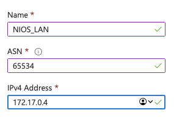
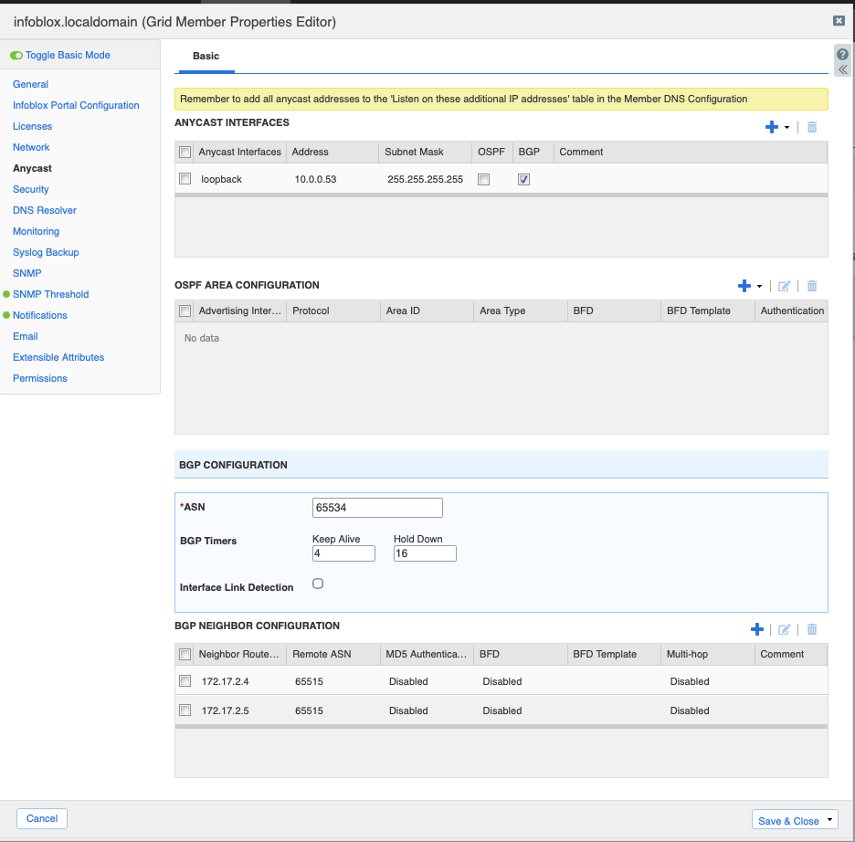

---

title: Integrating Azure Route Server with Infoblox NIOS
authors: simonpainter
tags:
  - azure
  - networks
  - dns
  - bgp
  - anycast
  - cloud
  - load-balancing
date: 2025-11-18

---

I read a great post on [LinkedIn](https://www.linkedin.com/pulse/delivering-anycast-dns-azure-infoblox-universal-ddi-virtual-fetahi-mooce/?trackingId=6dcLbjUX1MkFsVCKInj1bA%3D%3D) the other day about delivering Anycast DNS in Azure using Infoblox and Azure Virtual WAN. It immediately reminded me of the time I deployed Anycast DNS using Infoblox BloxOne DDI and OSPF in a major retailer's network. As I have been working with Azure Route Server on some [Anycast Load Balancing](anycast-route-server.md) projects not too long ago I thought was about time I tried it out with Infoblox NIOS.
<!-- truncate -->

## Lab Setup

First of all I had to get over a [little hurdle](nios-azure-basic-sku.md) with the Infoblox NIOS _pay as you go_ marketplace image. I selected it because I have a tonne of free credits in my Azure account and I didn't have a licence for NIOS. As it happens the `set temp_license` command is all it takes to install a [60 day trial license](https://docs.infoblox.com/space/nios90/220168268/set+temp_license) which is ideal for labs and evaluations.

I created a hub VNet with an Azure Router Server in one subnet and the Infoblox NIOS VM straddling another two subnets. The NIOS VM in the marketplace has two NICs, with one for management and one for data. It was the data NIC that has the public IP address assigned to it, and this is the NIC that I connected to for configuration. We'll ignore the management NIC for now.

Inside the `RouteServerSubnet` I created the route server. I was then able to configure the BGP peering settings for the Route Server side if the BGP session. Route Server allocates two IPs from the dedicated subnet for peering, these are typically the first two usable IPs in the subnet, in this case `172.17.2.4` and `172.17.2.5`. To create a peering in Azure Route Server you only need to specify the ASN and the peer IP address along with a name. There are far fewer options than you would find in a traditional router, or in fact in NIOS itself.

## Peering Configuration on Infoblox NIOS

Next came the configuration of the BGP peer on the Infoblox NIOS side. I have done it with Bloxone and the principle is pretty similar. First you create the Anycast IP address or addresses that you want to advertise via BGP. In my case I created one but it's not uncommon to have two or more IPs advertised.

Once you've created the Anycast IP address(es) you create the two peerings to the Azure Route Server. There are plenty of options in the NIOS BGP configuration but the only two you need are you ASN (from the private ASN range), the peer IPs for the Router Server and the Microsoft allocated ASN of `65515`. Once the peering is configured you can save and then go to the member DNS properties and enable the DNS listener on the Anycast IP address.

## Verifying the BGP Peering

I tried verifying the BGP peering as soon as I had saved the peering configuration but the bgpd service didn't appear to start until after I had set the listener for DNS. Once I had done that I was able to see the BGP session with a `show bgp summary` command.

You can also see the routes that are being advertised to via BGP by looking at the effective routes in any VMs in the same VNet.

## So why Anycast DNS in Azure?

There are a whole host of reasons why you might want to deploy Anycast DNS in Azure. Here's a non exhaustive list of why you might want to consider it:

### High Availability

This is the most obvious one. Azure has some pretty rubbish options for cross region load balancing at the moment so if you want to deploy multiple DNS servers in different regions and you don't want to _code the complexity_ by using many DNS IPs in the client configurations then Anycast allows you to route to a healthy instance automatically.

### Performance

You'll route to the closest healthy instance of your DNS server, this is great when most transactions start with a DNS lookup. Reducing latency on the DNS lookup can have significant performance benefits for the end user.

### Simplified Configuration

I mentioned earlier using it in a retailer network. Imagine the simplicity of having your multi site and multi region DNS infrastructure all reachable via a single IP address. There are numerous examples on the public internet - `8.8.8.8` for Google DNS, `1.1.1.1` for Cloudflare DNS, and so on.

### Migration Strategies

Having done a few DNS migration strategies over the years the single biggest pain point has been hard coded DNS configuration in applications and devices. Using Anycast DNS allows you to migrate your DNS infrastructure without having to change any client configurations. Simply install and test your new DNS servers and then advertise the Anycast IP from the new servers. Once you're happy everything is working you can decommission the old servers. As it's a /32 IP address you don't need to do much to prioritise the routing path to the new server instead of the old one.

## Conclusion

Integrating Infoblox NIOS with Azure Route Server is pretty straightforward and opens up some interesting possibilities for Anycast DNS in Azure. If you're already using Infoblox NIOS in your on-premises network then extending that to Azure using Route Server is a great way to provide consistent DNS services across your hybrid environment.
