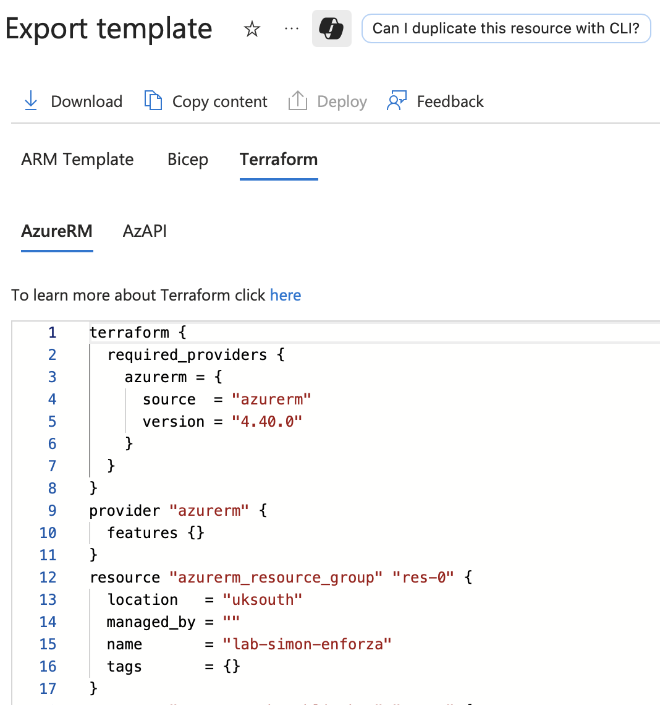

---

title: Exporting Azure resources to Terraform code
authors: simonpainter
tags:
  - azure
  - terraform
  - networks
  - automation
  - cloud
  - migration
date: 2025-09-08

---

I build a lot of labs and demos in Azure, and I often start by creating resources manually in the portal. It's quick and easy to get something up and running. I am also keen to keep my Azure Lab environment costs as low as possible so I try to only run resources when I am using them. With a busy family life, three kids, a spaniel and a rather involved job, I don't have the time to be constantly building and tearing down environments so I use Terraform where I can to define the labs so I can spin them up and down as needed.
<!-- truncate -->
Until recently I would try to build the labs exclusively in Terraform, but sometimes a bit of click-ops is the quickest way to get something working. I found that exporting to bicep was fine but I prefer Terraform and inevitably converted the bicep to Terraform either manually or with the help of an LLM like Claude or ChatGPT.
Times change and there is now a much easier way to export Azure resources to Terraform code - it's built right into the azure portal and you can select a resource group and export it to Terraform just like you can with bicep.

### Getting Started

You'll need to check that your Azure subscription has the 'Microsoft.AzureTerraform' resource provider registered. You can do this by running the following command in the Azure CLI:

```powershell
az provider show -n Microsoft.AzureTerraform
```

It's worth noting that if you have more than one subscription you'll need to specify which subscription you want to check.

Assuming you haven't already registered the provider, you can do so with this command:

```powershell
az provider register -n Microsoft.AzureTerraform    
```

When you check back with the show command again you'll see the registration state change to Registering for a while and then to Registered. I found it took several minutes for the registration to complete but even then it didn't actually work in the portal until the next day.

```powershell
PS /home/simon> az provider show -n Microsoft.AzureTerraform    
  ...
  "id": "/subscriptions/xxxxxxxx-xxxx-xxxx-xxxx-xxxxxxxxxxxx/providers/Microsoft.AzureTerraform",
  "namespace": "Microsoft.AzureTerraform",
  "providerAuthorizationConsentState": null,
  "registrationPolicy": "RegistrationRequired",
  "registrationState": "Registered"
  ...
```

Once the provider is registered you can go to the resource group you want to export in the portal and select 'Export to Terraform' from the menu. You'll need to open the resource group and then scroll to the bottom of the menu on the left to find the option under Automation.

When you select the option you'll see a screen that looks like this:



You can then download it. It's all in one single main.tf file so you will have to split it up yourself if that's the sort of thing you like doing. It will also include things like ssh keys if you have stored them in Azure and used them for you VMs so you may want to edit those out.
