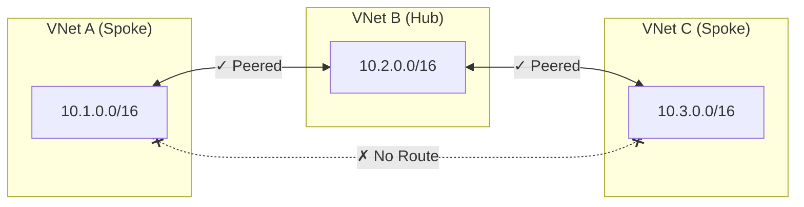

---

title: Public preview of Azure Virtual Network Appliance
authors: simonpainter
tags:
  - azure
  - networks
  - cloud
date: 2026-02-09

---

Microsoft have quietly released [Azure Virtual Network Routing Appliance](https://azure.microsoft.com/en-us/updates?id=555944) into public preview in February 2026. This is a new Azure network construct that sits in a hub network to provide high capacity routing between spoke networks. I had a look at why we might need it and if it is something we should be using. There was a bit of a glimpse of the technical details in [Ignite last year](https://ignite.microsoft.com/en-US/sessions/BRK430?source=sessions) but this is the first time we've seen the actual deployment experience.
<!--truncate-->

*This is a truly awful diagram, but at the moment it's the only one available on Microsoft Learn*

## What problem does it solve?

Azure networking is built to look a lot like on-premise networking, even though it's totally different under the hood. This is unlike AWS networking which is built to look like a bunch if developers thought they knew better than everyone else. One of the common anomalies though is that virtual networks in AWS and Azure (VPCs and VNets) can be peered together but they are not transitively peered. This means that if you have a hub and spoke network topology, the spokes cannot talk to each other though the hub unless you explicitly provide the routing mechanism to do so.

> Hub and spoke topologies have grown in popularity in Azure and many organisations are moving to a separate spoke VNet per application to provide better isolation and security.

Another common anomaly is that [the gateway router for a subnet doesn't actually exist in any real sense](https://blog.cloudtrooper.net/2023/01/21/azure-networking-is-not-like-your-on-onprem-network/). Sure there is a default gateway IP address reserved, and that's what the VM will try to send it's traffic to, but the virtual NIC knows better and holds the routing table itself so that it can send the traffic directly to the destination in another subnet or a peered VNet without needing to go through another gateway.

What this means to the 'trad networker' is that if you want to put in a routing table entry from one spoke to another, via the hub, the hub itself cannot be the next hop. You need to have some kind of appliance in the hub that can route the traffic between the spokes. This is a problem commonly solved with a third party NVA or a good old Azure Firewall, but there are some limitations to both of those.

## What limitations?

Azure Firewall is a great product, but it's designed to be a firewall, not a router. [It has some limitations](https://learn.microsoft.com/en-us/azure/firewall/firewall-known-issues) in terms of scaling, performance and cost which make it less than ideal for being the core routing mechanism in the hub of your cloud network. Throughput is [limited to 100 Gbps for Premium, 30 Gbps for Standard, 250 Mbps for Basic (preview) SKU](https://learn.microsoft.com/en-us/azure/azure-resource-manager/management/azure-subscription-service-limits#azure-firewall-limits) which is not enough for many scaled out topologies, It has a baked in internet egress rule becaue 0.0.0.0 has the NextHopType value set to Internet, and it has some problems with learning a default route via BGP peering from an on premise network. It also has a cost of $1.25 per hour for the Standard SKU and $1.75 per hour for the Premium SKU before you even start with the cost of the data processed through it.

Third party NVAs are a great option, but they can be expensive to license and run, and they require a lot of management overhead to keep them up to date and secure. They also require you to have the expertise to configure and manage them, which can be a challenge for many organisations. As NVAs are essentially just VMs runnng a network operating system they also have the same limitations as other VMs in Azure in terms of throughput and performance. The classic 250,000 active connection limit (due to the way they are counted) has caught a few people out when they have a lot more traffic between spokes than they were expecting.

A lot of cloud first organisations are trying to move away from the need for NVAs in roles that a native cloud construct can do and this architectural purity can butt you up against the limitations of Azure Firewall, so a native routing appliance that can be used in the hub to route traffic between spokes seems like a great addition to the Azure networking portfolio.

## OK, let's have a look at it then

As a general rule of thumb, if an Azure service requires a dedicated subnet, then it is likely to be a bunch of managed VMs running a service inside a loadbalancer sandwich. This looks to be the case for the Azure Virtual Network Routing Appliance and some of the choices you make when you deploy it point towards that. What I am interest in is if they have avoided the mistakes they made with Azure Firewall and long lived TCP connections.

> Azure Firewall has a problem with long lived TCP connections because it scales in and out by creating and destroying instances. When it scales in there is a non-deterministic process to drain the connections and then terminate a random instance which can lead to dropped connections.

As it's a public preview the first place to go, after you have read the [very sparse documentation](https://learn.microsoft.com/en-us/azure/virtual-network/virtual-network-routing-appliance-overview), is to the Azure portal to [register for the preview](https://portal.azure.com/#view/Microsoft_Azure_Resources/PreviewFeatures.ReactView).

As is common with Azure public previews, it can take a while for the registration to complete.

Once you have registered you can [create a new virtual network appliance](https://learn.microsoft.com/en-us/azure/virtual-network/how-to-create-virtual-network-routing-appliance) in much the same way you create any other resource in Azure. Select your subscription and resource group, give it a name and select the region you want to deploy in to.

Next up comes the capacity. This is where you select the maximum throughput. At the moment there is no charge for the public preview so you may as well select 200Gbps but I expect this will be chargeable when it goes GA.
<!-- Add a comment here about if the capacity can be changed after deployment or if you have to redeploy to change it. This needs testing as there are no docs.-->

Once you have selected capacity you can select your hub virtual network and the sizing for the dedicated subnet called **VirtualNetworkApplianceSubnet**.

It's not entirely clear if the subnet size will be selectable with the same granularity in GA - you can select anything between a /28 and a /1 which seems a little excessive! Typically there is a minimum size for the subnet and that is determined by the number of VM instances that are required for the capacity of the SKU you have selected.

There are a few more configuration options, to select an NSG and Route table for the appliance subnet.

<!-- This is about as far as I can get until the preview is available to me-->
