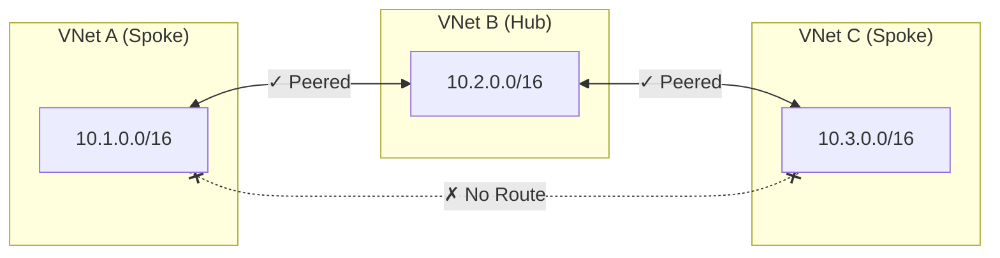
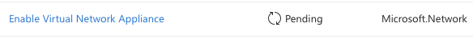
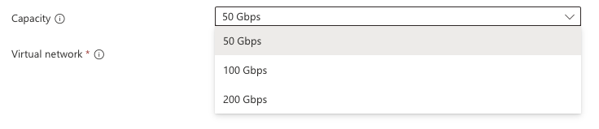
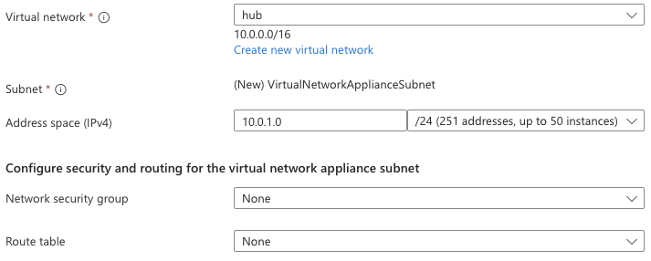
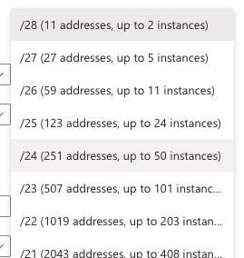
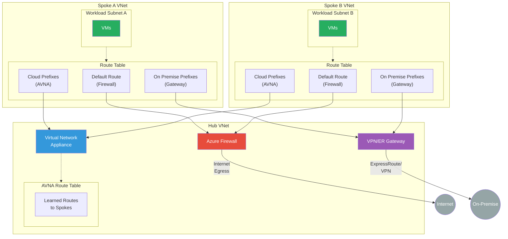
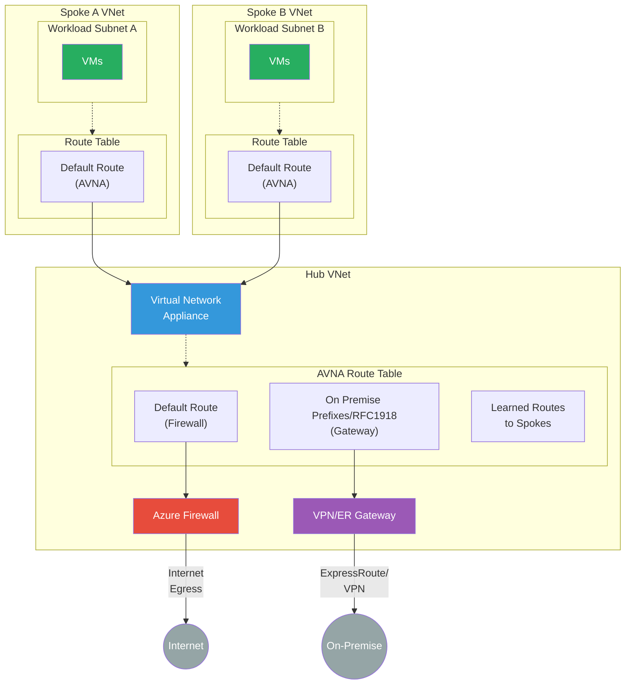
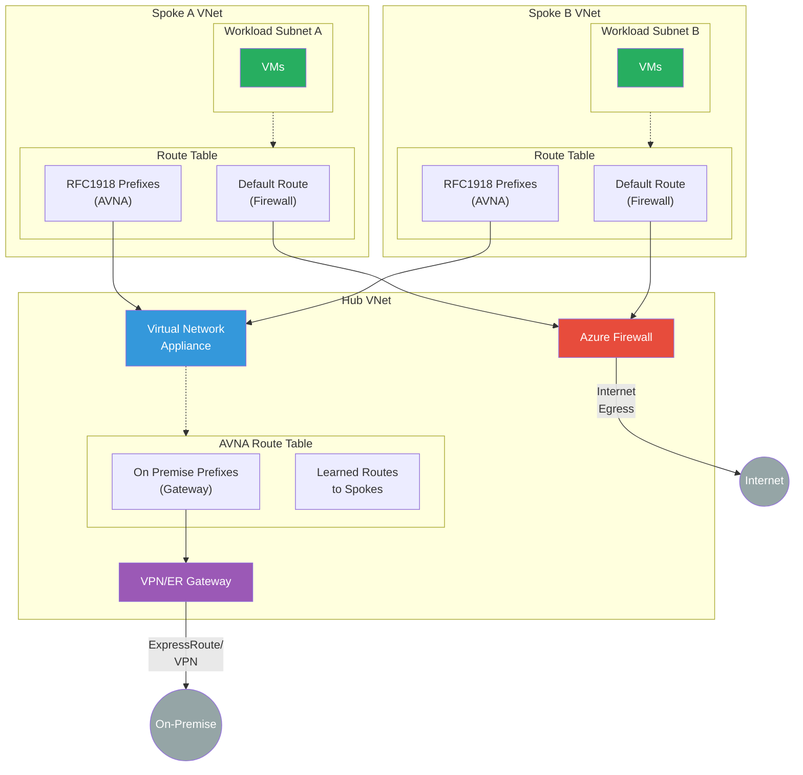
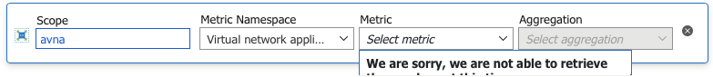
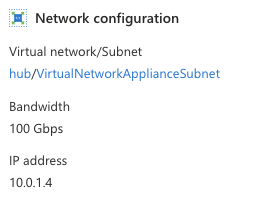

---

title: Public preview of Azure Virtual Network Routing Appliance
authors: simonpainter
tags:
  - azure
  - networks
  - cloud
date: 2026-02-09

---

Microsoft have quietly released [Azure Virtual Network Routing Appliance](https://azure.microsoft.com/en-us/updates?id=555944) into public preview in February 2026. This is a new Azure network construct that sits in a hub network to provide high capacity routing between spoke networks. I had a look at why we might need it and if it is something we should be using. There was a bit of a glimpse of the technical details in [Ignite last year](https://ignite.microsoft.com/en-US/sessions/BRK430?source=sessions) but this is the first time we've seen the actual deployment experience.
<!--truncate-->

This is a *truly awful diagram*, but at the moment it's the only one available on Microsoft Learn

## What problem does it solve?

Azure networking is built to look a lot like on-premise networking, even though it's totally different under the hood. This is unlike AWS networking which is built to look like a bunch of developers thought they knew better than everyone else. One of the common anomalies though is that virtual networks in AWS and Azure (VPCs and VNets) can be peered together but they are not transitively peered. This means that if you have a hub and spoke network topology, the spokes cannot talk to each other through the hub unless you explicitly provide the routing mechanism to do so.

> Hub and spoke topologies have grown in popularity in Azure and many organisations are moving to a separate spoke VNet per application to provide better isolation and security.

Another common anomaly is that [the gateway router for a subnet doesn't actually exist in any real sense](https://blog.cloudtrooper.net/2023/01/21/azure-networking-is-not-like-your-on-onprem-network/). Sure there is a default gateway IP address reserved, and that's what the VM will try to send it's traffic to, but the virtual NIC knows better and holds the routing table itself so that it can send the traffic directly to the destination in another subnet or a peered VNet without needing to go through another gateway.

What this means to the 'trad networker' is that if you want to put in a routing table entry from one spoke to another, via the hub, the hub itself cannot be the next hop. You need to have some kind of appliance in the hub that can route the traffic between the spokes. This is a problem commonly solved with a third party NVA or a good old Azure Firewall, but there are some limitations to both of those.

## What limitations?

Azure Firewall is a great product, but it's designed to be a firewall, not a router. [It has some limitations](https://learn.microsoft.com/en-us/azure/firewall/firewall-known-issues) in terms of scaling, performance and cost which make it less than ideal for being the core routing mechanism in the hub of your cloud network. Throughput is [limited to 100 Gbps for Premium, 30 Gbps for Standard, 250 Mbps for Basic (preview) SKU](https://learn.microsoft.com/en-us/azure/azure-resource-manager/management/azure-subscription-service-limits#azure-firewall-limits) which is not enough for many scaled out topologies, It has a baked in internet egress rule becaue 0.0.0.0 has the NextHopType value set to Internet, and it has some problems with learning a default route via BGP peering from an on premise network. It also has a cost of $1.25 per hour for the Standard SKU and $1.75 per hour for the Premium SKU before you even start with the cost of the data processed through it.

Third party NVAs are a great option, but they can be expensive to license and run, and they require a lot of management overhead to keep them up to date and secure. They also require you to have the expertise to configure and manage them, which can be a challenge for many organisations. As NVAs are essentially just VMs running a network operating system they also have the same limitations as other VMs in Azure in terms of throughput and performance. The classic 250,000 active connection limit (due to the way they are counted) has caught a few people out when they have a lot more traffic between spokes than they were expecting.

A lot of cloud first organisations are trying to move away from the need for NVAs in roles that a native cloud construct can do and this architectural purity can butt you up against the limitations of Azure Firewall, so a native routing appliance that can be used in the hub to route traffic between spokes seems like a great addition to the Azure networking portfolio.

## How much will this cost?

At the moment, during public preview, there is no charge for the Azure Virtual Network Routing Appliance, but that is likely to change when it goes GA. The pricing model is not yet clear but the presence of selectable capacity levels suggests that there will be different SKUs with different performance characteristics. Ultimately for this to be worthwhile it needs to be cheaper or better than the cost of running a third party NVA or Azure Firewall in the hub, so I would expect it to be priced somewhere between the cost of Azure Firewall and the cost of a basic NVA.

## OK, let's have a look at it then

As a general rule of thumb, if an Azure service requires a dedicated subnet, then it is likely to be a bunch of managed VMs running a service inside a load balancer sandwich. This looks to be the case for the Azure Virtual Network Routing Appliance and some of the choices you make when you deploy it point towards that. What I am interested in is if they have avoided the mistakes they made with Azure Firewall and long lived TCP connections.

> Azure Firewall has a problem with long lived TCP connections because it scales in and out by creating and destroying instances. When it scales in there is a non-deterministic process to drain the connections and then terminate a random instance which can lead to dropped connections.

As it's a public preview the first place to go, after you have read the [very sparse documentation](https://learn.microsoft.com/en-us/azure/virtual-network/virtual-network-routing-appliance-overview), is to the Azure portal to [register for the preview](https://portal.azure.com/#view/Microsoft_Azure_Resources/PreviewFeatures.ReactView).

As is common with Azure public previews, it can take a while for the registration to complete. I had to fill out a form to get it enabled so it seems to be a fairly private public preview.

Once you have registered you can [create a new virtual network appliance](https://learn.microsoft.com/en-us/azure/virtual-network/how-to-create-virtual-network-routing-appliance) in much the same way you create any other resource in Azure. Select your subscription and resource group, give it a name and select the region you want to deploy in to.

Next up comes the capacity. This is where you select the maximum throughput. At the moment there is no charge for the public preview so you may as well select 200Gbps but I expect this will be chargeable when it goes GA. From what I can see there is no option to change the throughput after deployment so you would need to get it right first time or be prepared to have a disruptive redeployment if you need to change it later on.

Once you have selected capacity you can select your hub virtual network and the sizing for the dedicated subnet called **VirtualNetworkApplianceSubnet**.

It's not entirely clear if the subnet size will be selectable with the same granularity in GA - you can select anything between a /28 and a /1 which seems a little excessive! Typically there is a minimum size for the subnet and that is determined by the number of VM instances that are required for the capacity of the SKU you have selected.

There are a few more configuration options, to select an NSG and Route table for the appliance subnet. If you want complex filtering rules then you're not going to be using this appliance, you're going to be using a third party NVA or Azure Firewall, but if you just need some basic L4 filtering then you can use NSGs for that. This is really for spokes that are in the same security zone and just need NSGs for least privilege access between them.

Like any other NVA, or indeed an Azure Firewall, you need to make sure your spoke subnets have a route to the appliance. This leads to a couple of architectural options, especially if you have got on premise connectivity and also depending on how your internet egress is set up. If this is for internal traffic between spokes then you can either have spoke based routes pointing on premise traffic to your hub gateway, egress traffic to your NAT gateway or firewall, and everything in the cloud IP space to the appliance. This can be typically achieved with a single route table shared across all the spokes, unless you have spoke based egress. Depending on how complicated your IP schema is (and complicated here is a euphemism for "badly planned") you may have a lot of routes in that route table and making updates to it could be a pain.

Alternatively you can direct all traffic to the appliance using an explicit default route and then have the appliance route on premise traffic via the gateway and egress traffic via the NAT gateway or firewall. Given the capacity of the appliance and the fact that it's designed to be a routing appliance, I would be tempted to go with the second option and direct all traffic to the appliance and let it route on premise and egress traffic as needed. This would simplify the routing configuration in the spokes and make it easier to manage. The cost is that you lose granular control of the spoke routing but anything that enforces the principle of spokes being cookie cutter and not having bespoke routing is a good thing in my book.

The halfway house is to have RFC1918 routes going to the appliance, which sorts out what goes on premise and what goes to another spoke, and then have the default route going to your egress solution. This is a bit more work to set up and manage but it does give you the best of both worlds in terms of control and simplicity. Separating cloud from on premise routes in the AVNA should be fairly straghtforward because all the spoke routes will be learned in the hub automagically and everything else in 10/8 can go to your gateway.

I like this option because you also reduce the chance of traffic inadvertently going through the firewall asymmetrically. This is a big problem when you are manually configuring UDRs because if you miss one you end up with one of those really irritating to troubleshoot problems that the SRE team won't thank you for.

Next up is capacity. I started with the 100Gbps option and created a few VMs to throw some traffic through it. Latency and throughput were all very consistent. It's going to take me a bit longer to build out some tests at scale but it's looking good so far. I will update this post with more details on the performance testing when I have it. I also want to know if the appliance scales out or not and how it handles long lived TCP connections but that will also require some more testing.

At the moment, because it's in preview, there is very little in the portal to show you about the appliance and nothing exposed in metrics.

Getting metrics exposed would be really good, and I am sure it'll be coming soon. Pretty much the only thing exposed in the Azure portal is the IP address of the appliance which you need to know to set up the routing.

## Conclusion

This is a bit of a weird public preview. I had to keep checking back on the [Azure Updates](https://azure.microsoft.com/en-us/updates?id=555944) page to make sure it was a public preview and not a private preview. The documentation is very sparse and the portal experience is very basic. To enable the public preview you have to be approved by the product group and they have limited capacity in the small group of regions where this is available. All of this would be more typical in a private preview, but maybe it is technically a public preview because anyone can apply to be part of it.
All that aside it's a really exciting product for Cloud Network Engineers and Architects because it satisfies the need for high capacity spoke to spoke routing in a native Azure construct. I've been in plenty of places where the cloud team had strong objection to using third party NVAs in the hub because of the support and management overhead and the additional licensing costs. I'm going to be watching this closely.
