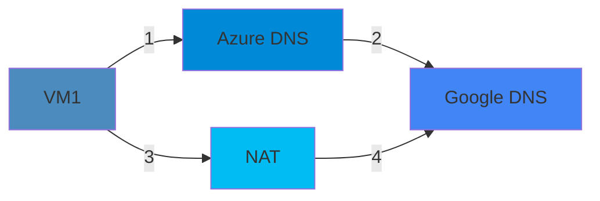

---

title: The secret IP that turned out to be DNS forwarding.
authors: 
  - simonpainter
  - zainkhan
tags:
  - azure
  - dns
  - networks
  - cloud
  - troubleshooting
date: 2024-11-17

---

## The Mystery Begins

The reason I fell down the rabbit hole with regard to [finding my public IP](finding-my-ip.md) was because of a section in an old Azure networking book my friend was reading. It said:

>To allow Azure internal communication between resources in Virtual Networks and Azure services, Azure assigns public IP
>addresses to VMs, which identifies them internally. Let's call these public IP addresses AzPIP (this is an unofficial
>abbreviation). You can check the Azure internal Public IP address bound to the VM with the command
>dig TXT short o-o.myaddr.google.com.
<!-- truncate -->
[Page Source](img/azure-networking.jpg)

This led to a bit of Friday night investigation as we wanted to know what this IP was, what it was for, and also why it appeared to be different from the one used for the default outbound internet access. I mention default outbound internet access because that was the first thing we checked, comparing the result from the test mentioned in the book with what happens if you do one of the other tests for [finding your public IP](finding-my-ip.md) like `curl ident.me` and others.

## Initial Investigation

Using dig to look up the text record from o-o.myaddr.google.com returns the IP of the client doing the lookup. What's interesting is that you get a different response depending on where you look it up - suggesting different interfaces with different routes exist under the hood in the Azure NIC.

### Test Case 1: VM with Public IP

With a VM that has a single NIC and a [PIP](https://learn.microsoft.com/en-us/azure/virtual-network/ip-services/public-ip-addresses) assigned, you get two different IPs:

```bash
simon@vm1:~$ dig TXT o-o.myaddr.l.google.com +short
"51.140.144.96"
simon@vm1:~$ dig TXT o-o.myaddr.l.google.com @ns1.google.com +short
"20.108.24.23"
```

Note: You get two different answers because in the first case you're connecting to Azure DNS servers, whereas in the second you're connecting to Google DNS out on the internet. The second IP matches what you get from 'curl ident.me'.

## The Plot Thickens

I thought the hidden public IP might provide outbound internet access when there's no PIP associated with the VM. Time to test that theory.

### Test Case 2: VM without Public IP

I spun up a second VM in the vNet without a PIP and hopped across from the other VM:

```bash
simon@vm2:~$ dig TXT o-o.myaddr.l.google.com @ns1.google.com +shortgle.com +short
"172.167.198.97"
simon@vm2:~$ dig TXT o-o.myaddr.l.google.com +short
"51.105.64.87"
```

### Test Case 3: Another VM Check

Just to be thorough, I tried another VM without a PIP:

```bash
simon@vm3:~$ dig TXT o-o.myaddr.l.google.com @ns1.google.com +short
"172.167.198.97"
simon@vm3:~$ dig TXT o-o.myaddr.l.google.com +short
"51.105.65.76"
```

## The Friday Night Experiment

At this point we knew two things pretty much for certain:

- The 'AzPIP' was not the same IP as was used for default outbound internet access.
- There appeared to be an implicit NAT gateway in place because both VM2 and VM3, which didn't have PIPs, were sharing the same public IP.

I wanted to know if there was any sharing of this 'AzPIP'. It seemed fairly bizarre that there was a public IP assigned to each VM that was basically invisible to the end customer. This led to a *Friday night grade idea*: spin up a load of VMs in the same AZ and have them report their AzPIP. I used a small bit of Terraform and a boot up script which looked a bit like this:

```bash
OUTPUT=$(dig TXT o-o.myaddr.l.google.com +short | tr -d '"')
curl -s "http://foo.simonpainter.com/?response=$OUTPUT"
```

The idea, silly though it was, involved spinning up as many VM instances as I could and having them run the command from the book to find out their 'AzPIP'.

### Initial Results (10 VMs)

```log
172.174.103.61 - - [22/Nov/2024:21:01:15 +0000] "GET /?response=52.168.119.57 HTTP/1.1" 200 251 "-" "curl/7.58.0"
172.174.103.61 - - [22/Nov/2024:21:01:15 +0000] "GET /?response=40.78.224.106 HTTP/1.1" 200 251 "-" "curl/7.58.0"
172.174.103.61 - - [22/Nov/2024:21:01:15 +0000] "GET /?response=52.168.118.196 HTTP/1.1" 200 251 "-" "curl/7.58.0"
172.174.103.61 - - [22/Nov/2024:21:01:16 +0000] "GET /?response=20.42.70.215 HTTP/1.1" 200 251 "-" "curl/7.58.0"
172.174.103.61 - - [22/Nov/2024:21:01:16 +0000] "GET /?response=20.42.77.37 HTTP/1.1" 200 251 "-" "curl/7.58.0"
172.174.103.61 - - [22/Nov/2024:21:01:17 +0000] "GET /?response=20.42.77.8 HTTP/1.1" 200 251 "-" "curl/7.58.0"
172.174.103.61 - - [22/Nov/2024:21:01:17 +0000] "GET /?response=20.42.70.167 HTTP/1.1" 200 251 "-" "curl/7.58.0"
172.174.103.61 - - [22/Nov/2024:21:01:17 +0000] "GET /?response=40.78.224.108 HTTP/1.1" 200 251 "-" "curl/7.58.0"
172.174.103.61 - - [22/Nov/2024:21:01:21 +0000] "GET /?response=40.71.9.109 HTTP/1.1" 200 251 "-" "curl/7.58.0"
172.174.103.61 - - [22/Nov/2024:21:01:22 +0000] "GET /?response=40.71.9.123 HTTP/1.1" 200 251 "-" "curl/7.58.0"
```

The script worked but with 10 VMs told me nothing of use. I had to go bigger.

## Next Steps (That Didn't Quite Work Out)

I decided to scale up to 1000 VMs to get a better sample size. This was, predictably, a terrible idea - I hit my quota limit, and Friday night is definitely not the best time to try getting that raised. As luck would have it, I managed to get my quota increased to 50 VMs, not quite the 1000 I was aiming for, but enough for a more substantial test. Here are the results from the expanded test:

### Test Results (50 VMs)

```log
52.191.254.129 - - [22/Nov/2024:21:46:48 +0000] "GET /?response=40.79.152.121 HTTP/1.1" 200 251 "-" "curl/7.58.0"
52.191.254.129 - - [22/Nov/2024:21:46:48 +0000] "GET /?response=20.42.77.3 HTTP/1.1" 200 251 "-" "curl/7.58.0"
52.191.254.129 - - [22/Nov/2024:21:46:51 +0000] "GET /?response=40.71.8.89 HTTP/1.1" 200 251 "-" "curl/7.58.0"
52.191.254.129 - - [22/Nov/2024:21:46:51 +0000] "GET /?response=40.79.152.105 HTTP/1.1" 200 251 "-" "curl/7.58.0"
52.191.254.129 - - [22/Nov/2024:21:46:53 +0000] "GET /?response=40.78.225.87 HTTP/1.1" 200 251 "-" "curl/7.58.0"
52.191.254.129 - - [22/Nov/2024:21:46:53 +0000] "GET /?response=40.71.9.76 HTTP/1.1" 200 251 "-" "curl/7.58.0"
52.191.254.129 - - [22/Nov/2024:21:46:57 +0000] "GET /?response=20.42.77.19 HTTP/1.1" 200 251 "-" "curl/7.58.0"
52.191.254.129 - - [22/Nov/2024:21:46:57 +0000] "GET /?response=52.168.119.54 HTTP/1.1" 200 251 "-" "curl/7.58.0"
52.191.254.129 - - [22/Nov/2024:21:46:59 +0000] "GET /?response=40.79.153.186 HTTP/1.1" 200 251 "-" "curl/7.58.0"
52.191.254.129 - - [22/Nov/2024:21:47:10 +0000] "GET /?response=40.71.8.127 HTTP/1.1" 200 251 "-" "curl/7.58.0"
52.191.254.129 - - [22/Nov/2024:21:47:38 +0000] "GET /?response=40.79.153.72 HTTP/1.1" 200 251 "-" "curl/7.58.0"
52.191.254.129 - - [22/Nov/2024:21:47:42 +0000] "GET /?response=40.79.153.165 HTTP/1.1" 200 251 "-" "curl/7.58.0"
52.191.254.129 - - [22/Nov/2024:21:47:45 +0000] "GET /?response=40.78.225.110 HTTP/1.1" 200 251 "-" "curl/7.58.0"
52.191.254.129 - - [22/Nov/2024:21:47:45 +0000] "GET /?response=40.78.224.89 HTTP/1.1" 200 251 "-" "curl/7.58.0"
52.191.254.129 - - [22/Nov/2024:21:47:46 +0000] "GET /?response=40.78.224.88 HTTP/1.1" 200 251 "-" "curl/7.58.0"
52.191.254.129 - - [22/Nov/2024:21:47:46 +0000] "GET /?response=40.78.224.103 HTTP/1.1" 200 251 "-" "curl/7.58.0"
52.191.254.129 - - [22/Nov/2024:21:47:47 +0000] "GET /?response=40.79.153.117 HTTP/1.1" 200 251 "-" "curl/7.58.0"
52.191.254.129 - - [22/Nov/2024:21:48:01 +0000] "GET /?response=40.79.152.85 HTTP/1.1" 200 251 "-" "curl/7.58.0"
52.191.254.129 - - [22/Nov/2024:21:48:05 +0000] "GET /?response=40.78.225.89 HTTP/1.1" 200 251 "-" "curl/7.58.0"
52.191.254.129 - - [22/Nov/2024:21:48:10 +0000] "GET /?response=40.78.224.79 HTTP/1.1" 200 251 "-" "curl/7.58.0"
52.191.254.129 - - [22/Nov/2024:21:48:28 +0000] "GET /?response=40.78.225.231 HTTP/1.1" 200 251 "-" "curl/7.58.0"
52.191.254.129 - - [22/Nov/2024:21:48:30 +0000] "GET /?response=40.71.9.96 HTTP/1.1" 200 251 "-" "curl/7.58.0"
52.191.254.129 - - [22/Nov/2024:21:48:30 +0000] "GET /?response=4.156.0.143 HTTP/1.1" 200 251 "-" "curl/7.58.0"
52.191.254.129 - - [22/Nov/2024:21:48:31 +0000] "GET /?response=40.79.152.119 HTTP/1.1" 200 251 "-" "curl/7.58.0"
52.191.254.129 - - [22/Nov/2024:21:48:31 +0000] "GET /?response=40.78.225.218 HTTP/1.1" 200 251 "-" "curl/7.58.0"
52.191.254.129 - - [22/Nov/2024:21:48:33 +0000] "GET /?response=4.156.0.130 HTTP/1.1" 200 251 "-" "curl/7.58.0"
52.191.254.129 - - [22/Nov/2024:21:48:40 +0000] "GET /?response=40.79.153.88 HTTP/1.1" 200 251 "-" "curl/7.58.0"
52.191.254.129 - - [22/Nov/2024:21:48:58 +0000] "GET /?response=52.168.119.128 HTTP/1.1" 200 251 "-" "curl/7.58.0"
52.191.254.129 - - [22/Nov/2024:21:48:59 +0000] "GET /?response=40.78.224.102 HTTP/1.1" 200 251 "-" "curl/7.58.0"
52.191.254.129 - - [22/Nov/2024:21:49:03 +0000] "GET /?response=20.42.70.134 HTTP/1.1" 200 251 "-" "curl/7.58.0"
52.191.254.129 - - [22/Nov/2024:21:49:16 +0000] "GET /?response=40.71.9.92 HTTP/1.1" 200 251 "-" "curl/7.58.0"
52.191.254.129 - - [22/Nov/2024:21:49:16 +0000] "GET /?response=52.168.118.195 HTTP/1.1" 200 251 "-" "curl/7.58.0"
52.191.254.129 - - [22/Nov/2024:21:49:16 +0000] "GET /?response=20.42.70.150 HTTP/1.1" 200 251 "-" "curl/7.58.0"
52.191.254.129 - - [22/Nov/2024:21:49:16 +0000] "GET /?response=20.42.77.81 HTTP/1.1" 200 251 "-" "curl/7.58.0"
52.191.254.129 - - [22/Nov/2024:21:49:18 +0000] "GET /?response=40.79.153.113 HTTP/1.1" 200 251 "-" "curl/7.58.0"
52.191.254.129 - - [22/Nov/2024:21:49:18 +0000] "GET /?response=40.79.152.115 HTTP/1.1" 200 251 "-" "curl/7.58.0"
52.191.254.129 - - [22/Nov/2024:21:49:42 +0000] "GET /?response=40.71.9.156 HTTP/1.1" 200 251 "-" "curl/7.58.0"
52.191.254.129 - - [22/Nov/2024:21:49:46 +0000] "GET /?response=40.78.225.252 HTTP/1.1" 200 251 "-" "curl/7.58.0"
52.191.254.129 - - [22/Nov/2024:21:49:46 +0000] "GET /?response=40.79.153.114 HTTP/1.1" 200 251 "-" "curl/7.58.0"
52.191.254.129 - - [22/Nov/2024:21:49:46 +0000] "GET /?response=20.42.77.58 HTTP/1.1" 200 251 "-" "curl/7.58.0"
52.191.254.129 - - [22/Nov/2024:21:49:57 +0000] "GET /?response=40.78.224.118 HTTP/1.1" 200 251 "-" "curl/7.58.0"
52.191.254.129 - - [22/Nov/2024:21:49:57 +0000] "GET /?response=40.78.225.252 HTTP/1.1" 200 251 "-" "curl/7.58.0"
52.191.254.129 - - [22/Nov/2024:21:50:00 +0000] "GET /?response=40.78.225.215 HTTP/1.1" 200 251 "-" "curl/7.58.0"
52.191.254.129 - - [22/Nov/2024:21:50:01 +0000] "GET /?response=20.42.77.39 HTTP/1.1" 200 251 "-" "curl/7.58.0"
52.191.254.129 - - [22/Nov/2024:21:50:02 +0000] "GET /?response=40.79.153.178 HTTP/1.1" 200 251 "-" "curl/7.58.0"
52.191.254.129 - - [22/Nov/2024:21:50:13 +0000] "GET /?response=40.79.152.78 HTTP/1.1" 200 251 "-" "curl/7.58.0"
52.191.254.129 - - [22/Nov/2024:21:50:28 +0000] "GET /?response=40.78.225.80 HTTP/1.1" 200 251 "-" "curl/7.58.0"
52.191.254.129 - - [22/Nov/2024:21:50:30 +0000] "GET /?response=40.78.224.111 HTTP/1.1" 200 251 "-" "curl/7.58.0"
52.191.254.129 - - [22/Nov/2024:21:50:30 +0000] "GET /?response=40.79.153.180 HTTP/1.1" 200 251 "-" "curl/7.58.0"
52.191.254.129 - - [22/Nov/2024:21:50:32 +0000] "GET /?response=40.71.9.136 HTTP/1.1" 200 251 "-" "curl/7.58.0"
```

All VMs reported through the same (new) NAT gateway (52.191.254.129) as the source of their internet connection, but the interesting part was in the reported AzPIPs. The IP `40.78.225.252` was reported by two different VMs within about 11 seconds of each other. 

While a single duplicate in 50 VMs isn't conclusive, it was the first evidence supporting my theory that these IPs were not unique to the VM NIC.

I still had some open questions so I thought I'd go out to the internet to see if anyone knew what these IPs were about.

>I had several people point me to the following links:
>
>[Azure Updates](https://azure.microsoft.com/en-us/updates?id=default-outbound-access-for-vms-in-azure-will-be-retired-transition-to-a-new-method-of-internet-access)
>
>[Default Outbound Access](https://learn.microsoft.com/en-us/azure/virtual-network/ip-services/default-outbound-access)
>
>While I appreciate the input, those links mention default outbound internet which is well known and clearly not what
>this was about. I even had an angry redditor question why I was bothering to investigate it; they clearly don't
>understand the network engineer mindset.

## My working theories on Friday night

- The duplicate IP in my testing suggested these are not VM level assignments. This means they could be host level.
- It's also possible they are part of a SNAT pool, which would also be a valid explanation for the overlap. Why there would be SNAT between a VM and the Azure DNS is another question altogether.
- How was Google DNS getting the client IP anyway if it was going via Azure DNS?

## A bit of inspiration

When I was out walking my dog on Saturday I managed to nail down the thing that had been nagging at the itchy part of the back of my brain. A little while ago I wrote a [Python implementation of a DNS server](https://github.com/simonpainter/pyDNS) for a bit of a laugh, so I have a fairly good understanding of the anatomy of a DNS query. 

There is nowhere in a DNS query for the client IP other than in the usual UDP header, and if the query was forwarded on from one DNS server to the other, there was no way for the end DNS server to know the IP of the original source client.

So I did a bit of testing on some other boxes, sending the query via a bunch of different DNS services and doing my own recursive lookups on a hastily spun up BIND box. That seems to satisfy Occam's Razor sufficiently. The whole page of the book is basically utter garbage and the entire concept of AzPIPs is nonsense!

## What's actually happening



When you use `dig TXT o-o.myaddr.l.google.com +short` the request goes from the VM to the Azure DNS server, which then forwards the request to Google's DNS server.

1. Source VM, Destination Azure DNS
2. Source Azure DNS, Destination Google DNS
3. Source VM, Destination Google DNS
4. Source NAT IP, Destination Google DNS

> In the second method, `dig TXT o-o.myaddr.l.google.com @ns1.google.com +shortgle.com +short` the path is straight to the
> Google DNS server via the NAT gateway.

So what the Azure networking book author mistook for a secret VM IP turns out to just be the egress IP of the Azure DNS lookups. I feel like a nerdy mythbuster.