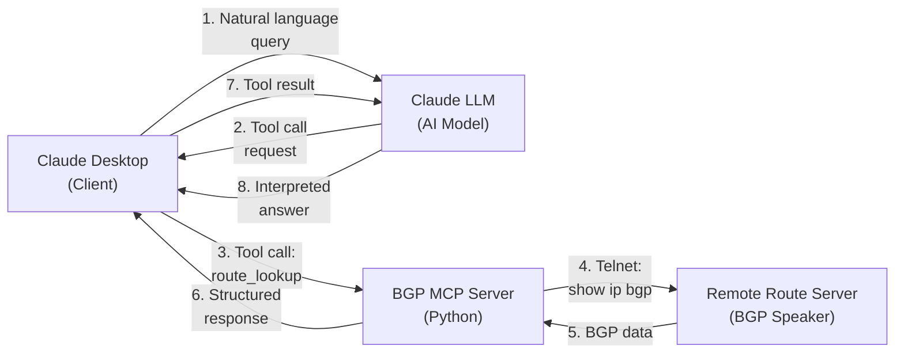

---

title: BGP Route Server MCP
authors: simonpainter
tags:
  - ai
  - networks
  - python
  - mcp
  - bgp
date: 2026-02-12

---

I was having a chat with a long-time friend [Adam Sharif](https://www.linkedin.com/in/adamsharif/) about AI and in the conversation I mentioned that I had been meaning to write a BGP route server MCP proxy for a while. Cue A-Team style musical montage and another evening lost to an ADHD hyperfocus session.
<!-- truncate -->

## The Problem

If you're a network engineer, you will know what a BGP route server is. If you're not, this post isn't for you. But the gist is: BGP route servers are public services that let you see live routing information from the internet. They're essential for troubleshooting and understanding how traffic flows across the global internet.

When you're troubleshooting routing issues or trying to verify how traffic flows to a particular destination, you often need to query a BGP route server. The internet has plenty of these services, maintained by universities and network operators as public goods. They are presented via web interfaces or command line sessions over telnet or ssh. They're free to use, updated in real time, and provide a window into global internet BGP.

The thing is, now that we're all lazy and used to asking an AI everything I though what if I could just ask "What's the AS path to 8.8.8.0/24?" rather than logging in and typing the command "show ip bgp 8.8.8.0/24" and figuring out what the results mean.

This is a perfect problem for MCP. You have a data source, live BGP routing information from public route servers, and you want an AI assistant to be able to query it naturally as part of a larger conversation about network behaviour.

## What Is a BGP Looking Glass?

BGP (Border Gateway Protocol) is the routing protocol that powers the internet. It allows autonomous systems (networks) to exchange routing information with each other. A looking glass is a window into what a particular BGP speaker sees—the routes it has learned, the AS paths to reach them, and the BGP neighbors it's connected to.

The [Route Views Project](https://www.routeviews.org/) at the University of Oregon maintains seven public route servers scattered around the world. They're free to use, always available, and updated in real time from live BGP feeds. They're invaluable for:

- Verifying that your prefix announcements are reaching the internet
- Troubleshooting why traffic isn't reaching your network
- Understanding how different regions see routing to a particular destination
- Monitoring BGP session health

## Building the Bridge

I built an [MCP server](https://github.com/simonpainter/bgp-lg-mcp) that wraps these seven public route servers into the Model Context Protocol. The architecture is straightforward: the server connects to route servers via telnet (the protocol they expect), executes BGP commands, and returns the results in a format Claude can work with.

Here's how each component works:

> **Claude Desktop**: The client that manages the MCP connection and executes tool calls based on the LLM's requests
>
> **Claude LLM**: The AI model that understands your question and decides which tools to call
>
> **BGP MCP Server**: The bridge that implements the MCP protocol and manages connections to remote route servers
>
> **Remote Route Server**: A public BGP looking glass that responds to telnet commands with live routing data

The server exposes three tools:

**`route_lookup`** - Query BGP routes for a specific IP address or subnet. You can ask Claude "What's the AS path to 1.1.1.1?" and it will query a route server and show you the result.

**`bgp_summary`** - Get statistics about a route server itself—how many BGP neighbors it has, how many routes it's learned, whether all its sessions are healthy.

**`list_servers`** - See which route servers are available and which ones respond quickly.

The implementation handles a lot of the annoying details: validation to ensure you're only querying public IPs (no private addresses leaking into telnet sessions), timeout management for slow connections, and a simple JSON configuration system so you can add new servers or disable ones that are down.

## Why This Matters

The deeper pattern here is about making expert knowledge accessible to AI assistants. BGP is esoteric. Most people working in cloud or infrastructure will never need to understand it deeply. But when you do need that knowledge—when you're debugging why a prefix isn't reaching certain regions, or validating that your provider has properly announced your address space—you need it to be accurate and real-time.

This MCP server lets Claude help you with those questions. You can ask in natural language. Claude handles the tool calls. You get back interpreted, summarised results instead of raw terminal output.

This is the promise of MCP: taking specialised knowledge sources and making them accessible through conversational AI. It's not about replacing the network engineer who understands BGP deeply—it's about making that knowledge available to people who need it occasionally and don't want to become experts.

## What's Next

The server is working and deployed. The Route Views Project maintains a stable set of looking glasses that have been running for years, so the infrastructure is reliable. The main expansion would be adding support for more BGP query types—things like filtering by AS path or origin, or examining more detailed route attributes.

But fundamentally, the hard part is done. If you need to query BGP routes from Claude Desktop, you can now do that in a few minutes. That's the goal.

> You can find the code and full documentation at [github.com/simonpainter/bgp-lg-mcp](https://github.com/simonpainter/bgp-lg-mcp). Installation is straightforward—add the server to your Claude Desktop config and you're ready to ask about routing.
