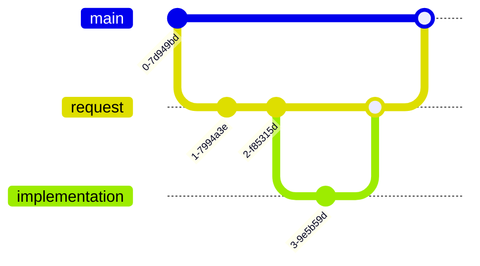

I have been working on a comprehensive approach to bringing network automation and documentation into a development style workflow. Rather than replacing the traditional ITSM approach to change management it moves infrastructure towards a CI/CD approach to releases with automation and baked in documentation.

<!-- truncate -->

Organisations already living in the cloud will likely have moved to using terraform for orchestration, it has rapidly become the de-facto industry standard for infrastructure as code. I am slightly concerned about the [recent IBM acquisistion](https://newsroom.ibm.com/2025-02-27-ibm-completes-acquisition-of-hashicorp,-creates-comprehensive,-end-to-end-hybrid-cloud-platform) but not enough to declare it dead like some of the pundits have.

Terraform allows for a more declarative approach to infrastructure management, enabling teams to define their infrastructure as code and version control it alongside their application code. By aligning your infrastructure code with your business services you can get away from the 'tshirt sizing' of networks and into a more [granular approach where features are turned on and off to create capabilities](modular-networking.md). A large number of terraform providers now exist for on premise networking and key areas around [SDWAN](sdwan-strategic-step-to-ztna.md), on premise access layer, and data center networking are all well covered with strong offerings from the likes of Cisco, Fortinet, Arista, and Juniper. The same principles of Cloud automation with IaC are gradually being applied to on-premise environments as well with the datacentre, SDWAN and finally the access layer targetted.

The diagram above shows how a common layer of terraform with multiple providers can be used to manage the various areas of the network. This allows for a consistent approach to managing the network infrastructure, regardless of the vendor or technology in use. To get the best of the situation you can use a version control system such as Github to manage the code pipelines so that approved pull requests automatically commit the configuration changes to the appropriate environment. This helps to ensure that the network infrastructure is always in a known and consistent state, making it easier to manage and troubleshoot.

Now what for the physical elements of networking? The luxury of the cloud has always been that you are divorced from the cables strung across data halls or even for the most part the cross connects and WAN. If you want to extend this model to the physical layer then you need to have a single source of truth for your physical network and its components. [Netbox has a powerful terraform provider](netbox-terraform.md) which can be used to manage your physical connections in the same way as you do your logical ones. If you take a [documentation first approach](documentation-first.md) to your physical network then netbox becomes the single inventory of physical network components, their locations, their physical connectivity and their relationships to other components. It's powerful enough to manage the physical components of your compute layer too and your DC Ops team will thank you for it.

The workflow for physical changes follows similar to config changes - a branch is created with specifics of the physical changes to be made. Implementation teams perform the physical cabling or installation work necessary and merge in any additional detail they need to capture (circuit information, patch panel information and th like) and then merge the finished request back into the main branch when complete. The history of the request and its implementation can be tracked through the git history, providing a clear audit trail of changes made to the physical network.

While a combination of netbox and self documenting IaC can be good for painting a picture of your infrastructure there is likely to be some additional documentation required, both for internal consumption and external to application teams and end users. This could include high level architecture diagrams, detailed design documents, and operational runbooks to help teams understand and manage the infrastructure effectively. Combining this into the same workflow with markdown means that changes to the code can be backed with changes to the documentation at the same time. The approval workflow requires both so it never gets lost and the diff in github provides a clear view of what has changed in the documentation as well as the code.

Finally organise your code into feature based modules rather than technology or vendor based configuration and you have a structured respository which can be scaled easily.

This approach allows for the physical elements of on premise networking while maintaining workflow patterns similar to cloud and cloud networking. It allows for repeatable [modular networking](modular-networking.md) that can be aligned to business functions rather than tech stacks and it provides a clear path for managing change and documentation across the entire stack.
