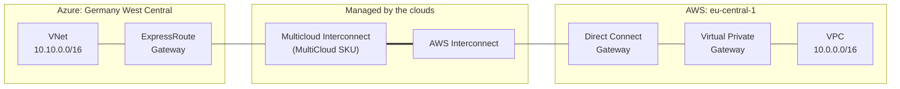
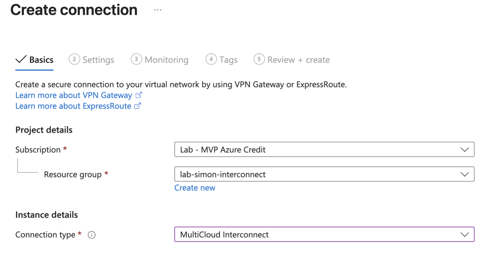
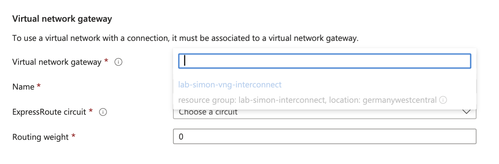
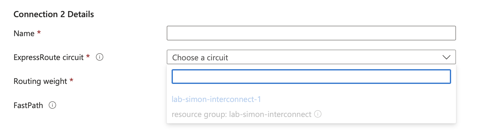
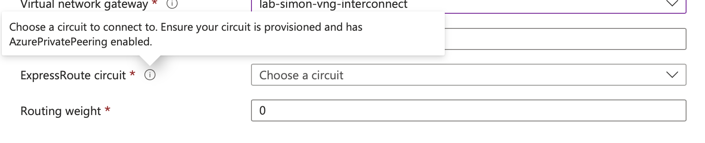

A few weeks ago I wrote about [the cross connect I didn't have to build](/the-cross-connect-i-didnt-have-to-build), which was me being pleased that Azure Multicloud Interconnect had finally landed in preview. Being pleased about a product announcement is not the same as having built the thing, so this weekend I sat down and built it.

Credit where it's due: I was prompted to stop reading and start clicking by [Ken Ogura's hands-on write-up on blog.aimless.jp](https://blog.aimless.jp/archives/2026/09/azure-multicloud-interconnect/), which beat me to the lab by a fortnight. If you read Japanese, go and read the original. It's a tidy piece of work and it saved me an afternoon of guessing. What follows is my own build and, in rather greater quantity than planned, my own mistakes.

<!-- truncate -->

## What we're building

The topology is simple, which is the whole point. There's a VNet in Azure with an ExpressRoute gateway, a VPC in AWS with a Direct Connect gateway, and a managed interconnect in the middle that neither of us has to rack.



The bit in the middle used to be a colo cage, a pair of my routers and a monthly cross connect bill. Now it's two resources and an activation key.

A note on shells before we start. The Azure commands below were run in Azure Cloud Shell with PowerShell, so line continuation is a backtick. The AWS commands were run in AWS CloudShell, which is bash, so it's a backslash. And the Azure CLI takes `-o table` where the AWS CLI wants `--output table` and will tell you so at length.

## Before you start

You need the ordinary furniture at both ends. None of this is specific to the interconnect.

1. **Pick a supported region pair.** Preview regions on the Azure side are Australia East, East US, Germany West Central and West US, per [Microsoft's availability and limits page](https://learn.microsoft.com/azure/multicloud-interconnect/availability-limits). I used Germany West Central, which pairs with eu-central-1. Bandwidth in preview is 1 Gbps and nothing else. AWS limits you to one preview interconnect per region.
2. **Check your address space.** Non-overlapping ranges either side is a documented prerequisite, not a suggestion. Mine is `10.10.0.0/16` in Azure and `10.0.0.0/16` in AWS, which is close enough to make you look twice and different enough to be fine.
3. **Azure: a VNet with a `GatewaySubnet` and an ExpressRoute gateway, in the same region as the interconnect.** The same region part is not optional, for reasons we'll get to. The gateway takes its usual geological age to deploy, so start it first.

   ```powershell
   az network vnet-gateway create `
     -g lab-simon-interconnect `
     -n lab-simon-vng-interconnect `
     --vnet vnet-lab-hub `
     --gateway-type ExpressRoute `
     --sku ErGw1AZ `
     --location germanywestcentral
   ```

4. **AWS: a VPC with a virtual private gateway attached.**

   ```bash
   aws ec2 create-vpn-gateway --type ipsec.1 --amazon-side-asn 64512 --region eu-central-1

   aws ec2 attach-vpn-gateway \
     --vpn-gateway-id <vgw-id> \
     --vpc-id <vpc-id> \
     --region eu-central-1
   ```

5. **AWS: a Direct Connect gateway.** I created mine inline during step 2 below, but here's the CLI if you'd rather have it ready. The Amazon side ASN matters later, because it's what Azure sees in the AS path, so pick something deliberate rather than accepting a default you'll have to look up again in twenty minutes. Mine is 65534, and the virtual private gateway is on 64512.

   ```bash
   aws directconnect create-direct-connect-gateway \
     --direct-connect-gateway-name interconnect-dxgw \
     --amazon-side-asn 65534 \
     --region eu-central-1
   ```

6. **Have your twelve digit AWS account ID to hand.**

   ```bash
   aws sts get-caller-identity --query Account --output text
   ```

## Step 1: create the interconnect in Azure

Either cloud can start the process and generate the activation key for the other to redeem. I started in Azure and claimed the key on the AWS side.

The entry point isn't where you'd expect. You don't start from the ExpressRoute blade, even though a circuit is what you end up with. [Microsoft's create article](https://learn.microsoft.com/azure/multicloud-interconnect/create-interconnect) sends you via **Hybrid connectivity**, then **Azure Multicloud Interconnect** in the left menu, then **Set up Azure Multicloud Interconnect**.

1. On the setup page, choose **Create Multicloud Interconnect Circuit**.
2. On the **Configuration** tab, pick your subscription and resource group.
3. Under **Port details**, set **Port type** to **Azure Multicloud Interconnect**. This is the fork in the road that turns a normal circuit into an interconnect.
4. Name the circuit, then set **Multicloud provider**, **Region** and **Bandwidth**. In my case AWS, Germany West Central and 1 Gbps. There's a **View region mapping** link that tells you which provider region each Azure region pairs with, which is worth a look before you commit to one.
5. Under **Activation key**, choose **Generate**.
6. Enter the **Account ID** for your provider account: the twelve digit AWS account ID from the prerequisites. This is how Azure knows which AWS account is allowed to claim the other end. Without it you'd have an activation key floating about that anyone could redeem, which would be a bad day for everyone.
7. **Review + create**, then **Create**. Open the resource afterwards and copy the **activation key** from the overview page.

Now go and look at what you've made:

```powershell
az network express-route show `
  -g lab-simon-interconnect `
  -n lab-simon-interconnect-1 `
  --query "{circuit:circuitProvisioningState, provider:serviceProviderProvisioningState, sku:sku, location:location}"
```

```json
{
  "circuit": "Enabled",
  "location": "germanywestcentral",
  "provider": "Provisioned",
  "sku": {
    "family": "MeteredData",
    "name": "MultiCloud_MeteredData",
    "tier": "MultiCloud"
  }
}
```

That output is from after activation. Before it, the provider state won't be `Provisioned` yet.

The full JSON has a few more things worth a look:

```json
"serviceProviderProperties": {
  "bandwidthInMbps": 1000,
  "peeringLocation": "germanywc",
  "serviceProviderName": "AWS"
},
"tags": {
  "MultiCloudCircuit": "true",
  "MultiCloudProvider": "AWS",
  "MultiCloudRegion": "germanywc"
}
```

The peering location is `germanywc`, in the style of the classic ExpressRoute peering locations rather than an Azure region name. This is where the two clouds physically meet, not where your gateway lives. The tags are applied for you. I'd leave them alone, on the basis that something in the portal is probably reading them.

The surprise here is that there isn't a new resource type. Multicloud Interconnect is `Microsoft.Network/expressRouteCircuits`, the same type you've been deploying for years. What changes is the SKU, with tier `MultiCloud` instead of `Local`, `Standard` or `Premium`, a service provider of `AWS` rather than a carrier name (which I find quietly satisfying), and a partner account ID property that has no equivalent on a normal circuit.

This matters later, so I'll say it now: because there is no separate resource type, there is nothing else to go looking for. [Microsoft's overview](https://learn.microsoft.com/azure/multicloud-interconnect/overview#how-you-set-up-an-interconnect) describes setup as four stages, the first being "create an ExpressRoute circuit and select the port type" and the second being "create the Azure Multicloud Interconnect resource", which reads like two things. It isn't. Follow the create article and both stages happen in the same form. I spent a while convinced I'd missed the second one. A Resource Graph query for anything with `interconnect` or `multicloud` in the type returns zero rows, and that is the correct answer. The circuit is the interconnect.

On the SKU family: `MeteredData` implies outbound data charges on top of the circuit. During preview [Microsoft says](https://learn.microsoft.com/azure/multicloud-interconnect/availability-limits#pricing) there is no interconnect service charge and no Azure egress charge, so for now the name tells you more about the future than about the bill.

## Step 2: accept it in AWS

1. Log into the AWS account whose ID you gave Azure. If the key is rejected later, the overwhelmingly likely cause is that you're in a different account. The provider, region, bandwidth and account all have to match or provisioning never starts.
2. Open the **Direct Connect console** and choose **AWS Interconnect** in the navigation pane.
3. Choose **Accept multicloud Interconnect**.
4. Paste the activation key from Azure. AWS validates it as you paste and shows you what it thinks it's accepting: provider, bandwidth, its own region and the provider's region. Check those against what you built, then choose **Next**.

   

5. Give the interconnect a description and pick the **Direct Connect gateway** to use as the attach point. If you don't have one, **Create DXGW** opens a panel alongside where you give it a name and an Amazon side ASN, then refresh the dropdown and select it. Bandwidth is greyed out at this point: it was fixed when the interconnect was created on the Azure side and can't be changed during acceptance. Choose **Next**.

   

6. Review and choose **Finish**.

A small aside on that activation key. AWS asks for "a base64-encoded activation key", which is an invitation. The start of mine decodes to this:

```bash
echo '<activation-key>' | base64 -d
```

```json
{
  "version": 1,
  "destinationEnvironmentUri": "https://partner-interconnect.eu-central-1.api.aws/providers/azure/environments/aws-azure-env-1-germany-wc",
  "sharedConnectionUuid": "<shared-id>",
  "connectionSizeMbps": 1000,
  ...
}
```

So it isn't an opaque token. It's a small JSON document naming the AWS partner API endpoint for this environment, the connection size, and a shared connection UUID that both clouds use to refer to the same thing. There's more after that, which I'd guess includes the destination account, given that's one of the things validation checks. This is the open interoperability spec AWS published showing through, and it's rather nice to be able to read it.

If you'd rather start from AWS, it's the mirror image: **Create new multicloud Interconnect**, pick Azure, pick the two regions, give it your Azure identifier, and AWS hands you a key to redeem on the Azure side. Microsoft covers that direction in [Redeem an activation key](https://learn.microsoft.com/azure/multicloud-interconnect/redeem-activation-key). AWS notes that for providers in preview you may need the CLI to complete activation on the other side.

This is the part that used to be an LOA-CFA, a cross connect order and a fortnight of waiting. It took about four minutes.

Check it from the CLI. AWS Interconnect has its own namespace, `aws interconnect`, and you need a recent AWS CLI v2 for it to exist.

```bash
aws interconnect list-connections --region eu-central-1
```

```json
{
    "connections": [
        {
            "id": "mcc-xxxxxxxx",
            "description": "AWS-Azure",
            "bandwidth": "1Gbps",
            "attachPoint": {
                "directConnectGateway": "<dxgw-id>"
            },
            "environmentId": "mce-aws-azure-fra-prod",
            "provider": {
                "cloudServiceProvider": "azure"
            },
            "location": "germanywestcentral",
            "type": "Multicloud",
            "state": "available",
            "sharedId": "<shared-id>"
        }
    ]
}
```

The state is the thing to read. `requested` means created but not accepted on the partner side, `pending` means it's being provisioned between the two clouds, and `available` means done. A minute or two after AWS reaches `available`, the Azure circuit flips to `Provisioned`.

One red herring for later: the `sharedId` here does not match the `serviceKey` on the Azure circuit, which briefly had me wondering whether I'd paired the wrong things. It's the `sharedConnectionUuid` from inside the activation key. If you need to prove which Azure circuit an AWS connection belongs to, decode the key, don't compare service keys.

## Step 3: finish the AWS side

The interconnect on its own is a dead end. It's the equivalent of having a patch lead in the rack with nothing plugged into the far end. It needs attaching to something that knows about your VPCs.

The attachment to the Direct Connect gateway was done for you in step 2. There's no VLAN to pick and no BGP ASN to type in. If you look at the gateway's attachments, the connection turns up dressed as a private virtual interface, with the connection ID where the VIF ID would be:

```bash
aws directconnect describe-direct-connect-gateway-attachments \
  --direct-connect-gateway-id <dxgw-id> \
  --region eu-central-1
```

```json
{
    "directConnectGatewayAttachments": [
        {
            "directConnectGatewayId": "<dxgw-id>",
            "virtualInterfaceId": "mcc-xxxxxxxx",
            "virtualInterfaceRegion": "eu-central-1",
            "attachmentState": "attached",
            "attachmentType": "privateVirtualInterface"
        }
    ]
}
```

What you still own is the other side of the Direct Connect gateway.

1. **Find your virtual private gateway and VPC CIDR.**

   ```bash
   aws ec2 describe-vpn-gateways --region eu-central-1 \
     --query "VpnGateways[].{id:VpnGatewayId,state:State,asn:AmazonSideAsn,vpc:VpcAttachments[0].VpcId,attach:VpcAttachments[0].State}" \
     --output table

   aws ec2 describe-vpcs --region eu-central-1 \
     --query "Vpcs[].{id:VpcId,cidr:CidrBlock,name:Tags[?Key=='Name']|[0].Value}" \
     --output table
   ```

2. **Associate the Direct Connect gateway with the virtual private gateway.** The allowed prefixes are what gets advertised towards Azure, so this is your VPC CIDR. For a transit gateway, use its ID as the gateway ID instead.

   ```bash
   aws directconnect create-direct-connect-gateway-association \
     --direct-connect-gateway-id <dxgw-id> \
     --gateway-id <vgw-id> \
     --add-allowed-prefixes-to-direct-connect-gateway cidr=10.0.0.0/16 \
     --region eu-central-1
   ```

3. **Wait for it to reach `associated`.** A few minutes.

   ```bash
   aws directconnect describe-direct-connect-gateway-associations \
     --direct-connect-gateway-id <dxgw-id> \
     --region eu-central-1 \
     --query "directConnectGatewayAssociations[].{state:associationState,gw:associatedGateway.id,prefixes:allowedPrefixesToDirectConnectGateway[].cidr}"
   ```

4. **Enable route propagation on the VPC route tables.** Easy to skip, and skipping it produces a working BGP session with no routes in the table, which is a confusing way to spend half an hour.

   ```bash
   aws ec2 describe-route-tables --region eu-central-1 \
     --filters "Name=vpc-id,Values=<vpc-id>" \
     --query "RouteTables[].{id:RouteTableId,propagating:PropagatingVgws[].GatewayId}"

   aws ec2 enable-vgw-route-propagation \
     --route-table-id <rtb-id> \
     --gateway-id <vgw-id> \
     --region eu-central-1
   ```

   Substitute the placeholders before you paste. In bash, `<rtb-id>` is an input redirect from a file called `rtb-id`, and the error you get for it, `rtb-id: No such file or directory`, is not as self-explanatory as it might be. I know this now.

Reader, the first time round I did not do item 2. I had the interconnect attached to the Direct Connect gateway, a virtual private gateway attached to the VPC, and nothing joining the two. Having just written a paragraph about patch leads with nothing plugged into the far end, I had built exactly that one hop further along. More on how I found out below.

## Step 4: connect the ExpressRoute gateway

### It behaves like a Local circuit

Ken's first attempt was to connect his `useast` circuit to a gateway in Japan East, and the error he got back is worth reading properly:

```
ErrorCode: InvalidParameter
ErrorMessage: The creation of the virtual network gateway connection failed
because your circuit in useast cannot be connected to Japan East on a Local
circuit. A Local ExpressRoute circuit can only connect to a designated
Azure region. Please upgrade the circuit to Standard SKU or Premium SKU.
```

So Multicloud Interconnect behaves like a Local SKU circuit. It reaches the Azure region associated with its peering location, and nothing else. The advice to upgrade to Standard or Premium is boilerplate from the classic ExpressRoute code path and doesn't apply here. There is no Standard tier of Multicloud Interconnect to upgrade to.

Microsoft's product page words this as a preview limitation: connections only to gateways in the local region, no cross-region. I'm less sure it's a wrinkle to wait out. Local SKU circuits don't charge for outbound data, and Microsoft is unlikely to carry AWS traffic across their backbone for free. Plan for it: the interconnect lands in a region, and if you want other Azure regions to use it, that's what VNet peering and your hub design are for.

I'd read Ken's post, so my gateway was already in Germany West Central alongside the circuit. That was the last thing to go smoothly.

### What the portal did

The intended route is the portal, and the portal has been taught about this. **Create connection** now has a dedicated connection type, **MultiCloud Interconnect**, alongside the usual VPN and ExpressRoute options.



So far so promising. On the Settings tab, the virtual network gateway dropdown listed my gateway, in the right resource group and the right region, and wouldn't let me select it.



The ExpressRoute circuit dropdown did the same thing with `lab-simon-interconnect-1`, in both the standard form and the "Connection 2 Details" form you get with maximum resiliency selected.



The tooltip on the circuit field offered this:



One gateway, one circuit, both present, both greyed out. A form with two fields and no permitted values for either.

Try the portal first. If it works for you, lovely. If not, do this.

### Creating the connection from the CLI

1. **Make sure the CLI is pointed at the subscription that holds the circuit and the gateway.** My first command came back with `ResourceGroupNotFound` for a resource group I was looking at in the portal, because Cloud Shell had other ideas.

   ```powershell
   az account show --query "{name:name, id:id}" -o table
   az account set -s <subscription-id>
   ```

2. **Get the circuit's resource ID.**

   ```powershell
   $circuitId = az network express-route show `
     -g lab-simon-interconnect `
     -n lab-simon-interconnect-1 `
     --query id -o tsv
   ```

3. **Create the connection.**

   ```powershell
   az network vpn-connection create `
     -g lab-simon-interconnect `
     -n conn-vng-to-interconnect `
     --vnet-gateway1 lab-simon-vng-interconnect `
     --express-route-circuit2 $circuitId `
     --routing-weight 0
   ```

4. **Check it.**

   ```powershell
   az network vpn-connection list -g lab-simon-interconnect `
     --query "[].{name:name, state:provisioningState, weight:routingWeight}" -o table
   ```

   ```
   Name                      State      Weight
   ------------------------  ---------  --------
   conn-vng-to-interconnect  Succeeded  0
   ```

It worked first time. The same circuit the portal wouldn't let me select, connected to the same gateway, with no complaint from the API at all.

No peering configuration, no VLAN ID, no point-to-point /30s, no MD5 key, no shared secret to email to someone. The private peering is created and managed for you. Coming from a world where I've typed out `10.x.x.x/30` primary and secondary subnets more times than I'd like to admit, this feels like cheating. The price of the cheating, at least in preview, is that when it doesn't work there's correspondingly little for you to look at.

## How I worked out what was wrong

The steps above are the clean version. The order I actually discovered them in was less dignified, and I'm writing the trail down because most of it is reusable the next time a preview portal shrugs at you.

The tooltip named two conditions. Provisioned I could tick off. So, the peerings:

```powershell
az network express-route peering list `
  -g lab-simon-interconnect `
  --circuit-name lab-simon-interconnect-1 -o table
```

Empty. No AzurePrivatePeering, which matches the tooltip exactly and explains the portal's behaviour, if not the underlying cause. The circuit itself was healthy: Enabled, Provisioned, MultiCloud tier, supported region, same region as the gateway.

On a normal circuit you'd go and create the peering. Here you can't sensibly do that, because the VLAN, the /30s and the ASNs are managed between Microsoft and AWS, and anything I typed in would at best be rejected and at worst not match what AWS had configured. Don't.

I then lost some time looking for the interconnect resource I assumed I'd forgotten to create. As above, there isn't one.

There's a relevant line buried in the [classic ExpressRoute documentation](https://learn.microsoft.com/en-us/azure/expressroute/expressroute-howto-linkvnet-portal-resource-manager): where a layer 3 provider configures your peerings, the BGP configuration doesn't show up on your side, and you should still be able to create connections once the circuit is provisioned. A managed interconnect is that same arrangement with AWS playing the layer 3 provider. Which raised the possibility that the portal was validating for something a managed circuit never exposes.

Before blaming the portal, though, I wanted proof that the AWS end was actually finished, so I worked along it with the commands from steps 2 and 3. The connection was `available`, with provider, location and bandwidth all matching the Azure circuit. The Direct Connect gateway attachment was `attached`. And then:

```json
{
    "directConnectGatewayAssociations": []
}
```

There's the patch lead. The interconnect was attached to a Direct Connect gateway that wasn't associated with anything, so no VPC was reachable and no prefixes were being advertised towards Azure. Even with a working Azure connection I'd have learned precisely nothing. I created the association, watched it reach `associated`, and went back to Azure to create the connection from the CLI. It succeeded, BGP came up and routes arrived.

So was the missing association what the portal was complaining about? No. With everything working, the peering list is still empty:

```powershell
az network express-route peering list `
  -g lab-simon-interconnect `
  --circuit-name lab-simon-interconnect-1 -o table
```

Nothing. But the full circuit JSON tells a different story, because there is a peering in there after all:

```json
"peerings": [
  {
    "azureASN": 12076,
    "connections": [],
    "lastModifiedBy": "Customer",
    "name": "AzurePrivatePeering",
    "peerASN": 0,
    "peeringType": "AzurePrivatePeering",
    "primaryAzurePort": "",
    "provisioningState": "Succeeded",
    "secondaryAzurePort": "",
    "state": "Disabled",
    "vlanId": 675
  }
]
```

An AzurePrivatePeering that exists, has a VLAN, reports a peer ASN of zero, claims no connections and says it is `Disabled`. All while four BGP sessions are up across it and carrying routes. The `lastModifiedBy` of `Customer` is a nice touch, given the customer has never been near it.

That, I think, is most of the answer. The portal's circuit dropdown wants a circuit with private peering enabled. A managed interconnect reports its peering as `Disabled`, presumably because the real configuration lives somewhere the customer-facing object doesn't reflect. The portal believes the object. The API that actually creates the connection doesn't check, or checks something else.

It doesn't explain the gateway being greyed out as well, mind. Nothing about a circuit's peering state should stop you selecting a perfectly healthy ErGw1AZ gateway in the same region. So either there's a second validation failing for its own reasons, or the MultiCloud Interconnect connection blade simply isn't finished. Either way it's a preview gap between the portal and the resource provider rather than anything wrong with the build, and worth reporting.

Two caveats, in the interest of honesty. I fixed the AWS association before I ran the CLI create, so I can't prove the create would have succeeded without it, though I can't see why the Azure resource provider would care about an association on the far side of AWS's Direct Connect gateway. And I can't cleanly re-test the dropdown now, because a circuit that's already connected to the gateway would be greyed out for that reason instead.

What the missing association would definitely have done is leave me with a connected circuit and an empty route table. So it was a real fault, just not the one I was chasing.

### The short version

If the circuit is greyed out in the portal:

1. Check your CLI is in the right subscription, and that the circuit and gateway share one.
2. Check the circuit is `Enabled` and `Provisioned`, MultiCloud tier, and in the same region as the gateway.
3. Don't go looking for a separate interconnect resource. There isn't one.
4. Don't create private peering by hand. An empty `peering list`, or a peering showing `Disabled` in the circuit JSON, is apparently what healthy looks like here.
5. On AWS, confirm the connection is `available`, the Direct Connect gateway attachment is `attached`, and the gateway association to your VGW or TGW is `associated` with the right allowed prefixes.
6. Create the connection from the CLI and read the error, if there is one. The dropdown greys things out; the API tells you why.

## Checking it actually works

Two clouds claiming success in their respective consoles is not evidence. Routes in tables is evidence.

### Azure learned routes

```powershell
az network vnet-gateway list-learned-routes `
  -g lab-simon-interconnect `
  -n lab-simon-vng-interconnect -o table
```

```
Network       NextHop    Origin    SourcePeer    AsPath       Weight
------------  ---------  --------  ------------  -----------  --------
10.10.0.0/16             Network   10.10.1.13                 32768
10.0.0.0/16   10.10.1.7  EBgp      10.10.1.7     12076-65534  32769
10.0.0.0/16   10.10.1.4  EBgp      10.10.1.4     12076-65534  32769
10.0.0.0/16   10.10.1.6  EBgp      10.10.1.6     12076-65534  32769
10.0.0.0/16   10.10.1.5  EBgp      10.10.1.5     12076-65534  32769
```

Three things worth pulling out of that.

The AS path is `12076-65534`. 12076 is Microsoft's ASN, the one that's always sat at the Azure end of an ExpressRoute private peering. 65534 is the Amazon side ASN on my Direct Connect gateway. Note that it is not 64512, the ASN on the virtual private gateway: the Direct Connect gateway is what speaks to the outside world, and the gateway behind it never appears in the path. Two hops, no transit AS in between, which is the whole product in eleven characters.

There are four next hops for the same prefix. The BGP peer status confirms four established sessions:

```powershell
az network vnet-gateway list-bgp-peer-status `
  -g lab-simon-interconnect `
  -n lab-simon-vng-interconnect -o table
```

```
Neighbor    ASN    State      ConnectedDuration    RoutesReceived    MessagesSent    MessagesReceived
----------  -----  ---------  -------------------  ----------------  --------------  ------------------
10.10.1.4   12076  Connected  00:06:53.1198960     1                 18              19
10.10.1.5   12076  Connected  00:06:57.3042342     1                 20              19
10.10.1.6   12076  Connected  00:06:54.7825062     1                 18              19
10.10.1.7   12076  Connected  00:06:57.2261057     1                 18              18
```

That matches what Ken saw, and it fits the four-link architecture Microsoft draws in the overview. Genuine path redundancy without having ordered two of anything. On a traditional build that's two circuits, two cross connects and two sets of BGP config.

The weight of 32769 on the learned routes against 32768 on the connected VNet range is standard ExpressRoute behaviour. The local VNet prefix still wins for local destinations, as it should.

### AWS route propagation

From the other direction, looking at the VPC's route tables:

```bash
aws ec2 describe-route-tables --region eu-central-1 \
  --filters "Name=vpc-id,Values=<vpc-id>" \
  --query "RouteTables[].{id:RouteTableId,routes:Routes[].{dst:DestinationCidrBlock,gw:GatewayId,origin:Origin,state:State}}"
```

```json
[
    {
        "id": "rtb-073d022e421b3296b",
        "propagating": ["vgw-03b396b82b3024d70"],
        "routes": [
            { "dst": "10.0.0.0/16", "gw": "local", "origin": "CreateRouteTable", "state": "active" },
            { "dst": "10.10.0.0/16", "gw": "vgw-03b396b82b3024d70", "origin": "EnableVgwRoutePropagation", "state": "active" }
        ]
    },
    {
        "id": "rtb-053c9963c332a16b9",
        "propagating": ["vgw-03b396b82b3024d70"],
        "routes": [
            { "dst": "10.0.0.0/16", "gw": "local", "origin": "CreateRouteTable", "state": "active" },
            { "dst": "0.0.0.0/0", "gw": "igw-078c7d5071c32d94c", "origin": "CreateRoute", "state": "active" },
            { "dst": "10.10.0.0/16", "gw": "vgw-03b396b82b3024d70", "origin": "EnableVgwRoutePropagation", "state": "active" }
        ]
    }
]
```

`EnableVgwRoutePropagation` as the origin is the bit that matters. That route wasn't typed in by me, it arrived over BGP from Azure and AWS installed it automatically. I can vouch for the alternative. Despite having written the warning about route propagation further up this page, I hadn't enabled it. Azure had four BGP sessions up and a route to the VPC, the VPC had no route back, and ping did nothing at all. Two `enable-vgw-route-propagation` commands later it worked. That's the second time in one post I've ignored my own advice, which is at least consistent.

### End to end

Put a VM at each end, open ICMP in the NSG and the security group, and ping across.

```
Simon@vm-bird-interconnect:~$ ping 10.0.1.78
64 bytes from 10.0.1.78: icmp_seq=1 ttl=125 time=2.68 ms
64 bytes from 10.0.1.78: icmp_seq=2 ttl=125 time=3.52 ms
64 bytes from 10.0.1.78: icmp_seq=3 ttl=125 time=18.5 ms
64 bytes from 10.0.1.78: icmp_seq=4 ttl=125 time=2.69 ms
64 bytes from 10.0.1.78: icmp_seq=5 ttl=125 time=2.69 ms
64 bytes from 10.0.1.78: icmp_seq=6 ttl=125 time=6.27 ms
64 bytes from 10.0.1.78: icmp_seq=7 ttl=125 time=2.84 ms
64 bytes from 10.0.1.78: icmp_seq=8 ttl=125 time=2.71 ms

rtt min/avg/max/mdev = 2.683/5.236/18.482/5.136 ms
```

A floor of about 2.7 ms between a VM in Germany West Central and an instance in eu-central-1, with the odd outlier dragging the average up. Both clouds' Frankfurt regions, a couple of router hops apart. Latency is a function of physics and where the two clouds meet, and there's nothing in my hands to tune.

### The traceroute is the interesting bit

```
Simon@vm-bird-interconnect:~$ traceroute 10.0.1.78
traceroute to 10.0.1.78 (10.0.1.78), 30 hops max, 60 byte packets
 1  10.10.1.5 (10.10.1.5)  4.702 ms 10.10.1.4 (10.10.1.4)  2.257 ms 10.10.1.6 (10.10.1.6)  6.400 ms
 2  169.254.255.13 (169.254.255.13)  4.650 ms 169.254.255.5 (169.254.255.5)  2.215 ms  6.287 ms
 3  * * *
 ...
30  * * *
```

For a service whose selling point is that you can't see the middle, that's a surprisingly good look at the middle.

**Hop 1 is three different addresses for three probes.** 10.10.1.4, .5 and .6 are three of the four BGP neighbours from the peer status table above, the Microsoft edge routers as they appear from inside the GatewaySubnet. Each traceroute probe is a separate flow, so each one gets hashed independently. That's ECMP across the interconnect's links, visible from a VM with no special tooling. Run it a few more times and .7 will turn up.

**Hop 2 is link-local.** 169.254.255.5 and 169.254.255.13 are the far end of the point-to-point links between Microsoft and AWS. This is the addressing I didn't have to choose, and it turns out to be documented, just not as part of this product. Microsoft [reserves 169.254.255.0/24 for internal use](https://learn.microsoft.com/azure/multicloud-interconnect/availability-limits#routing-requirements) and tells you to keep your own ASNs and addresses out of it. The interconnect's transit links live in that reserved block. The spacing fits a run of /30s (.4/30 and .12/30 seen here, so presumably .0/30 and .8/30 alongside them), one per link, which again gives you four. The /30 inference is mine; the reservation is Microsoft's.

That it's [link-local](https://en.wikipedia.org/wiki/Link-local_address) is the neat part, and it's why the whole arrangement is as tidy as it is. Link-local addresses are valid only on the segment they're configured on, and routers won't forward traffic to them. So these addresses exist purely to let the two edge routers talk to each other and run BGP across the link. They're never advertised, never routed, and can't be reached from either my VNet or my VPC. The only reason I can see them at all is that the routers put their own interface address in the ICMP time exceeded messages that traceroute lives on.

That non-routability is what lets Microsoft use the same block on every interconnect they build without any of them colliding. If the transit links used routable RFC 1918 space, someone would have to allocate it, avoid overlaps with both customers' networks, and document it. Instead the addressing is local to each link and identical everywhere, which is exactly the property you want in plumbing nobody's meant to look at.

Worth noting if you've ever hand-built a Direct Connect VIF: this is *not* the AWS convention. It's Microsoft's reserved range, which tells you which side of the fence owns the point-to-point addressing in a managed interconnect. Also worth checking your own kit isn't already using 169.254.255.0/24 for something, because Microsoft's advice is explicit about staying out of it. That's less far-fetched than it sounds, given how much networking equipment helps itself to link-local space for keepalives, cluster interconnects and similar.

So remember the peering object from earlier that claimed to be `Disabled` with a peer ASN of zero? Here's its actual configuration, leaking out through ICMP time exceeded messages.

**Then silence.** Nothing beyond hop 2 answers. The destination doesn't respond to traceroute's default UDP probes, because the security group only allows ICMP.

So I went back and tested that, rather than leaving it as an assertion:

```
Simon@vm-bird-interconnect:~$ sudo traceroute 10.0.1.78 -I
traceroute to 10.0.1.78 (10.0.1.78), 30 hops max, 60 byte packets
 1  10.10.1.5 (10.10.1.5)  1.614 ms  1.597 ms  1.582 ms
 2  169.254.255.13 (169.254.255.13)  1.626 ms  1.622 ms  1.614 ms
 3  10.0.1.78 (10.0.1.78)  3.556 ms  3.548 ms  3.541 ms
```

Three hops, end to end, no gaps. The silence was the security group all along, not the AWS side declining to decrement TTL.

That's a remarkably short path between two clouds. A Microsoft edge router, the link-local hop across to AWS, and then the instance itself. Nothing in AWS between the interconnect and the destination announces itself at all: the Direct Connect gateway and the virtual private gateway are both logical constructs rather than hops, so there's nothing there to reply. It also matches the ping TTL of 125, three short of the Linux default of 128.

One difference worth spotting. The earlier UDP run gave three different addresses for hop 1 as each probe hashed onto a different link. This ICMP run gave 10.10.1.5 three times. ICMP echo probes vary the sequence number rather than the port, and the ECMP hash on the Microsoft edge clearly doesn't take that into account, so all three probes followed the same path. The load balancing is still there, it's just that this particular tool stopped revealing it. If you want to see the spread, the UDP version is the better instrument.

## What I'd think about before using it properly

The lab works. Production is a different conversation, and there are a few things I'd want settled first.

**Regional gravity.** The Local SKU behaviour means your interconnect is anchored to a region. If your Azure estate is a hub and spoke with a single hub per region, that's fine. If you've got workloads scattered and you were hoping one interconnect would serve the lot, you'll be routing via VNet peering, and you should model what that does to your east-west charges before you commit. The same is true on the AWS side: virtual private gateways and transit gateways only work with an interconnect in their local region, and it takes Cloud WAN to reach further.

**Bandwidth is a purchase decision, not a dial.** Preview gives you 1 Gbps and no other choice. Whatever options arrive later, changing bandwidth is a circuit change, with the usual caveats about what that means for an in-service connection. Size it with some headroom.

**Egress won't stay free.** This removes the colo, the cross connects and the NaaS subscription. Preview also waives the charges on both sides, which is generous and temporary. Run the numbers again when GA pricing lands, because a `MeteredData` family circuit plus AWS data transfer out can land in a surprising place if you're moving serious volume.

**Preview connections get deleted.** AWS says preview 1 Gbps connections will be removed from your account as the pairing approaches general availability. Don't hang anything you care about off this.

**Managed means opaque.** No peering to inspect, no ARP table, no BGP config on your side. That's the appeal, and it's also why my troubleshooting consisted of checking states at each end and inferring the middle. One thing you get for free: Microsoft says [MACsec is enabled by default](https://learn.microsoft.com/azure/multicloud-interconnect/overview#key-benefits) on the physical links between the two clouds, which is more than you'd get from a cross connect you built yourself. Work out now what your monitoring looks like when the only things you can see are a provisioning state and a route table.

**One connection per interconnect.** The [limits page](https://learn.microsoft.com/azure/multicloud-interconnect/availability-limits#supported-virtual-network-gateway-connections) is clear that an interconnect supports a single gateway connection during preview. Combined with the regional anchoring, that means one interconnect serves one gateway in one region, and everything else reaches it through your hub design.

**The portal isn't finished.** Anything you can't do in the portal, try in the CLI before assuming it can't be done. This is not the first time I've found an Azure portal constraint that the API doesn't share.

**It's preview.** Four regions, one bandwidth, one provider and [no SLA](https://learn.microsoft.com/azure/multicloud-interconnect/availability-limits#service-level-agreement). Build the design, prove the pattern, but keep your existing path until it goes GA. Microsoft's [FAQ](https://learn.microsoft.com/azure/multicloud-interconnect/faq) is short but worth reading before you plan anything around it.

## Worth it

I spent years explaining to people why connecting two clouds privately was a six week project involving a colo contract, and now it's a handful of commands, an activation key and, in my case, an hour of finding out which bit I'd forgotten.

The thing I keep coming back to is what this says about the market. The received wisdom was always that each cloud wants to pull your workloads in and make leaving awkward. A managed, first-party, private path to a competitor is the opposite instinct. It's both vendors accepting that you're going to run things in both places, and deciding they'd rather make that easy than pretend it isn't happening.

Thanks again to [Ken Ogura](https://blog.aimless.jp/archives/2026/09/azure-multicloud-interconnect/) for the nudge and for publishing the resource definition before I had to reverse engineer it. Go and read the original if you can.
