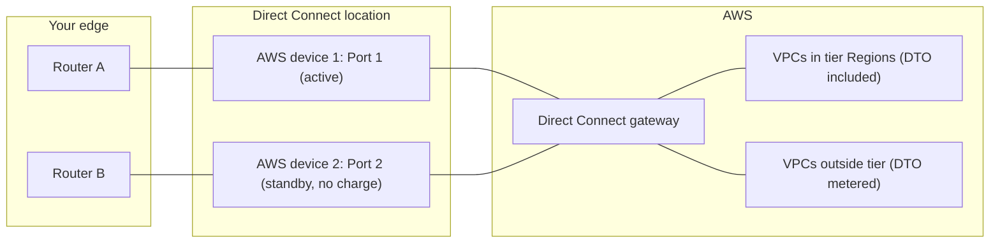

Two weeks ago I [wrote about Azure Multicloud Interconnect](https://www.simonpainter.com/the-cross-connect-i-didnt-have-to-build) and finished with a bit of speculation about pricing. My guess was that the interconnects would land on a flat rate model, bandwidth and geography in, a fixed monthly number out, and no per-gigabyte line on the bill. I was fairly confident because AWS had already published exactly that shape for its side of the Google Cloud interconnect.

Yesterday AWS went one better and applied the same model to Direct Connect itself. [Flat-rate pricing for dedicated connections](https://aws.amazon.com/about-aws/whats-new/2026/09/aws-direct-connect-announces-flat-rate-pricing/) is a fixed hourly rate for a 10 Gbps or 100 Gbps port, with the data transfer out charge for a chosen set of regions folded into it. That's a bigger deal than the interconnect pricing because Direct Connect is the thing most of us already have, and it's the first time AWS has offered to stop metering egress on a hybrid circuit at all.

<!-- truncate -->

If you've been in Azure land for a while this will feel familiar, because Microsoft fired the first shot in this particular war a long time ago with ExpressRoute Local. I want to go through what AWS has actually announced, where the sharp edges are, and why I think the pricing model for hybrid and multicloud connectivity is converging on something network engineers will find a lot easier to reason about than the per-gigabyte world we've lived in for a decade.

## What was announced

The short version, with the detail pulled from the [pricing guide](https://docs.aws.amazon.com/directconnect/latest/PricingGuide/pricing-flat-rate.html) and the [flat-rate pricing page](https://aws.amazon.com/directconnect/pricing/flat-rate/):

- Applies to **dedicated connections only**, at **10 Gbps and 100 Gbps**. Hosted connections and 1 Gbps ports aren't eligible.
- You pay a **fixed hourly rate** based on bandwidth and a **pricing tier** you choose. Billed per hour, rounded up.
- The tier defines a set of AWS Regions. **Data transfer out from those Regions over the connection isn't charged.** Data transfer in was never charged and still isn't.
- There are **five tiers**, from Tier 1 (source Region in the same metro as the Direct Connect location) through to Tier 5 (any Region globally). Higher tiers include everything in the lower ones.
- Billing mode is **set per connection** and you can **switch between pay-as-you-go and flat-rate at any time**.
- It introduces the **port-pair**: two dedicated connections on different devices or locations, same bandwidth and tier, with the second port **included at no extra charge**.
- Available at all Direct Connect locations in all commercial Regions except China.

The two worked examples AWS gives are a 10 Gbps Tier 1 port-pair at Ashburn for `us-east-1` at $10.96 per hour, which is about $8,000 a month, and a 100 Gbps Tier 3 port-pair at San Francisco reaching `us-east-1` and `eu-central-1` at $219.18 per hour, which is a shade under $160,000 a month.

Those are list prices for the US and I'd expect them to vary by location, but the shape is the point. Once you've picked a port and a tier, the number doesn't move when your traffic does.

## The port-pair is the interesting design choice

I want to dwell on the port-pair because it's the part of the announcement that's doing more than just billing.

AWS has always told you to order two dedicated connections on different devices, and preferably in different locations, and then charged you for both. The [resiliency recommendations](https://aws.amazon.com/directconnect/resiliency-recommendations/) are good advice that a lot of people quietly ignored on cost grounds, and I've seen more than one production estate hanging off a single 10 Gbps LAG because the second port was a line item that never survived the budget review.

A flat-rate port-pair is two ports on separate devices for the price of one. The usable capacity is the capacity of **one** port, so a 10 Gbps port-pair is 10 Gbps of throughput with a standby, not 20 Gbps. AWS is explicit about that and it's worth repeating to whoever signs the purchase order, because someone will read "pair" and expect double.

Existing dedicated connections on different devices can be paired retrospectively by adding them to a Resiliency Group, so this isn't just for greenfield. If you have two pay-as-you-go ports today you can flip both to flat-rate and group them, and you've just halved your port hours.

You can also decline the pairing. Two independent flat-rate connections, each on its own tier and not in a Resiliency Group, gives you two full-bandwidth ports at two full flat rates. That's the right answer if you genuinely need 20 Gbps of active capacity, and the wrong one if you were only ever going to use the second port for failover.

What I like about this is that AWS has tied the resiliency pattern it wants you to build into the pricing. That's a much more effective nudge than a best practice document.

## The tier is where you will get it wrong

Every flat rate scheme has a boundary, and this one is the tier. The mechanics are simple enough on paper: the tier is decided by the geographic distance between the Region where your VPC traffic originates and the Direct Connect location where the port lives. Same metro is Tier 1, same continent is Tier 2 or 3, cross-continent is Tier 4, global is Tier 5.

The catch is in how a Direct Connect connection actually reaches Regions. Most of us attach it to a Direct Connect gateway, and a Direct Connect gateway is a global object. Hang a Transit Gateway or a Cloud WAN core network off it and the connection can receive traffic from any Region in that topology, not just the one you had in mind when you picked the tier.

AWS doesn't stop that traffic. It bills it. Data transfer out from a Region outside your tier is charged at the standard Direct Connect per-gigabyte rate, on top of the flat fee. Their own example makes the trade-off explicit: a San Francisco port serving Virginia and Frankfurt can be Tier 3 and pay metered egress on the Frankfurt path, or Tier 4 and cover both.

This is subtly different from how the [AWS Interconnect - multicloud pricing](https://aws.amazon.com/interconnect/multicloud/pricing/) works. On the interconnect, the tier is assigned automatically from the highest tier path in your topology. Attach a Cloud WAN with an edge in Singapore to a Virginia interconnect and you're on Tier 4 whether you like it or not. On Direct Connect flat-rate you pick the tier yourself and anything outside it is metered. One model protects you from a surprise tier, the other protects you from paying for coverage you don't use. Both will produce an unexpected bill for someone who didn't read the pricing page, which is most people.

A few other boundaries worth writing on a sticky note:

- **SiteLink isn't covered.** Traffic between Direct Connect locations over SiteLink never touches a Region, so it sits outside the tier model entirely and is billed at standard SiteLink rates.
- **The FAQ says "private and public traffic" is included and "transit and SiteLink traffic are not."** The considerations section talks happily about attaching Transit Gateways, and the exclusions table lists Transit Gateway data processing as a separate AWS service charge. I read "transit" here as the TGW data processing charge rather than transit VIF egress, but I'd want that confirmed in writing before I put a Transit Gateway behind a flat-rate connection and assumed the DTO was free. If anyone from the Direct Connect team is reading, a one-line clarification in the FAQ would save a lot of support tickets.
- **Cross connects, colocation and the last mile are still yours.** This is the AWS side of the bill only. Your colo provider and your carrier haven't gone flat rate.
- **Expanding to a new Region may mean a tier change.** Until you raise the tier, the new Region's egress is metered.

None of this is unreasonable. It's the same problem ExpressRoute Local has always had, just expressed as a price rather than a route filter.

## When flat rate actually wins

The obvious question is whether it's cheaper, and the honest answer is that it depends entirely on how much you push through the port.

Take the Tier 1 example. A 10 Gbps flat-rate port-pair is about $8,000 a month. A pay-as-you-go 10 Gbps dedicated port in the US is around $2.25 an hour, call it $1,650 a month, and data transfer out to a US location is around $0.02 per gigabyte. The difference between the two fixed costs is roughly $6,350 a month, which buys you somewhere in the region of 320 TB of metered egress.

320 TB a month is a sustained average of about 1 Gbps out of AWS, around the clock. So on a single 10 Gbps port, flat rate starts winning at roughly 10 percent average utilisation. Below that you're paying for headroom you aren't using; above it the meter would have cost you more.

But that comparison is unfair to the flat rate in one important way. The pay-as-you-go side of the sum is one port. The flat-rate side is a port-pair. If you were doing the sensible thing and paying for two pay-as-you-go ports, your fixed cost was already $3,300 and the break-even drops to around 235 TB, or a bit over 700 Mbps sustained.

At 100 Gbps the arithmetic is similar but the numbers are large enough to make a FinOps team go quiet. $160,000 a month for Tier 3 is a lot of money to spend on connectivity, but it's also a lot of money to spend on egress, and if you're the sort of organisation that needs a 100 Gbps dedicated port you were probably already spending it.

The bit that doesn't show up in a spreadsheet is predictability. Metered egress is a variable cost that grows with success. Every new data pipeline, every backup job, every "let's just replicate that to on-prem as well" quietly adds to a line on the bill that nobody owns. A flat rate turns that into a fixed cost with a capacity ceiling, which is exactly how network engineers have always wanted to think about a circuit. You size it, you budget it, and if it fills up you buy a bigger one. That's a conversation I know how to have. "Why did egress go up 30 percent in Q3" isn't.

## The war on egress

Here's the bit I actually wanted to write about.

For most of the first decade of hybrid cloud, the pricing model for a private circuit was the same everywhere: a port fee plus a per-gigabyte data transfer out charge. The private circuit's per-gigabyte rate was much lower than internet egress, which was the whole sales pitch, but it was still a meter, and meters make people nervous.

Microsoft broke ranks first. ExpressRoute had an Unlimited data plan almost from the start, which was a higher fixed fee that bought you unmetered egress on a Standard or Premium circuit. But the real shot across the bows was **ExpressRoute Local**, which arrived in 2019. Local is a circuit SKU that only gives you routes for the one or two Azure regions in the same metro as the peering location, and in exchange the data transfer is included in the port fee. No metered plan, no unlimited plan, just a port with the egress baked in, priced below the equivalent Standard circuit.

The design logic was clear. If your traffic stays in the metro, Microsoft's cost to carry it is low, so they can afford to stop counting it. If you want to reach a region on the other side of the continent, you pay for the backbone, either through a Standard circuit's metered egress or an Unlimited plan. Adam Stuart's [ExpressRoute Direct plus Local pattern](https://github.com/adstuart/azure-expressroute-direct-local) is the canonical write-up of how to exploit that: Local circuits carry the bulk of the traffic for free, and a Standard circuit sits alongside for DR to remote regions, with BGP path prepending to keep it idle until it's needed.

Look at the Direct Connect flat-rate tiers again with that in mind. Tier 1 is "same metro" and it's the cheapest. That's ExpressRoute Local. The difference is that AWS has kept going up the scale and put a fixed price on continental and global reach as well, where Microsoft still makes you choose between a metered plan and an unlimited one for anything beyond the local region. AWS has, in effect, built ExpressRoute Local with four more rungs on the ladder, and it's done it as a billing mode on the existing product rather than a separate SKU with a separate route policy.

The other place this model showed up first was the interconnects. AWS Interconnect - multicloud [launched with flat-rate tiers](https://aws.amazon.com/interconnect/multicloud/pricing/) and no per-gigabyte charge, using the same five tier structure and similar hourly rates. A 10 Gbps Tier 1 interconnect is $12.33 an hour against $10.96 for the equivalent Direct Connect port-pair, which is a modest premium for the managed cross-cloud plumbing. Azure Multicloud Interconnect is [waiving egress during preview](https://azure.microsoft.com/en-us/blog/introducing-azure-multicloud-interconnect-for-aws/), and I'd now be surprised if Microsoft went back to a meter at GA when the AWS side of the same link is flat.

So the direction of travel is clear on the private connectivity side. What hasn't changed, and what I want to be careful not to conflate with this, is internet egress. The regulatory front in the war on egress has been about **switching** costs: the EU Data Act pushed the big three to waive data transfer charges for customers migrating away from a provider, and Google, AWS and Microsoft all announced free egress for departing customers in early 2024. That's about leaving. This is about staying and moving data every day. Internet egress at $0.09 a gigabyte is still very much alive and it's still the reason an IPsec VPN over the internet looks cheap until you use it.

What flat-rate Direct Connect does is widen the gap between the two. The private circuit is now not just cheaper per gigabyte than the internet path, it's a fixed cost with no per-gigabyte component at all, which makes the VPN-to-cloud pattern look worse the more data you move. If you're still running production hybrid traffic over a VPN because the Direct Connect business case never quite stacked up, this is the announcement that might change the answer.

## Where this leaves the comparison

For the network engineer who has to explain this to someone, here's the state of play on the three private options I care about, as of this week:

| | Fixed cost | Egress | Reach | Resilience |
|---|---|---|---|---|
| ExpressRoute Standard, metered | Port | Per GB | Geopolitical region | Two links included |
| ExpressRoute Standard, unlimited | Higher port | Included | Geopolitical region | Two links included |
| ExpressRoute Local | Port | Included | Same metro only | Two links included |
| Direct Connect pay-as-you-go | Port hours per port | Per GB | Any Region via DXGW | Buy two ports |
| Direct Connect flat-rate | Port hours by tier | Included within tier, per GB outside | Tier 1 metro to Tier 5 global | Port-pair included |
| AWS Interconnect - multicloud | Hourly by tier | Included, tier auto-assigned | Tier 1 to Tier 5 | Four links included |

ExpressRoute has always shipped with two links in the circuit and priced accordingly, so the port-pair is really AWS catching up on the resilience model as much as on the egress model. On the other side of the ledger, AWS is now offering a fixed price for global reach that Azure only offers through a Premium circuit on an Unlimited plan, which isn't cheap.

If I were placing bets, I'd expect the next moves to be AWS extending flat-rate to hosted connections, because that's how most European customers actually consume Direct Connect through partners, and Microsoft adding tiered scope to ExpressRoute Local so that it stops being a binary choice between one metro and a whole continent. Both would be sensible. Neither has been announced, and I've been wrong before about what's in the works.

## What I would do with it

If you have dedicated 10 Gbps or 100 Gbps ports today, go and look at last month's Direct Connect data transfer out line. If it's above about 250 TB per port-pair, or if you've been running a single port because the second one never got approved, switch. The billing mode is per connection and reversible, so the downside of trying it is one month of paying for headroom.

If you have a Transit Gateway or Cloud WAN behind a Direct Connect gateway, work out which Regions can actually source traffic over the connection before you pick a tier, and then get someone at AWS to confirm in writing what "transit traffic is not covered" means for your topology. That sentence in the FAQ is the one that will bite.

And if you're still on a VPN because Direct Connect never made financial sense, redo the sum. The meter is gone, and the meter was the argument.

I'll be adding a flat-rate port-pair to the lab account as soon as I can justify it to myself, and the multicloud interconnect follow-up I promised last time will now include the AWS side priced on the same model. Two flat rates and no per-gigabyte charge between two clouds is a pricing conversation I never expected to be having, and I'm rather enjoying it.
