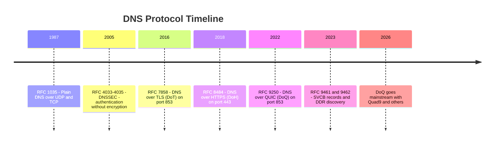
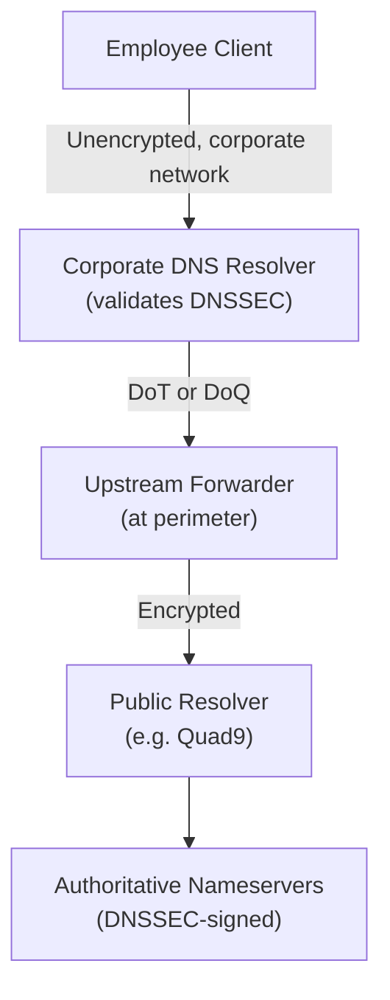

---

title: "DNS, DoT, DoH, and DoQ: The Evolution of Encrypted DNS"
authors: simonpainter
tags:
  - dns
  - security
  - networks
  - architecture
  - educational
date: 2026-04-06

---

Back in February, Microsoft quietly shipped DoH support on Windows Server DNS. In March, Quad9 announced DoQ (DNS over QUIC) alongside DoH3 on their resolver network. These announcements mark a quiet inflection point in how DNS moves across the wire. The protocol landscape has evolved from a single option—unencrypted DNS over UDP—to a real choice between encryption methods, each with different performance characteristics, operational visibility, and security trade-offs.

This article compares four DNS transport models: plain DNS (the baseline), DNS over TLS (DoT), DNS over HTTPS (DoH), and DNS over QUIC (DoQ). I've already written about [encrypted DNS governance](https://www.simonpainter.com/encrypted-dns) and [SVCB/HTTPS records](https://www.simonpainter.com/svcb-https-records) from the enterprise perspective. This piece steps back to examine the protocols themselves—their design philosophy, their wire-level characteristics, and where each fits in modern infrastructure.

The comparison isn't about which protocol is "best." It's about understanding what each protocol was designed to do, what it trades off to get there, and when those trade-offs actually matter in practice.

<!-- truncate -->

---

## Plain DNS: The Baseline

Before encryption arrived, DNS was simple. A client sent a query over UDP port 53, the server sent back a response, and that was the transaction. Fast, stateless, and transparent to anyone on the network path.

### The Wire Format

I covered the DNS message format in detail in my [encrypted DNS post](https://www.simonpainter.com/encrypted-dns), but the headline is: the message itself is 12 bytes of fixed header followed by variable-length question, answer, authority, and additional sections. Most A record queries fit in about 33 bytes total. The response to `example.com?` returning a single A record is about 45 bytes.

The message goes straight into a UDP datagram with no framing overhead. Port 53. No encryption. No authentication. The resolver has no way to know if the query came from the client it thought it did, and the client has no way to know if the response came from the resolver it asked.

### Why It Still Dominates

Despite everything that's come after, plain DNS remains the dominant transport for most queries. It's fast, simple, and works everywhere.

One transaction: client sends 33 bytes on port 53, receives 45 bytes back. Sub-200ms wall-clock time on most networks. Compare that to encrypted transports which need handshakes, TLS negotiation, and connection setup. For a single query, encrypted DNS is slower. For sustained traffic, it catches up because the handshake cost is spread across many queries.

### The Attack Surface

Unencrypted DNS is transparent to any observer on the path. Your ISP sees what domains you resolve. Your corporate firewall sees what your users query. Your government can mandate that ISPs redirect DNS traffic to state-monitored resolvers—and many do. An attacker can forge responses, inject malware-hosting IPs into lookups, or run DNS exfiltration channels for command and control.

None of this is theoretical. I built a [fully functional API proxy on DNS TXT records](https://www.simonpainter.com/dns-api-proxy) in an afternoon. Unencrypted DNS is a covert channel waiting to be exploited.

RFC 9076 (DNS Privacy Considerations) documents the threat model in detail. The security community has been clear about the problem for years. The response has been encryption—but the question has always been: which encryption method?

---

## DNS over TLS (DoT): Encryption Without Overhead

[RFC 7858](https://datatracker.ietf.org/doc/html/rfc7858) defines DoT. The design is straightforward: take DNS-over-TCP (which adds a 2-byte length prefix to handle stream framing), wrap it in TLS, and run it on port 853.

### The Wire Format

```
TCP Connection (3-way handshake)
 └── TLS Handshake (typically 1-2 round trips with TLS 1.3)
 └── [2-byte length field][DNS wire message]
     [2-byte length field][DNS wire message]
     [2-byte length field][DNS wire message]
```

The DNS message doesn't change. The length field from TCP-DNS stays. TLS encrypts everything inside the session. The query and response—the domain names being resolved—are hidden. But the metadata isn't: port 853 traffic is visible, along with its volume and timing.

### Built for TCP

TCP adds overhead. The three-way handshake costs 1.5 round trips before any data arrives. TLS adds another round trip (or two with older versions, one with TLS 1.3). By the time the client is ready to send a query, 100+ milliseconds might have passed on a distant connection.

Once connected, though, TCP is efficient. The client can pipeline queries—send multiple queries without waiting for each response, with the transaction ID in the DNS header matching answers to questions. Modern TCP handles loss recovery well for a sustained stream of queries.

DoT is designed to be long-lived. The client opens a connection, sends multiple queries over it, and keeps it alive across transactions. Most DoT implementations configure idle timeouts of 60 seconds or more—the connection is an asset worth keeping warm.

The trade-off is that establishing a new connection is expensive. For mobile clients or those with sporadic query patterns, DoT's connection cost hits harder than UDP's stateless model.

### Operational Visibility

DoT traffic is identifiable by port. A firewall can see port 853 in use without decrypting anything. That's both a strength and a weakness.

The strength: if you want to enforce encrypted DNS while monitoring which resolvers clients reach, DoT is visible. You can count queries by measuring packet rate and block or allow specific resolver IPs without TLS interception.

The weakness: port 853 is identifiable and blockable. A network that wants to prevent encrypted DNS can simply block port 853 outbound. For users in restrictive environments, the visibility that makes DoT operationally clean for administrators makes it fragile for privacy.

### When to Use DoT

DoT is the right choice for enterprise stub-to-recursive deployments—internal clients using internal resolvers. It's also well-suited to any scenario where port 853 visibility is acceptable or desirable. If you operate your own network and want encrypted DNS without losing observability, DoT is the straightforward option.

For public resolver deployments where users might be on hostile networks, DoT is less appealing. Blocking it is trivial.

---

## DNS over HTTPS (DoH): Encryption by Stealth

[RFC 8484](https://datatracker.ietf.org/doc/html/rfc8484) takes a different philosophy from DoT. Rather than creating a dedicated transport, DoH encapsulates DNS inside HTTP/2 (or HTTP/3) over standard HTTPS on port 443.

### The Wire Format

GET method:
```
GET /dns-query?dns=AAABAAABAAAAAAAAA3d3dwdleGFtcGxlA2NvbQAAAQAB HTTP/2
Host: dns.example.com
Accept: application/dns-message
```

The DNS message is base64url-encoded as a query parameter. Simple, cacheable by intermediaries, but with roughly 33% overhead from base64 encoding.

POST method:
```
POST /dns-query HTTP/2
Host: dns.example.com
Content-Type: application/dns-message
Content-Length: 33

[raw DNS wire message]
```

The DNS message goes as the binary request body. No encoding overhead, but responses aren't cacheable by default.

### Why HTTP/2?

DoH runs over HTTP/2, and that matters. HTTP/2 provides stream multiplexing—multiple DNS queries and responses can be in-flight at once on a single TLS connection, identified by stream IDs. This avoids head-of-line blocking where a single lost packet on TCP would stall all subsequent queries. HTTP/2 headers are compressed with HPACK, reducing per-query overhead for repeated headers.

The persistent connection model is the same as DoT: open once, send multiple queries. But because DoH is HTTP, CDNs can cache GET responses, and intermediate proxies can inspect DoH traffic if TLS is intercepted.

### Operational Invisibility

This is where DoH changes things. DoH traffic is structurally identical to ordinary HTTPS web traffic. A firewall sees port 443, which it allows for web browsing. The HTTP/2 headers show requests to `/dns-query`, but those look like any REST API call. Without TLS interception, DoH is indistinguishable from normal web traffic.

That's intentional. It's why DoH became the default in Chrome, Firefox, and increasingly in operating systems. A user on a network that monitors DNS can't block DoH without also decrypting HTTPS—and decrypting HTTPS at scale has its own operational and privacy costs.

From a user privacy perspective, that's compelling. From an enterprise security perspective, it's a headache. As I covered in my [encrypted DNS post](https://www.simonpainter.com/encrypted-dns), it breaks wildcard FQDN objects on FortiGate, circumvents DNS-based threat intelligence, and makes DNS visibility nearly impossible without full SSL/TLS interception.

### When to Use DoH

DoH is the choice for public resolvers serving privacy-conscious users on potentially hostile networks. It's also the natural choice if you don't need DNS visibility—if you're an individual user or a small team where DNS monitoring isn't part of your security model.

For internal enterprise DNS, DoH adds complexity without meaningful security gains over DoT. The overhead of full TLS interception to inspect DoH traffic is typically higher than simply using DoT on port 853 with proper logging.

---

## DNS over QUIC (DoQ): The Latency Solution

[RFC 9250](https://datatracker.ietf.org/doc/html/rfc9250) defines DoQ. The design is direct: take DNS-over-TCP (with its 2-byte length prefix), wrap it in QUIC, and run it on port 853.

QUIC is fundamentally different from TCP+TLS. It's a transport protocol with encryption built in as a first-class concern, not added on afterwards.

### Why QUIC Matters

The critical insight from RFC 9250's design considerations is that DoT and UDP DNS solve different problems. UDP DNS is fast but insecure and lacks proper loss recovery. DoT is secure but adds TCP's head-of-line blocking and connection setup overhead. QUIC aims to combine UDP's latency properties with TLS's security and TCP's reliability.

**Connection Setup:** QUIC merges the TCP handshake and TLS handshake. Instead of separate TCP and TLS negotiations, a single round trip gets you an encrypted connection ready to exchange DNS messages. TLS 1.3 over TCP costs 2 RTTs; QUIC costs 1 RTT for the initial connection. For mobile clients making sporadic queries, that's a real difference.

**0-RTT Resumption:** QUIC supports session resumption where a client that previously connected to a server can send encrypted data in the very first packet, before the server responds. A client with a saved session token can include a DNS query in the first packet of connection establishment. If the server supports it, the response might arrive while the handshake is still completing.

**Stream Multiplexing:** Like HTTP/2, QUIC allows multiple streams in-flight without head-of-line blocking. A lost packet affecting stream 5 doesn't stall streams 7 and 9. Each DNS query gets a separate bidirectional stream, so responses can arrive out of order and are processed without waiting.

**Connection Migration:** A QUIC connection survives a client changing networks—WiFi to cellular, for example. The connection state, including any established session token, persists across the transition. TCP connections break immediately if the source IP changes. That matters for mobile clients.

### The Wire Format

```
QUIC Connection (1-RTT handshake)
 └── [2-byte length field][DNS wire message]
     [2-byte length field][DNS wire message]
     [2-byte length field][DNS wire message]
```

Like DoT, DoQ uses the 2-byte length field from DNS-over-TCP. Each DNS query/response pair uses a separate stream—the client's first query on stream 0, second on stream 4, third on stream 8, and so on.

RFC 9250 mandates that DNS Message IDs be set to **zero** on DoQ connections. The stream mapping provides unambiguous query/response correlation, making the ID field redundant. This has implications for proxying—a proxy forwarding from DoQ to DoT or UDP has to synthesise a Message ID for the target protocol.

### Operational Characteristics

DoQ shares DoT's port 853 visibility. It's identifiable as encrypted DNS traffic, blockable without interception, and suitable for enterprise governance. But it drops the TCP overhead. For a single query from a cold start, DoQ's 1-RTT handshake is faster than DoT's 2-RTT.

For sustained query streams, the difference narrows because both maintain long-lived connections. But for sporadic clients or mobile devices that frequently establish new connections, DoQ's faster handshake is a genuine win.

### When to Use DoQ

DoQ is most compelling for mobile DNS clients where the lower connection setup cost and connection migration features pay off. It's also well-suited to recursive-to-authoritative zone transfers—no intermediaries to proxy through, and streams allow large multi-response transactions without head-of-line blocking.

For traditional enterprise stub-to-recursive within a data centre, DoT is still simpler and has more mature tooling. For end-user privacy on hostile networks, DoH remains harder to block. DoQ sits between them: better latency than DoT, better visibility than DoH.

---

## Protocol Evolution

Before comparing them directly, it helps to see how the protocols developed:



---

## Comparative Analysis

### Connection Setup and Latency

| Scenario | DNS/UDP | DoT | DoH | DoQ |
|----------|---------|-----|-----|-----|
| First query (cold start) | ~1 RTT | 3-4 RTT | 3-4 RTT | 2-3 RTT |
| First query (with 0-RTT) | N/A | N/A | N/A | 0-1 RTT |
| Subsequent query (warm connection) | 1 RTT | 1 RTT | 1 RTT | 1 RTT |
| Connection keep-alive model | Stateless | 60s idle timeout | 10s idle timeout | Implementation-defined |

Plain DNS is unbeatable for per-query latency. But this is a misleading comparison for most real clients. Most use resolvers they have some persistent relationship with, "warm" connections are the common case once a resolver is chosen, and the encryption overhead is usually smaller than network latency anyway.

The latency win for DoQ appears most clearly in mobile scenarios where connections are frequently re-established.

### Privacy and Visibility

| Aspect | DNS/UDP | DoT | DoH | DoQ |
|--------|---------|-----|-----|-----|
| Query content encrypted | No | Yes | Yes | Yes |
| Response content encrypted | No | Yes | Yes | Yes |
| Traffic identifiable as DNS | Yes | Yes (port 853) | No (looks like HTTPS) | Yes (port 853) |
| Observable by network without interception | Fully | Port/timing only | Port/timing only | Port/timing only |
| Observable by ISP/carrier | Yes | Partially | No | Partially |
| Observable by enterprise firewall | Yes | Yes | Needs interception | Yes |

The privacy wins are shared across all encrypted methods: the query content isn't visible. The difference is in observability of the fact that DNS occurred at all.

DoH's strength is that it doesn't advertise itself as DNS. DoT and DoQ signal their purpose by using port 853. On a network that monitors DNS, DoH is harder to block or rate-limit without causing false positives on normal HTTPS traffic. But observability isn't always a problem—in enterprise networks, knowing which clients resolve which domains is a security necessity.

### Compatibility and Deployment

| Aspect | DoT | DoH | DoQ |
|--------|-----|-----|-----|
| RFC Status | RFC 7858 (2016) | RFC 8484 (2018) | RFC 9250 (2022) |
| Browser support | No | Yes (Chrome, Firefox, Safari) | Emerging |
| OS support | Windows 11+, macOS, Linux | Windows 11+, macOS, iOS, Android | Early/limited |
| Public resolver adoption | Common | Ubiquitous | Growing |
| Monitoring tools | Mature | Limited | Early |

DoT has been stable for nearly a decade. Tools exist. Vendors support it. But it's not the default in consumer software—browsers don't use it. DoH is everywhere in consumer software, though enterprise tooling for inspection and monitoring is still catching up to DoT. DoQ is the new entrant. Quad9's March 2026 announcement puts DoQ on a major public resolver, giving developers a production system to test against. Client support is still patchy.

### Message Size Handling

| Transport | Max DNS Message Size | MTU Issues | Fragmentation Risk |
|-----------|----------------------|------------|-------------------|
| DNS/UDP | 512 bytes (1220 with EDNS0) | Yes | High |
| DoT | 65535 bytes | No | None |
| DoH | 65535 bytes | No | None |
| DoQ | 65535 bytes | No | None |

Plain UDP DNS has a 512-byte limit from RFC 1035. EDNS0 extended this to ~1220 bytes on some paths, but fragmentation becomes a risk. If a large response—like a DNSSEC-signed zone apex—exceeds the path MTU, UDP fragmentation happens. Firewalls drop fragments. The query times out.

All encrypted protocols use the 2-byte length field from DNS-over-TCP, allowing 65535-byte messages. That makes them suitable for zone transfers, large DNSSEC responses, and scenarios with many resource record sets.

### CPU and Network Overhead

| Scenario | Overhead | Notes |
|----------|----------|-------|
| DoT per-query | 2-byte length prefix + TLS records | Minimal once connection is warm |
| DoH POST per-query | HTTP/2 headers (~100-200 bytes) + 2-byte length | More overhead than DoT |
| DoH GET per-query | HTTP/2 headers + 33% encoding overhead | Worst overhead, but cacheable |
| DoQ per-query | QUIC frame headers + stream mapping | Similar to DoT, cleaner stream semantics |

For a 33-byte DNS query over a warm connection, DoT carries 35 bytes of application data (plus TLS record headers). DoH POST carries 33 + 2 + approximately 150 bytes of HTTP/2 headers. DoQ carries 35 bytes plus QUIC stream headers. DoT is the leanest. DoQ is close. DoH carries more because HTTP, even compressed, has headers.

---

## Real-World Scenarios

### Scenario 1: Enterprise Internal DNS

Windows or Linux clients querying internal resolvers within a corporate network should use DoT. Port 853 is visible and controllable. Both client and server are under your management. You don't need to accept the DoH/port-443 ambiguity. TLS interception tools are mature. Certificate management is simpler than DoH—no HTTPS SANs, just a TLS cert for the resolver hostname. And you keep operational visibility, which is the point.

Deploy Windows Server DNS 2022+ with DoT support (or BIND/dnsdist/Infoblox with DoT), configure clients via GPO or device management to use port 853, and monitor with your existing DNS logging infrastructure.

### Scenario 2: Public Resolver for Privacy-Conscious Users

A public resolver serving end users who want privacy from their ISP should support all three. DoH reaches users on restrictive networks where port 853 is blocked. DoT suits users who control their networks and want visible, monitorable encrypted DNS. DoQ benefits users with modern clients where latency matters.

This is Quad9's current approach: support all three, advertise via SVCB/HTTPS records, and let clients choose.

### Scenario 3: Mobile App with Sporadic Queries

A mobile application making DNS queries on unreliable networks with frequent transitions should prefer DoQ, with DoH as a fallback. DoQ's 1-RTT handshake and 0-RTT resumption reduce latency on initial queries. Connection migration survives network changes. Per-stream semantics handle out-of-order responses well. If port 853 is blocked, DoH is the fallback.

The practical challenge is client library support—DoQ library support is still limited as of mid-2026, which is why DoH remains the more common choice for mobile developers.

### Scenario 4: Recursive-to-Authoritative Zone Transfer

Zone transfers from authoritative to secondary nameservers suit DoQ well. Zone transfers can be large, but the 65535-byte limit is no longer a constraint. There are no intermediaries, so DoH's HTTP caching offers no benefit. DoQ streams allow multi-response transactions without head-of-line blocking, and per-stream error codes let primaries abort a transfer on one stream without closing the connection entirely.

BIND 9.18+, NSD, and dnsdist all have DoQ support.

---

## DNSSEC: Authentication Without Encryption

Before going further into when encryption matters, it's worth covering DNSSEC—a parallel approach to DNS security that's been standardised since 2005 but remains underdeployed and often misunderstood.

[RFC 4033](https://datatracker.ietf.org/doc/html/rfc4033), [RFC 4034](https://datatracker.ietf.org/doc/html/rfc4034), and [RFC 4035](https://datatracker.ietf.org/doc/html/rfc4035) define DNSSEC. Zone operators cryptographically sign their DNS records. Clients (or validating resolvers) verify those signatures. A valid signature means the response hasn't been tampered with. An invalid or missing signature means it can't be trusted.

### How DNSSEC Works

Each zone has a key pair (KSK, Key Signing Key). When the zone operator publishes records, they sign them with the private key. The signature arrives in the DNS response as an RRSIG record alongside the original data:

```
example.com. 3600 IN A 192.0.2.1
example.com. 3600 IN RRSIG A 8 2 3600 20260501000000 20260401000000 (
    12345 example.com. <base64-encoded-signature-data> )
```

The client receives both the A record and the RRSIG. It can verify the signature using the public key from the zone's DNSKEY record. DNSSEC doesn't stop at individual zones—it uses a chain of trust. The `.com` nameservers sign DNSKEY records for `example.com`. Root nameservers sign DNSKEY records for `.com`. Clients that trust the root key can validate the entire chain.

### What DNSSEC Solves

DNSSEC gives you **authenticity**: the response came from the authoritative source, not an attacker. **Integrity**: the response hasn't been modified in transit. And **proof of non-existence**: NSEC records cryptographically prove a domain doesn't exist—you can't get a false positive.

DNSSEC is protocol-agnostic. It works over plain DNS/UDP, DoT, DoH, DoQ—anywhere DNS messages travel. The signature is part of the response itself.

### What DNSSEC Doesn't Solve

DNSSEC provides no confidentiality. An observer on the network still sees which domains are being resolved, when, and how often. Even with DNSSEC fully deployed, the stub resolver's query to the recursive resolver is visible to anyone on that hop.

DNSSEC authenticates the answer. It doesn't hide the question.

### DNSSEC Deployment Reality

DNSSEC has been a standards-track protocol for nearly 20 years. The root zone is signed. Most TLDs are signed. Cloudflare, Google, and other major operators sign their zones. Globally, roughly 60-65% of domain names are DNSSEC-signed. But many clients don't validate those signatures.

The operational costs are real. Zone operators must manage key rotation and handle KSK/ZSK hierarchies. DNSSEC responses are larger—RRSIGs, DNSKEY records, and NSEC records add overhead, making UDP fragmentation more likely. Validating resolvers use more CPU. And when DNSSEC validation fails, the problem is often opaque: a misconfigured signing key, an expired signature, or a missing NSEC record all look the same from the client's perspective.

Most end-user clients don't validate DNSSEC. Browsers don't. Operating systems don't (with some exceptions). The validation happens on the resolver—if you trust your resolver to validate, you don't need to validate yourself.

---

## Encryption vs. Authentication: What Enterprises Actually Need

The push toward encrypted DNS assumes that confidentiality is universally necessary. But enterprises have different threat models from end users on potentially hostile networks.

### The Threat Models

An end user on a hostile network worries about their ISP or mobile carrier seeing queries, or a government mandating DNS redirection. Encryption is the answer.

An enterprise on its own network has different priorities. You probably want visibility into your employees' queries—that's how you catch malware, enforce policy, and run threat detection. Your DNS resolver is under your control. The threats you face are malware exfiltrating data via DNS, compromised devices using DNS for C2, and poisoning attacks on your resolver. DNSSEC validation and DNS-based threat intelligence address those directly.

A public resolver like Cloudflare or Quad9 sits in the middle. Users want privacy from their ISP (encryption) and protection against poisoning (DNSSEC). The resolver operator wants to validate responses from authoritative servers (DNSSEC). All of it matters.

### What Each Solves

| Problem | DNSSEC | Encryption (DoT/DoH/DoQ) | Both |
|---------|--------|--------------------------|------|
| Response tampering on network | ✓ Solves | ✓ Mitigates | ✓ Optimal |
| Query visibility to ISP | ✗ Doesn't help | ✓ Solves | ✓ Optimal |
| Response visibility to ISP | ✗ Doesn't help | ✓ Solves | ✓ Optimal |
| DNS poisoning attacks | ✓ Solves | ✗ Doesn't help | ✓ Optimal |
| Operational visibility (enterprise) | ✓ Maintains | ✗ Removes | Depends |
| Computational cost (resolver) | Higher | Lower | Highest |
| Backward compatibility | High | Lower | Lower |

The key insight: **encryption and authentication solve different problems.** DNSSEC answers "Is this response from the real nameserver and unmodified?" Encryption answers "Can anyone see that I'm querying this domain?"

### When Enterprises Don't Need Encryption (But Should Use DNSSEC)

Consider a typical enterprise DNS architecture:



In this architecture, the employee-to-resolver hop runs on your controlled network with your controlled resolver. DNSSEC validation ensures untampered responses. Encryption adds complexity without security benefit.

The resolver-to-upstream hop is where encryption is worth having—you're protecting against ISP snooping on the path to the public internet. The authoritative hop is where DNSSEC validates that the response is genuine.

Many enterprises would gain more from deploying DNSSEC validation on their internal resolvers than from deploying encrypted DNS on the stub-to-resolver hop.

### The Visibility Cost

As I covered in my [encrypted DNS post](https://www.simonpainter.com/encrypted-dns), encrypted DNS removes visibility into queries. That visibility matters operationally. Abnormal query patterns reveal compromised devices or malware. Spikes in queries to known malware domains are detectable via DNS logging. Some regulatory frameworks—HIPAA, PCI-DSS—require DNS logging. When users report connectivity issues, DNS logs are the first diagnostic tool.

DNSSEC doesn't remove this visibility. Queries are still visible—the responses are authenticated, not hidden. That's why I'd recommend DoT over DoH for enterprise internal use: port 853 is visible, port 443 isn't.

Combining DNSSEC validation with visible DNS transport gives you authentication of responses, reasonable privacy where you need it, and the threat detection capability that DNS visibility provides.

### When Both Are Needed

There are legitimate scenarios where DNSSEC and encryption both matter.

A public resolver with DoH and DNSSEC gives end users privacy from their ISP and protection against poisoning. This is Cloudflare's and Quad9's model, and it's the right one for that use case.

An enterprise with an external forwarder can run DNSSEC validation on the internal resolver, encrypt traffic to the external resolver with DoT or DoQ, and maintain visibility on the internal network while protecting privacy on the external hop.

Zone transfer with DNSSEC and DoQ validates zone content authenticity while encrypting the transfer itself. You get tamper protection and confidentiality for zone contents.

---

## Encryption Doesn't Replace Visibility

Here's where I need to be direct. The assumption that encryption solves "DNS security" is incomplete in enterprise contexts.

DNS security has multiple dimensions: **authenticity** (did this response come from the real nameserver?), **confidentiality** (can anyone see what I'm querying?), **integrity** (wasn't the response modified?), and **observability** (can I see what domains are being resolved?).

Enterprises often care more about authenticity, integrity, and observability than confidentiality. End users on hostile networks prioritise confidentiality. The risk of treating encryption as the complete solution is that it removes visibility without adding the authentication DNSSEC provides.

A domain encrypted between client and resolver is still vulnerable to a compromised resolver returning poisoned responses (DNSSEC catches that), malware using DNS for exfiltration (visibility detects it), and operational issues that log analysis would surface (visibility diagnoses them).

The better enterprise strategy is: deploy DNSSEC validation on your recursive resolvers; use DoT for encrypting client-to-resolver traffic if encryption is required; maintain query visibility for security monitoring; block access to unauthorised external resolvers (including via SVCB records); and use DNS-based threat intelligence and malware blocking.

This gives you authentication (DNSSEC), reasonable privacy where needed, and the visibility you need for detection and compliance.

---

## The Evolution Ahead

The encrypted DNS landscape is still moving. A few things to watch.

### DoH3 (DoH over HTTP/3)

Quad9 and others are deploying DoH3—DoH carried over HTTP/3, which runs on QUIC. This gives you DoH's port 443 invisibility combined with QUIC's latency improvements. Modern browsers that support HTTP/3 will automatically upgrade from HTTP/2 DoH to HTTP/3 DoH if the server advertises it via Alt-Svc headers. No client configuration needed.

### Encrypted Recursive-to-Authoritative

Most encrypted DNS work focuses on the stub-to-recursive scenario—clients to resolvers. The recursive-to-authoritative hop is less developed. RFC 9103 (DNS Zone Transfer over TLS) exists, but deployment is minimal. DoQ is gaining traction here because zone transfers don't benefit from HTTP caching and the stream semantics are a better fit.

### DDR Maturity

Discovery of Designated Resolvers (DDR) lets clients discover encrypted transports without manual configuration. Quad9's DoQ deployment, combined with SVCB record advertising, lets clients learn about DoQ automatically. As client support improves, this mechanism will become more important for seamless encrypted DNS adoption.

### The Long Tail of Plain DNS

Plain DNS will remain dominant for years. The infrastructure is vast, the adoption curve for new protocols is gradual, and encrypted DNS will coexist with plaintext DNS for a decade or more. Both will persist—not because either is universally superior, but because the installed base is enormous and migration is expensive. Progress rarely looks like a clean switchover.

---

## Implementation Considerations

### For DNS Server Operators

Start with DoT if you need visibility and control. Add DoH if you're serving privacy-conscious end users. Consider DoQ if you're upgrading infrastructure or serving mobile clients.

Certificate management is the main operational burden. DoT needs TLS certs for the resolver hostname. DoH needs HTTPS certs with correct SANs matching your URI template. DoQ needs TLS certs for the resolver hostname—same as DoT.

### For Client Developers

Support multiple transports if you can: DoH, DoT, and DoQ. Implement fallback logic so clients degrade gracefully if one transport fails. Use DDR to discover encrypted transports automatically if the resolver name is known. Handle connection pooling carefully—different protocols have different idle timeouts and connection costs. And test on real networks with real latency and loss, not just local labs.

### For Enterprise Architects

Deploy DoT internally for encrypted stub-to-recursive within your network. Block port 853 outbound to prevent clients from using external DoT resolvers. Block SVCB/HTTPS record types at your internal resolver to prevent DoH discovery. Monitor for DoH traffic to known external resolver IPs. And don't rely on FQDN blocking alone—determined clients will find workarounds.

The Infoblox model (contain and redirect) remains the right approach: block unauthorised encrypted DNS, then offer your own encrypted service.

---

## Conclusion

DNS encryption isn't new—the protocols are mature, the implementations are solid, and client support is broad. But the evolution from one option (unencrypted) to multiple choices (DoT, DoH, DoQ) changes the operational landscape.

The choice between them isn't about which is abstractly "best." It's about your threat model, your infrastructure, and what you need to see. DoT if you need DNS visibility and control. DoH if your threat model is protection from ISPs and carriers, not internal networks. DoQ if latency matters and you're optimising for mobile. All three if you're a public resolver serving everyone.

The march toward encrypted DNS isn't stopping. Microsoft shipping DoH, Quad9 shipping DoQ, browsers defaulting to DoH—these aren't anomalies. They're the trajectory. DNS that once flowed in the clear, readable to anyone on the path, is becoming the exception rather than the rule.

Whether that's progress or a problem depends entirely on which side of the perimeter you're sitting on.

---

## Further Reading

- [RFC 1035: Domain names - implementation and specification](https://datatracker.ietf.org/doc/html/rfc1035) - The original DNS spec
- [RFC 4033: DNS Security Introduction and Requirements](https://datatracker.ietf.org/doc/html/rfc4033) - DNSSEC overview
- [RFC 4034: Resource Records for the DNS Security Extensions](https://datatracker.ietf.org/doc/html/rfc4034) - DNSSEC RRsets and formats
- [RFC 4035: Protocol Modifications for the DNS Security Extensions](https://datatracker.ietf.org/doc/html/rfc4035) - DNSSEC validation
- [RFC 7858: DNS over TLS](https://datatracker.ietf.org/doc/html/rfc7858)
- [RFC 8484: DNS over HTTPS](https://datatracker.ietf.org/doc/html/rfc8484)
- [RFC 9250: DNS over QUIC](https://datatracker.ietf.org/doc/html/rfc9250)
- [RFC 8310: Usage Profiles for DNS over TLS and DNS over DTLS](https://datatracker.ietf.org/doc/html/rfc8310)
- [RFC 9461: SVCB and HTTPS Records for DNS Servers](https://datatracker.ietf.org/doc/html/rfc9461)
- [RFC 9462: Discovery of Designated Resolvers](https://datatracker.ietf.org/doc/html/rfc9462)
- [My encrypted DNS post: Governance, visibility, and the FortiGate problem](https://www.simonpainter.com/encrypted-dns)
- [My SVCB/HTTPS post: Service binding records and encrypted DNS discovery](https://www.simonpainter.com/svcb-https-records)
