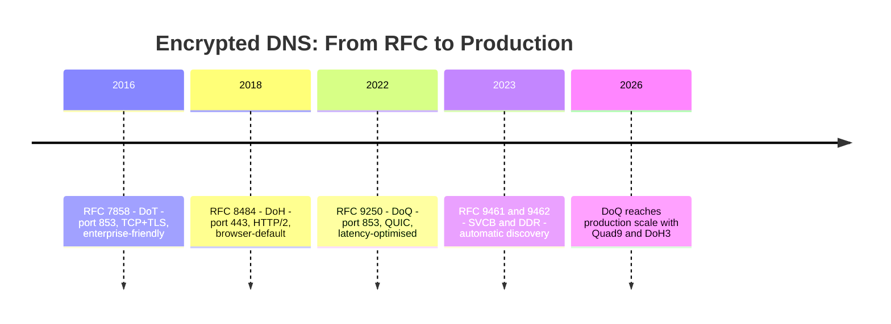

---

title: "Quad9 now supports DoQ along with DoH3"
authors: simonpainter
tags:
  - dns
  - security
  - networks
  - architecture
  - educational
date: 2026-04-06

---

In March 2026, [Quad9 announced support for DNS over QUIC (DoQ) alongside DoH3 on their public resolver network](https://quad9.net/news/blog/quad9-enables-dns-over-http-3-and-dns-over-quic/). That's the same month Microsoft's DoH support for Windows Server DNS moved out of preview. Two announcements in the same month, both about encrypted DNS, and they point in different directions.

Microsoft's move continues the push toward DoH—encryption that hides in plain sight on port 443. Quad9's move adds DoQ, which offers better latency than DoT but keeps the port 853 visibility that enterprises actually want. Together they prompt a question I don't think the industry has properly answered yet: are we encrypting DNS for privacy, or for security? Because the answer changes everything about which protocol you should reach for. In this post I'll largely ignore DoH3, which is DoH over HTTP/3. It's HTTP/3 and that's about as exciting as it gets, otherwise it's the same story as DoH over HTTP/2.

This post builds on my earlier posts on [encrypted DNS governance](encrypted-dns.md) and [SVCB/HTTPS records](svcb-https-records.md). I'm not going to re-cover the wire format or the DoT vs DoH comparison—read those first if you need the background. This is about DoQ specifically, what QUIC brings to DNS, and why I think the enterprise conversation about encrypted DNS is asking the wrong question.

<!-- truncate -->

## What QUIC Actually Is

Before talking about DoQ, it's worth being clear about what QUIC is—because it's not just "faster than TCP."

QUIC is a transport protocol designed from scratch with encryption as a first-class requirement, not an optional layer. It runs over UDP but provides the reliability, ordering, and congestion control you'd expect from TCP. The key distinction is that TLS isn't bolted on top of QUIC the way it is with TCP—the handshake is integrated. You can't have an unencrypted QUIC connection. Encryption is structural.

That integration matters for DNS because it collapses two separate negotiations—the TCP handshake and the TLS handshake—into one. TLS 1.3 over TCP costs 2 round trips before you can send application data. QUIC costs 1. For a protocol where every millisecond of the lookup adds to page load time, that's meaningful.

QUIC also solves a problem that's plagued multiplexed protocols running over TCP: head-of-line blocking. When TCP loses a packet, everything queued behind it stalls until retransmission succeeds. HTTP/2 over TCP has this problem—you can have 50 requests multiplexed on one connection, but a single lost packet freezes all of them. QUIC handles loss at the stream level. If stream 5 loses a packet, streams 7 and 9 keep moving. This is a really big deal and addresses one of the biggest performance issues with DoH over HTTP/2 and DoT.

DNS is built on UDP for a reason, it's designed to be fast and low latency and for the request and response to be independent and non-blocking. If the problem is the lack of encryption, and that's hardly a given, then DoQ is the better solution than DoH and DoT because it preserves the performance characteristics of UDP while adding encryption.

## DoQ: DNS-over-TCP's Logic, QUIC's Performance

[RFC 9250](https://datatracker.ietf.org/doc/html/rfc9250) defines DoQ. The wire format is deliberately familiar if you know DoT—it uses the same 2-byte length prefix that DNS-over-TCP introduced, just carried inside QUIC streams rather than a TCP byte stream.

Each DNS query/response pair gets its own bidirectional QUIC stream. The client's first query goes on stream 0, second on stream 4, third on stream 8. Because each is independent, responses can arrive out of order with no head-of-line blocking—the stream ID tells you which query a response belongs to.

RFC 9250 makes one notable departure from conventional DNS: Message IDs must be set to zero on DoQ connections. The stream handles query/response correlation, so the 16-bit ID field that DNS has used since 1987 is redundant. Proxies that translate DoQ to DoT or UDP have to synthesise a real Message ID, something to watch for in implementations.

The 0-RTT resumption story is where DoQ really separates itself from DoT. When a client has previously connected to a DoQ resolver, it stores a session token. On the next connection, it can send encrypted DNS data in the very first packet—before the server has responded at all. The resolver processes the query and the handshake simultaneously. For mobile clients that cycle through network connections frequently, that's not a theoretical win. It's a real reduction in lookup latency at exactly the moment users notice it most—when an app opens after switching from WiFi to cellular.

## What Quad9's Announcement Actually Means

Quad9 isn't the first public resolver to support DoQ, AdGuard and NextDNS got there earlier, but Quad9 is the first major infrastructure-grade resolver to do so. Quad9 operates 250+ PoPs globally, partners with Shadowserver for threat intelligence, and is a common choice for enterprises that want a privacy-respecting public resolver without Google or Cloudflare in the supply chain.

The announcement also included DoH3, DoH carried over HTTP/3, which runs on QUIC. That's the best-of-both-worlds option if you want DoH's port 443 invisibility alongside QUIC's performance characteristics. Modern browsers that support HTTP/3 will upgrade from DoH/HTTP/2 to DoH3 automatically via Alt-Svc headers.

What changes practically? Two things.

First, DoQ now has a production resolver to test against at scale. Until now, DoQ client implementations have mostly been tested against lab setups or small operators. Quad9's global footprint gives library authors and platform teams a real target.

Second, DDR (Discovery of Designated Resolvers, [RFC 9462](https://datatracker.ietf.org/doc/html/rfc9462)) becomes more interesting for DoQ. If you're already using Quad9 as your resolver, a DDR-capable client can now discover the DoQ endpoint automatically without manual configuration—the same mechanism I covered in detail in my [SVCB post](svcb-https-records.md). Clients that support both DDR and DoQ can upgrade transparently.


## The Protocol Landscape Now



My worry is that the industry will treat DoQ as late to the party and not adopt it as the best option for enterprise encrypted DNS. Already we've seen Microsoft opt for DoH over DoT; one of the product managers told me they 'had to do one first' and DoH was the one supported on the client end. It would be good to see some joined up thinking with the Windows client and the DNS server teams making an intentional choice to support the protocol offering the best performance and security properties for enterprise use.

I get why 1.1.1.1, 8.8.8.8, 9.9.9.9 and all the other public resolvers have been quick to add DoH support. It's the easiest one to market to end users because it melts into the background of https traffic and is hard to spot, hard to police, and hard to sniff. For privacy conscious end users, DoH is the obvious choice even though it is an abomination of a protocol from a performance, management, and security perspective.

For enterprise the choices are different. All the reasons a privacy conscious end user would want DoH are the same reasons an enterprise would absolutely not want it. DoH is a nightmare for enterprise visibility and governance. DoT is better, but the TCP handshake and TLS handshake overheads are a real problem for high-churn environments. DoQ is the best of both worlds: encryption with a lower performance cost, and port 853 visibility for enterprise governance.

The choice of protocol has always been about more than performance. Where you run your DNS and who you need to trust shapes which protocol makes sense.

DoH runs on port 443 and is indistinguishable from ordinary HTTPS. That's by design—it protects privacy from network observers including enterprise firewalls. As I covered in [my first encrypted DNS post](encrypted-dns.md), this is exactly what breaks FortiGate wildcard FQDN objects and circumvents DNS-based threat intelligence. DoH prioritises user confidentiality over organisational visibility.

The meaningful comparison for enterprise architects isn't DoT vs DoH any more—it's DoT vs DoQ, with DoH as the external-facing option for users on untrusted networks.

## The Question Nobody's Asking

Here's where I want to push back on the framing that's dominated the encrypted DNS conversation since 2018.

The standard narrative goes like this: DNS is insecure, so we need to encrypt it, and the argument is only about which encryption method. That's true for end users querying from a coffee shop or a hotel WiFi. But for enterprises, it's the wrong question.

DNS security has two separate concerns that the community keeps conflating. **Confidentiality** is about whether an observer on the network can see your queries. **Authentication** is about whether the response you receive is genuine—whether it came from the real nameserver and hasn't been tampered with in transit.

Encrypted DNS (DoT, DoH, DoQ) solves confidentiality. DNSSEC solves authentication.

For a user on an untrusted network, confidentiality matters. Their ISP, their government, the person running the coffee shop's router—all of these are potential observers. Encryption hides the query.

For an enterprise, the threat model is different. You own the network between the client and your internal resolver. The risk isn't an observer on the wire—it's a compromised resolver returning poisoned responses, or malware using DNS for exfiltration and C2. Encryption doesn't address either of those. DNSSEC addresses the first. Visibility—the ability to see what's being queried—addresses the second.


## DNSSEC: The Security Property Enterprises Actually Need

DNSSEC ([RFC 4033](https://datatracker.ietf.org/doc/html/rfc4033), [RFC 4034](https://datatracker.ietf.org/doc/html/rfc4034), [RFC 4035](https://datatracker.ietf.org/doc/html/rfc4035)) has been a standard since 2005. It's underdeployed and widely misunderstood. Let me explain what it actually does.

Zone operators sign their DNS records with a private key. The signature arrives in the response as an RRSIG record alongside the real data:

```dns
example.com. 3600 IN A 93.184.216.34
example.com. 3600 IN RRSIG A 8 2 3600 20260501000000 20260401000000 (
    12345 example.com. <base64-encoded-signature> )
```

A validating resolver checks that signature against the zone's public key (in the DNSKEY record). If it validates, the response is genuine. If it doesn't, the response is rejected—regardless of how plausible it looks. An attacker can't forge a valid RRSIG without the zone operator's private key.

DNSSEC uses a chain of trust. The `.com` nameservers sign the DNSKEY records for `example.com`. Root nameservers sign the DNSKEY records for `.com`. A resolver that trusts the root key—which is published and well-known—can validate the entire chain from root to leaf. Compromise of a recursive resolver can't produce a valid RRSIG without the zone's private key.

That's the property you want in an enterprise. If your resolver is validating DNSSEC, a DNS poisoning attack that redirects a signed name such as `example.com` to a malicious IP will fail because it can't produce a valid signature. For internal names such as `payments.internal`, that same protection only applies if the internal zone is DNSSEC-signed and your resolver has a trust anchor for it. Encryption of the query doesn't give you this—an encrypted query to a compromised resolver just gets you a confidential wrong answer.

DNSSEC is protocol-agnostic. It works over plain DNS/UDP, DoT, DoH, or DoQ. The signature is in the response, not the transport. You can have DNSSEC validation without any encryption, and you can have encrypted DNS without any DNSSEC. They're independent.

### The Deployment Reality

Roughly 60-65% of domain names are DNSSEC-signed globally. Most TLDs are signed. The root is signed. Cloudflare, Google, Quad9, and other major resolver operators validate DNSSEC by default.

But a lot of enterprises don't run DNSSEC validation on their internal resolvers. They've deployed split-horizon DNS for internal zones. They've spent effort on encrypted DNS transport. They've blocked port 853 outbound. And they've left the door open to response tampering because their recursive resolver doesn't validate signatures.

There's no excuse for this from a tooling perspective. [Windows DNS Server has supported DNSSEC since Windows Server 2012](https://learn.microsoft.com/en-us/windows-server/networking/dns/dnssec-overview). BIND has supported it for longer. The feature is there; it just hasn't been prioritised.

The DNSSEC operational overhead is real: key rotation, larger response sizes due to RRSIG records, occasional validation failures that are painful to debug. But that overhead is lower than deploying and maintaining TLS interception infrastructure to inspect DoH traffic.

## Authentication vs Confidentiality in Practice

Consider the threat models honestly.

An enterprise DNS resolver sits on your network, answering queries from your clients. The path from client to resolver is on infrastructure you control. The path from resolver to upstream forwarder might cross ISP networks. The path from forwarder to authoritative nameserver crosses the public internet.

On the internal hop, you control the network. DNSSEC validation at your resolver means tampered responses are rejected. You don't need to encrypt this hop for security reasons—and encrypting it removes the query visibility you need for threat detection.

On the resolver-to-public-internet hop, you're crossing untrusted infrastructure. DoT or DoQ makes sense here—you want confidentiality from ISP monitoring, and port 853 keeps the traffic identifiable for your own governance.

The authoritative layer is protected by DNSSEC signatures. A compromised public resolver can't fake a valid RRSIG for a zone it doesn't control.

The result: DNSSEC validation on your recursive resolver + DoT or DoQ on the upstream hop gives you authentication at every layer and confidentiality where the network is untrusted. It maintains query visibility on the internal hop, where you need it for security monitoring.

Deploying DoH internally gives you confidentiality on a hop you already control, removes the query visibility you need, and still leaves you vulnerable to response tampering if your resolver isn't validating DNSSEC.

I'd take DNSSEC validation on a plaintext resolver over DoH without DNSSEC validation, every time, for an enterprise deployment.

## What DoQ Changes for Enterprises

DoQ doesn't resolve the confidentiality vs authentication debate. But it does change the picture for enterprises that want encrypted DNS on the upstream hop without sacrificing visibility.

DoT has been the enterprise-friendly option since 2016, but it carries TCP's connection setup cost. For long-lived connections between a corporate resolver and a public upstream forwarder with high query volumes, that overhead is amortised and barely matters. For deployments with frequent connection resets—cloud-native environments, serverless functions making sporadic queries, or IoT devices with intermittent connectivity—DoT's 2-3 RTT cold start is a real cost.

DoQ's 1-RTT handshake and 0-RTT resumption make it a better fit for those sporadic patterns. And because it runs on port 853, it stays visible to enterprise governance tools in the same way DoT does.

DoQ also has better characteristics for zone transfers. Zone content can be large. Multiple resource record sets in a single transfer can hit UDP fragmentation limits. DoQ's per-stream independence means a large transfer doesn't stall other queries on the same connection, and per-stream error codes let a primary abort a transfer without dropping the whole connection. BIND 9.18+ and dnsdist both support DoQ for zone transfer.

The tooling maturity gap is real—DoQ monitoring and inspection tools are considerably less developed than DoT equivalents. If you're considering DoQ for enterprise internal use today, factor in that your observability tooling may need to catch up.

## The Practical Upshot

If you haven't already, the most impactful thing you can do for your enterprise DNS security posture isn't deploying encrypted transports. It's enabling DNSSEC validation on your internal recursive resolvers. Both Windows Server DNS and BIND support it with minimal configuration change. Your upstream resolvers (Quad9, Cloudflare, Google) already validate so make sure your internal resolvers do too.

Once that's in place, use DoT or DoQ on the upstream forwarder hop, from your internal resolver to your public DNS provider. This gives confidentiality where the network is untrusted and maintains visibility on the internal network.

DoH belongs outside the enterprise, not inside the perimeter. For users on untrusted networks such as remote workers, or mobile devices away from corporate infrastructure, DoH provides confidentiality from their local network observer. Inside your perimeter, it removes visibility for no additional security gain over DNSSEC + DoT/DoQ.