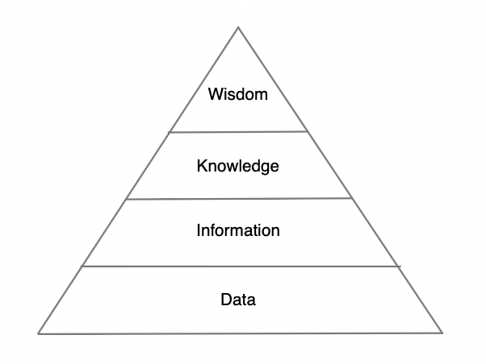

---

title: "The network documentation pyramid: why your spreadsheets aren't enough"
authors: simonpainter
tags:
  - business
  - networks
  - opinion
  - ai
  - documentation
date: 2025-09-15

---

I've been thinking about why network documentation always feels incomplete. You know the feeling - you've got spreadsheets full of device details, beautiful network diagrams, and configuration backups. But when something breaks at 3am, you're still calling Dave from the pub because he's the only one who knows why VLAN 247 exists.

The problem isn't that we don't document things. It's that we're only capturing the bottom layer of what we actually need.
<!-- truncate -->
## A framework for understanding documentation gaps

The [Data-Information-Knowledge-Wisdom (DIKW) model](https://en.wikipedia.org/wiki/DIKW_pyramid) has been around for decades and attempts to create a hierarchy of understanding from raw data to actionable wisdom and often prediction.



At the bottom, we have **data** - raw facts like IP addresses, device models, and serial numbers. Moving up, **information** shows relationships and connections. **Knowledge** explains how these relationships serve business purposes. At the top, **wisdom** captures the hard-won insights about why decisions were made and what works in practice.

I found a great example on Reddit which works well to illustrate the concept:

> **Data**: Here's data for 500 phone calls to a customer service department. The data includes the call date and the reason for calling.
>
> **Information**: There were many more calls on weekends for park maintenance than there were during the week.
>
> **Knowledge**: Calls for park maintenance are high on weekends because many more people go to parks on weekends. More people = more maintenance issues found.
>
> **Wisdom**: A maintenance crew should visit the park on Fridays and fix issues that they notice. This will reduce call volume, especially on weekends.

Notice how each level builds on the previous one, transforming raw call data into a proactive strategy that prevents problems before they happen. This progression from reactive data collection to predictive wisdom is exactly what's missing in most network documentation. The DIKW model gives us a useful way of understanding why network documentation fails: as you move up the pyramid, documentation quality plummets.

## The documentation drought

Applying the DIKW model to network documentation we find that most organisations are brilliant at the data layer. Our CMDBs are packed with device inventories, our monitoring systems track every metric, and our configuration management tools back up every change.

We're pretty good at the information layer too. Network diagrams show topology, VLAN tables map relationships, and routing tables display connectivity. We can usually work out how things connect. I have been wowed by many a dashboard that pulls live data from network devices to show RAG status of all manner of things - PowerBI has a lot to answer for in this space. But climb higher and things get sparse fast.

The knowledge layer - understanding how network design serves business needs - lives scattered across project documents, architectural decision records, and the occasional wiki page. It's patchy, often outdated, and rarely connected to the technical reality it's supposed to explain.

And the wisdom layer? That's almost entirely tribal. It's the insights that come from years of experience, the patterns that emerge from repeated incidents, the unwritten rules about what works and what doesn't. This knowledge exists in people's heads and nowhere else.

## The nature of tribal knowledge and wisdom

Before we go further, let's talk about what tribal wisdom is and what it means. I use this term to describe the understanding passed down between engineers like an oral tradition - insights, patterns, and contextual knowledge that never make it into formal documentation.

At the knowledge layer, tribal knowledge includes understanding how your network actually supports business operations. This knowledge lives in people's heads because nobody ever documented the full context of how systems interconnect.

But tribal wisdom goes deeper. It's the wisdom held by the senior engineers - the team's elders who've seen multiple generations of technology and organisational change. This is experiential knowledge that comes with stories and context.

It's the senior engineer telling you, "Don't restart BGP on that router during market hours - learned that the hard way in 2008." It's knowing that a particular switch model always shows interface errors two weeks before it fails completely. It's understanding that the monitoring system reports everything as normal, but when you see this specific combination of log entries, then something is about to crash.

This wisdom lives in conversations, in the margins of team meetings, in the knowledge shared during 3am incident calls. It's contextual, experiential, and often comes with [war stories](vlan-add.md) about why certain approaches work or fail in your specific environment.

## The fragility of institutional memory

Here's what makes both tribal knowledge and wisdom so vulnerable: they exist primarily in people's minds, not in systems or documents.

When experienced engineers leave, retire, or get made redundant, decades of institutional memory walks out the door with them. Outsourcing to managed services is particularly devastating - the handover documentation captures processes and procedures, but it never captures the nuanced understanding of how systems actually behave under stress, or why certain design decisions were made years ago.

Knowledge transfer sessions try to bridge this gap, but they're fighting human nature. You can't download twenty years of pattern recognition in a few training sessions. The subtle cues that trigger "something's not quite right" in an experienced engineer's mind - those don't transfer easily in formal handovers.

Yet this tribal knowledge and wisdom often contain the most valuable insights about your infrastructure. It's the difference between someone who can follow a runbook and someone who can write the runbook.

## When tools become part of the problem

I've watched organisations try to solve this with better tools. They implement documentation platforms, mandate architectural decision records (ADRs), and create elaborate knowledge management systems. The results are predictably disappointing.

ADRs get written for major projects but rarely maintained. They're stored in separate repositories, disconnected from the configurations they describe. Six months later, when you're troubleshooting an issue, good luck finding the ADR that explains why this particular configuration exists.

Even when documentation exists, it's in the wrong place at the wrong time. Your Confluence space has detailed explanations of network design decisions. Your Git repository has configuration files. Your monitoring system shows current state. But they're all separate, so when you need to understand why something was built the way it was, you're hunting across multiple systems.

The context that makes documentation valuable - the connection between decision, implementation, and outcome - gets lost in the tool sprawl.

## Capturing Intent Within Implementation

What if we flipped the script? Instead of documenting after we build, what if we captured our intent and reasoning at the moment of decision, when the context is fresh and the alternatives are clear?

This isn't about designing in documents first - it's about embedding the "why" directly with the technical implementation, not filing it away in a separate system. It's documentation that lives where it's needed, when it's needed.

Here's where infrastructure as code becomes powerful beyond just automation. When your network configurations live in code, the comments become a natural place to capture intent alongside implementation.
Instead of having your BGP configuration in one system and your architectural decisions in another, everything lives together:

```text
# BGP Configuration for Core Router CR01-LON-01
# Business Context: Primary internet gateway for London office (400 users)
# Design Decision: Dual-homed to different providers for redundancy
# Historical Context: Single provider outage in Feb 2023 caused 4-hour downtime
# Traffic Patterns: Peak 2Gbps during business hours, 200Mbps overnight
# Failure Impact: Complete office connectivity loss, affects customer support
# Last Review: 2024-03-15 (next review due with office expansion Q4 2024)

router bgp 65001
  neighbor 203.0.113.1 remote-as 64512  # Primary: GlobalConnect 
  neighbor 203.0.113.1 description "Primary ISP - GlobalConnect"
  neighbor 203.0.113.5 remote-as 64513  # Secondary: MetroNet
  neighbor 203.0.113.5 description "Secondary ISP - MetroNet"
  
  # Prefer primary path under normal conditions
  # Secondary has higher AS prepend for outbound traffic engineering
  neighbor 203.0.113.5 route-map BACKUP-PATH out
```

The power here isn't just that documentation exists - it's that it exists in context. When someone's reviewing the configuration, the business reasoning is right there. When they're making changes, they can see why previous decisions were made. When they're troubleshooting, they understand what the configuration is supposed to achieve.

Version control gives you the history of both implementation and reasoning. You can see not just what changed, but why it changed, because the comments evolve with the code.

## Embedding documentation in the change process

But here's where it gets really powerful. When you treat documentation as code, it becomes part of the change process itself, not something that happens afterwards.

Every change becomes a feature branch in your version control system. That branch doesn't just contain the configuration changes - it contains the documentation updates too. The business context, the design rationale, the impact analysis - all of it evolves together with the technical implementation.

Let's say you're implementing redundant internet connectivity for a branch office. Your feature branch might be called `feature/branch-manchester-dual-wan` and it contains:

- Updated router configurations with new BGP neighbours
- Modified firewall rules for the secondary path  
- Updated network diagrams showing the new topology
- Revised runbooks with failover procedures
- Updated monitoring configurations for the new links

But it also contains the documentation that explains the change:

- Business justification (regulatory requirement for 99.9% uptime)
- Design decisions (why BGP over static routing)
- Risk assessment (what happens if implementation goes wrong)
- Success criteria (how we'll know it's working properly)
- Future considerations (planned migration to SD-WAN in 2025)

When you merge that branch, you're not just deploying a configuration change. You're deploying a complete package of infrastructure evolution - technical implementation and human understanding together.

This kills the traditional technical design document. No more writing lengthy documents that describe a point-in-time snapshot of where you're heading. No more documents that become obsolete the moment requirements change or implementation reveals new constraints.

Instead, documentation evolves continuously with your infrastructure. When you need to understand why something exists, you look at the commit that introduced it. When you need to change something, you update both the implementation and the explanation in the same pull request.

The documentation stays current because it can't drift - it's locked to the same version as the infrastructure it describes.

## Where AI helps change the game

AI is where things get really interesting. The wisdom layer has always been the hardest to capture because it's experiential and contextual. But modern AI models can connect directly to your operational systems using protocols like Model Context Protocol (MCP).

Instead of trying to capture every insight, you can give AI models access to context in the form of your configuration repositories, historical logs, incident management systems, and monitoring data. When someone's troubleshooting at 3am, instead of calling Dave, they could ask:

"What does vlan 247 do again? Why was it added?"

This isn't replacing human expertise - it's amplifying it. The AI becomes a bridge between your live operational data and institutional memory, making our understanding discoverable while keeping it current.

## Building organisational memory

The real power comes from combining documentation-first practices with AI-augmented wisdom capture. As you document intent and implementation together, the AI has context on not just what you did, but why you did it.

As you resolve incidents and capture lessons learned, the model builds understanding of what works in your specific infrastructure. Over time, you develop genuine organisational memory - not just records of what happened, but understanding of why decisions were made and what their consequences were.

This matters because networks aren't just technical systems. They're socio-technical systems where human knowledge, business context, and technical implementation all interweave. The wisdom layer captures those interconnections.

## Start where it hurts most

You don't need to revolutionise everything at once. Pick the area where tribal knowledge is most critical - maybe it's your BGP configuration, your security policies, or your change management procedures.

For your next significant change, document not just what you're implementing, but why you chose this approach over alternatives. Capture the business context, the technical constraints, and the expected outcomes. Store it with the implementation, not separate from it.

When the next incident happens, spend ten minutes documenting not just how it was resolved, but what led the responder to look in the right place. Feed that pattern recognition back into your organisational memory.

Build the wisdom layer one insight at a time. Your future self - and your colleagues - will thank you for it. Especially at 3am.
