---

title: "Infrastructure documentation"
authors: simonpainter
tags:
  - cloud
  - business
  - networks
  - opinion
  - ai
date: 2025-06-21

---

The topic of documentation always comes up in tech and it's one that has had a lot of attention in world of software development which has led to some excellent solutions. In the world of infrastructure, however, the solutions have not been as readily available or adopted.
<!-- truncate -->

## The Documentation Problem in Infrastructure

There is a joke amongst network engineers that the only network diagram that isn't out of date is the one that hasn't been drawn yet; this is why many network people gravitate towards rooms with whiteboards in them.

> One of my first improvements to my home office when covid struck, and we all banished to
> our back bedrooms, was to install a whiteboard behind me in full view of my teams camera
> so I can illustrate things visually in situations where more formal documentation doesn't
> exist or has not been regularly updated. Sometimes just being able to show 'how it is now'
> quickly and informally helps to broaden understanding but it should ideally be backed up
> with a more structured description of change and the requirements that change is designed
> to satisfy.

## Current Tools and Their Limitations

Tools exist, such as Netbrain et al, to provide visual representations of network and infrastructure however I have always been disappointed with the output compared to the effort involved in installing and managing those tools. They also create a laziness around documentation which is the antithesis of the problem that we want to address.

## Lessons from Software Development

In software development the use of comments provides a way to create the 'self documenting code' ideal where each element is labelled with comments like a well constructed diagram, but within the source code itself. That approach can work to some extent in infrastructure with descriptions, naming conventions and other comment elements in config helping to describe the systems, their functions and their reason.

### Embedding Documentation in Configuration

At a large retailer I became custodian of a few legacy hacks in the core network and embedded a shortened url to a sharepoint page into the config whenever there was a weird kludge that wasn't immediately clear in the config. I used the sharepoint page to explain the workaround and why it was there. Several years later when returning to the organisation after a long gap I was pleased to find that while the kit had been migrated in the meantime the hack had not been fixed but the comment with the link had been transferred. I also returned to a piece of work that had not been progressed in the lengthy gap and found that the instructions I had left in the comments of a prefix list on how to complete the final step of a default route migration were still there and it formed the basis of the change plan to complete the work.

## The Waterfall Documentation Problem

Good documentation in infrastructure is a casualty of waterfall project methodology. A focus on the design document showing what's changed, rather than how the whole system looks afterwards, means that operational teams sometimes have to look through pages of design documents, created to meet stage gates rather than deliver value, to get the nuggets of information they need. In software development the structure of documentation is often around a feature and tools like Jira capture documentation on the fly as features are defined, created, tested and released. These rarely translate well into the project lifecycle of infrastructure and I can't express the hours I've spent writing updates into Jira about why I haven't made progress on a piece of documentation.

## A Documentation-First Approach

Infrastructure as Code gives us more tools to manage our infrastructure documentation because the challenges for addressing documentation of code have had plenty of airtime and if we reduce our infrastructure to code we should be able to use the same methodologies.

### What Does Documentation-First Mean?

When I write code that I want to keep, be it an application, script or IaC definition in something like Terraform, I start by defining the problem I am trying to solve. I'll describe the overall behaviour and then work from that. If I change what I want it to do then I'll update the documentation. The principle to follow is that the documentation is always right because that's what you've defined; if the documentation and the system diverge then it's the system that must be fixed and not the documentation.
This leads to strong test driven development because you've designed what you want the system to do, then you design a test to see if it's doing it, and finally you fix the system so that the tests pass.

#### A Simple Example: FizzBuzz Documentation-First

Let's illustrate this with a classic programming example. First, we define what we want:

**Documentation Definition:**

```text
fizzbuzz(n) - A function that takes an integer n and returns:
- "Fizz" if n is divisible by 3 but not 5
- "Buzz" if n is divisible by 5 but not 3  
- "FizzBuzz" if n is divisible by both 3 and 5
- The number as a string if n is not divisible by 3 or 5
```

**Test Implementation:**

```python
def test_fizzbuzz():
    assert fizzbuzz(1) == "1"
    assert fizzbuzz(3) == "Fizz" 
    assert fizzbuzz(5) == "Buzz"
    assert fizzbuzz(15) == "FizzBuzz"
    assert fizzbuzz(7) == "7"
```

**Code Implementation:**

```python
def fizzbuzz(n):
    if n % 15 == 0:
        return "FizzBuzz"
    elif n % 3 == 0:
        return "Fizz"
    elif n % 5 == 0:
        return "Buzz"
    else:
        return str(n)
```

The documentation came first, defining exactly what we wanted. The test validates our understanding, and the code implements the documented behavior. If requirements change, we update the documentation first, then the tests, then the code.

```mermaid
flowchart TD
    A[📝 Documentation] --> B[🧪 Tests]
    B --> C[💻 Code]
    C --> D{Pass?}
    D -->|No| C
    D -->|Yes| E[✅ Done]
    F[📋 Changes] --> A
```



With LLMs becoming more prevalent, good documentation of a feature can easily form the prompt to help create that feature; I think this is far superior to the reverse approach of using an LLM to document the code because the LLM cannot extract the business logic from the code as well as it can extract the code from the business logic.

### Benefits of Documentation-First Infrastructure

A common theme in my world is around understanding how we handle things when they don't behave as we want them to. It's very common in my world for infrastructure changes to be snuck in on the back of an incident. I'm sure you've been there yourself when a software or business driven change proceeds without infrastructure engagement and it doesn't work because there are corresponding changes to be made in infrastructure that weren't included in the plan. In these situations the common question that must be asked is 'has this ever worked?' which separates the things that should behave in a defined way, and don't, and those who are behaving how they're intended to but that intention doesn't match the new requirements.
Documentation first approach gives a clear hierarchy. Let's say someone has introduced a new system and they want communication from DC A to DC B on a specific service. If this behaviour isn't defined in the documentation then it's clearly not an incident and so can't be considered 'breakfix'. If the documentation agrees that this traffic flow should be allowed for the system then we should have failed tests for that system already which should have invoked a proactive incident to ensure that the problem is solved.

### Implementation Strategies

This can be solved by documenting a blueprint for an infrastructure, be it an application hosting environment, a campus office location, or in my favourite realm of retail, a store. This documentation can follow a lifecycle similar to code, the wonderful [documentation as code](https://about.gitlab.com/blog/five-fast-facts-about-docs-as-code-at-gitlab/) approach that uses tools like [github](/tags/github) to manage the documentation and things like [docusaurus](/tags/docusaurus) to make it accessible to anyone that needs it. These blueprints are made up of a collection of business focussed features within the infrastructure and allow the capabilities and limitations of the infrastructure to be easily understood.

```mermaid
flowchart LR
    A[📄 Initial Docs] --> B[🌐 WiFi Feature]
    B --> C[🔀 Merge v2.0]
    C --> D[💳 POS Feature]
    D --> E[🔀 Merge v2.1]
    E --> F[🚨 Hotfix]
    F --> G[🔀 Emergency Update]
```



Using a business focussed feature set as the basis for your documentation also allows you to create a business focussed testing criteria which can form the groundwork for a set of dashboards that demonstrate the infrastructure is healthy, not by some arbitrarily defined metrics but by useful capabilities. Gone are the 'is the database server responding' and in comes 'can the store authorise POS transactions'. Out goes 'is there sufficient bandwidth on the WAN' and in comes 'can 1000 people be on teams calls at the same time'.

## Conclusion

The shift to documentation-first infrastructure isn't just about better diagrams or more detailed runbooks—it's about fundamentally changing how we think about infrastructure design and management. When documentation becomes the source of truth rather than an afterthought, we create systems that aren't only more reliable but also more understandable and maintainable.

The benefits are clear: fewer incident-driven changes, better alignment between business requirements and infrastructure capabilities, and monitoring that actually tells us what matters. Most importantly, documentation-first practices help us answer the critical question "has this ever worked?" before problems arise, not after.

Infrastructure as Code has given us the tools to make this shift practical. By treating our infrastructure documentation with the same rigor we apply to application code—version control, testing, continuous integration—we can finally break free from the curse of the perpetually outdated network diagram.

The transition requires discipline and cultural change, but the investment pays dividends in reduced operational overhead, clearer communication, and systems that behave predictably. Start small, pick a single service or location, document it thoroughly, test against that documentation, and build from there.

Your future self—and your colleagues—will thank you when the next incident hits and the documentation actually reflects reality.
