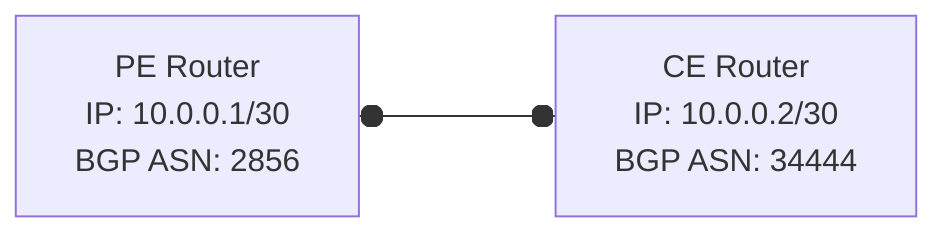

---

title: Dual AS for BGP ASN migrations and changes
authors: simonpainter
tags:
  - networks
  - bgp
  - routing-protocols
date: 2025-08-04

---

I was reminded today of a post I wrote for my old blog about using a dual AS for BGP ASN migrations and changes. It was written some time ago but the principles still apply today. I thought it was worth reposting here as it got lost in one of my blog's own migrations.
<!-- truncate -->
I used to work for a global retailer that assigned a unique BGP ASN to each of its sites. This approach was one of their global standards and one that I can't say I ever really questioned at the time. BGP ASNs were assigned using the store 4 digit store number prepended with a 3. This meant that the ASN for store number 4444 was 34444.

> BGP ASN 34444 happens to also be a [French satellite telecoms provider](https://bgp.he.net/AS34444) but as the vendor never leaked their internally used ASNs out to the internet, and never let internet ASNs in (using a conditional injection of default at their edge) it was never a problem.

Of course the more I think of it in retrospect the more I wonder why they did this. I guess there were some marginal benefits like being able to easily identify a prefix in the BGP table as belonging to a specific site. The downsides also appeared marginal until the time came to renumber some of the sites.

The site numbers were generated regionally in SAP and pretty much everything relied on them. During a tech transformation project the sites were migrated from one instance of SAP to another and this meant they had to be renumbered so that they could be run in parrallel. The new site numbers were generated in a different range and so the BGP ASNs had to change too.

> It's a lot easier to use [private ASNs](https://datatracker.ietf.org/doc/html/rfc6996) internally and then have your WAN provider strip them at the PE. The reason you need to strip them is because BGP loop prevention will drop any prefixes into an ASN where they have already been seen. This means if a prefix advertised from site 64512 transits through a provider, say BT 2856, and then comes to a site also numbered as 64512 the prefix will be dropped because 64512 will already be in the AS Path. Stripping it at the PE means only the provider ASN is seen in the AS Path and so the prefix is accepted.

Weirdly the biggest problem operationally with changing a site ASN is that you need to coordinate with your WAN provider. BGP peerings are manually configured and you need the remote-as configure on the other peer to match the ASN you are using. If you need to raise a ticket with your telco to get them to change the ASN on their end, and also do it at your end, then you have a coordination problem. This also means that you need to arrange a maintenance window because you probably can't change the ASN on both sides at exactly the same time.

To solve this problem use dual-as which allows you to configure a secondary remote ASN that is accepted in addition to the primary ASN. This means you can change to the new ASN on your end and then raise a ticket with your telco to change their end. Once they have done that you can remove the old ASN from your configuration.



```text
PE Router
interface FastEthernet0/0
 ip address 10.0.0.1 255.255.255.252
!
router bgp 2856
 neighbor 10.0.0.2 remote-as 34444
```

```text
CE Router

interface Loopback1
 ip address 192.168.0.1 255.255.255.255
!
interface FastEthernet0/0
 ip address 10.0.0.2 255.255.255.252
!
router bgp 34444
 network 192.168.0.1 mask 255.255.255.255
 neighbor 10.0.0.1 remote-as 2856
 neighbor 10.0.0.1 local-as 35555 no-prepend replace-as dual-as
```

Dual ASN is configured on the CE router using ```neighbor 10.0.0.1 local-as 35555 no-prepend replace-as dual-as```. This means that the CE router will try using 35555 as well as 34444 as it's local ASN and whichever the peer is configured with will be accepted. The no-prepend means that the ASN will not be prepended to the AS Path when advertising prefixes. If you capture the bgp packets you see the following:

First the PE router sends an OPEN message to the CE router with its ASN of 2856.

```text
Border Gateway Protocol - OPEN Message
    Marker: ffffffffffffffffffffffffffffffff
    Length: 57
    Type: OPEN Message (1)
    Version: 4
    My AS: 2856
    Hold Time: 180
    BGP Identifier: 10.0.0.1
    Optional Parameters Length: 28
    Optional Parameters
```

 The CE router responds with an OPEN message using its ASN of 35555. I tested it a few times and it seems to consistently send the explicitly configured local-as first rather than the primary ASN of 34444. This makes sense as it's peer level configuration and fits with the idea that most explicit configurations are preferred.

```text
Border Gateway Protocol - OPEN Message
    Marker: ffffffffffffffffffffffffffffffff
    Length: 57
    Type: OPEN Message (1)
    Version: 4
    My AS: 35555
    Hold Time: 180
    BGP Identifier: 192.168.0.1
    Optional Parameters Length: 28
    Optional Parameters
```

The PE responds with a NOTIFICATION message indicating that it has received an OPEN message with a bad peer AS. This is because the PE router is configured to expect remote-as of 34444 for this peer.

```text
Border Gateway Protocol - NOTIFICATION Message
    Marker: ffffffffffffffffffffffffffffffff
    Length: 23
    Type: NOTIFICATION Message (3)
    Major error Code: OPEN Message Error (2)
    Minor error Code (Open Message): Bad Peer AS (2)
    Bad Peer AS: 35555
```

The CE router then sends another OPEN message with its primary ASN of 34444. This is accepted by the PE router and the BGP session is established.

```text
Border Gateway Protocol - OPEN Message
    Marker: ffffffffffffffffffffffffffffffff
    Length: 57
    Type: OPEN Message (1)
    Version: 4
    My AS: 34444
    Hold Time: 180
    BGP Identifier: 192.168.0.1
    Optional Parameters Length: 28
    Optional Parameters
```

When you come to change the config on the PE router your telco provider can change the remote-as to 35555. There will be a brief reset of the peering however it will come back up because the CE is still configured to try to use 35555 as well as 34444. Once the PE router has been updated you can then remove the old ASN from the CE router configuration.

I found this approach to be a really useful way to manage ASN changes and migrations. It allows you to avoid the need for a maintenance window and the coordination problems that come with it. It also means that you can change your ASN without having to worry about losing connectivity during the process.
