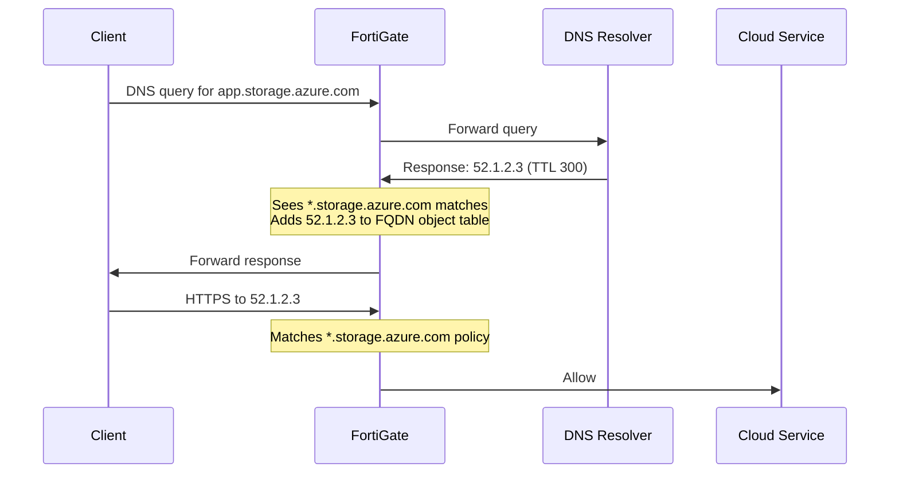
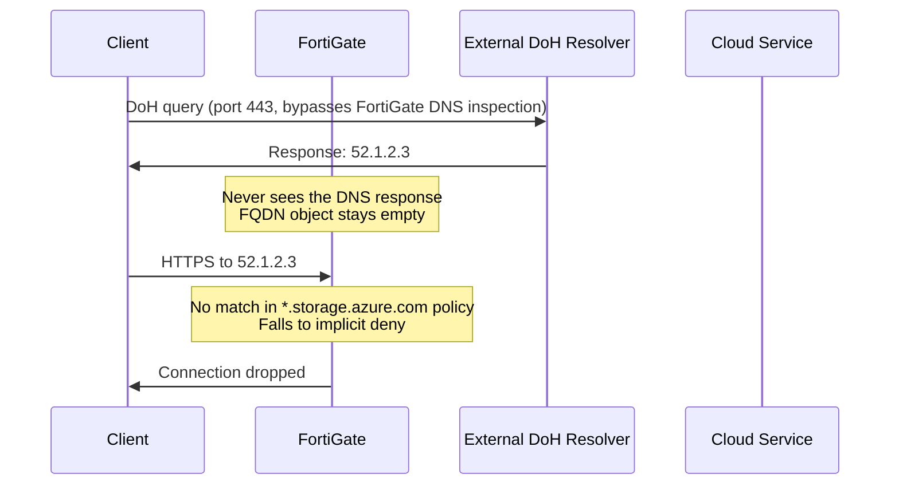

---

title: "Encrypted DNS: What Microsoft's DNS over HTTPS public preview means for you"
authors: simonpainter
tags:
  - dns
  - security
  - networks
  - architecture
  - firewall
  - zero-trust
  - educational
date: 2026-02-23

---

## Microsoft lights the fuse

In February 2026, [Microsoft quietly dropped a public preview of DNS over HTTPS (DoH)](https://techcommunity.microsoft.com/blog/networkingblog/secure-dns-with-doh-public-preview-for-windows-dns-server/4493935) support in the Windows Server DNS service. It's available in [Windows Server 2025 with the KB5075899](https://support.microsoft.com/en-gb/topic/february-10-2026-kb5075899-os-build-26100-32370-ffae9df3-05c5-439c-9087-e034985c1b2e) update, and the announcement was understated: a few PowerShell commands, a certificate requirement, and an event ID to watch for in the DNS Server logs. The implications for enterprise network architects are anything but quiet, though.

This isn't Microsoft's first encrypted DNS move. Back in[November 2019, the Windows Core Networking team announced their intention to adopt DoH in the Windows DNS client](https://techcommunity.microsoft.com/blog/networkingblog/windows-will-improve-user-privacy-with-dns-over-https/1014229). They described their reasoning with characteristic idealism: *"We have to treat privacy as a human right. We have to have end-to-end cybersecurity built into technology."* They acknowledged DNS over TLS (DoT) as a future possibility but prioritised DoH, citing the ability to reuse existing HTTPS infrastructure. That client-side work eventually shipped. Now, five years later, the server-side has followed.

The choice to implement DoH and only DoH tells you everything about how Microsoft frames this problem. Privacy as a feature, encrypted DNS as a natural extension of HTTPS, and a preference for the path of least resistance. For end-user privacy advocates, this is progress. For enterprise network and security teams, it opens a set of problems that will take some time to fully work through.

To understand why, we need to go back to basics.

---

## DNS from the ground up: what's in the packet

Before looking at how encryption changes DNS, it's worth understanding exactly what a DNS message looks like at the packet level. The differences between DoH and DoT are about what wraps the message, not the message itself. And the message hasn't changed much since 1987.

I once wrote a [very basic Python DNS packet parser](https://github.com/simonpainter/pyDNS) just so I could really understand the protocol. It's one of my favourite protocols for its elegance and simplicity because it is so fundamental to how netoworks work and is therefore extremely well designed and optimised.

### The DNS message format

A DNS message follows a binary format defined in [RFC 1035](https://datatracker.ietf.org/doc/html/rfc1035). It has a fixed 12-byte header followed by variable-length sections. It's worth pointing out that the fixed size limit of a 512 byte UDP DNS packet reduces the chance of fragementation significantly and also reduces the chance of the UDP datagrams getting dropped. The header fields are all fixed-size integers, and the sections are sequences of records that can vary in length. Most importantly there is no size field in the header because the message is expected to be read in its entirety from the single UDP datagram.

The request and the response both follow the same format, the difference is in the flags that are present and the QR field.

```text
+--+--+--+--+--+--+--+--+--+--+--+--+--+--+--+--+
|                      ID                       |  2 bytes
+--+--+--+--+--+--+--+--+--+--+--+--+--+--+--+--+
|QR|   Opcode  |AA|TC|RD|RA|   Z    |   RCODE   |  2 bytes (flags)
+--+--+--+--+--+--+--+--+--+--+--+--+--+--+--+--+
|                    QDCOUNT                    |  2 bytes
+--+--+--+--+--+--+--+--+--+--+--+--+--+--+--+--+
|                    ANCOUNT                    |  2 bytes
+--+--+--+--+--+--+--+--+--+--+--+--+--+--+--+--+
|                    NSCOUNT                    |  2 bytes
+--+--+--+--+--+--+--+--+--+--+--+--+--+--+--+--+
|                    ARCOUNT                    |  2 bytes
+--+--+--+--+--+--+--+--+--+--+--+--+--+--+--+--+
|                   Question                    |  variable
|                   Answer                      |  variable
|                   Authority                   |  variable
|                   Additional                  |  variable
+--+--+--+--+--+--+--+--+--+--+--+--+--+--+--+--+
```

Let me walk through the header fields because they matter later when we talk about what inspection tools actually see.

**ID** is a 16-bit identifier assigned by the client. The server copies it into its response so the client can match answers to outstanding queries. This becomes important when multiple queries are in-flight at once.

**QR** is a single bit: 0 means query, 1 means response.

**Opcode** is four bits indicating the query type. 0 is a standard query (QUERY), 1 is an inverse query (IQUERY, now obsolete), and 2 is a server status request.

**AA (Authoritative Answer)** is set in responses to show the responding server is authoritative for the queried domain.

**TC (Truncated)** signals the message was cut short because it exceeded the maximum size, most often the 512-byte UDP limit. When a client gets a truncated response, it should retry over TCP.

**RD (Recursion Desired)** is set by the client to ask the server to pursue recursive resolution if it doesn't hold the answer locally.

**RA (Recursion Available)** is set by the server in responses to confirm it supports recursive queries.

**RCODE** is a four-bit response code. 0 means no error; 2 means server failure; 3 is NXDOMAIN (the name doesn't exist); 5 is refused.

**QDCOUNT** tells you how many questions are in the Question section. It's almost always 1 in practice.

**ANCOUNT**, **NSCOUNT**, and **ARCOUNT** count the records in the Answer, Authority, and Additional sections respectively. The Additional section is where you'll find glue records and EDNS0 options.

### The question section

Each question has three fields.

**QNAME** is the domain name being queried, encoded as a sequence of length-prefixed labels. The name `www.example.com` becomes `\x03www\x07example\x03com\x00`. Each label gets a single-byte length prefix, and the sequence ends with a zero byte for the root label. It's compact and unambiguous.

**QTYPE** is a 16-bit integer specifying the record type being requested. The common ones you'll see in practice are:

- `1` = A (IPv4 address)
- `28` = AAAA (IPv6 address)
- `5` = CNAME (canonical name alias)
- `15` = MX (mail exchange)
- `16` = TXT (text record)
- `33` = SRV (service location)
- `65` = HTTPS (service binding record, [RFC 9460](https://datatracker.ietf.org/doc/html/rfc9460))

That last one, QTYPE 65, will come back to haunt us in the security section.

> OK, I can't skip past the `AAAA` record without pointing out that the name is a bit of an insider joke. The fixed size of the reponses (for a 32 bit - 4 byte IPv4 address) meant that it would have been impractical to reuse the A record with a 128 bit (16 byte) IPv6 address; there would just be too many implementations that would break. Instead a new record type was created with a different QTYPE value. The name `AAAA` is a playful way to indicate it's 4 times the size of an A record while also being a valid DNS label.

**QCLASS** is a 16-bit integer for the class. It's almost universally `1` (IN, for Internet). The others are historical curiosities.

> If you can't help yourself try looking up QCLASS 3 (CHAOS) and QCLASS 4 (HESIOD) for a bit of fun.

### A real query, decoded

A query for the A record of `www.example.com` looks like this on the wire, 33 bytes total:

```text
AA BB        <- Transaction ID (random, e.g. 0xAABB)
01 00        <- Flags: QR=0 (query), Opcode=0, RD=1 (recursion desired)
00 01        <- QDCOUNT: 1 question
00 00        <- ANCOUNT: 0
00 00        <- NSCOUNT: 0
00 00        <- ARCOUNT: 0
03 77 77 77  <- \x03 + "www"
07 65 78 61 6d 70 6c 65  <- \x07 + "example"
03 63 6f 6d  <- \x03 + "com"
00           <- root label (end of name)
00 01        <- QTYPE: A (1)
00 01        <- QCLASS: IN (1)
```

> Note that each section of the message is contiguous with no padding. The elements that are not fixed length, like the domain name `www.example.com` in this case, are encoded with length prefixes to indicate their size. `3www7example3com0` with a single byte for each length and a zero byte for the root label.


### DNS over UDP: the default

By default, DNS runs over UDP on port 53. The message goes straight into a UDP datagram payload with no additional framing. As previously mentioned, UDP datagrams carry their own length; no prefix is needed. The resolver sends the query, sets a timer, and either gets a response or retries. Simple and fast.

The 512-byte message size limit for UDP comes from [RFC 1035](https://datatracker.ietf.org/doc/html/rfc1035) and the practicalities of network fragmentation. [EDNS0](https://datatracker.ietf.org/doc/html/rfc6891) extended this by adding an OPT record in the Additional section, though fragmentation risk still applies on some paths.

### DNS over TCP: adding a length field

When DNS moves to TCP, it hits an immediate problem. TCP is a stream protocol. Bytes flow continuously with no natural message boundaries. You can't tell where one DNS message ends and the next begins.

[RFC 1035](https://datatracker.ietf.org/doc/html/rfc1035) solved this with two bytes. Every DNS message over TCP gets a two-byte big-endian length prefix.

```text
+--+--+--+--+--+--+--+--+--+--+--+--+--+--+--+--+
|           Message Length (uint16 BE)          |  2 bytes
+--+--+--+--+--+--+--+--+--+--+--+--+--+--+--+--+
|                                               |
|           DNS Message (N bytes)               |
|                                               |
+--+--+--+--+--+--+--+--+--+--+--+--+--+--+--+--+
```

Our 33-byte query becomes a 35-byte TCP payload: `00 21` (33 in big-endian) followed by the 33 DNS bytes. The receiver reads 2 bytes to get N, then reads exactly N more bytes. That's all the framing. Nothing else is added.

This two-byte length field is the foundation of everything that follows.

---

## DNS over TLS (DoT): encryption without reinvention

[RFC 7858](https://datatracker.ietf.org/doc/html/rfc7858) defines DNS over TLS. I can describe the encoding briefly: it's DNS-over-TCP with the two-byte length prefix, wrapped in TLS, on port 853. That's it.

```text
TLS Record Layer
  └── TCP Stream
        └── [2-byte length][DNS wire message]
            [2-byte length][DNS wire message]
            [2-byte length][DNS wire message]
```

The DNS message itself is unchanged. The length framing from TCP-DNS is kept. TLS encrypts everything inside the session. Port 853 is a dedicated, registered port that exists nowhere else in standard networking, which means DoT traffic is identifiable on the wire even without decrypting it.

The TLS handshake (a single round trip with TLS 1.3) pays the connection cost once. Multiple DNS queries then flow as length-prefixed messages through the persistent session. [RFC 7858](https://datatracker.ietf.org/doc/html/rfc7858) supports query pipelining, so the client can send multiple queries without waiting for each response and matches answers back using the transaction IDs in the DNS header.

Total overhead over raw UDP: 2 bytes per message plus TLS record headers. The application-layer footprint is essentially zero beyond what TCP-DNS already needed.

---

## DNS over HTTPS (DoH): a different philosophy

[RFC 8484](https://datatracker.ietf.org/doc/html/rfc8484) takes a different approach. Rather than wrapping DNS in a minimal transport, DoH encapsulates DNS messages as the payload of full HTTP/2 requests over standard HTTPS on port 443. The DNS wire format is unchanged, but it arrives at the resolver dressed in the complete machinery of the web.

The resolver endpoint is a URI template:

```text
https://cloudflare-dns.com/dns-query
https://dns.google/dns-query
```

DoH supports two HTTP methods, each with different characteristics.

### The GET method

The DNS message is encoded as [base64url](https://datatracker.ietf.org/doc/html/rfc4648) (RFC 4648, without padding characters) and passed as a query parameter named `dns`:

```http
GET /dns-query?dns=AAABAAABAAAAAAAAA3d3dwdleGFtcGxlA2NvbQAAAQAB HTTP/2
Host: cloudflare-dns.com
Accept: application/dns-message
```

Base64url encoding expands the binary payload by about 33%. Three bytes become four characters. GET requests are cacheable by HTTP intermediaries, which was a deliberate design goal. Popular domain resolutions can be served from CDN edge caches without reaching the resolver. The trade-off is URL length constraints, which make GET unsuitable for large DNS messages like DNSSEC responses.

### The POST method

The DNS wire-format message goes as the raw binary body of an HTTP POST:

```http
POST /dns-query HTTP/2
Host: cloudflare-dns.com
Accept: application/dns-message
Content-Type: application/dns-message
Content-Length: 33

<binary DNS message>
```

POST has no size constraints and no encoding overhead. POST responses aren't cacheable by default under HTTP semantics, though, so every query must reach the resolver. Most programmatic DoH clients use POST.

### Why HTTP/2 matters

DoH runs over HTTP/2, and that's deliberate. HTTP/2 multiplexing lets multiple DNS queries and responses be in-flight over a single TLS connection simultaneously, identified by stream IDs. A client can issue parallel queries for A and AAAA records without waiting for one before starting the other. HPACK header compression reduces per-request overhead for repeated headers. A persistent connection amortises the TLS handshake cost across many queries, just as DoT does.

HTTP/3 over QUIC is now common in DoH implementations too. QUIC handles stream-level loss recovery better than TCP, so a dropped packet only delays the affected query stream rather than all concurrent queries.

### The wire-level comparison

The difference in overhead between the two protocols is pretty clear.

**DoT payload inside TLS:**

```text
[2-byte length][raw DNS wire message]
```

**DoH GET payload inside TLS:**

```text
HTTP/2 HEADERS frame:
  :method = GET
  :path = /dns-query?dns=<base64url-encoded DNS message>
  :authority = cloudflare-dns.com
  :scheme = https
  accept = application/dns-message
```

**DoH POST payload inside TLS:**

```text
HTTP/2 HEADERS frame:
  :method = POST
  :path = /dns-query
  :authority = cloudflare-dns.com
  content-type = application/dns-message
  content-length = 33
  accept = application/dns-message

HTTP/2 DATA frame:
  [raw DNS wire message]
```

Even with HPACK compression, DoH carries substantially more per-request overhead than DoT. More importantly, DoH traffic is structurally indistinguishable from ordinary HTTPS web traffic to any observer on the network between client and resolver. DoT traffic on port 853 is identifiable as encrypted DNS to any observer, without decrypting it.

That single observation drives nearly every enterprise concern that follows.

---

## DNS as a covert channel: the risk you're already carrying

Before looking at what encryption does to DNS governance, it's worth dwelling on what DNS can do in an attacker's hands even without encryption. The reason DNS visibility matters isn't just about knowing what domains your users visit. It's about detecting and preventing DNS being weaponised.

I wrote [a post that's ostensibly about Pokémon](https://www.simonpainter.com/dns-api-proxy) that demonstrates something every security architect should find unsettling. I built a fully functional API proxy on DNS TXT records as a Friday evening experiment, deployed on a small Azure VM in minutes. The inspiration was ESET's OUI lookup: querying `00-1A-2B.a.o.e5.sk` to identify MAC address manufacturers. ESET uses DNS TXT records to distribute database lookups without requiring HTTP access to an external API. Clever and legitimate. Also a perfect template for abuse.

DNS exfiltration works by encoding data into the subdomain portion of queries directed at an attacker-controlled authoritative nameserver. The payload travels inside what looks to most firewalls like completely normal DNS traffic. The attacker's nameserver logs every query and extracts the encoded data from the subdomain labels. Responses carry data back to the implant in TXT records or encoded A records. The channel is low-bandwidth but persistent, and it's difficult to block without also breaking legitimate resolution. There is another great writeup of [DNS exfiltration here](https://meetcyber.net/how-we-use-dns-for-data-exfiltration-a-look-at-running-the-attack-657ffc28bbe9).

Command and control over DNS follows the same pattern. The implant polls its C2 domain at intervals, encoding status in query subdomains and receiving instructions in crafted DNS responses. Unlike HTTP-based C2, which fails immediately if the host can't reach the target domain over TCP, DNS-based C2 can survive aggressive perimeter controls because blocking DNS entirely breaks everything. The attacker bets on DNS being treated as infrastructure rather than traffic.

As I concluded in that post: *"That's the thing about DNS. It's the quiet protocol that nobody watches. Most firewalls wave it through without a second glance."*

This is the context in which encrypted DNS arrives. DNS is already a vector. Encryption doesn't create the risk. It blindfolds the defenders.

---

## Infoblox: the right way to think about this

When the [Infoblox deployment guide for DoT and DoH](https://insights.infoblox.com/resources-deployment-guides/infoblox-deployment-guide-dot-and-doh-implementation-guide) opens with the sentence *"The sudden rollout of encrypted DNS services in applications and operating systems has left Infoblox customers with unexpected security gaps in their network architecture,"* it's framing the problem correctly. This isn't a guide about deploying encrypted DNS. It's a guide about defending against it.

Their recommended approach is a two-stage model: first, block access to unauthorised DNS resolvers using threat intelligence; second, offer your own encrypted DNS service to satisfy client demand under your governance. Contain and redirect rather than accommodate and hope.

### The RPZ feed mechanism

Infoblox maintains live threat intelligence feeds distributed via DNS zone transfer with TSIG authentication. The `Public_DOH` and `Public_DOH_IP` feeds (around 89 to 90 records each) contain the domain names and IP addresses of known public DoH resolver services: Cloudflare, Google, NextDNS, Quad9, and others. These populate Response Policy Zones (RPZs) on your Infoblox grid, causing any client DNS query for a known DoH provider's resolver endpoint to return a sinkhole response or NXDOMAIN. The client can't reach the external DoH resolver. It falls back to your internal resolver. You keep visibility and control.

The feed is maintained by Infoblox's threat intelligence team and updates automatically via zone transfer. You don't need to manually track which new DoH providers have launched.

### Blocking SVCB and HTTPS records

This is the detail most organisations miss. Infoblox's Advanced DNS Protection (ADP) blocks SVCB and HTTPS DNS record types by default. The four rules are:

- DNS HTTPS record, Rule ID 130502880
- DNS HTTPS record TCP, Rule ID 130506000
- DNS SVCB record, Rule ID 130502870
- DNS SVCB record TCP, Rule ID 130505900

[SVCB](https://datatracker.ietf.org/doc/html/rfc9460) (Service Binding) and HTTPS records, defined in [RFC 9460](https://datatracker.ietf.org/doc/html/rfc9460), let DNS advertise alternate service endpoints including DoH URIs. A browser or operating system that queries for a SVCB record for a domain can be told by the DNS response to use a specific DoH endpoint instead of a conventional TCP connection. This is how browsers and operating systems auto-discover and upgrade to DoH without any explicit user or administrator configuration.

Blocking these record types at your internal resolver prevents clients from auto-discovering external DoH providers through the DNS infrastructure you control. If the response never arrives telling the client where to find a DoH endpoint, the client can't auto-upgrade. This is a proactive, structural defence rather than a reactive blocklist.

### Encrypted DNS on your terms

Having blocked unauthorised encrypted DNS, Infoblox supports both DoT on port 853 and DoH on port 443 as listener services on NIOS grid members, available from NIOS 8.5.2. These aren't supported on the Grid Master or Grid Master Candidate, which keeps a clean separation between the management plane and the data plane. Both services need either the vDCA (virtual DNS Cache Acceleration) or vADP licence, which positions encrypted DNS as a security-adjacent premium feature rather than baseline functionality.

The session timeout difference between the two services is telling. DoT defaults to a 60-second idle timeout, reflecting the persistent TCP connection model. DoH defaults to 10 seconds, reflecting the shorter-lived HTTP request/response lifecycle. Infoblox has implemented them as distinct services with different operational characteristics, not as two interfaces to the same resolver.

The CLI makes this explicit. `show doh-status` and `show dns-over-tls-status` are separate commands with separate outputs. Different protocol families, different operational discipline.

---

## The FortiGate problem: when wildcard FQDNs go dark

There's a consequence of encrypted DNS that goes beyond governance and monitoring, and it's operationally concrete for organisations using FortiGate at their perimeter. Wildcard FQDN objects silently stop working. This is not unique to Fortigate but it has caused me endless hassle in the last few years so I want to explain it in detail.

### How wildcard FQDN objects actually work

A wildcard FQDN object in FortiOS, used in egress firewall policies to permit traffic to cloud services with variable subdomains like `*.windows.net`, `*.storage.azure.com`, or `*.sharepoint.com`, is a dynamic, passively-populated data structure. It doesn't work like a standard FQDN object where the firewall resolves the domain against its configured DNS server and refreshes periodically.

Instead, a wildcard FQDN object starts completely empty. The FortiGate acts as a passive observer of DNS traffic flowing through it. When a client sends a DNS query and the response passes through the FortiGate, the firewall's DNS proxy inspects the answer section. When a resolved hostname matches a configured wildcard pattern, the returned IP addresses get loaded into the corresponding wildcard FQDN object, tagged with the TTL from the DNS response. When a connection attempt arrives destined for that IP, the firewall matches it against the wildcard FQDN policy.

The object is continuously maintained through observed traffic. IPs expire after their TTL and get repopulated the next time a client resolves a matching name. The dns-udp session helper must be enabled (it is by default) for this to work. It's the component that lets the FortiGate read DNS response payloads in transit.

This whole mechanism rests on one non-negotiable dependency: the FortiGate must be able to read the DNS response.



### The DoH failure mode

When a client uses DoH, the DNS query and response travel inside HTTPS on port 443, encrypted with TLS. The FortiGate's DNS proxy can't read port 443 traffic without SSL deep packet inspection. Even with full SSL inspection enabled, Fortinet doesn't support using decrypted DoH traffic to populate wildcard FQDN objects. The feature simply isn't implemented that way. Fortinet's own documentation states it: DoH is not supported for wildcard FQDN resolution.

The failure mode is insidious because it's silent. The client resolves the domain name using DoH. The HTTPS session to the resolved IP is established. The FortiGate receives the connection but has no entry in its wildcard FQDN table for that IP, because it never saw the DNS response. Depending on rule ordering, the traffic either falls through to a broader allow rule (creating an unintended permissive gap) or hits the implicit deny (creating an unexplained connectivity failure).

Neither outcome is what was intended, and neither is easy to diagnose without knowing to look for empty or under-populated FQDN objects as the root cause.



### DoT: the partial solution

From FortiOS 7.0, DoT is handled more usefully. Because DoT uses port 853 with a dedicated TLS connection, FortiGate can be configured to decrypt and inspect it. The requirement is a firewall policy that allows DNS traffic from clients, with a DNS Filter profile and Deep Packet Inspection applied. With that configuration, the FortiGate terminates the TLS session on port 853, reads the plaintext DNS response, extracts the resolved IPs, populates the wildcard FQDN object, then re-encrypts and forwards the response. The mechanism works.

This path exists for DoT. It doesn't exist for DoH at any level of configuration.

DoT inspection does have trade-offs. The FortiGate is performing TLS interception on port 853, which needs clients to trust the FortiGate's inspection CA certificate. In a fully managed estate with enterprise certificate deployment via GPO or MDM, this is achievable. The processing overhead is real but manageable in most deployments, one would argue that there are plenty of good reasons above to be inspecting DoT at the perimeter anyway.

### The scope of the problem

I want to be clear about where this matters. The FortiGate wildcard FQDN dependency is a perimeter issue. It applies at the firewall sitting between clients and the internet, or between network segments where DNS traffic crosses the firewall boundary.

Microsoft's server-side DoH capability on your internal Windows DNS servers primarily encrypts the stub-to-recursive-resolver hop within your own network. If your clients query an internal Windows DNS server over DoH and that server is on the same segment or the traffic doesn't traverse a FortiGate with wildcard FQDN policies in the path, the FortiGate problem doesn't apply to that internal resolution.

The problem shows up when clients bypass your internal resolver and use DoH directly to an external resolver, because the FortiGate sees neither the query nor the response. It also shows up when DoT or DoH traffic from your internal resolver to upstream forwarders passes through a perimeter FortiGate with wildcard FQDN policies in the egress rules.

Microsoft's internal DoH implementation won't cause this problem unless there's a FortiGate between the client and the resolver. But if your clients are using browsers or operating systems with hardcoded DoH to Cloudflare or Google, you've got the problem today regardless of whether you've deployed anything yourself.

---

## Microsoft's direction of travel

The 2019 Microsoft blog post made a passing comment that has aged into relevance: *"As a platform, Windows Core Networking seeks to enable users to use whatever protocols they need, so we're open to having other options such as DNS over TLS (DoT) in the future. For now, we're prioritising DoH support as the most likely to provide immediate value to everyone."*

That was six years ago. DoT is still listed as a future possibility. The server-side DoH preview in February 2026 suggests the platform trajectory continues toward DoH as the primary encrypted DNS protocol, with DoT as a potential later addition.

This matters beyond the technical preference. Microsoft's choices in Windows DNS become the de facto behaviour of the majority of enterprise environments globally. When Microsoft ships DoH as the default encrypted DNS path, the gravitational pull on the industry is enormous. Vendors integrate with what Windows ships. Administrators enable what's built in. The network effects of a Microsoft commitment to DoH over DoT will be felt in firewall firmware updates, SIEM parsing rules, monitoring tool configurations, and security policy templates for years.

The irony is that from a pure enterprise governance perspective, DoT is the better fit. Its dedicated port makes it identifiable, monitorable, and controllable without decryption. It works with security appliance capabilities like the Infoblox ADP model and the FortiGate DoT inspection feature. But DoT requires a genuine choice to deploy it, while DoH emerges naturally from existing HTTPS infrastructure with minimal additional work. Microsoft has chosen the path of least resistance and will take the industry with them.

---

## Architectural considerations when deploying encrypted DNS

Pulling this all together, the decision to deploy encrypted DNS isn't a single architectural choice. It's a set of intersecting ones that need to be made deliberately rather than by default.

### The resolver trust model

The first and most important question isn't which protocol to use. It's which resolver. DoH baked into browsers and operating systems defaults to large public resolvers: Cloudflare 1.1.1.1, Google 8.8.8.8, NextDNS, Quad9. When clients use these resolvers, DNS resolution moves outside your governance. Your split-horizon DNS breaks. Your RPZ-based malware sinkholing breaks. Your internal service discovery breaks. You can't control what you can't see.

The right enterprise approach is to own the encrypted DNS resolver, not just the encryption. Deploy DoT or DoH on your own infrastructure, enforce that clients use it through policy, and block traffic to external resolvers at the perimeter.

### Protocol choice: DoT vs DoH

For enterprise environments with managed clients and controlled resolver configuration, DoT is the better architectural choice. Port 853 is visible, monitorable, and blockable without decryption. Security appliances can inspect it. Your existing DNS governance model maps more cleanly onto a dedicated port than onto SSL inspection of port 443.

DoH has legitimate uses: public resolver deployments, mobile applications on untrusted networks, environments where port 853 is blocked by upstream carriers. But for internal stub-to-recursive encryption within an enterprise, DoH adds complexity without adding security value over DoT.

### Perimeter egress controls

Regardless of which protocol you adopt internally, outbound DoH to external resolvers needs to be addressed at the perimeter. Block port 853 outbound to prevent rogue DoT to external resolvers. Subscribe to a threat intelligence feed of known DoH provider domains and IPs and enforce RPZ-based blocking. Block SVCB and HTTPS DNS record types at your resolver to prevent auto-discovery of DoH endpoints. Use SNI-based filtering on port 443 egress to block known DoH provider hostnames.

None of these controls individually is complete. Together they establish defence in depth against the most common bypass patterns.

### DNS visibility and security monitoring

DNS monitoring isn't optional. As the Pokémon experiment showed, DNS is a capable covert channel. TXT records carry arbitrary data. Subdomains encode exfiltrated information. Query rate to unusual domains signals beaconing behaviour. None of this is visible if DNS queries are encrypted and directed at an external resolver outside your monitoring perimeter.

If you're deploying encrypted DNS internally, make sure your resolver logs feed into your SIEM. Encrypted between client and resolver doesn't mean invisible to security. It means the resolver becomes the authoritative point of DNS visibility rather than the network. Your monitoring needs to move from passive network observation to resolver query log analysis.

### Auditing your wildcard FQDN exposure

Any organisation using FortiGate at the perimeter with wildcard FQDN objects in egress policies should audit their exposure before encrypted DNS becomes common on their estate. Which of your wildcard FQDN policies would break if a significant proportion of clients started using DoH? What IP ranges do those wildcards currently resolve to? Are those IPs stable enough to replace the dynamic FQDN mechanism with static IP objects? Is DoT with SSL inspection a viable alternative for the resolver-to-forwarder leg?

The worst outcome is discovering this problem when connectivity to cloud services starts failing intermittently as a new wave of device builds brings DoH-enabled clients onto your network.

### Certificate management

Both DoT and DoH need TLS certificates. DoH needs certificates with subject alternative names matching your URI template hostname, verified by a CA trusted by all clients. At enterprise scale across many DNS servers distributed across sites and data centres, this creates a meaningful PKI lifecycle management problem. DoT uses simpler TLS server authentication against your existing CA. Neither is free, but DoH's requirement for valid HTTPS certificates with correct SANs is a materially higher operational burden at scale.

---

## Conclusion

Microsoft's decision to enable DoH on Windows Server DNS doesn't make encrypted DNS more or less necessary. It makes the conversation unavoidable. Encrypted DNS is coming whether organisations choose it or not, in browsers, operating systems, and cloud-native clients. The question is whether it arrives under your governance or around it.

The case for DoT over DoH in enterprise environments remains strong. It's visible, governable, and compatible with existing security tooling. DoH's primary advantage, blending into port 443, is a benefit to end users on hostile networks and a liability to enterprise security teams on their own networks.

The Infoblox model of blocking unauthorised encrypted DNS first and offering authorised encrypted DNS second is the right strategic frame. The FortiGate wildcard FQDN consideration adds concrete operational urgency to the governance argument. And the DNS exfiltration risk reminds us that the reason we need DNS visibility in the first place isn't bureaucratic control for its own sake. It's the fundamental security principle that you can't defend what you can't see.

DNS isn't the quiet protocol nobody watches anymore. It's time to start watching it properly, before encryption makes observation impossible.
