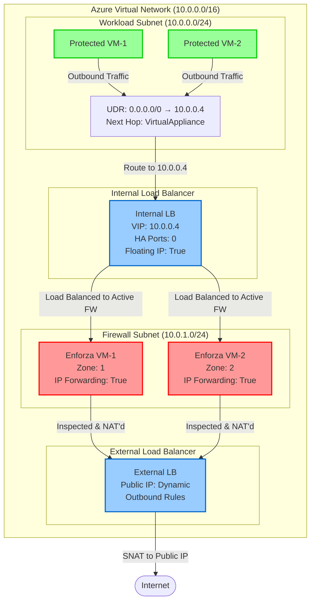

---

title: HA internet egress using enforza.io
authors: simonpainter
tags:
  - cloud
  - security
  - networks
  - enforza
  - high-availability
date: 2025-08-12

---

I have been playing around with [enforza.io](https://enforza.io) for a while and it's a great solution for low cost internet egress across AWS and Azure. The platform give an easy to manage low cost NVA which can be scaled out to cloud spokes to give consistent egress policy. As HA (High Availability) is crucial for any production environment, I wanted to investigate how easy it was to combine more than one enforza instance to achieve a highly available egress solution.
<!-- truncate -->
### Network Overview



### Step 1: Network Foundation - Virtual Network and Subnets

Building the network foundation starts with proper subnet design. I've created three subnets: the firewall subnet for my Enforza instances, the workload subnet for the VMs I want to protect, and a management subnet for admin access. The important setting here is default_outbound_access_enabled = false on the workload subnet. This creates a proper private subnet where VMs have no implicit internet connectivity; this mirrors the upcoming default behaviour for Azure.

```hcl
resource "azurerm_virtual_network" "enforza_vnet" {
  name                = "lab-simon-enforza-vnet"
  location            = azurerm_resource_group.main.location
  resource_group_name = azurerm_resource_group.main.name
  address_space       = ["10.0.0.0/16", "10.1.0.0/16"]
}

# Firewall subnet - where NVAs live
resource "azurerm_subnet" "firewall" {
  name                 = "Firewall"
  resource_group_name  = azurerm_resource_group.main.name
  virtual_network_name = azurerm_virtual_network.enforza_vnet.name
  address_prefixes     = ["10.0.1.0/24"]
}

# Workload subnet - protected resources
resource "azurerm_subnet" "workload" {
  name                 = "Workload"
  resource_group_name  = azurerm_resource_group.main.name
  virtual_network_name = azurerm_virtual_network.enforza_vnet.name
  address_prefixes     = ["10.0.0.0/24"]
  default_outbound_access_enabled = false
}

```

#### Step 1 Key Points

- Separate subnets for firewall, workload, and management. I have removed the jumpbox subnet for simplicity as you may choose to use bastion or have local routing to on-premises.
  - Firewall subnet houses the NVA instances
  - Workload subnet contains protected resources which will have egress to the internet. I used [private subnet](azure-private-subnet.md) to ensure that the VMs do not have implicit internet egress by setting default_outbound_access_enabled to false.

### Step 2: User Defined Routes (UDR) - Critical for Traffic Flow

The User Defined Route controls how traffic flows out of the workload subnet. I'm using a default route (0.0.0.0/0) that redirects all outbound traffic to the internal load balancer. The key is referencing the load balancer's IP dynamically using azurerm_lb.internal_lb.frontend_ip_configuration[0].private_ip_address rather than hardcoding an IP address. This prevents mismatches when Azure assigns different IPs than expected. The critical rule is only applying this route to the workload subnet - never to the firewall subnet itself, as that creates a routing loop.

```hcl
resource "azurerm_route_table" "enforza_route" {
  name                = "lab-simon-enforza-route"
  location            = azurerm_resource_group.main.location
  resource_group_name = azurerm_resource_group.main.name

  route {
    name                   = "default"
    address_prefix         = "0.0.0.0/0"
    next_hop_type          = "VirtualAppliance"
    next_hop_in_ip_address = azurerm_lb.internal_lb.frontend_ip_configuration[0].private_ip_address
  }
  
  depends_on = [azurerm_lb.internal_lb]
}

# Associate UDR with workload subnet
resource "azurerm_subnet_route_table_association" "workload_route_association" {
  subnet_id      = azurerm_subnet.workload.id
  route_table_id = azurerm_route_table.enforza_route.id
}
```

#### Step 2 Key Points

- Next Hop IP: This is the Internal Load Balancer VIP - rather than trying to guess what it will be I have just used the output of `azurerm_lb.internal_lb.frontend_ip_configuration[0].private_ip_address`.
- Address Prefix: 0.0.0.0/0 routes ALL traffic through the firewall. You may wish to add more specific routes to a path to on-premise networks.
- Next Hop Type: VirtualAppliance tells Azure this is an NVA
- Association: Only apply to workload subnet, NOT firewall subnet as it will result in a routing loop.

### Step 3: Internal Load Balancer - The Heart of HA

The internal load balancer distributes traffic across multiple firewall instances and handles failover. I'm using HA Ports configuration (protocol = "All", ports = 0) which forwards all traffic types without needing individual port rules. The enable_floating_ip = true setting is essential because it preserves original destination IP addresses that the Enforza firewalls need for proper policy decisions. Session persistence with SourceIPProtocol ensures related traffic from the same source reaches the same firewall instance. The health probe monitors SSH on port 22, but you'll need to configure Enforza to allow Azure's health check IP ranges.

```hcl
resource "azurerm_lb" "internal_lb" {
  name                = "lab-simon-internal-lb"
  location            = azurerm_resource_group.main.location
  resource_group_name = azurerm_resource_group.main.name
  sku                 = "Standard"  # Required for HA Ports

  frontend_ip_configuration {
    name                          = "lab-simon-internal-lb-cgf"
    subnet_id                     = azurerm_subnet.workload.id
    private_ip_address_allocation = "Dynamic"
    zones                         = ["1", "2", "3"]  # Zone redundant
  }
}

resource "azurerm_lb_backend_address_pool" "internal_lb_pool" {
  loadbalancer_id = azurerm_lb.internal_lb.id
  name            = "lab-simon-internal-lb-pool"
}

# Health probe - TCP 22 is common for Linux NVAs
resource "azurerm_lb_probe" "internal_lb_probe" {
  loadbalancer_id     = azurerm_lb.internal_lb.id
  name                = "lab-simon-enforza-healthcheck"
  protocol            = "Tcp"
  port                = 22
  interval_in_seconds = 5
  number_of_probes    = 1
}

# HA Ports rule - forwards ALL traffic
resource "azurerm_lb_rule" "internal_lb_rule" {
  loadbalancer_id                = azurerm_lb.internal_lb.id
  name                           = "lab-simon-enforza-lb-rules-out"
  protocol                       = "All"          # ALL protocols
  frontend_port                  = 0              # ALL ports
  backend_port                   = 0              # ALL ports
  frontend_ip_configuration_name = "lab-simon-internal-lb-cgf"
  backend_address_pool_ids       = [azurerm_lb_backend_address_pool.internal_lb_pool.id]
  probe_id                       = azurerm_lb_probe.internal_lb_probe.id
  enable_floating_ip             = true           # Critical for NVAs
  load_distribution              = "SourceIPProtocol"  # Session persistence
  disable_outbound_snat          = true           # Let NVA handle NAT
  enable_tcp_reset               = false
}
```

#### Step 3 Key Points

- HA Ports: protocol = "All", frontend_port = 0, backend_port = 0
- Floating IP: enable_floating_ip = true - Essential for NVAs to see original destination IPs
- Load Distribution: SourceIPProtocol maintains session affinity
- SNAT Disabled: disable_outbound_snat = true - Let the firewall handle NAT
- Health Probe: Usually TCP 22 (SSH) for Linux-based firewalls

In the enforza dashboard you will need to create a rule to allow management access from the Azure Magic IP so that the healthcheck probe can work.

### Step 4: External Load Balancer - Outbound Internet Access

The external load balancer provides SNAT functionality for outbound internet access. It's not doing inbound load balancing - just giving the firewalls a way to reach internet destinations on behalf of workload VMs. I've allocated 5000 SNAT ports per firewall instance, which works well for lab environments. The Standard SKU provides zone redundancy, so if one availability zone fails, the remaining firewall instances continue handling traffic.
You could just add a PIP to the firewall instances however that would mean egress traffic would originate from different IPs depending on what instance is used.

```hcl
resource "azurerm_public_ip" "public_lb_ip" {
  name                = "lab-enforza-public-lb-ipcfg"
  location            = azurerm_resource_group.main.location
  resource_group_name = azurerm_resource_group.main.name
  allocation_method   = "Static"
  sku                 = "Standard"
  zones               = ["1", "2", "3"]
}

resource "azurerm_lb" "public_lb" {
  name                = "lab-simon-public-lb"
  location            = azurerm_resource_group.main.location
  resource_group_name = azurerm_resource_group.main.name
  sku                 = "Standard"

  frontend_ip_configuration {
    name                 = "lab-enforza-public-lb-ipcfg"
    public_ip_address_id = azurerm_public_ip.public_lb_ip.id
  }
}

resource "azurerm_lb_backend_address_pool" "public_lb_pool" {
  loadbalancer_id = azurerm_lb.public_lb.id
  name            = "lab-enforza-public-lb-pool"
}

# Outbound rule for internet access
resource "azurerm_lb_outbound_rule" "public_lb_outbound" {
  loadbalancer_id          = azurerm_lb.public_lb.id
  name                     = "lab-simon-public-lb-rule-out"
  protocol                 = "All"
  backend_address_pool_id  = azurerm_lb_backend_address_pool.public_lb_pool.id
  allocated_outbound_ports = 5000                    # SNAT ports per instance
  enable_tcp_reset         = true
  idle_timeout_in_minutes  = 4

  frontend_ip_configuration {
    name = "lab-enforza-public-lb-ipcfg"
  }
}
```

#### Step 4 Key Points

External LB Purpose:

- Provides outbound internet connectivity from the firewall VMs
- SNAT for outbound connections
- Not used for inbound traffic in this design
- Allocated Outbound Ports: Tune based on expected connections

### Step 5: Network Security Groups (NSGs) - Firewall Permissive Rules

NSGs on firewall interfaces need to be permissive because the Enforza software handles all security decisions. Restrictive NSG rules will block legitimate traffic before it reaches the firewall for inspection. I allowed SSH explicitly for management access and then permit all other traffic. This approach works because traffic only reaches these interfaces through deliberate routing via the UDR, and the actual security filtering happens inside the Enforza firewall software.

```hcl
# Firewall NSGs - Very permissive since firewall handles security
resource "azurerm_network_security_group" "vm_1_nsg" {
  name                = "lab-simon-enforza-vm-1-nsg"
  location            = azurerm_resource_group.main.location
  resource_group_name = azurerm_resource_group.main.name

  # SSH for management
  security_rule {
    name                       = "SSH"
    priority                   = 300
    direction                  = "Inbound"
    access                     = "Allow"
    protocol                   = "Tcp"
    source_port_range          = "*"
    destination_port_range     = "22"
    source_address_prefix      = "*"
    destination_address_prefix = "*"
  }

  # Allow ALL traffic - firewall will filter
  security_rule {
    name                       = "AllowAnyCustomAnyInbound"
    priority                   = 310
    direction                  = "Inbound"
    access                     = "Allow"
    protocol                   = "*"
    source_port_range          = "*"
    destination_port_range     = "*"
    source_address_prefix      = "*"
    destination_address_prefix = "*"
  }
}
```

#### Step 5 Key Points

- Permissive Rules: NSGs should be wide open for firewall NICs
- Security at NVA: Let the firewall appliance handle security policies
- Management Access: Ensure SSH access for firewall management.

⚠️ NSG Gotcha: Restrictive NSGs on firewall NICs will break traffic flow!

### Step 6: Network Interfaces for NVAs

The network interface configuration includes several critical settings. enable_ip_forwarding = true is mandatory - without it, Azure drops traffic that isn't destined for the interface's specific IP address. I also enable accelerated networking for better performance but in a lab this isn't really necessary. Each interface gets associated with both load balancers: the internal LB for receiving traffic from workloads, and the external LB for outbound internet access.

```hcl
resource "azurerm_network_interface" "vm_1_nic" {
  name                          = "lab-simon-enforza-vm-1-nic"
  location                      = azurerm_resource_group.main.location
  resource_group_name           = azurerm_resource_group.main.name
  enable_accelerated_networking = true              # Performance boost
  enable_ip_forwarding          = true              # CRITICAL for NVAs!

  ip_configuration {
    name                          = "vm-1-ipconfig"
    subnet_id                     = azurerm_subnet.firewall.id
    private_ip_address_allocation = "Dynamic"
  }

  tags = {
    fastpathenabled = "True"  # Azure accelerated networking
  }
}

# Associate with both load balancers
resource "azurerm_network_interface_backend_address_pool_association" "vm_1_internal_lb" {
  network_interface_id    = azurerm_network_interface.vm_1_nic.id
  ip_configuration_name   = "vm-1-ipconfig"
  backend_address_pool_id = azurerm_lb_backend_address_pool.internal_lb_pool.id
}

resource "azurerm_network_interface_backend_address_pool_association" "vm_1_public_lb" {
  network_interface_id    = azurerm_network_interface.vm_1_nic.id
  ip_configuration_name   = "vm-1-ipconfig"
  backend_address_pool_id = azurerm_lb_backend_address_pool.public_lb_pool.id
}
```

#### Step 6 Key Points

- enable_ip_forwarding = true: MANDATORY for NVAs to route traffic
- enable_accelerated_networking = true: Performance improvement
- Dual LB Association: Connect to both internal and external load balancers

### Step 7: Virtual Machine Configuration

For the VMs, I'm using Standard_D2s_v3 instances with 2 vCPUs and 8GB RAM, which handles typical lab traffic loads. I deploy the VMs across different availability zones for redundancy. The 30GB disk size is sufficient for the OS and basic logging needs. The installation of the Enforza software is done via a bootstrap script available from the enforza dashboard.

```hcl
resource "azurerm_linux_virtual_machine" "enforza_vm_1" {
  name                = "lab-simon-enforza-vm-1"
  location            = azurerm_resource_group.main.location
  resource_group_name = azurerm_resource_group.main.name
  size                = "Standard_D2s_v3"          # Minimum recommended
  admin_username      = var.admin_username
  zone                = "1"                        # Spread across zones

  disable_password_authentication = true

  network_interface_ids = [
    azurerm_network_interface.vm_1_nic.id,
  ]

  admin_ssh_key {
    username   = var.admin_username
    public_key = var.ssh_public_key
  }

  os_disk {
    caching              = "ReadWrite"
    storage_account_type = "Premium_LRS"          # Performance
    disk_size_gb         = 30
  }

  # Use appropriate Enforza marketplace image
  source_image_reference {
    publisher = "enforzanetworks"
    offer     = "enforza-cloud-firewall"
    sku       = "byol"                           # Or PAYG
    version   = "latest"
  }

  boot_diagnostics {
    storage_account_uri = null
  }
}
```

#### Step 7 Key Points

- Availability Zones: Deploy VMs in different zones for HA
- VM Size: Minimum Standard_D2s_v3, scale based on throughput needs
- Premium Storage: For better IOPS performance
- Marketplace Image: Use official Barracuda CloudGen Firewall image

## Note on Bootstrapping Enforza

I have previously tested bootstrapping the enforza software using a custom script but didn't include it in this lab as I need to make sure there is sufficient delay for the public loadbalancer to become fully operational and provide internet egress before the VM startup script runs and attempts to access external resources.

```hcl

  custom_data = base64encode(<<-EOF
              #!/bin/bash
              apt-get update
              apt-get upgrade -y
              curl -L https://efz.io/install | sudo bash -s -- --companyId=${var.enforza_company_id} > /var/log/enforza_bootstrap.log
              EOF
  )

```
