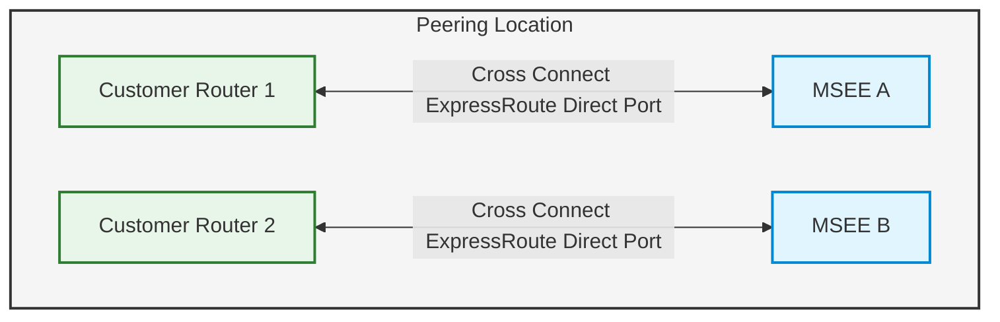
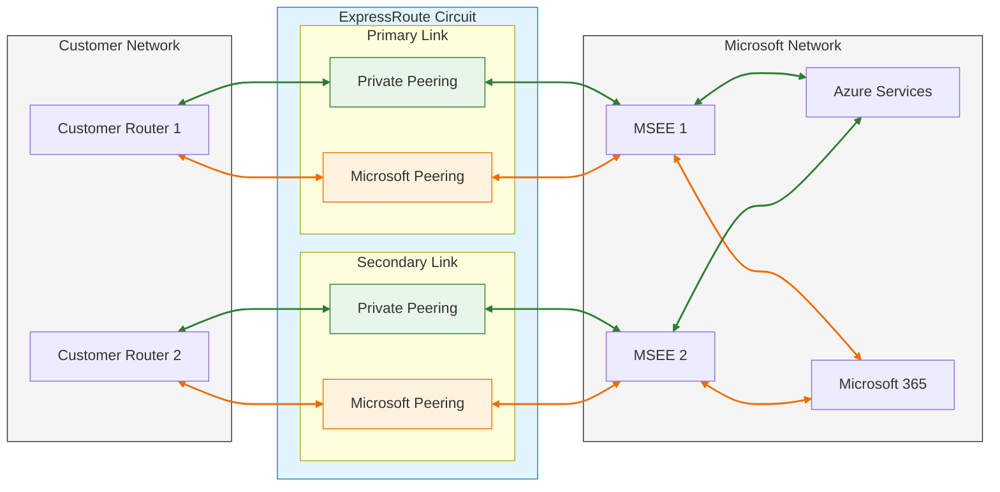
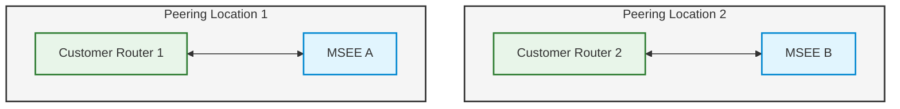
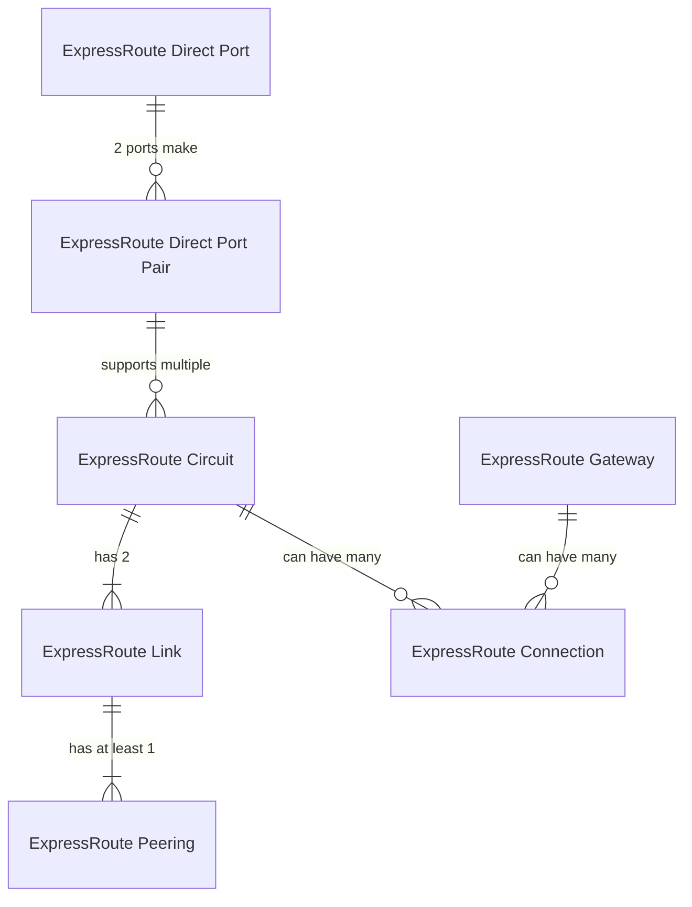

---

title: ExpressRoute construct naming
authors: 
  - simonpainter
  - zainkhan
tags:
  - azure
  - expressroute
  - bgp
  - ipv6
date: 2025-01-29

---

## Make it make sense

I will always be a network engineer, and that means some words have very specific meanings that have taken root in my soul. The terminology within ExpressRoute has bothered me for ages, and when speaking to a few people, I found that I'm not the only one who finds it unintuitive. To me, a circuit is a single link, but to Microsoft, a circuit is the pair of links and the associated peerings! Two thumbs up to that, Microsoft, or rather in your own language 'one ExpressRoute thumb'.
<!-- truncate -->
Here's a rundown of what's what, starting with the wires.

### ExpressRoute Direct (ERD) port pair

This is a pair of physical ports in a peering location in the Microsoft Enterprise Edge (MSEE). They enable the physical fibre cross connects at layer 1 to the customer router. Before ERD was available as a product, these would typically exist only as cross connects to service providers who offered ExpressRoute connectivity services. Now they're offered directly to customers who have the requirement and the necessary supporting infrastructure.

Microsoft documents refer to these as ExpressRoute Direct *resources* to either add or remove confusion with [ExpressRoute Direct Circuits](#expressroute-direct-circuit).



> ExpressRoute Direct resources are provided as a pair of ports in separate MSEE devices to ensure that maintenance outages or
> failures on a single MSEE don't cause loss of service. It's not possible to buy them with a single link.

ExpressRoute Directs are paired inside a single peering location except when they're used in [ExpressRoute Metro](#expressroute-metro). In that case, the separate [ExpressRoute Direct Ports](#expressroute-direct-port) are supplied in two separate peering locations but still function as a pair.

#### Vlan tagging

ExpressRoute Direct supports both QinQ and Dot1Q VLAN tagging.
Here's the documentation:

```text
QinQ VLAN Tagging allows for isolated routing domains on a per 
ExpressRoute circuit basis. Azure dynamically gives an S-Tag at 
circuit creation that can't be changed. Each peering on the circuit 
(Private and Microsoft) uses a unique C-Tag as the VLAN. The C-Tag 
isn't required to be unique across circuits on the ExpressRoute 
Direct ports.

Dot1Q VLAN Tagging allows for a single tagged VLAN on a per 
ExpressRoute Direct port pair basis. A C-Tag used on a peering must 
be unique across all circuits and peerings on the ExpressRoute Direct 
port pair.
```

To simplify the choice: with Dot1Q, you have to maintain unique VLAN tags for all [peerings](#expressroute-peering) in all [circuits](#expressroute-circuit) using an [ExpressRoute Direct](#expressroute-direct-erd-port-pair) resource. Alternatively, with 802.1QinQ, a separate outer tag is allocated for each [ExpressRoute Circuit](#expressroute-circuit) over the ExpressRoute Direct. This means you only need to have the VLAN tags for each [peering](#expressroute-peering) unique within that [circuit](#expressroute-circuit).

### ExpressRoute Direct Port

This is nominally a single port on the MSEE or a single fibre pair cross connect to that port. You can't buy these separately - they're supplied as pairs in the same peering location, or in a metro pair in two separate locations for [ExpressRoute Metro](#expressroute-metro).

### ExpressRoute Direct Circuit

This is exactly the same as an [ExpressRoute Circuit](#expressroute-circuit). However, instead of being provided over a telco partner's infrastructure, it's provisioned over an [ExpressRoute Direct](#expressroute-direct-erd-port-pair) resource. A single [ExpressRoute Direct port pair](#expressroute-direct-erd-port-pair) resource can have multiple ExpressRoute Direct Circuits associated with it.

### ExpressRoute Circuit

These are the logical constructs which encompass two [ExpressRoute Links](#expressroute-link). A circuit can be associated with more than one [ExpressRoute Connection](#expressroute-connection) to an [ExpressRoute Gateway](#expressroute-gateway).

### ExpressRoute Link

Each [ExpressRoute Circuit](#expressroute-circuit) is made up of two links. These are the logical connections between customer (or telco) managed equipment and the MSEE.

### ExpressRoute Peering

Each [ExpressRoute Circuit](#expressroute-circuit) consists of a pair of [links](#expressroute-link), and each of these can have distinct peerings. A peering is required for each link, and a single circuit can support both [Azure private peerings](#peering-type-azure-private-peering) and [Microsoft peerings](#peering-type-microsoft-peering).



#### Peering type: Azure private peering

Azure compute services, such as virtual machines (IaaS) and cloud services (PaaS), deployed within a virtual network can be connected through the private peering domain. This domain is considered a trusted extension of your core network into Microsoft Azure.

#### Peering type: Microsoft peering

Connectivity to Microsoft online services (Microsoft 365, Azure PaaS services, and Microsoft PSTN services) occurs through Microsoft peering. This peering enables bi-directional connectivity between your WAN and Microsoft public cloud services without using the Internet.

#### Required Subnet Configuration

- Two subnets outside of any VNet address space
- One subnet for primary link, one for secondary link
- Customer uses first usable IP, Microsoft uses second usable IP
- Subnet size options:
  - IPv4: Two /30 subnets
  - IPv6: Two /126 subnets
  - Dual-stack: Two /30 and two /126 subnets
- Public addressing or RFC1918 can be used for [Private peering](#peering-type-azure-private-peering)
- Public addressing must be used for [Microsoft peering](#peering-type-microsoft-peering)

#### VLAN Configuration

- Valid VLAN ID required - unique within [circuit](#expressroute-circuit) or unique across [ExpressRoute Direct](#expressroute-direct-erd-port-pair) resource depending on if [dot1Q or dot1QinQ](#vlan-tagging) used on underlying [ExpressRoute Direct](#expressroute-direct-erd-port-pair) resource
- Same VLAN ID used for both primary and secondary [ExpressRoute Link](#expressroute-link)

#### BGP Configuration for Private Azure Peerings

- AS number (2-byte or 4-byte supported)
- Private AS numbers allowed except 65515-65520
- Optional MD5 hash for session security

#### BGP Configuration for Microsoft Peerings

- AS number (2-byte or 4-byte supported)
- Private AS numbers allowed except 65515-65520
- Public AS numbers allowed with proof of ownership
- Optional MD5 hash for session security

### ExpressRoute Connection

A Connection is the resource that links an [ExpressRoute Circuit](#expressroute-circuit) at the MSEE to an [ExpressRoute Gateway](#expressroute-gateway). You can have more than one connection on a single [ExpressRoute Circuit](#expressroute-circuit). A standard Azure ExpressRoute circuit can typically support up to 10 connections to virtual networks, all within the same geopolitical region; however, this limit is the default and can be raised.

### ExpressRoute Gateway

An ExpressRoute Gateway is a virtual network gateway that enables private connectivity between your on-premises network and Azure through [ExpressRoute Connections](#expressroute-connection).

Key points:

- Acts as a bridge between your virtual network and on-premises network
- Handles routing between these networks
- Supports multiple circuits for redundancy
- Must be deployed in a dedicated gateway subnet
- Scales based on selected SKU
- An [ExpressRoute Gateway](#expressroute-gateway) can connect to more than one [ExpressRoute Connection](#expressroute-connection).

#### Available Gateway SKUs and capabilities

| Gateway SKU  | FastPath | Max Connections |
|------------|----------|-----------------|
| Standard SKU/ERGw1Az  | No | 4 |
| High Perf SKU/ERGw2Az  | No | 8 |
| Ultra Performance SKU/ErGw3Az  | Yes | 16 |
| ErGwScale (Preview)  | Yes* | 4-16** |

> *FastPath requires minimum 10 scale units
> ** Up to 4 connections with 1 scale unit (2Gbps), up to 8 with at least 2 scale units (4Gbps) and up to 16 connections with
> at least 10 scale units.

### ExpressRoute Metro

ExpressRoute Metro is a variation of an ExpressRoute Circuit where the separate [ExpressRoute Links](#expressroute-link) are provisioned in different physical peering locations within a metro area. This gives additional geographic redundancy for those who don't require two separate resilient [ExpressRoute Circuits](#expressroute-circuit) in two separate locations.



> ExpressRoute Metro can be selected when ordering an [ExpressRoute Direct](#expressroute-direct-erd-port-pair), and the metro pair
> appears like any single peering location on the list of available locations.

### Summary



I hope this helps clear up some of the confusion around ExpressRoute terminology. It took me a while to wrap my head around it, especially since I'm used to more traditional networking terms. If you're working with Azure networking, print this out or bookmark it - you'll probably need to refer back to it a few times until the naming conventions start to feel natural!