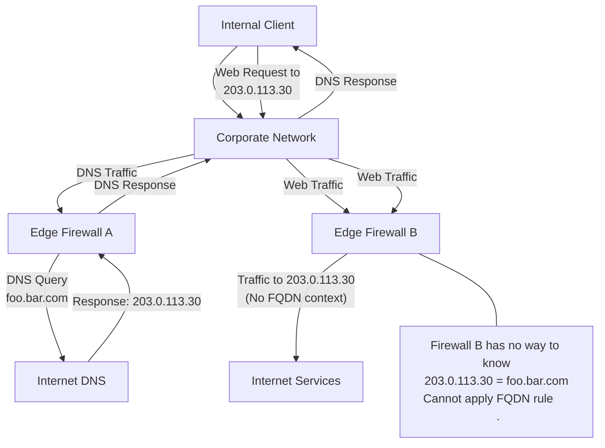

---

title: "More on FQDN Filtering"
authors: simonpainter
tags:
  - dns
  - security
  - networks
  - educational
date: 2025-03-24

---

I've already [written a bit about various firewalls](fqdn-deep-dive.md) and their performance with FQDN filtering. I've also [made the case](egress-security.md) for a 'less is more' approach to egress security where it makes sense. But the topic of FQDN filtering keeps coming up, so I thought I'd share a few more thoughts on it.
<!-- truncate -->

## Why FQDN Filtering Matters

Let's talk about why FQDN (Fully Qualified Domain Name) filtering matters today.

The internet used to be simpler. Most services had stable IP addresses that didn't change much. Network admins could create rules based on these IPs and feel confident they'd work for a long time. But things have changed.

Now it's hard to filter based just on IP addresses. Cloud services have changed everything. Content now gets spread across global networks. Websites use servers close to your location. Traffic gets routed based on where you are. Resources scale up and down as needed, changing IP addresses along the way.

All this means websites don't have just one IP address anymore. Take [Cloudflare's IP ranges](https://www.cloudflare.com/en-gb/ips/) - they're huge and they change. These ranges host thousands of different websites. If you allow traffic to all Cloudflare IPs, you're basically opening access to a massive chunk of the internet.

Here's what happens when I look up my own website:

```text
simon@MacBook-Pro ~ % dig www.simonpainter.com

; <<>> DiG 9.10.6 <<>> www.simonpainter.com
;; global options: +cmd
;; Got answer:
;; ->>HEADER<<- opcode: QUERY, status: NOERROR, id: 25875
;; flags: qr rd ra; QUERY: 1, ANSWER: 2, AUTHORITY: 0, ADDITIONAL: 1

;; OPT PSEUDOSECTION:
; EDNS: version: 0, flags:; udp: 512
;; QUESTION SECTION:
;www.simonpainter.com.    IN    A

;; ANSWER SECTION:
www.simonpainter.com.    300    IN    A    172.67.208.85
www.simonpainter.com.    300    IN    A    104.21.53.33

;; Query time: 28 msec
;; SERVER: 192.168.25.1#53(192.168.25.1)
;; WHEN: Mon Mar 24 12:55:08 GMT 2025
;; MSG SIZE  rcvd: 81

simon@MacBook-Pro ~ % 
```

See how my site returns two different IP addresses? If you checked again later from somewhere else, you might get completely different IPs. This makes traditional filtering really tough.

Let's look at how firewalls can handle this challenge.

## The Five Tuples: Old School Filtering That Still Works

Even though we need FQDN filtering, I think it's worth talking about the traditional approach first - the five tuples.

| Component | Header | Description | Example |
|:----------|:-------|:------------|:--------|
| **Source IP Address** | IP Header | Where the traffic comes from | 192.168.1.100 |
| **Destination IP Address** | IP Header | Where the traffic goes to | 203.0.113.30 |
| **Protocol** | IP Header | TCP or UDP | TCP (6) |
| **Source Port** | TCP/UDP Header | The sending application's port | 49152 |
| **Destination Port** | TCP/UDP Header | The receiving application's port | 443 |

A tuple is just a fancy word for a group of things in a specific order. Five-tuple filtering means checking these five elements for each packet.

This approach is still great for many reasons. It's super fast - firewalls can check these rules in microseconds. Many firewalls have special hardware just for this. The rules are predictable and don't depend on outside systems. They work for any kind of traffic, not just web traffic.

For services with stable IPs, like many internal apps, five-tuple rules are still the way to go. They're simpler and faster. But for modern cloud services, we need something else.

## DNS-based FQDN Filtering: A Good Idea With Problems

Many firewalls let you create rules using domain names instead of IP addresses. Here's how it works:

You set up a rule allowing traffic to "app.company.com" instead of specific IPs. The firewall regularly looks up this domain and updates its internal rules with whatever IPs it finds. Traffic to those IPs gets allowed.

It sounds great, but there's a big issue - making sure the firewall sees the same IPs as your users do. When a user looks up "app.company.com", they might get different IPs than what the firewall found.

This happens for many reasons:
- Some services rotate through IPs for load balancing
- Some give different answers based on where you are
- Some use special routing that can send you to different servers

If the firewall and user get different answers, connections break even though you have a valid rule.

Some vendors try to fix this with a DNS proxy. All DNS queries go through the firewall, so it sees exactly what users see. This works well in simple networks.

But in big companies, it often falls apart. Large organizations have complex DNS setups. They might have multiple paths to the internet. Different parts of the network might use different DNS servers. Global companies might have internet access in several regions.

Here's a common situation where it fails:



In this example, DNS goes through one firewall but web traffic goes through another. The second firewall has no idea what domain name the IP belongs to, so it can't apply FQDN rules correctly.

## Looking Deeper: Application-Aware Filtering

Another approach is to look inside the traffic itself to find domain names. Instead of just checking packet headers, these firewalls inspect the actual content of the connection.

For regular HTTP traffic, it's pretty straightforward. Here's what an HTTP request looks like:

```text
Hypertext Transfer Protocol
    GET /index.html HTTP/1.1\r\n
    Host: www.example.com\r\n
    User-Agent: Mozilla/5.0 (Windows NT 10.0; Win64; x64) AppleWebKit/537.36 (KHTML, like Gecko) Chrome/91.0.4472.124 Safari/537.36\r\n
    Accept: text/html,application/xhtml+xml,application/xml;q=0.9,image/webp,*/*;q=0.8\r\n
    Accept-Language: en-US,en;q=0.5\r\n
    Accept-Encoding: gzip, deflate\r\n
    Connection: keep-alive\r\n
    Referer: https://www.google.com/\r\n
    Upgrade-Insecure-Requests: 1\r\n
    DNT: 1\r\n
    Cache-Control: max-age=0\r\n
    \r\n
    [Full request URI: http://www.example.com/index.html]
```

The firewall looks at the `Host` header to see which domain the user wants. It checks this against its rules and decides whether to allow the connection.

This approach works well with dynamic IPs and load balancing. The domain name comes straight from the user's request, not from DNS lookups. But it comes with costs:
- Examining traffic content takes a lot more processing power than simple packet filtering
- The firewall needs more memory to track connections
- There's added delay while the firewall reads enough data
- As traffic grows, you need more powerful hardware

Also, this only works for protocols that include the domain name in plain text. Many don't.

### The HTTPS Problem

Most web traffic today uses HTTPS, which encrypts everything including the Host header. The firewall can see a connection to port 443, but can't see which website you're trying to reach.

There are two main ways to handle this:

### Option 1: Decrypting the Traffic

One approach is to have the firewall decrypt and inspect all HTTPS traffic. The firewall sits in the middle, creating separate encrypted connections with both the user and the website. This lets it see everything inside the encrypted tunnel.

But this has big drawbacks:
- Decryption takes huge amounts of processing power, often slowing firewalls by 60-80%
- You need to install trusted root certificates on all devices
- Many apps don't work with this approach
- There are privacy concerns
- If not done right, it can actually make security worse

For these reasons, many companies find this approach too difficult to implement widely.

### Option 2: Looking at the SNI Header

A more practical approach uses something called the SNI (Server Name Indication) header. When a device starts an HTTPS connection, it sends the website name in plain text before encryption begins. The firewall can see this without decryption.

Here's how it works:

1. Your browser starts an HTTPS connection and includes the website name
2. The firewall sees this name
3. The firewall checks it against its rules
4. If allowed, the encrypted connection continues normally

This approach doesn't need special certificates. It's much faster than full decryption. It works with most modern browsers and websites. And it keeps the connection secure.

But it has limits too:
- A new standard called Encrypted Client Hello will eventually hide this information
- SNI only shows the website name, not the specific pages you visit
- It only appears when a connection first starts
- Some applications don't use it correctly

Despite these limits, SNI inspection is often the most practical choice for HTTPS filtering.

## What Should You Do?

So what's the best approach for your network? It depends on your situation.

For smaller, simpler networks with a single internet connection, using your firewall's DNS proxy with FQDN rules works well. Add SNI inspection for HTTPS. You might want full decryption just for high-risk sites.

For large companies with complex networks, mix your approaches:
- Use IP-based rules where possible
- Consider a dedicated web proxy instead of doing everything at the firewall
- Use SNI inspection at all internet exit points
- Only decrypt traffic for specific high-risk categories

For high-security environments, you might need to funnel all internet traffic through a central point, decrypt more traffic, and use more advanced tools to inspect application traffic.

## Finding Balance

FQDN filtering is crucial today, but it's not simple to implement well. As with most security decisions, you need to balance security, performance, and complexity.

Remember these key points:

- IP-based rules are still the most efficient when they can work
- DNS-based filtering works in simple networks but has issues in complex ones
- Application inspection gives better visibility but hurts performance
- SNI inspection offers a good middle ground for HTTPS traffic
- Full decryption gives the most control but comes with big costs

Think about your specific security needs, performance requirements, and what your team can realistically manage. The right answer involves tradeoffs among these factors.