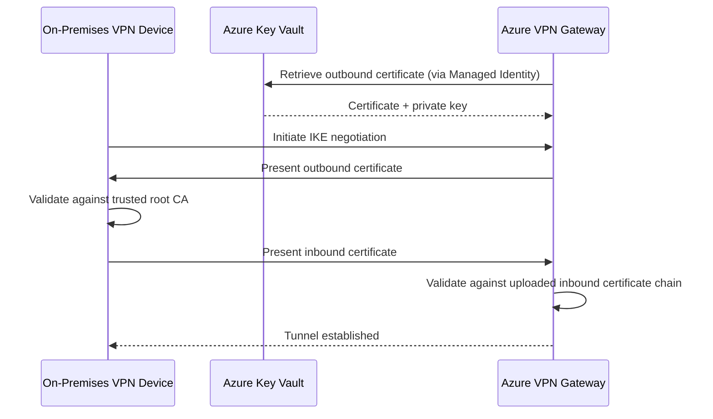

Azure VPN Gateway has supported site-to-site connections with pre-shared keys for years. They work, but a shared secret passed between two parties is only as strong as the process you use to manage it. Certificate authentication gives you something more robust, and it's now generally available.

This feature lets you authenticate your site-to-site VPN tunnels using X.509 certificates rather than a pre-shared key. Certificates live in Azure Key Vault, and the VPN gateway accesses them through a User-Assigned Managed Identity. That means no secrets sitting in a config file, no manual rotation conversations, and a much cleaner audit trail.

If you've been waiting for GA before rolling this out to production, the wait is over.

<!-- truncate -->

## What it is

Site-to-site VPN with certificate authentication replaces the pre-shared key handshake with mutual certificate validation. Both sides of the tunnel present a certificate, and each side checks that the certificate was signed by a trusted root CA.

You need two types of certificate: an outbound certificate (used by Azure to prove its identity to your on-premises device) and an inbound certificate chain (used by Azure to validate the certificate your on-premises device presents). They don't need to come from the same root CA, which gives you flexibility if you already have an on-premises PKI.

Microsoft's announcement is here: [Generally Available: site-to-site VPN connections with certificate authentication](https://azure.microsoft.com/updates?id=562705).

The full technical overview is on the [About site-to-site VPN connections with certificate authentication](https://learn.microsoft.com/en-us/azure/vpn-gateway/site-to-site-certificate-authentication-gateway-about) page on Microsoft Learn.

## How the certificate flow works

It helps to think about the two directions separately.

The outbound flow is Azure to on-premises. Your VPN gateway holds a certificate (with private key) in Azure Key Vault. When the tunnel comes up, the gateway presents that certificate to your on-premises VPN device, which checks it against its trusted root CA list.

The inbound flow is on-premises to Azure. Your on-premises device presents its certificate when negotiating the tunnel. Azure checks that certificate against the public portion of the inbound certificate chain you've uploaded to the connection configuration.



## Who should care

If you manage hybrid connectivity for an organisation with any kind of compliance requirement, this is worth your attention. Certificate-based authentication is generally easier to justify to auditors than a shared secret, and it integrates cleanly with your existing Key Vault and identity management practices.

It's also useful if you've got multiple site-to-site connections and you're tired of managing pre-shared keys. Certificate rotation through Key Vault is far more manageable than coordinating key changes across multiple tunnels and devices simultaneously.

Teams running active-active VPN gateways benefit too. Each gateway instance can use the same certificate material, which removes the awkward dance of keeping pre-shared keys in sync across active-active pairs.

## How to set it up

The setup has three main parts: a Managed Identity, certificates in Key Vault, and the connection configuration itself. Here's the Azure CLI approach, which I find cleaner than clicking through the portal.

### Create the Managed Identity and Key Vault access

```bash
# Create a user-assigned managed identity
az identity create \
  --name vpngw-managed-identity \
  --resource-group myResourceGroup \
  --location uksouth

# Get the identity's principal ID
IDENTITY_ID=$(az identity show \
  --name vpngw-managed-identity \
  --resource-group myResourceGroup \
  --query principalId -o tsv)

# Grant the identity access to Key Vault secrets and certificates
az keyvault set-policy \
  --name myKeyVault \
  --object-id $IDENTITY_ID \
  --certificate-permissions get list \
  --secret-permissions get list
```

### Generate and import the outbound certificate

The outbound certificate needs at least a 2048-bit key, a private key, server and client authentication extended key usage, and a subject name. You can use PowerShell on Windows to generate a self-signed certificate for testing:

```powershell
# Create a self-signed root CA for Azure outbound cert
$azureRootCA = New-SelfSignedCertificate `
    -Type Custom `
    -Subject 'CN=AzRootCA1' `
    -KeySpec Signature `
    -KeyExportPolicy Exportable `
    -KeyUsage CertSign `
    -KeyLength 2048 `
    -HashAlgorithm sha256 `
    -NotAfter (Get-Date).AddMonths(120) `
    -CertStoreLocation 'Cert:\CurrentUser\My' `
    -TextExtension @('2.5.29.19={critical}{text}ca=1&pathlength=4')

# Create the outbound leaf certificate signed by that root CA
$outboundCert = New-SelfSignedCertificate `
    -Type Custom `
    -Subject 'CN=AzOutboundCert' `
    -KeySpec Signature `
    -KeyExportPolicy Exportable `
    -KeyUsage DigitalSignature `
    -KeyLength 2048 `
    -HashAlgorithm sha256 `
    -NotAfter (Get-Date).AddMonths(12) `
    -CertStoreLocation 'Cert:\CurrentUser\My' `
    -Signer $azureRootCA `
    -TextExtension @('2.5.29.37={critical}{text}1.3.6.1.5.5.7.3.2,1.3.6.1.5.5.7.3.1')
```

Once you have the certificate, export it as a .pfx file and import it to Key Vault:

```bash
az keyvault certificate import \
  --vault-name myKeyVault \
  --name vpn-outbound-cert \
  --file outbound.pfx \
  --password "YourCertPassword"
```

### Enable Key Vault on the VPN gateway and configure the connection

```bash
# Get the managed identity resource ID
IDENTITY_RESOURCE_ID=$(az identity show \
  --name vpngw-managed-identity \
  --resource-group myResourceGroup \
  --query id -o tsv)

# Enable Key Vault access on the VPN gateway
az network vnet-gateway update \
  --name myVPNGateway \
  --resource-group myResourceGroup \
  --enable-bgp-route-translation false \
  --set "additionalProperties.enableKeyVaultAccess=true"

# Get the Key Vault certificate identifier
CERT_ID=$(az keyvault certificate show \
  --vault-name myKeyVault \
  --name vpn-outbound-cert \
  --query id -o tsv)

# Create the S2S connection using certificate authentication
az network vpn-connection create \
  --name myS2SConnection \
  --resource-group myResourceGroup \
  --vnet-gateway1 myVPNGateway \
  --local-gateway2 myLocalNetworkGateway \
  --location uksouth \
  --authorization-key "" \
  --vpn-site-link-conn-auth-type Certificate
```

The full step-by-step portal walkthrough is at [Configure a S2S VPN with certificate authentication: Azure portal](https://learn.microsoft.com/en-us/azure/vpn-gateway/site-to-site-certificate-authentication-gateway-portal), and there's a PowerShell version at [Configure a S2S VPN with certificate authentication: Azure PowerShell](https://learn.microsoft.com/en-us/azure/vpn-gateway/site-to-site-certificate-authentication-gateway-powershell).

## Gotchas and limits

A few things to check before you start.

This feature only works on Azure public cloud. If you're on Azure Government or Azure operated by 21Vianet (the China regions), you'll need to keep using pre-shared keys for now.

The Basic SKU VPN gateway doesn't support certificate authentication. You need VpnGw1AZ or higher. If you're still on Basic, this is a good moment to evaluate whether it's time to move up to a more capable SKU anyway, since Basic is quite limited in other ways too.

Your on-premises VPN device needs to support certificate-based IKEv2 authentication. Most modern appliances do, but check your vendor's documentation before you commit to the change. The [Azure VPN device compatibility list](https://learn.microsoft.com/en-us/azure/vpn-gateway/vpn-gateway-about-vpn-devices) is a good starting point.

Certificate management brings its own operational overhead. You'll need a process for certificate rotation before expiry. Key Vault's certificate lifecycle policies can help automate this, and it's worth configuring expiry alerts before you go live.

## Quick takeaway

Site-to-site VPN certificate authentication gives you a cleaner security posture for hybrid connectivity. No shared secrets, proper certificate chain validation in both directions, and all the Key Vault and managed identity goodness you'd use elsewhere in Azure.

It's now production-ready. If you've got S2S tunnels in environments where certificate-based auth matters, this is worth doing.
