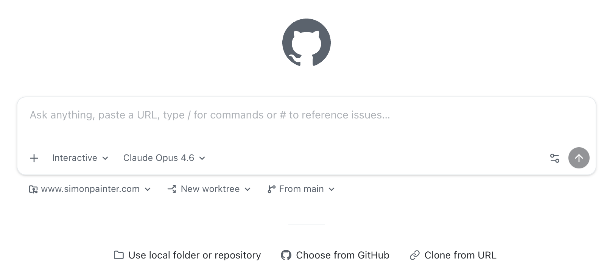
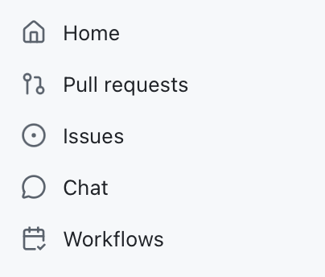
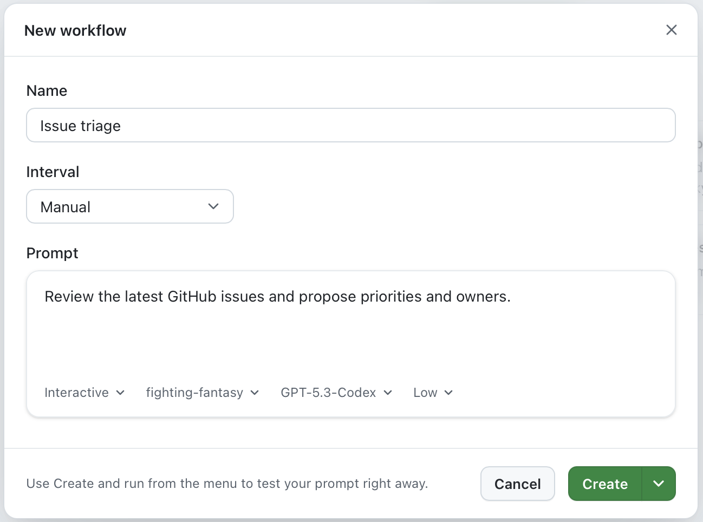

---

title: "From chatbots to workflows: why the GitHub app is the next step"
authors: simonpainter
tags:
  - ai
  - automation
  - github
  - mcp
  - opinion
  - personal
date: 2026-04-13

---

My journey with AI tools has followed a pattern I've seen before with Microsoft: someone builds something useful, then someone else makes it native to where you already work. That turns out to matter more than being technically superior.

<!-- truncate -->

## The innovation and integration pattern

Microsoft's reputation for "embrace, extend, and extinguish", acquiring or copying ideas until competitors are squeezed out, isn't entirely unfair. But Azure told a different story.

Azure didn't win because it was objectively the best cloud platform. It won, at least partly, because it fits the world that Microsoft customers already live in. Office 365 integration, Active Directory, familiar tooling. Not always the best choice on raw specs, but often the best choice for the organisation already running Windows and Exchange.

I see exactly the same pattern playing out with AI.

## Phase 1: the model race

My own journey started where most people's did: with a chat box and a model.

While a lot of people fixated on ChatGPT, I found Claude a better engine for the work I actually needed doing. The content felt more grounded, the reasoning was sharper, and it worked better for the kinds of technical writing and problem solving I throw at it. There have been times I've reached for OpenAI models, but Anthropic consistently came out ahead in my early experiments.

This was the first phase of AI apps: a model, a chat box, a prompt. Useful, but limited in scope.

## Phase 2: tools, choice, and control

Then things got interesting. The apps stopped competing purely on model quality and started competing on capabilities.

I tried Claude Code and found it good, but I replaced it with OpenCode when I wanted more control over which model I was using. That flexibility matters. The best model for writing documentation isn't necessarily the best model for refactoring code, and I don't want to be locked into one engine for everything. Copilot has this right too — you can switch models and optimise for cost and capability at the same time.

I installed the Claude desktop app mainly to get access to MCP servers. Model Context Protocol is a way for AI tools to connect to external systems: databases, APIs, your own custom tools. Once you've used it, you can't imagine going back to a model that can't reach your infrastructure and act on it. I liken it to APIs with AI friendly instructions baked in. It's not perfect, and some people are saying that LLMs with CLI access make it redundant, but we'll see about that.

Then I set up an OpenClaw instance, it was called something else back then. It runs on a Raspberry Pi, hardware I control, which means I decide what it can access and what it can do. It connects to GitHub so it can handle admin tasks and edit code in repos. It connects to WhatsApp so I can steer it from my phone. It runs cron jobs, so I can automate things intelligently in the background without babysitting a chat session.

At that point the question stopped being "which model is best?" and became something much more interesting: Where does the agent run? What can it reach? How do I steer it? How do I trust it? How do I keep control?

## Phase 3: ecosystems win

Microsoft has now blown all of this out of the water with the Copilot ecosystem.

Why build an agent that can interact with GitHub when Copilot is already native to GitHub? Why build separate pipelines for email, documents, and code when Microsoft 365 Copilot ties them together in the tools you already use? The advantage isn't raw capability, it's integration density.

Copilot CLI competes well with Claude Code and OpenCode on features. But now there is a GitHub app which goes further; not because it's technically superior on every axis, but because it's built into the place where development work actually happens.

This is the bet Microsoft is making: agentic workflow belongs inside the tools where work already happens, not bolted on from outside.

## The GitHub app: what good ideas look like when they converge

What I find interesting is how clearly the GitHub app reflects patterns that worked elsewhere, brought closer to where developers live.

The shift to a prompt-first interface feels like a direct lesson from Claude, ChatGPT, and Copilot Chat. For a lot of tasks, starting with a prompt is a better mental model than opening a file and asking questions about it. The editor is still there when you need it, but it's not the centre of gravity. I can still open things in VS Code and use Copilot there, but I don't have to make it the primary interface for every interaction. In fact I'm writing this sentence in VS Code with Copilot helping me along after clicking on the handy 'Open' button in the GitHub app.

Model choice is increasingly table stakes. OpenCode and the Copilot model picker established that appetite clearly: people want to pick the right model for the job rather than commit their entire workflow to one engine. Cross-provider support is the direction of travel.

MCP server support being easy to set up reflects exactly what Claude Desktop proved: if MCP is hard to configure, people won't use it. The next natural step is better visibility and debugging when those servers misbehave — still a rough edge across the board.

The async, multi-session model takes the best lesson from tools like OpenClaw and other agent runners. Running multiple sessions in the background, context-switching freely, and coming back to review progress is a different way of working to "single chat, single thread". You can feel the shift in how people describe using it.

Mobile control is the one that still feels like a near-future feature rather than a current one. My OpenClaw setup via WhatsApp gave me a taste of what it means to manage agents from your phone rather than just chat with them. If that lands well in the GitHub app, and it's already [public preview in the Copilot CLI](https://github.blog/changelog/2026-04-13-remote-control-cli-sessions-on-web-and-mobile-in-public-preview/), it genuinely changes when and where development work can happen.

Finally, repo-native conventions feel like the natural evolution of devcontainer and dotfiles patterns. The appetite for `/` commands and repo-defined skills is asking agents to work the way the project works, not the way the tool was designed.

But that's not all that's in there at the moment either. And I say 'at the moment' with real intent because one of the features in the list below wasn't there yesterday. The pace of iteration is impressive, and the roadmap is ambitious.

OpenClaw has cron jobs, it was a dizzying moment when I told my agent to do something at 2am every day and it just... did it. The GitHub app has workflows which are time based (or manually triggered) prompts that you can set up to handle the boring admin like triage of issues and pull requests, or to run regular checks on the codebase. It's a similar idea, but built into the tools where you already work rather than something you have to set up separately.

## What you'll notice first

The most encouraging early feedback isn't about novelty. It's about workflow.

The async, multi-session model keeps coming up. Being able to kick off several jobs, switch context, and let the agent run in the background feels like a step change. Investigation tasks and "make progress while I do something else" scenarios are where it shines.

It's a prompt-first interface that still respects the code. Quick jumps into a real editor to sanity-check and tweak the output, without making the editor the primary interface. And for well-bounded tasks, the willingness to delegate and just validate the result (autopilot for low-risk changes) is real.

The wishlist is even more telling, because it shows where this goes next. Mobile as a genuine remote control for running agents, not just a mobile chat window. Cross-provider model choice so people aren't locked in — Anthropic models running on Anthropic's own infrastructure, not just Microsoft's hosted versions. Agents that understand and follow the project's own conventions and automation rather than working around them. And project management automation: triage, prioritisation, stand-up summaries, the unglamorous work that steals time from more valuable things.

## A concrete example: building a game engine without writing a line of code

I want to give you a real example of what autopilot actually looks like in practice, because I think it lands differently than any abstract description.

Fighting Fantasy gamebooks were a big part of my childhood. If you grew up in the UK in the 1980s you probably remember them — pocket-sized paperback adventures by Steve Jackson and Ian Livingstone, first published in 1982, where you played the hero, rolled dice for combat, and managed three stats: SKILL, STAMINA, and LUCK. The books were divided into numbered sections; you'd make a choice, flip to section 247, fight a goblin, and either survive or start again.

They also translated really well to code. As a kid my first foray into BBC BASIC was converting the pages of the books into code with GOTO statements. It was a mess, but it worked. I always thought it would be fun to build a more robust engine for those adventures, but I never got around to it until last week. I decided to build a Python engine to run those adventures in the terminal. The thing is, I didn't write a single line of code. Not one. The entire engine including branching narrative, dice-based combat, luck tests, and a JSON adventure format was built entirely through the GitHub app's chat interface.

My input was my own recollections of the rules and some photos of the instruction pages from the books, uploaded directly through the chat. I described what I wanted, the agent figured out the architecture, wrote the code, and tested it. The repo is [here](https://github.com/simonpainter/fighting-fantasy) if you want to see the result.

This is an extreme example, and I'm not suggesting it's how you'd build production software. But it illustrates something important. The task was well-bounded: I had a clear spec (the game rules), a clear output format (a working Python engine), and a way to validate the result (does the game play correctly?). That's exactly the profile where autopilot earns its keep. I was the architect and the tester. The agent did the rest.

## What comes next

If you squint at the trajectory, the next phase is already pretty visible. I want voice so I can talk to my agents while I'm doing other things. I want an agent that stops being a chat box and becomes a layer that sits across your tools: tracking state, running parallel work, and handing you decisions instead of logs. In that world, you spend less time in the weeds of implementation and more time on the higher-value work: architecture, intent, constraints, and reviewing the output.

The tooling takes care of the rest. Quietly, in the background, inside the tools where you already work.
