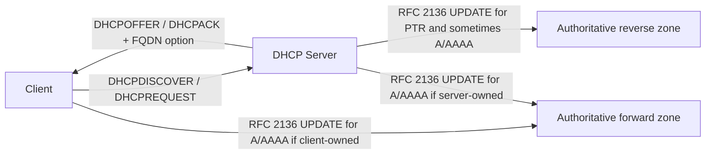

When people say "dynamic DNS", they often mean two different things. One is the home broadband pattern where a firewall tells a public DNS provider that its internet address changed. The other is the enterprise pattern where a host gets a lease from DHCP and then its name shows up in internal DNS a few seconds later. This post is about the second one.

The short version is simple: DHCP doesn't magically write to DNS. A client or a DHCP server sends a normal DNS `UPDATE` message to the authoritative DNS server, and a set of RFCs decides who is allowed to do it, what gets written, and how collisions are handled. The clever bit is not the packet. It's the ownership model around the packet. [RFC 2136](https://datatracker.ietf.org/doc/html/rfc2136) defines the DNS update opcode, [RFC 4702](https://datatracker.ietf.org/doc/html/rfc4702) and [RFC 4704](https://datatracker.ietf.org/doc/html/rfc4704) define how DHCP negotiates update responsibility, and [RFC 4701](https://datatracker.ietf.org/doc/html/rfc4701) plus [RFC 4703](https://datatracker.ietf.org/doc/html/rfc4703) define the ownership token that stops one client from trampling another.

<!-- truncate -->

## First, what problem is this solving?

In a network with static addressing, you can hand-write DNS. In a network with short-lived leases, wireless clients, VPN users, servers that rebuild often, and whole piles of [RFC 1918](https://www.rfc-editor.org/info/rfc1918) address space, that falls apart fast.

You need two things to stay true:

1. `host.example.internal` must point at the address the client has now.
2. `10.1.2.55` must reverse-resolve to the host that actually holds that lease.

If either side drifts, troubleshooting gets messy. Logs point at the wrong machine. Monitoring labels the wrong host. Kerberos, RADIUS, SIEM pipelines, and reverse-lookup-heavy tooling start telling half-truths.

## The base mechanism

The DHCP part and the DNS part are separate conversations.

1. The client gets a lease through DHCP.
2. The client and server decide who should update DNS.
3. Whoever owns the job sends a DNS `UPDATE` to the authoritative DNS server for the forward and reverse zones.

That looks like this:

The key thing to notice is that DHCP does not update "DNS" in the abstract. It updates a specific authoritative zone. If the updater talks to the wrong server, a caching resolver, or a server that is not authoritative for that zone, it won't work.

In practice, the updater often finds the right target by looking up the zone's `SOA` first and then sending the `UPDATE` toward a server that can actually commit the change. In AD-integrated DNS that feels less obvious because several domain controllers can accept updates, but the same rule applies: the update has to land on a server with write authority for that zone.

## How DHCP negotiates who updates what

For DHCPv4, the negotiation lives in **Option 81**, the Client FQDN option, defined in [RFC 4702](https://datatracker.ietf.org/doc/html/rfc4702). For DHCPv6, it is **Option 39**, defined in [RFC 4704](https://datatracker.ietf.org/doc/html/rfc4704).

Those options carry the FQDN and a few flags. The important ones are:

| Flag | Meaning |
| --- | --- |
| **S** | Server should perform the forward update |
| **O** | Server overrode the client's preference |
| **N** | No DNS updates at all |
| **E** | DHCPv4 encoding flag for canonical wire format |

In practice, three patterns matter.

### Model 1: client updates forward, server updates reverse

This is the classic split model. The client updates its `A` record, or `AAAA` in IPv6, and the DHCP server updates the `PTR` record because it knows which address it handed out. Microsoft documents this as the default Windows client behaviour when the DHCP FQDN flags are zeroed: the client asks to handle the forward record, and the DHCP server handles the reverse record in the ACK path. That's still one of the most sensible defaults because it keeps the host in control of its own name while letting DHCP own the lease-to-address mapping.  
[Microsoft dynamic update](https://learn.microsoft.com/en-us/windows-server/networking/dns/dynamic-update)

### Model 2: server updates both forward and reverse

Here the DHCP server tells the client, in effect, "leave it with me". This is common when the client is old, simple, embedded, or not trusted to do DNS correctly. Windows documents this too: when the DHCP server is configured to always update both records, it sets the FQDN option in the ACK so the client knows not to send its own forward update.  
[Microsoft dynamic update](https://learn.microsoft.com/en-us/windows-server/networking/dns/dynamic-update)

### Model 3: no updates

This is less interesting, but it exists. The `N` flag means neither side should update DNS. You still see this in locked-down environments, point-to-point segments, or networks where DHCP is used only for bare connectivity and naming is handled elsewhere.

Two smaller details are worth keeping in mind. Older clients may only send **DHCP option 12**, the Host Name option, instead of the FQDN option. In that case the DHCP server often builds the full name itself by appending a domain suffix and then registers on the client's behalf. Microsoft documentation also describes the flags as numbers in some places. A returned value of `0` is the split model, while `3` means the server is updating both records and has overridden the client's preference.

## What the DNS server actually receives

On the DNS side, this is plain old DNS with a different opcode. [RFC 2136](https://datatracker.ietf.org/doc/html/rfc2136) adds the `UPDATE` operation. The message contains four logical parts:

1. **Zone**: which zone is being updated.
2. **Prerequisite**: what must already be true, or not true, before the change is allowed.
3. **Update**: the records to add or remove.
4. **Additional data**: often where authentication material sits.

That prerequisite section is where most of the safety comes from. An updater can say "only add this record if the name does not already exist" or "only replace this record if the existing ownership marker matches me". If the prerequisite fails, the whole update fails. No half-writes.

That makes DDNS feel less like appending lines to a text file and more like a tiny compare-and-swap transaction. It also means the target zone has to be writable. On BIND that normally means update policy on the zone and permission for `named` to create its `.jnl` journal file. On Windows it means the zone must allow dynamic updates and, if it is secure-only, the caller must arrive with credentials the zone will accept.

## The record types that matter

Most of the time you are dealing with four record types.

| Record | Purpose |
| --- | --- |
| `A` | Maps a name to an IPv4 address |
| `AAAA` | Maps a name to an IPv6 address |
| `PTR` | Reverse mapping from address to name |
| `DHCID` | Ownership marker used for conflict detection |

The odd one there is `DHCID`, defined in [RFC 4701](https://datatracker.ietf.org/doc/html/rfc4701). Think of it as the claim ticket left on the name. It is derived from the client's identity and the FQDN. When a later update arrives, the updater can use that token in the prerequisite logic to prove that the name already belongs to the same client rather than to a different one.

That conflict-resolution logic is defined in [RFC 4703](https://datatracker.ietf.org/doc/html/rfc4703). If the name does not exist, the updater can create the `A` or `AAAA` record and the matching `DHCID`. If the name does exist, the updater can only replace it if the `DHCID` matches its own identity. If the `DHCID` does not match, the update should fail and the client should choose a different name or stop.

That is an important nuance: `DHCID` is not magic locking built into DNS itself. It is a cooperative pattern. It only works if every client, DHCP server, and appliance writing to that zone follows the same rules. Secure updates stop unauthorised writers getting in. `DHCID` stops authorised writers trampling each other.

For `PTR` records, life is simpler. The DHCP server usually just removes the old reverse record for the leased IP and writes the new one because only one client should hold that address at a time.

## Secure updates: where most real deployments get interesting

Unauthenticated RFC 2136 exists, but in serious environments you normally secure updates.

### TSIG

The basic standards path is [TSIG](https://datatracker.ietf.org/doc/html/rfc2845). The DHCP server and DNS server share a secret key and sign each transaction. BIND, ISC DHCP, Kea, Infoblox, and plenty of appliances support this model.

If the key is wrong, missing, or attached to the wrong zone, the DNS server usually answers with `REFUSED` or a signature-related failure. If clocks are too far apart, TSIG can also fail because the protocol includes a time window for replay protection.

### GSS-TSIG and Active Directory

Windows adds another layer. In Active Directory integrated zones, "secure only" dynamic updates use Kerberos-backed [GSS-TSIG](https://datatracker.ietf.org/doc/html/rfc3645), not just a shared secret. Microsoft's flow is roughly:

1. The client or DHCP server establishes a security context.
2. It sends the DNS `UPDATE` signed with that context.
3. The DNS server checks both the signature and the ACL on the target object in AD.

This is why Windows DDNS can feel more like directory security than plain DNS. The record is not only data. It is an object with ownership.

That ownership model creates one of the most common Windows gotchas. If one DHCP server creates a secure record, another DHCP server may not be able to update it later because it doesn't own it. Microsoft's fix is the `DnsUpdateProxy` group or, better, using dedicated credentials for DHCP-driven updates rather than letting the server machine account own everything.  
[Microsoft dynamic update](https://learn.microsoft.com/en-us/windows-server/networking/dns/dynamic-update)

There is also a weaker middle ground worth naming. Some DNS servers can accept updates based on source IP allow lists alone. That is easy to understand and easy to deploy, but it is much weaker than TSIG or GSS-TSIG because it trusts the source rather than the transaction.

## Lease expiry, cleanup, and TTL

Getting the record into DNS is only half the job. You also need a sane way to age it out.

On a clean path, the owner removes what it wrote when the lease ends. If the server owns the `PTR`, it should remove that on lease expiry or `DHCPRELEASE`. If the client owns the forward record, it should remove that too. RFC 4703 uses the same ownership checks during deletion so an old client does not remove a name that has already been re-claimed elsewhere.

The ugly bit is that clients rarely leave politely. Laptops sleep, VMs are deleted, Wi-Fi sessions vanish, and VPN users disappear. That is why stale-record cleanup matters so much. In Windows, aging and scavenging are the backstop. In ISC and Kea style deployments, correct cleanup on lease expiry is more central because there is less platform magic waiting behind the scenes.

TTL matters here too. RFC 4702 recommends keeping DDNS-driven TTLs short relative to the lease, broadly no more than a third of the lease time, so caches do not hold onto an address long after DHCP has moved it. Microsoft's defaults are also short for the same reason. Long TTLs and short leases are a bad mix.

## The main implementation patterns

The standards are one thing. Products turn them into different operational shapes.

## Windows client and Windows DHCP

Windows is the reference point many people know because the behaviour is well documented and common in enterprise networks.

By default, the Windows client sends the FQDN option, asks to manage its own forward record, then registers with DNS after the lease is acknowledged. The DHCP server handles the reverse record. If the DHCP server is configured to always update both records, it tells the client and the client stops trying to register the forward record itself.  
[Microsoft dynamic update](https://learn.microsoft.com/en-us/windows-server/networking/dns/dynamic-update)

Under the bonnet, the client usually works out where to send the update by looking up zone authority first. That is one reason DDNS failures can look odd: the problem is sometimes not the update packet at all, but the client's inability to find the right authoritative server in the first place.

There is a nasty wrinkle here that Microsoft documents in a troubleshooting note: if a client has learned in the past that the DHCP server is handling updates, and the server later stops sending Option 81, the client may continue assuming the server is still doing the work. Then nobody updates DNS. Fixing that often needs a full DORA cycle rather than a simple renew.  
[Microsoft Option 81 troubleshooting](https://learn.microsoft.com/en-us/troubleshoot/windows-server/networking/client-ddns-updates-dhcp-option-81)

## ISC DHCP and BIND

This is the old-school open-source setup. The DHCP server has zone declarations pointing at the primary DNS server, the DNS server allows updates for those zones, and both sides share a TSIG key. The `ddns-update-style interim;` mode is the important one because it uses the DHCID-based conflict model instead of older ad-hoc behaviour.  
[Semicomplete](https://www.semicomplete.com/articles/dynamic-dns-with-dhcp/)

This setup is simple when it works and maddening when it doesn't. The classic failure is not the key. It is the zone file directory permissions. BIND writes a journal file beside the zone file for dynamic changes. If `named` can't write there, updates fail and the symptom often looks like a DNS problem when it is really a filesystem problem.  
[Semicomplete](https://www.semicomplete.com/articles/dynamic-dns-with-dhcp/)

## Kea and D2

Kea takes a cleaner architectural route. The DHCP service does not speak to DNS directly in the hot lease path. Instead it emits a **NameChangeRequest** to `kea-dhcp-ddns`, usually called **D2**, and D2 performs the RFC 2136 updates. Kea's own documentation is clear on this split: lease events generate NCRs, and D2 matches them to the right forward and reverse zones before talking to authoritative DNS servers.  
[Kea ARM](https://kea.readthedocs.io/en/kea-2.2.0/arm/ddns.html)

That separation buys you a few things:

1. DHCP stays focused on leases.
2. DNS update retries and matching logic live in one place.
3. Forward and reverse zone routing becomes explicit.

Kea also implements RFC 4703 conflict resolution and supports TSIG per domain or per server. One detail worth knowing if you run dual stack is that shared IPv4 and IPv6 ownership depends on consistent client identity. Kea notes that support for the RFC 4361 style identity needed for a single `DHCID` across both families arrived later than the base feature set.  
[Kea ARM](https://kea.readthedocs.io/en/kea-2.2.0/arm/ddns.html)

## Infoblox NIOS and BloxOne DDI

Infoblox gives you more policy knobs around RFC behaviour. Their DDNS compliance guidance describes the usual choices: server updates both records, server updates only the reverse record while the client updates forward, or DDNS is disabled. They also surface **Name Protection**, which is basically the productised version of "don't let another client steal this FQDN".  
[Infoblox NIOS](https://docs.infoblox.com/space/nios85/35481649)  
[Infoblox BloxOne DDI](https://docs.infoblox.com/space/BloxOneDDI/2114552113/DHCP+DDNS+RFC+Compliance)

In shops with Active Directory, Infoblox also has to straddle both worlds: standards-based TSIG for many DNS targets and secure Windows-style integration where GSS-TSIG or delegated credentials matter.

## Firewall and appliance DHCP

Some appliances act as tiny DHCP servers and can register names too. Cisco's Secure Firewall documentation covers DHCP and DDNS on managed interfaces. That is the same basic model as any other server-driven update: the appliance owns the lease, so it can own the DNS update path as well.  
[Cisco Secure Firewall](https://www.cisco.com/c/en/us/td/docs/security/secure-firewall/management-center/device-config/730/management-center-device-config-73/interfaces-settings-dhcp-ddns.html)

Fortinet is a good reminder that the phrase **dynamic DNS** is overloaded. Their glossary content leans toward the public internet use case, where a device updates a public DNS provider when its WAN IP changes. That's useful, but it is not the same thing as enterprise DHCP-driven RFC 2136 updates against internal authoritative zones.  
[Fortinet glossary](https://www.fortinet.com/resources/cyberglossary/dynamic-dns)

## The gotchas that bite in real networks

This is the part that matters once the lab demo works.

### Stale records

The clean path assumes leases expire neatly, releases are sent, and updates are removed. Real clients crash, sleep, vanish, or leave the network without sending anything polite. Then `A`, `AAAA`, and `PTR` records hang around long after the lease is gone.

Windows DNS aging and scavenging help, but only if the timers make sense against your lease duration. If your scavenging windows and lease windows fight each other, you can either delete live records too soon or keep dead records for ages. On BIND-style deployments, a failure to update or delete may be as simple as the journal file not being writable.  
[Microsoft dynamic update](https://learn.microsoft.com/en-us/windows-server/networking/dns/dynamic-update)

### Secure ownership deadlocks

AD-integrated secure DNS is great until ownership becomes too strict. If one DHCP server creates a record and another tries to update it later, you can get stuck unless both servers use a shared credential model or `DnsUpdateProxy`. This is one of those problems that feels random until you notice it tracks failover events and server changes, not clients.  
[Microsoft dynamic update](https://learn.microsoft.com/en-us/windows-server/networking/dns/dynamic-update)

### Dual-stack identity drift

If IPv4 and IPv6 updates calculate different identities for what is really the same host, the `DHCID` logic will quite reasonably treat them as different owners. Then your `A` record might register while your `AAAA` record collides, or vice versa. This is why [RFC 4703](https://datatracker.ietf.org/doc/html/rfc4703) and [RFC 4361](https://datatracker.ietf.org/doc/html/rfc4361) matter more than they first appear to.

### Split-horizon confusion

Dynamic updates must go to the authoritative internal zone, not to a public resolver, a forwarder that cannot write, or the wrong view of a split-horizon zone. Reverse zones for private space are especially easy to get wrong because there is no useful public authority for them. Inside [RFC 1918](https://www.rfc-editor.org/info/rfc1918) space, your private DNS is the whole game.

### TTL and lease mismatch

Short DNS TTLs with long leases are usually fine. Long TTLs with short leases are trouble because caches keep serving an address long after DHCP has moved the host somewhere else. If you want fast address churn, your DNS caching policy has to accept that reality too. A good rule of thumb from RFC 4702 is to keep the TTL comfortably below the lease time rather than treating it like a static-host record.

### Replication and timing

An update can succeed and still not look successful everywhere at once. AD-integrated zones replicate through Active Directory, not old-style zone transfer. BIND writes to a journal and may propagate secondaries on a different cadence. If one resolver sees the new record and another still has the old one, you have a timing problem, not necessarily a failed update.

### VPN and remote clients

Microsoft notes that Windows clients do not attempt dynamic update over all VPN or remote-access scenarios by default. That catches people out because the host is "on the network" from the user's point of view, but from a DDNS point of view it is behaving differently.  
[Microsoft dynamic update](https://learn.microsoft.com/en-us/windows-server/networking/dns/dynamic-update)

## Why this matters more in private address space

In public DNS, reverse zones and naming usually belong to the ISP, cloud provider, or public-facing service owner. Inside the network, you own the whole mess.

That means DHCP-driven DDNS is not a nice extra. It is the mechanism that keeps private naming honest. If it breaks, nothing external fixes it for you. Your monitoring stack, your logs, your internal APIs, and your admin tools just start arguing with reality.

## The practical design choices

If I boil this down, there are four decisions that shape almost every deployment.

1. **Who owns forward updates?** Client, DHCP server, or a mix.
2. **How are updates authenticated?** None, TSIG, or GSS-TSIG.
3. **How are name conflicts handled?** DHCID or product-specific name protection.
4. **What cleans up stale state?** Lease expiry logic, scavenging, or both.

Most of the pain in DDNS comes from inconsistent answers to those four questions across different parts of the same estate.

## Final thought

DHCP-driven DNS updates look simple from the outside because the result is simple: a name appears in DNS. Under the bonnet, it is a careful handshake between lease ownership, DNS transaction semantics, authentication, and conflict control.

If you remember one thing, make it this: **the hard part of DDNS is not writing the record. It is proving who has the right to write it, and knowing when to remove it.**

## References

- [RFC 2136 - Dynamic Updates in the Domain Name System](https://datatracker.ietf.org/doc/html/rfc2136)
- [RFC 2845 - TSIG](https://datatracker.ietf.org/doc/html/rfc2845)
- [RFC 3645 - GSS-TSIG](https://datatracker.ietf.org/doc/html/rfc3645)
- [RFC 4361 - DHCPv4 client identifiers based on DUID](https://datatracker.ietf.org/doc/html/rfc4361)
- [RFC 4701 - DHCID resource record](https://datatracker.ietf.org/doc/html/rfc4701)
- [RFC 4702 - DHCPv4 Client FQDN option](https://datatracker.ietf.org/doc/html/rfc4702)
- [RFC 4703 - Resolving FQDN conflicts among DHCP clients](https://datatracker.ietf.org/doc/html/rfc4703)
- [RFC 4704 - DHCPv6 Client FQDN option](https://datatracker.ietf.org/doc/html/rfc4704)
- [RFC 1918 - Address Allocation for Private Internets](https://www.rfc-editor.org/info/rfc1918/)
- [Microsoft Learn - Dynamic update](https://learn.microsoft.com/en-us/windows-server/networking/dns/dynamic-update)
- [Microsoft Learn - Client DNS dynamic updates and DHCP Option 81](https://learn.microsoft.com/en-us/troubleshoot/windows-server/networking/client-ddns-updates-dhcp-option-81)
- [Kea Administrator Reference Manual - DHCP-DDNS](https://kea.readthedocs.io/en/kea-2.2.0/arm/ddns.html)
- [Infoblox NIOS documentation](https://docs.infoblox.com/space/nios85/35481649)
- [Infoblox BloxOne DDI DDNS RFC compliance](https://docs.infoblox.com/space/BloxOneDDI/2114552113/DHCP+DDNS+RFC+Compliance)
- [Cisco Secure Firewall - DHCP and DDNS](https://www.cisco.com/c/en/us/td/docs/security/secure-firewall/management-center/device-config/730/management-center-device-config-73/interfaces-settings-dhcp-ddns.html)
- [Dynamic DNS with DHCP - Semicomplete](https://www.semicomplete.com/articles/dynamic-dns-with-dhcp/)
- [Fortinet glossary - Dynamic DNS](https://www.fortinet.com/resources/cyberglossary/dynamic-dns)
