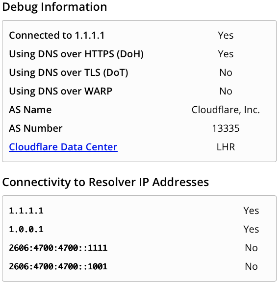

---

title: "DDR: DNS Discovery and Redirection"
authors: simonpainter
tags:
  - dns
  - security
  - networks
  - architecture
  - educational
date: 2026-03-12

---

I went down the rabbit hole of [encrypted DNS](encrypted-dns.md) a little while ago, mainly prompted by the recent [preview of DNS over HTTPS (DoH) in Windows DNS Server](https://techcommunity.microsoft.com/blog/networkingblog/secure-dns-with-doh-public-preview-for-windows-dns-server/4493935), and that led me to the wonders of [SVCB and HTTPS records in DNS](svcb-https-records.md) which have some practical applications includng DNS Discovery and Redirection (DDR).

First things first, a recap of what DDR is and the mechanism. DDR is a mechanism that allows a DNS resolver to discover and redirect to an alternative DNS resolver that supports encrypted DNS protocols like DoH or DoT. This is done through the use of SVCB (Service Binding) records in DNS, which can provide information about the capabilities of a DNS resolver and how to connect to it securely.

## Let's start with macOS

Turning on DoH and DoT is a suprisingly irritating process on macOS if you do it manually, but surprisingly easy if you use DDR. The only ways I have found to configure it directly include downloading additional networking profiles, using third party tools, or configuring it in specific applications like browsers.

Turning on DDR, and then using a DNS resolver that supports both DDR and DoH/DoT is a far easier path in macOS. To turn on DDR, run the following command in your terminal:

```bash
sudo defaults write /Library/Preferences/com.apple.networkd enable_ddr -int 1
```

That is a simple boolean value to enable DDR. Once you have done that, restart your network service by running:

```bash
sudo killall -9 mDNSResponder
```

If you aren't already using a DNS resolve that supprorts DDR, you can [change your DNS resolver to one that does](https://support.apple.com/en-gb/guide/mac-help/mh14127/mac), such as Cloudflare.

## OK, now Windows

The [approach in Windows](https://techcommunity.microsoft.com/blog/networkingblog/making-doh-discoverable-introducing-ddr/2887289) is pretty similar, but it's also considerably easier to configure DoH manually in Windows, as the UI supports it directly. To turn on DDR in Windows, you first need to enable it globally:

```powershell
netsh dns add global doh=yes ddr=yes
```

Then you enable it on the interface you want to use it on:

```powershell
netsh dns add interface name=”<interface-name>” ddr=yes ddrfallback=no
```

You still need to make sure your DNS server supports DDR, or switch to one that does.

> DDR is supported on a number of public DNS resolvers, including [Cloudflare (1.1.1.1 & 1.0.0.1)](https://www.cloudflare.com/en-gb/learning/dns/what-is-1.1.1.1/), [Google (8.8.8.8 & 8.8.4.4)](https://developers.google.com/speed/public-dns/docs/using), [Quad9 (9.9.9.9)](https://quad9.net), and [OpenDNS (208.67.222.222 & 208.67.220.220)](https://www.opendns.com/).

## Linux?

I'm not even going to bother. Linux is a bit of a mess when it comes to DNS, with different distributions and desktop environments using different DNS resolvers and configuration methods. Some may support DDR, but it's not a universal feature across all Linux distributions. If you want to use DDR on Linux, you'll need to check if your specific distribution and DNS resolver support it, and then follow the appropriate configuration steps for that resolver.

## What happens next?

If you happen to be running a packet capture while you do this you'll see an immediate request to the DNS resolver for the SVCB record for _dns.resolver.arpa, which is the special domain used for DDR.

```dns
_dns.resolver.arpa: type SVCB, class IN
```

 The DNS resolver will respond with the SVCB record that contains information about the alternative DNS resolver that supports DoH or DoT. An SVCB record has a priority value, which indicates the order of preference. Cloudflare responds with DoH as the preferred option, and DoT as the fallback whereas Quad9 responds with DoT as the preferred option, and DoH as the fallback.

Here's an example of the DNS question and responds for DDR when using Cloudflare as the DNS resolver:

```pcap
Frame 203: Packet, 389 bytes on wire (3112 bits), 389 bytes captured (3112 bits) on interface en0, id 0
Ethernet II, Src: CiscoMeraki_bd:db:33 (0c:8d:db:bd:db:33), Dst: 06:24:e8:b8:e7:eb (06:24:e8:b8:e7:eb)
Internet Protocol Version 4, Src: 1.1.1.1, Dst: 192.168.25.10
User Datagram Protocol, Src Port: 53, Dst Port: 64485
Domain Name System (response)
    Transaction ID: 0xe4ce
    Flags: 0x8180 Standard query response, No error
    Questions: 1
    Answer RRs: 2
    Authority RRs: 0
    Additional RRs: 4
    Queries
        _dns.resolver.arpa: type SVCB, class IN
            Name: _dns.resolver.arpa
            [Name Length: 18]
            [Label Count: 3]
            Type: SVCB (64) (General Purpose Service Endpoints)
            Class: IN (0x0001)
    Answers
        _dns.resolver.arpa: type SVCB, class IN
            Name: _dns.resolver.arpa
            Type: SVCB (64) (General Purpose Service Endpoints)
            Class: IN (0x0001)
            Time to live: 300 (5 minutes)
            Data length: 103
            SvcPriority: 1
            TargetName: one.one.one.one
            SvcParam: alpn=h2,h3
            SvcParam: port=443
            SvcParam: ipv4hint=1.1.1.1,1.0.0.1
            SvcParam: ipv6hint=2606:4700:4700::1111,2606:4700:4700::1001
            SvcParam: dohpath=/dns-query{?dns}
        _dns.resolver.arpa: type SVCB, class IN
            Name: _dns.resolver.arpa
            Type: SVCB (64) (General Purpose Service Endpoints)
            Class: IN (0x0001)
            Time to live: 300 (5 minutes)
            Data length: 81
            SvcPriority: 2
            TargetName: one.one.one.one
            SvcParam: alpn=dot
            SvcParam: port=853
            SvcParam: ipv4hint=1.1.1.1,1.0.0.1
            SvcParam: ipv6hint=2606:4700:4700::1111,2606:4700:4700::1001
    Additional records
        one.one.one.one: type A, class IN, addr 1.1.1.1
            Name: one.one.one.one
            Type: A (1) (Host Address)
            Class: IN (0x0001)
            Time to live: 300 (5 minutes)
            Data length: 4
            Address: 1.1.1.1
        one.one.one.one: type A, class IN, addr 1.0.0.1
            Name: one.one.one.one
            Type: A (1) (Host Address)
            Class: IN (0x0001)
            Time to live: 300 (5 minutes)
            Data length: 4
            Address: 1.0.0.1
        one.one.one.one: type AAAA, class IN, addr 2606:4700:4700::1111
            Name: one.one.one.one
            Type: AAAA (28) (IP6 Address)
            Class: IN (0x0001)
            Time to live: 300 (5 minutes)
            Data length: 16
            AAAA Address: 2606:4700:4700::1111
        one.one.one.one: type AAAA, class IN, addr 2606:4700:4700::1001
            Name: one.one.one.one
            Type: AAAA (28) (IP6 Address)
            Class: IN (0x0001)
            Time to live: 300 (5 minutes)
            Data length: 16
            AAAA Address: 2606:4700:4700::1001
    [Request In: 198]
    [Time: 28.390000 milliseconds]
```

There's a lot of information in there but the summary is this:

Priority 1 is DoH, with the target name of one.one.one.one, and the path for DoH queries is `/dns-query{?dns}`. The supported ALPNs are h2 and h3, which means that the client can use either HTTP/2 or HTTP/3 to connect to the DoH server. The IPv4 hints are 1.1.1.1 and 1.0.0.1, and the IPv6 hints are 2606:4700:4700::1111 and 2606:4700:4700::1001.

Priority 2 is DoT, with the same target name and IP hints, but the supported ALPN is dot and the port is 853.

The client will then attempt to connect to the DoH server using the information provided in the SVCB record. If the connection is successful, the client will use DoH for DNS queries. If the connection fails, or does not support DoH, the client will fall back to using DoT if it's available, or continue using unencrypted DNS if neither DoH nor DoT is available.

## Testing

One of the easiest way to test is to keep using that pcap and look for https or tls traffic to the DoH/DoT server. Alternatively you can use soemthign like the [Cloudflare test page](https://one.one.one.one/help/) which will look something like this:



## So why does this matter?

There are two things that matter here. The first is that DDR provides a seamless way to roll out DoT or DoH support to clients without additional DHCP configuration or manual setup. This is particularly useful in environments where you want to encourage the use of encrypted DNS but don't want to force users to manually configure their devices.

> [RFC 9463](https://www.rfc-editor.org/rfc/rfc9463.html) covers the use of DHCP options for DoH and DoT discovery, but it's pretty recent, and not widely supported yet on DHCP clients or servers.

The second thing that matters is that it allows you to opportunistically use encrypted DNS when it's available, without requiring it. This means that if a user is on a network that supports DoH or DoT, they can take advantage of the security benefits of encrypted DNS without any additional configuration and aren't stuck without name resolution when connected to networks that either don't support it encrypted DNS, or have it explicitly blocked it.
