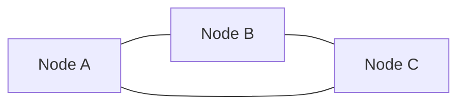
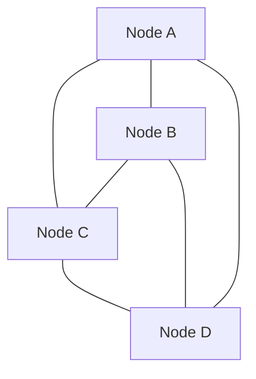
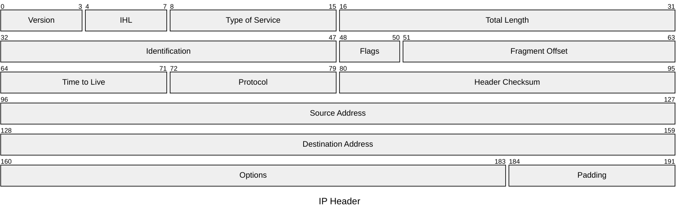
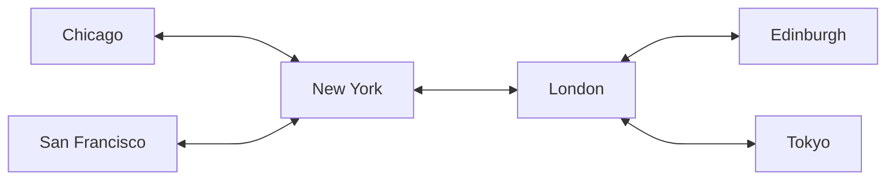
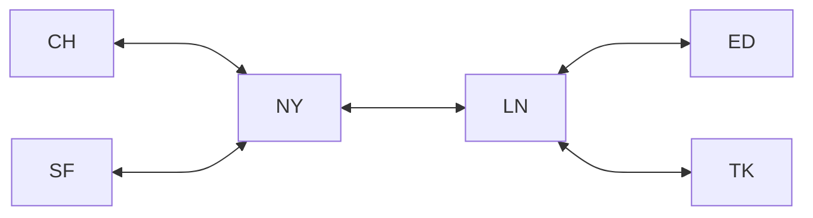
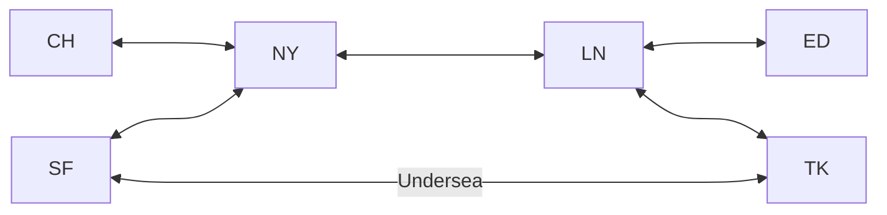
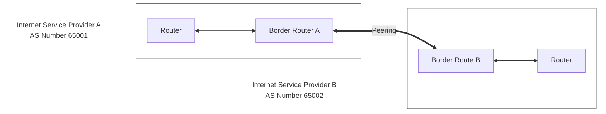
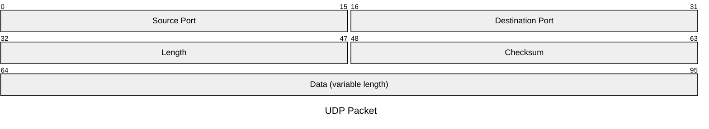
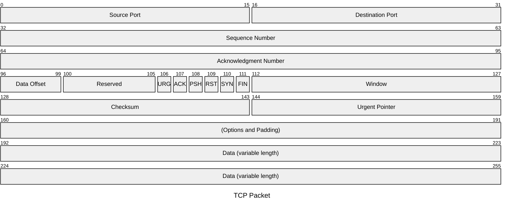

---

title: "How the internet works"
authors: simonpainter
tags:
  - networks
  - personal
date: 2025-01-02

---

## Introduction

On a few occasions I have been asked to explain networks to people with no prior experience and it's quite hard to work out where to start; there is so much history and so many concepts from general computer science that have got us to where we are today. I have long believed that to truly understand a concept it's very valuable to be able to organise your understanding in a way that means you can explain it to someone else. My goal here is not just to explain many of the contributions to networking that make the internet work but also organise some of my own understanding and explore areas where I have taken things on faith rather than asking why they are the way they are. The approach for this will be to assume we're starting with nothing and rebuilding the internet from the ground up and solving the problems that were solved to get us where we are today.
<!-- truncate -->
## Let's start with the cable

The first job before us is to connect two computers together. Computers talk in ones and zeros because they are for the most part only able to understand if a signal on a wire is there (a one) or not (a zero). If you connect two computers, or other networked devices, the lowest level of connectivity is likely to be a cable carrying an electricial signal, a fibre optic cable carrying pulses of light or some sort of radio frequency with modulated frequency or amplitude which denotes an on or off. If you are dealing with an electrical signal you need a common ground wire as well to make the circuit but for everything else you just need a wire to transmit in one direction and another to transmit in the other.

### Serial vs Parallel Communication

When connecting two computers, data can be transmitted either serially (one bit at a time) or in parallel (multiple bits simultaneously). Each approach has distinct characteristics that make it suitable for different scenarios.

In serial communication, bits are sent one after another along a single wire (plus ground). Think of it like a single-lane road where cars (bits) must travel in sequence:

```text
Computer A                Computer B
    [Tx] --------------> [Rx]
    [Rx] <-------------- [Tx]
    [G]  --------------- [G]

    Data: 1 0 1 1 0
    Time: 1 2 3 4 5    (each bit sent sequentially)
```

Parallel communication, by contrast, uses multiple wires to send several bits simultaneously. This is like a multi-lane highway where multiple cars (bits) can travel side-by-side:

```text
Computer A                Computer B
    [D0] --------------- [D0]
    [D1] --------------- [D1]
    [D2] --------------- [D2]
    [D3] --------------- [D3]
    [D4] --------------- [D4]
    [D5] --------------- [D5]
    [D6] --------------- [D6]
    [D7] --------------- [D7]
    [G]  --------------- [G]

    Data: 1 0 1 1 0 1 0 1
    Time: 1            (all bits sent simultaneously)
```

While parallel communication might seem superior due to its ability to transmit multiple bits simultaneously, it comes with its own challenges. The primary issue is something called "clock skew" - where bits sent at the same time might arrive slightly offset due to minute differences in wire length or electrical characteristics. This becomes more problematic as distances increase or transmission speeds rise.

> At higher speeds or longer distances, the complexity of keeping multiple data lines synchronized in parallel
> communication becomes increasingly difficult. This is why modern high-speed communications (like USB 3.0, SATA,
> and PCIe) use multiple serial lanes rather than parallel communications. They achieve high throughput by
> running the serial communications at very high frequencies rather than sending bits in parallel.

Serial communication, while seemingly slower at first glance, can actually achieve higher speeds over longer distances because it only needs to maintain timing on a single data line. This is why most modern high-speed computer interfaces have moved away from parallel to serial communications, often using multiple serial lanes when higher bandwidth is needed.

The tradeoff between serial and parallel communications is a perfect example of how engineering decisions in computer networking often involve balancing theoretical performance against practical limitations. In our further discussion of networking, we'll focus primarily on serial communications as they form the basis of most modern network interfaces.

### Serial clocks

The next problem to solve in order to make serial communcations this work is how we ensure that both computers know when a one and a zero start and finish, serial connections rely on both computers knowing the rate at data is flowing.  In a simple system both computers can be configured to know the rate of transfer, say 9600 bits per second and they sample the data received at that rate and will typically be fine. For faster and more accurate transfer another wire with a clock signal is needed. The clock signal acts like a metronome, providing the timing reference that keeps both sender and receiver synchronised. This synchronisation ensures that bits are sampled at the correct moments to accurately interpret the data.

> The baud rate, measured in *symbols per second*, represents how many signal changes can occur on the communication
> channel in one second. While baud rate was historically equivalent to bits per second in early systems where each
> symbol represented one bit, some communication can encode more than one bit in a signal. For example, if we use four
> different voltage levels to represent two bits per symbol and operates at 1200 baud, it can achieve a data rate of 2400
> bits per second. This is only important so that you realise that while bit rate and baud are often used
> interchangeably they are not the same.

The relationship between clock signals and baud rate is intimate - one computer must generate a clock signal that matches the baud rate so both computers can sample their incoming data stream at the optimal points between signal transitions.

### We can send numbers, what about letters?

When connecting two computers we established that they communicate in ones and zeros, but humans prefer to work with text. ASCII (American Standard Code for Information Interchange) solves this by using 7 bits to represent 128 different characters. Each character maps to a specific binary number - for example, the letter 'A' is represented as binary 1000001 (decimal 65).

> ASCII's use of 7 bits rather than 8 reflects its 1960s origins, when the 8th bit was reserved for parity - a simple
> error detection scheme. The parity bit would be set to make the total number of 1s either odd or even, allowing
> detection of single-bit transmission errors. When 8-bit bytes became standard, various "extended ASCII" encodings
> emerged using the extra bit to add 128 more characters, though these extensions weren't standardised.

```text
Example byte with even parity:
Letter 'A' = 1000001  (three 1s)
Parity bit = 1        (to make total 1s even)
Final byte  = 11000001
```

This ASCII standard was very much designed around English text, with the available 128 characters covering the Latin alphabet (both upper and lower case), numbers, punctuation marks, and control characters like carriage return and line feed. While this worked well for English-speaking countries, it proved problematic for languages with different alphabets or character sets.

### Enter Unicode

As computing spread globally, ASCII's limitations became apparent. Unicode was developed to handle text from all of the world's writing systems. While ASCII uses 7 bits, Unicode can use multiple bytes to represent characters, allowing it to handle millions of different characters rather than just 128.

```text
Character encoding comparison:
ASCII:    'A' = 1000001                    (7 bits)
UTF-8:    'A' = 01000001                   (8 bits)
UTF-8:    '世' = 11100100 10111000 10000000 (24 bits)
```

> For backwards compatibility, Unicode was cleverly designed so that the first 128 characters match ASCII exactly.
> This means that plain English text looks identical in both ASCII and UTF-8 (the most common Unicode encoding),
> which helped smooth the transition. This is why protocols like HTTP headers still use ASCII - they can be processed
> by both old and new systems without any confusion.

The transition from ASCII to Unicode is still ongoing. While modern applications and websites typically use Unicode, many networking protocols and legacy systems continue to use ASCII, particularly in areas where backwards compatibility is crucial or where the character set is limited to simple English text.

## Control characters

The first 32 ASCII values (0-31) are control characters designed for controlling teletype and early computer terminals:

```text
00 NUL - Null character, used as a string terminator
01 SOH - Start of Heading, marking message header
02 STX - Start of Text, marking message body start
03 ETX - End of Text, marking message body end
04 EOT - End of Transmission
05 ENQ - Enquiry, request for response
06 ACK - Acknowledge, positive response
07 BEL - Bell, triggers audible alert
08 BS  - Backspace, move cursor back
09 TAB - Horizontal Tab
0A LF  - Line Feed, move down one line
0B VT  - Vertical Tab
0C FF  - Form Feed, advance to next page
0D CR  - Carriage Return, move cursor to line start
0E SO  - Shift Out, switch to alternate character set
0F SI  - Shift In, return to standard character set
10-13 DC1-DC4 - Device Control (DC1/XON and DC3/XOFF for flow control)
14 NAK - Negative Acknowledge
15 SYN - Synchronous Idle
16 ETB - End of Transmission Block
17-1F - Various block/record/unit separators and escape codes
```

Many are still used today - notably TAB, LF, CR for text formatting and XON/XOFF for flow control in serial communications.

The full ASCII table is useful when disecting captures of low level protocols.

```text
Dec Hex ASCII   Dec Hex ASCII   Dec Hex ASCII   Dec Hex ASCII
--- --- -----   --- --- -----   --- --- -----   --- --- -----
000 00  NUL     032 20  SPACE   064 40  @       096 60  `
001 01  SOH     033 21  !       065 41  A       097 61  a
002 02  STX     034 22  "       066 42  B       098 62  b
003 03  ETX     035 23  #       067 43  C       099 63  c
004 04  EOT     036 24  $       068 44  D       100 64  d
005 05  ENQ     037 25  %       069 45  E       101 65  e
006 06  ACK     038 26  &       070 46  F       102 66  f
007 07  BEL     039 27  '       071 47  G       103 67  g
008 08  BS      040 28  (       072 48  H       104 68  h
009 09  TAB     041 29  )       073 49  I       105 69  i
010 0A  LF      042 2A  *       074 4A  J       106 6A  j
011 0B  VT      043 2B  +       075 4B  K       107 6B  k
012 0C  FF      044 2C  ,       076 4C  L       108 6C  l
013 0D  CR      045 2D  -       077 4D  M       109 6D  m
014 0E  SO      046 2E  .       078 4E  N       110 6E  n
015 0F  SI      047 2F  /       079 4F  O       111 6F  o
016 10  DLE     048 30  0       080 50  P       112 70  p
017 11  DC1     049 31  1       081 51  Q       113 71  q
018 12  DC2     050 32  2       082 52  R       114 72  r
019 13  DC3     051 33  3       083 53  S       115 73  s
020 14  DC4     052 34  4       084 54  T       116 74  t
021 15  NAK     053 35  5       085 55  U       117 75  u
022 16  SYN     054 36  6       086 56  V       118 76  v
023 17  ETB     055 37  7       087 57  W       119 77  w
024 18  CAN     056 38  8       088 58  X       120 78  x
025 19  EM      057 39  9       089 59  Y       121 79  y
026 1A  SUB     058 3A  :       090 5A  Z       122 7A  z
027 1B  ESC     059 3B  ;       091 5B  [       123 7B  {
028 1C  FS      060 3C  <       092 5C  \       124 7C  |
029 1D  GS      061 3D  =       093 5D  ]       125 7D  }
030 1E  RS      062 3E  >       094 5E  ^       126 7E  ~
031 1F  US      063 3F  ?       095 5F  _       127 7F  DEL
```

### That's two computers, how about n?

Connecting two computers with a serial connection is great but what about if you want to introduce a third node? The simplest answer is to use a full mesh topology where each computer node has a direct serial connection to the both of the other computer nodes.



This really doesn't scale well though. You need one serial link to connect two nodes, three serial links to connect three nodes but for four you need six serial links. When you get to five computer nodes in full mesh you need ten serial links.



> The formula for the number of connections between **n** computer nodes is n(n-1)/2 and the important thing to recognise
> in that forumla is that **n** is multiplied by **n** (OK, it's n-1 but who quibbles about the -1?) which makes it an
> exponential growth. Exponential growth is really bad when you get to big numbers and 50 computer nodes in a small
> office would need 1225 serial connections to be provisioned, configured and working.

## Addressing the problem

Now we have decided that point to point links in a full mesh are a bad idea we need to start connecting more than one device on the same shared wire. In order to do that we need to solve another problem first, and that's making sure that each device gets the right data and that's the start of addressing. If we have a shared wire with all the computers connected, perhaps with some sort of T shaped splitter, we can transmit from any computer node and it will be received by all of the other computer nodes. If we prefix each chunk of data with a destination address and each computer knows its own address then it can ignore data that is not meant for it. This probably sounds bonkers in the current climate of cybersecurity but we used to be a lot more trusting.


### Frames and MAC addresses

In order to understand when the data for each destination starts and finishes it's useful to organise it, or frame it, in a discrete block with a start and a finish. Data frames have headers with the source and destination addresses and a marker at the end to show that the data payload has finished. The addresses are, like everything in networks, just numbers, but large numbers with trillions of possiblities which ensures they are unique.

> A MAC address (short for medium access control address or media access control address) is a unique identifier
> assigned to a network interface. It is a 48-bit address space which contains potentially over 281 trillion
> possible MAC addresses. Blocks of addressing were historically allocated to network interface vendors to locally
> hardcode onto network interfaces; due to the sheer quantity of available addresses it's statistically impossible that
> two devices on a network could ever have the same MAC addresss.

Now that we have our data organised into frames, our computer nodes connected to a hub and each one uniquely addressed we can start to scale out. We can connect hubs to hubs if we like because the data sent by one hub will be repeated to other hubs. One thing we can't do though is form loops of hubs because they are not clever enough to realise if a data frame is in an endless loop as it is repeated by each hub in the loop and then endlessly repeated to every computer node on the network. This is just one of the many ways we can get to some serious congestion in our hub and spoke network.

### Collisions

As we scale out our hub and spoke network we hit another problem, collisions. We need each computer node to take turns in sending data. This means that computer nodes listen for gaps in the data flow at the end of frames before they start sending their own frames. On occasions, two computers connected to a hub will both want to send data and both will listen for the end of a frame and then try to send their own frames at the same time. When two computer nodes send data at the same time the hub is not clever enough, as it's just a simple electrical repeater, to hold one frame for a bit while it transmits the other. When hubs detect more than one sender at a time they will reject both senders which causes them to stop sending and those senders will then wait a random amount of time (to avoid colliding again) before they attempt to transmit again.

As networks grow there will be an increase in the liklihood of collisions and there will also be a drop in performance because a lot of data is getting sent to computer nodes that will discard it as it is not meant for them.

## Switching to something cleverer

Instead of simple hubs which are just electrical repeaters, we need a device that can look at the destination MAC address, compare it to a table in memory and then send that data out of the correct interface where the destination computer node is connected. In order to do this we have more problems to solve. First of all we need to work out how to populate that table which stores MAC addresses and the ports they are associated with. The easiest way to do this is to look at the source MAC address of frames and associate them with the interfaces they are received on. If we get a frame with a destination MAC address we don't know about then we can flood it to all interfaces and see which one the computer responds from. As this switching device is going to be a bit cleverer we will need to give it a processor and some memory, taking it from dumb electrical repeater that a hub was into a processing computer in its own right. With memory it can hold frames in a buffer while it looks in its MAC table to work out where to send them. It can also use that buffer in cases where the interfaces get congested.

### Congestion

Congestion happens where several computer nodes want to send data to one computer node at the same time. If two computer nodes are sending at their maximum interface capacity then the receiving computer would need twice as much interface capacity to receive it all. In some cases this is what we do but for the most part we would buffer the traffic as it comes in and then send it out as fast as we can until the buffer empties. If the congestion is sustained over a long period of time then traffic must be prioritised.

### MAC tables and why they don't scale

Maintaining a table of MAC addresses and the ports they are associated has some complexity and that complexity increases as a network scales. Imagine having to know the MAC address for every one of the billions of network devices on the internet and what port to use to get to it? Imagine having to flood the entire internet with a frame to find out which node responds to it? The upper limits to the number of devices on your network will be determined by the size of your MAC address table and the complexity of sorting and searching it.

> MAC tables, like the phone book, are a simple lookup search algoritm. The simplest way is to look at every entry,
> which means that you have to do **n** comparisons where **n** is the size of MAC table. If you sort the MAC table you
> can use cleverer algorithms that are more efficient to search the table but that means you have to sort the table again
> whenever there is a change to the network topology. This is why network loops can be so disasterous for a switch
> because it will see traffic from the same MAC address coming from more than one port and have to keep updating its MAC
> address table and ensuring it's sorted. Even the most efficient sort algorithms can be resource intensive when they
> are done over and over again.

## Finding the router

If our networks are limited by the size of the MAC address table we need to think of them as individual segments that can be joined up into larger networks. For this to work we need to have a more organised addressing system that means we can organise addresses into blocks have have a table of address blocks rather than individual addresses. Internet Protocol organises data into packets, which are similar to frames, which also have a source and a destination address. The common analogy is that the IP packet is an envelope, perhaps addressed to someone in another city, and the frame is the postman's bag that carries it to the post office. A person addresses the letter (packet) and hands it to the postman who puts it in their bag (the frame). That bag is carried to a sorting office (a router) where it is removed from the bag, inspected and put in another bag destined for the sorting office in the right city. Once it is received there the letter is inspected again and the address is compared to a table showing which addresses are on which delivery run and they are put in the appropriate post bag to be delivered.

This introduces a new device, a router, and the new addressing scheme, the Internet Protocol (IP) address. IP addresses are just 32 bit numbers but that means it can be between 0 and 4,294,967,295. Decimal notation isn't really that good for understanding the nuance of how these numbers are organised so we break the 32 bits into four chunks (or octets) of 8 bits and then represent those in decimal.

```text
If we take a dotted decimal IP address like 192.168.0.1 and convert each octet to binary we get 11000000.10101000.00000000.00000001. This is actually a representation of the single 32 bit number 11000000101010000000000000000001 or 3,232,235,521 in decimal. 
```

Our IP addresses can be grouped into networks by splitting the binary into a network, or subnet, portion and a host address portion. The network portion is the address of the network that contains the host and the host portion is the address of the computer node or host within that network. Routers need only maintain a list of routes to other networks and so know the route to every subnet or host within those networks. They also need to know the corresponding MAC address for each IP within their own local subnets but we'll get to that later.

> In the early days of IP there was a concept of address classes - their size dictated by their class. Now we don't
> use those classes so you will see CIDR (Classless Inter-Domain Routing) notation which uses the number of bits used in
> the network address to show which parts are the network address and which parts are the host address.

In a simple network where we have a CIDR of 10.0.0.0/24 we can look at the first 24 bits (conveniently the first three octets) as the network portion and the last 8 bits (the last octet) as the host portion. This means that the first 24 bits will stay the same and we can address our devices with the remaining 8 bits. With 8 bits we have a decimal number range of 0 to 255 inclusive but really we want to reserve the first and the last addresses, 0 and 255 for special purposes. We keep the 0 as the network address so we don't use that for a host and we keep the last as the broadcast address - that means anything sent to that address gets sent to every host on the network segment. That leaves us 254 other addresses (10.0.0.1 - 10.0.0.254) to allocate to our hosts. When you deal with different sized CIDR ranges it gets a bit more complicated because the number if bits doesn't always line up with the octets but the principle still applies.

> While IPv4 addresses use dotted decimal notation, both MAC addresses and IPv6 addresses are typically represented in
> hexadecimal. This difference stems from their distinct purposes and historical contexts. Decimal notation works well
> for IPv4 because each octet only ranges from 0-255 - numbers that humans can readily understand. MAC addresses (48 bits)
> and IPv6 addresses (128 bits) use hexadecimal because it provides a more compact and manageable representation for
> larger numbers. For example, each 16-bit block in an IPv6 address can represent values up to 65535, which would be
> unwieldy in decimal but is easily represented as four hexadecimal digits.
> Hexadecimal is particularly efficient for representing byte-oriented data because each byte (8 bits) maps perfectly to
> two hexadecimal digits. Each group of 4 bits (called a nibble or a nybble) converts to a single hex digit 0-F. This makes it easy
> to read and manipulate binary data, which is why packet captures and network debugging tools typically display their
> output in hexadecimal format.

When IP packets travel across networks, they carry their addressing information in a structured header. This header prefixes the actual data being sent and contains everything a router needs to know to get the packet to its destination. Let's look inside an IP packet to see how these addresses are actually used:



The source and destination addresses each take up 32 bits - exactly the size of our IP addresses. But the header contains much more than just addresses. It includes a Time to Live field that prevents packets from circulating forever if there's a routing loop, a Protocol field that tells us what kind of data follows (like TCP or UDP), and fields for handling large messages that need to be split across multiple packets (the Identification, Flags, and Fragment Offset fields).

The Version field tells us which version of IP we're using - 4 for IPv4 in this case. IHL (Internet Header Length) tells us how long the header itself is, as it can vary if optional fields are included. The Type of Service field (now usually called Differentiated Services) lets us mark packets that need special handling, like those carrying voice calls that need to arrive quickly.

Each router along the packet's journey will examine this header, use the destination address to decide where to send the packet next, decrease the Time to Live value by one, and update the checksum. If the Time to Live reaches zero, the router discards the packet and sends an error message back to the source address - this prevents packets from circulating endlessly when something goes wrong.

Now with your new addressing scheme we need one more piece of information - where to send stuff that isn't on our local segment. Routers will have a routing table but for the end host computer they just need a default gateway address on their network segment to send things to if they aren't in their own network. Back in the postman analogy if you hand a letter to the postman that is addressed to someone on his round he'll probably just deliver it but if it's not then he will take it to your local sorting office, your default gateway to the postal routing system.

```text
In an example where our local host has an address of 10.0.0.1 and is on network 10.0.0.0/24 the network portion is 10.0.0.0 and the host portion is 1. The computer works that out using a subnet mask which comprises of 24 ones (from the 24 in the network address CIDR notation) and 8 zeros to make it up to a total of 32 bits. A 24 bit subnet mask is 11111111.11111111.11111111.00000000 or 255.255.255.0
If we use a logical AND on the subnet mask and the local host address 10.0.0.1 we get get the bits that appear in both

11111111.11111111.11111111.00000000 AND
00001010.00000000.00000000.00000001
    ^ ^
gives
00001010.00000000.00000000.00000000

Now we do a logical AND with the subnet mask and the destination address 10.1.0.1 00001010.00000001.00000000.00000001

11111111.11111111.11111111.00000000 AND
00001010.00000001.00000000.00000001
    ^ ^         ^
gives
00001010.00000001.00000000.00000000

If we now compare those two network addresses, 10.0.0.0 and 10.1.0.0 they are different so know we need to send the packet to the default gateway. 
```

### The Address Configuration Problem

As our networks grow, we encounter a new scaling problem: how do we ensure every device gets the correct network configuration? For a network to function, each device needs:

1. A unique IP address (to avoid conflicts)
2. The correct subnet mask (to know what's local vs remote)
3. A default gateway address (to reach other networks)
4. DNS server addresses (to resolve names to addresses)

Manual configuration quickly becomes unmanageable:

```text
Network Admin's Challenge:
100 devices = 400 configuration items to track
1000 devices = 4000 configuration items to track
10000 devices = 40000 configuration items to track
```

Even in a small office with 50 devices, manual configuration presents several problems:

- Address conflicts when two devices are accidentally given the same IP
- Configuration errors when subnet masks don't match
- Lost connectivity when gateway addresses are typed incorrectly
- Wasted addresses when devices leave the network but their IPs aren't reassigned
- New devices can't connect until an administrator manually configures them

DHCP solves these problems through automation. It maintains a central pool of addresses and dynamically assigns them when devices join the network:

```text
Address Pool Management:
+-------------------+
| 192.168.1.1-50   | → Accounting Department
+-------------------+
| 192.168.1.51-100 | → Engineering Department
+-------------------+
| 192.168.1.101-150| → Available Pool
+-------------------+
| 192.168.1.151-200| → Reserved for Printers
+-------------------+
```

> The beauty of DHCP is that it solves both immediate and future problems. Not only does it handle initial
> configuration, but it also manages address reuse through lease times. When a device leaves the network, its
> address automatically returns to the pool after the lease expires.

### The Address Resolution Dilemma

Our network now has two addressing systems that need to work together:

- IP addresses (for logical network organization)
- MAC addresses (for physical frame delivery)

This creates a problem: when a device wants to send data to an IP address on its local network, how does it know which MAC address to put in the frame? Consider this scenario:

```text
Device A wants to send to 192.168.1.100
BUT
Frame needs a MAC address destination
AND
Device A only knows the IP address
```

Without a solution, every device would need a manually maintained table mapping every local IP to its MAC address - essentially the same scaling problem we had with MAC address tables in switches. Moreover, these mappings would need constant updates as devices join, leave, or change addresses.

ARP solves this through a dynamic discovery process:

```text
Problem: Who has 192.168.1.100?
+-----------------+     Broadcast     +------------------+
| Device A        |----------------->| Every Device     |
| "I need to find |                  | "Is this my IP?" |
|  192.168.1.100" |                  |                  |
+-----------------+                  +------------------+
                                           |
                        Unicast Response   |
                  <------------------------|
                  "Yes, that's me, here's 
                   my MAC address"
```

> ARP's elegant solution is to let devices discover mappings as needed and cache them temporarily. This
> addresses both the scaling problem (you only cache mappings you actually need) and the maintenance problem
> (cached entries expire automatically).

The real genius of ARP is how it handles network changes:

```text
Scenario: IP Address Changes
Before:
  192.168.1.100 → MAC: 00:11:22:33:44:55

After Device Moves:
  192.168.1.100 → MAC: AA:BB:CC:DD:EE:FF

Solution: Gratuitous ARP
  "Hey everyone, 192.168.1.100 is now at MAC AA:BB:CC:DD:EE:FF"
```

Both DHCP and ARP are examples of how networking protocols solve complex management problems through automation and discovery rather than manual configuration. They're critical pieces that make modern networks scalable and self-managing.

## Finding the route

Once a packet has got to the router the router will then compare it to the route table. The biggest difference between the route table and the MAC table is that the route table has the path to whole networks as a single entry without having to list every single host. The network address that we discussed earlier, [with the CIDR prefix length](longest-prefix-matching.md), is used to locate the right path out of all the available paths. So long as each router along the path knows the way to the network that has the host in it they can pass the packet, wrapping it in a fresh frame for each hop, until it reaches the destination network's router and ARP allows it to send it directly to the host computer's MAC address.

### Static routing

We can easily build up routing tables that span a large network by taking each hop. Take the example below where an organisation has networked computers in cities across the world connected by underground or undersea cables.



We can simplify the diagram and remove the geography and give each router a name.



The routing table for each site's router would be as follows:

```text
San Francisco (SF):
CH-->NY
NY-->NY    (direct)
ED-->NY    (via NY to LN to ED)
LN-->NY
TK-->NY    (via NY to LN to TK)

Chicago (CH):
SF-->NY
NY-->NY    (direct)
ED-->NY    (via NY to LN to ED)
LN-->NY
TK-->NY    (via NY to LN to TK)

New York (NY):
SF-->SF    (direct)
CH-->CH    (direct)
ED-->LN
LN-->LN    (direct)
TK-->LN

London (LN):
SF-->NY
CH-->NY
NY-->NY    (direct)
ED-->ED    (direct)
TK-->TK    (direct)

Edinburgh (ED):
SF-->LN
CH-->LN
NY-->LN
LN-->LN    (direct)
TK-->LN

Tokyo (TK):
SF-->LN
CH-->LN
NY-->LN
ED-->LN
LN-->LN    (direct)
```

If you trace the path of a packet from Chicago to Tokyo you can see at each step the router knows where to send the packet but it doesn't know the whole route. You can simplify things even further with stub networks like Edinburgh, Chicago and Tokyo because all traffic from them goes to the same next hop

```text
San Francisco (SF):
CH-->NY
NY-->NY    (direct)
ED-->NY    (via NY to LN to ED)
LN-->NY
TK-->NY    (via NY to LN to TK)

Chicago (CH):
All traffic (default route) -->NY

New York (NY):
SF-->SF    (direct)
CH-->CH    (direct)
ED-->LN
LN-->LN    (direct)
TK-->LN

London (LN):
SF-->NY
CH-->NY
NY-->NY    (direct)
ED-->ED    (direct)
TK-->TK    (direct)

Edinburgh (ED):
All traffic (default route) -->LN


Tokyo (TK):
All traffic (default route) -->LN

```

This is great until we want to make changes, or perhaps changes are forced upon us by unexpected failures. Let's say we add in an undersea cable crossing the pacific to connect Tokyo and San Francisco. Many such cables exist and we might want to use it for communciations between those two sites. We probably don't want to use it for communications between London and New York though because that cable is shorter.



We can update the routing table for the two sites:

```text
San Francisco (SF):
CH-->NY
NY-->NY    (direct)
ED-->NY    (via NY to LN to ED)
LN-->NY
TK-->SF    (direct via pacfic cable)

Tokyo (TK):
SF-->SF    (direct via pacfic cable)
CH-->LN
NY-->LN
ED-->LN
LN-->LN    (direct)
```

Everything else can remain the same because all other sites will use the existing routes until disaster strikes and the cable between London and New York gets damaged. We can connect to each router and update the routing table to reflect the change, sending all traffic via SF and TK rather than via NY and LN. Traffic between NY and LN goes the long way round but everything works again. In practice though this just isn't going to work. Statically assigned routing is a huge overhead because as sites increase the number of routing table entries increases exponentially.

> Think back to the full mesh network topology at the start - every node needed a path to every other node so the number
> of paths was n(n-1)/2 - the same calculation works here if you don't do anything clever with route summarisation.

### Dynamic routing

Building up a routing table dynamically relies on routers talking to each other. This is done using routing protocols which are essentially ways for routers to exchange information about the networks they know about and in many cases the distance or cost of getting there over that path. One of the most popular protocols, OSPF (Open Shortest Path First), uses a route finding algorith called [Dijkstra's Algorithm](dijkstra-ospf.md) which is the same algorithm used by some sat nav units to calculate the best route to somewhere taking into account distance, road congestion, and speed limits.

> A better solution for Sat Navs is likely to be [the A* search algorithm](algorithms.md#a-a-star-search) which takes
> into account heuristics to indicate roughly what direction the target is from the start point. If you are in London
> trying to find a route to Edinburgh you are probably going to be wasting your time looking at routes that start off
> going south. OSPF has no such heuristic to influence path selection so relies on cost alone.

Now we have got to the point where we can get data from one part of the world to the other across our IP network. We still need to figure out a bit more about what to send to make it useful but we don't operate the only network. The Internet is, by definition, a collection of networks that have joined together to form a larger network. Inter is a prefix that means between, whereas intra means within. An intranet is within your own network and internet means between separate networks. So how do we connect our networks and exchange routing information with other networks in a safe way? We want to have something on the border of our network that allows us to carefully exchange information about the networks we know about within our autonomous system and the networks they can see within their autonomous system. We might also want to exchange information about other autonomous systems that we are connected to that others can reach through us. The protocol for exchanging this information at the border of our network is Border Gateway Protocol, or BGP.

### Peering with other networks

When networks grow beyond a single organisation, or autonomous system, we find we need to share routing information whilst maintaining control and independence. Each autonomous system needs to:

- Control what routes they advertise to others
- Choose which routes to accept from others
- Make policy decisions about traffic flow
- Maintain stability when other networks have problems



Each autonomous sytem for internet peering is assigned a unique number, the Autonomous System Number (ASN). BGP uses this to track the path a route has taken through different networks to ensure that there are no loops. It also uses the list of ASNs that a route has been through to get a crude estimate of the distance to the destination using the path length; in most cases a route that passes through the fewer networks is considered better than one that passes through more networks.
Unlike internal routing protocols, BGP is not designed to focus on finding the shortest path, it is designed to solve a different set of problems:

### Policy Enforcement

BGP allows network owners to apply policies to routing decisions at their perimeter to control what routes they allow into their network. Note that BGP controls the routing information, the control plane, and not the data plane itself. Firewalls and other security technologies provide that layer of protection. As part of the agreement to peer with another network it is common for organisations to share their [routing policy](https://www.rfc-editor.org/rfc/rfc2622) so that both peers know what to expect.

```text
AS 65001's Policy:
- Advertise only our customer networks
- Accept only customer routes from AS 65002
- Prefer paid links over free peering

AS 65002's Policy:
- Advertise all routes to paying customers
- Accept all routes from AS 65001
- Filter out private networks
```

### Route Aggregation

Where networks are made up of contiguous smaller subnets it may be possible to summarise those networks into a larger network and just advertise the route to that. This reduces the overall complexity of the routing table.

```text
Instead of advertising:
  192.168.1.0/24
  192.168.2.0/24
  192.168.3.0/24
  192.168.4.0/24

BGP can summarise as:
  192.168.0.0/22
```

### Path Selection

> BGP's genius is that it doesn't just share routes - it shares the path to reach those routes. This path
> information (called the AS_PATH) lets networks make informed decisions about which routes to trust and use.
> It's like not just knowing there's a road to a destination, but knowing exactly which countries you'll pass
> through to get there.

BGP routers establish TCP sessions (on port 179) with their peers and exchange routes through UPDATE messages:

```text
Router A                Router B
   |                      |
   |---Open------------->|    "Hello, I'm AS 65001"
   |<--Open--------------| "Hello, I'm AS 65002"
   |                      |
   |---Update----------->|    "I can reach 192.168.0.0/22"
   |<--Update------------| "I can reach 10.0.0.0/8"
   |                      |
   |---Keepalive-------->|    "Still here!"
   |<--Keepalive---------| "Still here too!"
```

BGP does not direcly allow a network admin to make routing choices within another ASN but it does allow them to provide information which can influence that decision. Routing decisions within an ASN are entirely controlled by the network admins of that ASN and how they choose to use the routing information provided to them.

```text
BGP Path Selection (in order):
1. Highest LOCAL_PREF
2. Shortest AS_PATH
3. Lowest ORIGIN type
4. Lowest MED
5. External over internal BGP
6. Lowest IGP metric to next hop
7. Lowest router ID (tie breaker)
```

> BGP's deliberate slowness in converging is actually a feature, not a bug. When a route disappears and
> reappears frequently (called route flapping), BGP implements route dampening to maintain stability.
> This prevents unstable routes from causing cascading problems across the internet.

## What to transport

We can now get a packet from our source, anywhere in the world, to our destination, also anywhere in the world. We are sending that data in discrete packets and to avoid congestion on the network we probably want to keep those packets small so we don't clog up a link and stop other packets flowing over it for too long. That's good for sending a single packet but what about if we want a longer connection with data flowing back and forth? What if we want to actually get a response or an acknowledgement that the packet was received? Here we need to look at the protocols within IP and what they can do for us.

> The protocols you are most likely to already have heard of are TCP, UDP and perhaps ICMP. ICMP is what is used in the
> ping command which is a rather troublesome way to troubleshoot network connectivity.

### UDP (User Datagram Protocol)

Once we can route packets across networks, we need a way to get information from one application to another. The User Datagram Protocol (UDP) provides one of the simplest solutions to this problem. Think of UDP like sending a postcard - you write your message, address it, and send it on its way. Once it's posted, you have no way of knowing if it arrived, and you won't get any confirmation of delivery. This might seem like a limitation, but in many cases, it's exactly what we need.

The word "datagram" in UDP's name gives us a clue about how it works - it's about sending independent messages (datagrams) that each carry their own addressing information. Each message stands alone, like a self-contained postcard, rather than being part of a larger conversation.

Looking inside a UDP message reveals a remarkably simple structure. The header contains just four essential pieces of information:



The source and destination ports tell us which applications should handle the message at each end. The length field tells us how big the entire package is, and a checksum provides basic error detection. That's all there is to it - UDP adds just enough information to get a packet of data from one application to another.

This simplicity makes UDP perfect for applications where timeliness matters more than perfect reliability. Consider a voice chat application: if a packet containing a fraction of a second of audio gets lost, it's better to skip that tiny bit of sound than to wait for it to be sent again. By the time the lost audio would arrive, the conversation would have moved on, and the delayed sound would be more disruptive than the brief silence from the lost packet.

Online gaming often uses UDP for similar reasons. When a game is sending constant updates about player positions, losing an occasional update isn't catastrophic - the game can make educated guesses about where things should be until the next update arrives. The important thing is keeping the game moving without introducing delays.

DNS, the internet's phone book that we discussed earlier, also uses UDP for its queries. When you want to look up a website's IP address, adding complex reliability mechanisms would just slow things down. A simple query and response is much more efficient, and if something goes wrong, the application can simply try again.

The lack of connection state in UDP also makes it ideal for services that need to handle huge numbers of clients. A DNS server doesn't need to maintain information about every client that might ask it a question - it just answers queries as they arrive. This stateless nature allows UDP servers to be much more scalable than more complex approaches.

UDP's simplicity extends to error handling as well. While it does include a checksum to detect corrupted packets, it doesn't do anything about them - corrupted packets are simply discarded. There's no mechanism to send packets again if they're lost, no system to confirm receipt, no guarantee that packets will arrive in the same order they were sent. If an application needs any of these features, it must implement them itself.

The "fire and forget" nature of UDP can sometimes lead to interesting challenges. Without built-in flow control, it's possible for a fast sender to overwhelm a slow receiver, causing packets to be dropped. Applications might need to implement their own mechanisms to avoid overwhelming network links. These considerations make UDP programming more challenging in some ways, despite its simpler protocol.

This might seem like UDP is pushing complexity up to the application layer, and in a sense, it is. But this is actually one of UDP's strengths - it allows applications to implement exactly the level of reliability they need, no more and no less. A video streaming application might choose to resend certain critical packets but not others, based on their importance to the video quality.

Not every application can work with UDP's simple "best effort" delivery model. Many applications nee

### TCP (Transmission Control Protocol)

TCP is the workhorse of the internet, providing reliable, ordered delivery of data between applications. While UDP simply sends packets and hopes for the best, TCP creates a sophisticated conversation between sender and receiver. Think of it like the difference between dropping a letter in a postbox and having an important conversation over the phone - with TCP, both sides actively participate in ensuring the message gets through.

The magic begins with what we call the three-way handshake. Imagine you're making a phone call: first you dial (sending a SYN flag), the other person picks up and says "hello" (sending back a SYN-ACK), and you respond with your own "hello" (sending an ACK). This seemingly simple exchange actually establishes something quite sophisticated - both computers agree on sequence numbers they'll use to keep track of the conversation, much like you might number pages in a long letter to ensure they stay in order.

Let's peek inside a TCP header to understand how this works. Every TCP segment (that's what we call the individual pieces of a TCP stream) carries a wealth of information in its header:



The sequence and acknowledgment numbers are particularly clever. The sequence number identifies each byte in the stream of data being sent, while the acknowledgment number tells the other side which byte is expected next. This system allows TCP to handle lost, duplicated, or out-of-order packets gracefully.

When data starts flowing, TCP doesn't just send everything at once. Instead, it uses a sophisticated flow control mechanism called the sliding window. The "Window" field in the header tells the sender how much data the receiver is willing to accept. This window slides forward as data is acknowledged, preventing any one side from overwhelming the other with too much data too quickly.

The flag bits in the TCP header each serve specific purposes. SYN (synchronise) and FIN (finish) manage connection establishment and teardown. ACK (acknowledge) confirms received data. PSH (push) suggests the receiver should pass this data to the application immediately rather than buffering it. URG (urgent) marks priority data, though it's rarely used today. RST (reset) abruptly terminates connections when something goes wrong.

TCP also includes a built-in capability to handle network congestion. If packets start getting lost (which we can detect through missing acknowledgments), TCP assumes the network is congested and slows down its transmission rate. It then gradually speeds up again as packets successfully get through. This self-regulating behaviour helps prevent network collapse under heavy load.

The connection teardown is as carefully managed as the setup. When one side is finished sending data, it sends a FIN flag. The other side acknowledges this and may continue sending its own data. When it too is finished, it sends its own FIN, which gets acknowledged. This four-way handshake ensures both sides have finished their conversation before the connection is fully closed - like saying "goodbye" and waiting for the other person to say "goodbye" too before hanging up the phone.

All these mechanisms work together to provide what we call TCP's reliability guarantees: data arrives in order, without gaps, exactly once. This reliability comes at the cost of some overhead - those acknowledgments and window advertisements take up bandwidth, and waiting for acknowledgments adds latency. But for many applications, from web browsing to email to file transfer, this is a worthwhile trade-off for the assurance that all data will arrive correctly.

The sophistication of TCP becomes particularly apparent when things go wrong. If a packet is lost, TCP automatically retransmits it. If packets arrive out of order, TCP holds them until the gaps can be filled in. If the network becomes congested, TCP adjusts its sending rate to help alleviate the problem. All of this happens without the applications having to worry about it - they just see a reliable stream of data.

What makes TCP truly remarkable is how it provides this reliability over an unreliable network. The Internet Protocol (IP) makes no guarantees about packet delivery - packets can be lost, duplicated, or arrive out of order. TCP builds reliable communication on top of this uncertainty, much like building a dependable postal service using couriers who might occasionally lose packages or deliver them in the wrong order. The fact that this works so well is a testament to the elegant design of the protocol.

## The phone book

> By now we have used analogies including the postal service, text messaging and phone calls so it was only a matter of
> time before we brought the phone book into it. It may not be as common to people now but we used to have big books in
> our houses with all the phone numbers of all the houses in our local area. For anyone under 30 this might seem bonkers.

We've looked at IP addresses. They're just a 32 bit number expressed in a dotted decimal notation for humans to read. So when you want to contact me at 74.125.133.27 you can do so now right? People don't want to have to remember 32 bit numbers so we need a more friendly name for computer systems around the world and we need to make it able to scale; the best way to make things scale is often to distribute them rather than store them centrally.

DNS, or the domain name system, introduces a heirarchical naming system which can be distributed such that individual records can be delegated down the organisations and individuals to manage using a system of distributed authority. If you take my website address, `www.simonpainter.com`, it has three clear parts: the host name www, which is the convention for hosts that make up the world wide web, the domain `simonpainter.com` which has a top level of `com` and a second level of `simonpainter`.

> I want to stop and talk about the dot in the domain name, or more interestingly the fact that it doesn't exist in the
> actual DNS query. The space between each portion of the domain name is filled with a byte containing the length of the
> next portion.

```text

Common packet capture output:
0000   00 11 22 33 44 55 66 77   01 02 03 04 05 06 07 08
0010   03 77 77 77 06 67 6F 6F   67 6C 65 03 63 6F 6D 00

Converting the DNS query above:
03          Length (3)
77 77 77    'www'       
06          Length (6)
67 6F 6F    'goo'
67 6C 65    'gle'
03          Length (3)
63 6F 6D    'com'
00          End marker
```

> You would express `www.google.com` as **03** 77 77 77 **06** 67 6f 6f 67 6c 65 **03** 63 6f 6d where 03, 06 and 03 are
> the lengths of the www, google, and com respectively.

When I want to look up how to get to `www.simonpainter.com` I start by querying my local DNS server. It's another one of those options that can be configured manually or with [DHCP](#the-address-configuration-problem) so I know my DNS server's IP address (or more likely I know more than one). I send a UDP packet asking for it to resolve `www.simonpainter.com` to an IP address. My local DNS server probably doesn't know the answer because it's not the authority for that domain so it does one of two different things: it could forward all queries to a different DNS server, perhaps a central one managed by my internet service provider, or it could try recursively looking it up itself. If it forwards it to the ISP DNS server it's likely the ISP DNS server would do a recursive lookup. In the event that someone else had already recently requested that lookup from the ISP it may be able to respond with a cached answer rather than have to look it up again.
In order to do a recursive lookup the first place to start is the DNS root servers. They are globally distributed computers which all hold the same root zone that is the starting point for a lookup. DNS servers just have to know where to find the root servers so [all recursive DNS servers will hold a list of the root servers and their IP addresses](https://www.internic.net/domain/named.root). The root servers will know the name servers that hold information for anything ending .com and will respond with that information. The record from the [root zone](https://www.internic.net/domain/root.zone) will look like this for `.com`.

```text
com.            172800    IN    NS    a.gtld-servers.net.
com.            172800    IN    NS    b.gtld-servers.net.
com.            172800    IN    NS    c.gtld-servers.net.
com.            172800    IN    NS    d.gtld-servers.net.
com.            172800    IN    NS    e.gtld-servers.net.
com.            172800    IN    NS    f.gtld-servers.net.
com.            172800    IN    NS    g.gtld-servers.net.
com.            172800    IN    NS    h.gtld-servers.net.
com.            172800    IN    NS    i.gtld-servers.net.
com.            172800    IN    NS    j.gtld-servers.net.
com.            172800    IN    NS    k.gtld-servers.net.
com.            172800    IN    NS    l.gtld-servers.net.
com.            172800    IN    NS    m.gtld-servers.net.
```

From one of those name servers for `.com` the DNS server will find out the name servers for `simonpainter.com` and that will be where they can get an authorative answer for `www.simonpainter.com`.

> This only covers DNS A records (host records) and NS records (name server records) but there are several other record
> types which serve different purposes. A records resolve IPv4 and AAAA records are used for IPv6, this is because IPv6
> addresses wouldn't fit in the space allocated for IPv4 addresses in A records. The name AAAA comes from it being 4
> times the size of an A record.

## A moment to talk about security

So far we've just been sending plain ASCII, or Unicode, text. When we establish communications between computers we now want to ensure there is some degree of encryption.

Transport Layer Security (TLS) evolved from Secure Sockets Layer (SSL), which Netscape developed in 1994. SSL went through versions 1.0 (never released), 2.0, and 3.0, but security flaws led to the development of TLS 1.0 in 1999. TLS provides encryption, authentication, and integrity for data transmitted between clients and servers, using a combination of asymmetric encryption for key exchange and symmetric encryption for data transfer.

> The adult entertainment industry, facing challenges with online payment processing in the mid-1990s, played a
> crucial role in advancing secure online transactions. Traditional payment processors were hesitant to handle adult
> content transactions, leading adult websites to develop and fund their own payment solutions. This investment helped
> establish the infrastructure for secure online payments, pushing forward the adoption of SSL/TLS encryption for
> e-commerce. The same technologies later became standard across all industries for protecting sensitive data during
> online transactions.

### Public Key Cryptography

Public key cryptography solves a fundamental problem: how do you share a secret key with someone when anyone could be listening? The solution uses pairs of mathematically linked keys - one public that can be freely shared, and one private that must be kept secret. Data encrypted with the public key can only be decrypted with the private key, and vice versa.

```text
Example:
1. Alice generates key pair: public key Pa, private key Sa
2. Alice shares Pa publicly, keeps Sa secret
3. Bob wants to send message M to Alice:
   - Encrypts M with Pa: C = encrypt(M, Pa)
   - Sends C to Alice
4. Only Alice can decrypt C using Sa:
   - M = decrypt(C, Sa)
```

> The mathematics behind public key cryptography relies on problems that are easy to do in one direction but
> computationally infeasible to reverse, like multiplying two large prime numbers versus factoring their product.
> This asymmetry provides the security foundation for modern encryption.

### How TLS Works

TLS operates through a handshake process that establishes a secure connection. First, the client and server agree on which version of TLS and which encryption algorithms they'll use. The server presents its digital certificate, which contains its public key. Using this public key, the client and server securely exchange a session key, which they then use for symmetric encryption of the actual data transfer.

```text
TLS Handshake Process:
1. Client Hello: Supported TLS versions and cipher suites
2. Server Hello: Chosen version and cipher suite
3. Server Certificate: Public key and identity verification
4. Key Exchange: Generate shared session key
5. Handshake Complete: Begin encrypted communication
```

The beauty of this system is that it combines the security of asymmetric encryption for the initial handshake with the speed of symmetric encryption for the ongoing data transfer. Each new session gets a unique session key, ensuring that even if one session is compromised, others remain secure.

## And finally the application

We know how to resolve a name to an IP address anywhere in the world, we know how to route traffic to it across many different networks and we understand right the way down to the pulses of light or electricity through a cable how we get data across networks. Once it arrives at a computer we know that if the destination MAC address is right the frame will be received and the packet inside inspected. We know that it might be a UDP packet or it might be part of a TCP session but whatever it is there will be an application waiting there listening for that data. But what if there are more than one networked applications running on that computer? How do we ensure that data for an application is passed from the network interface to the correct application?

> A socket is the construct that serves as the endpoint for a networked application to send and receive data. In the
> context of IP a socket address is the triad of transport protocol, IP address, and port number. This recognises that
> systems may have more than one IP address and more than one interface. An example of a socket for a web server might
> be tcp/80 on address 192.168.0.50.  Wildcards are sometimes used in configuration where an application is bound to any
> IP address associated with a system. Note that TCP and UDP would listen on different sockets however some
> applications, such as DNS, use both and would therefore have sockets for both.

Applications have commonly associated ports and the TCP or UDP header will have the application port within it. When the packet is received the port number, along with the protocol and the IP address, are used to pass the payload of the packet to the correct application. Those applications then parse the data according to their own application protocols. There are a number of common TCP and UDP port numbers that are by convention associated with common applications however you can configure most applications to listen on any port and so long as the sender knows to use the non standard port then everything will still work.

```text
Some of the well-known ports (1-1023):
Port    Proto   Service         Purpose
20      TCP     FTP-data       File transfer data channel
21      TCP     FTP-control    File transfer control channel
22      TCP     SSH            Secure remote access and file transfer
23      TCP     Telnet         Legacy remote terminal (unencrypted)
25      TCP     SMTP           Email submission
53      TCP/UDP DNS            Name resolution
67      UDP     DHCP-Server    Network configuration (server side)
68      UDP     DHCP-Client    Network configuration (client side)
69      UDP     TFTP           Trivial file transfer (network boot)
80      TCP     HTTP           Web traffic
123     UDP     NTP            Time synchronization
443     TCP     HTTPS          Secure web traffic
445     TCP     SMB            File/printer sharing
514     UDP     Syslog         System logging
```

### Sir Tim and the World Wide Web

## People don't need to study preposterous acronyms

Now you have reached the end of this you also know a bit more about the OSI model and what people mean when they talk about 'layer 2' or 'layer 3' networks. Networking is conceptually organised into discrete layers which have standardised interfaces between them. Those layers have irritatingly unintitive names:

- Layer 1 - **P**hysical
- Layer 2 - **D**atalink
- Layer 3 - **N**etwork
- Layer 4 - **T**ransport
- Layer 5 - **S**ession
- Layer 6 - **P**resentation
- Layer 7 - **A**pplication

There are lots of ways to remember the order, PDNTSPA: 'Please Do Not Throw Sausage Pizza Away' is one particularly bad example. What is important is to understand that the bits where we discussed [the cable and underlying physical network connections](#lets-start-with-the-cable) were all about layer 1, the [hub](#thats-two-computers-how-about-n) and [switch topology](#switching-to-something-cleverer) and [data frames between MAC addresses](#addressing-the-problem) were all at layer 2. [Routing](#finding-the-router) and [routing protocols](#finding-the-route) were layer 3 while layer 4 is made up of the transport protocols like [TCP](#tcp-transmission-control-protocol) and [UDP](#udp-user-datagram-protocol). Internet Protocol blurs the model a bit at the top because layers 5, 6 and 7 are all associated with [application traffic](#and-finally-the-application) but we now know quite a lot about that too. You should now be able to visualise the path of date from when you put this web page address into your browser and the page loaded up for you to read. I hope you've enjoyed the process.
