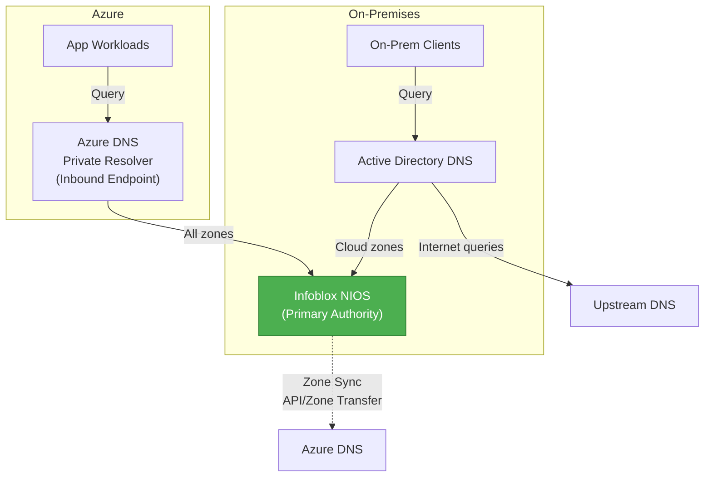
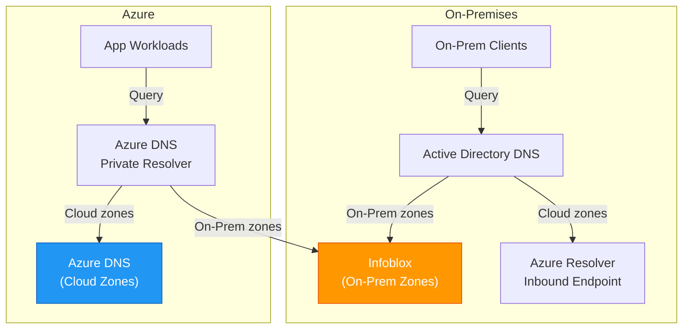
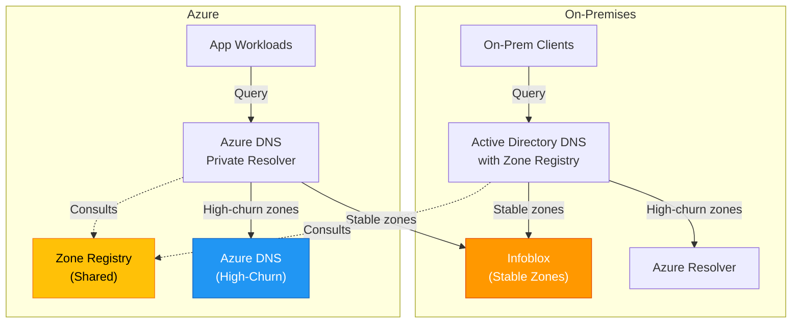
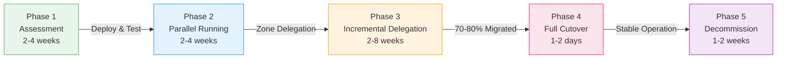

I've spent the last few years helping organisations move their DNS infrastructure from legacy on-premises Active Directory (AD) DNS to modern hybrid cloud environments. Every single migration tells a slightly different story, but they all share a common thread: zone change frequency determines whether your migration is smooth or painful.

If you're planning to migrate to Infoblox in a hybrid cloud environment, your biggest decision isn't between NIOS and BloxOne. It's understanding where your DNS zones live, how often they change, and how that drives your architectural choices. Get that wrong, and you'll spend months updating forwarders and wrestling with inconsistent DNS data. Get it right, and the whole thing just works.

<!-- truncate -->

## Current State: Legacy On-Premise AD DNS

Most organisations I work with have been running Active Directory integrated DNS for fifteen or twenty years. It's reliable, integrated with their domain infrastructure, and frankly, most people haven't thought about it in a decade.

But AD DNS has some real limitations when you're trying to build a hybrid cloud infrastructure.

### The Pain Points with Active Directory DNS

**Replication Delays Across WAN Links**

AD DNS relies on Active Directory replication. When you extend your domain to Azure (via Azure AD DS or domain controllers in the cloud), you're now replicating DNS records across a WAN link. This isn't terrible, but it's not fast either. A change made in your on-premises Active Directory might take seconds, minutes, or even longer to replicate to the cloud. During that window, DNS queries from cloud resources might hit stale records.

**Split-Brain DNS Risk**

Hybrid cloud environments often use different DNS zones for on-premises and cloud resources. If you're not careful, the same DNS name resolves differently depending on which side of the network you're on. I've seen this cause chaos—applications in the cloud can't reach applications on-premises because they're resolving to different IP addresses.

**No Native Cloud Support**

Azure DNS, AWS Route 53, and Google Cloud DNS don't speak Active Directory. They don't understand AD replication, dynamic updates, or AD security. If you want to host a zone in Azure DNS, you're managing it in two places—Azure DNS for the cloud zones, and AD DNS for the on-premises zones. That's a recipe for confusion and manual work.

**Cross-Premises Name Resolution Complexity**

Making sure that on-premises systems can resolve cloud hostnames, and that cloud systems can resolve on-premises hostnames, requires careful configuration of conditional forwarders, zone transfers, or custom DNS server deployments. It's doable, but each approach has security and performance implications you need to think through.

**Scalability**

Active Directory DNS was designed for single-site or limited multi-site deployments. True hybrid cloud—where you've got resources everywhere—pushes it beyond what it was built for. You're not going to break it, but you'll be fighting against the design assumptions.

## Why Migrate? Business Drivers

So why move away from something that's been stable for two decades? There are several compelling reasons:

**Unified Management**

Infoblox gives you a single pane of glass for DNS across your entire hybrid environment. Whether your zones are on-premises, in Azure, or in multiple clouds, they're all managed from one place. The operational simplicity is enormous.

**Modern Cloud Features**

Infoblox solutions (both NIOS and BloxOne) understand cloud. They integrate with AWS, Azure, and GCP natively. They support dynamic workloads like Kubernetes. They've got built-in threat protection, analytics, and automation APIs that modern cloud teams expect.

**Reduced Operational Overhead**

Once you're running Infoblox, your teams don't need to manage domain controllers just for DNS. You don't need to maintain separate DNS infrastructure for cloud. You've got a unified platform that scales.

**Enabler for Cloud Adoption**

If you're trying to move more workloads to the cloud, DNS architecture is a blocker. Getting this right removes a major barrier to cloud adoption and lets your teams move faster.

## Infoblox Solutions: NIOS vs BloxOne

Before we talk about architecture patterns, let's understand the two main Infoblox solutions and how they differ.

### Infoblox NIOS: On-Premises Control

NIOS is the traditional Infoblox solution. It's been around for twenty years and it's battle-tested. You deploy NIOS appliances (or virtual machines) in your data centres. Those appliances run DNS, DHCP, and IPAM services.

If you're migrating from legacy AD DNS, NIOS is the natural choice. It feels familiar. You've got on-premises control. You manage zones, forwarders, and policies from your local infrastructure.

NIOS integrates with cloud environments, but here's the key: your control plane stays on-premises. You might deploy a virtual NIOS instance in Azure or AWS, but that instance connects back to your on-premises Grid Master for management and zone replication. It's cloud integration, but with on-premises DNA.

**Key capabilities:**
- Grid Master/Member architecture (centralised management, distributed responders)
- Zone replication between appliances via TSIG-secured transfers
- Anycast IP support for stateless, resilient DNS responders
- Built-in threat protection and DNS firewall
- Full IPAM integration with on-premises bias

**Best for:** Enterprises with substantial on-premises infrastructure; organisations that want on-premises control; gradual cloud adoption journey.

### Infoblox BloxOne DDI: Cloud-Native

BloxOne is Infoblox's cloud-first solution. It's a Software-as-a-Service platform. You don't deploy a Grid Master anywhere. Instead, you use Infoblox's cloud-hosted management console.

You still deploy appliances (BloxOne Hosts) on-premises and in the cloud. But those hosts are thin clients. They pull their configuration from the cloud console. They synchronise zones via encrypted HTTPS APIs. If the cloud link goes down, they continue running with their cached configuration. When the link comes back, they sync again.

This is a fundamentally different model. Your zones live in the cloud. Your policies live in the cloud. Your analytics and threat intelligence live in the cloud. The appliances on-premises are just execution endpoints.

**Key capabilities:**
- Cloud-hosted SaaS management console
- BloxOne Hosts as distributed execution endpoints
- Native integration with AWS, Azure, GCP
- Automation-first APIs optimised for CI/CD
- Centralised threat intelligence and analytics
- Automatic failover and geo-redundancy

**Best for:** Cloud-first organisations; multi-cloud environments; teams that want cloud-managed infrastructure; organisations that want to move away from on-premises management overhead.

## Official Reference Architectures

Before I describe three custom patterns, let me show you the official reference architectures that Infoblox and Microsoft have published. These are based on thousands of deployments.

### Microsoft Azure Hybrid DNS Architecture

Microsoft's official hybrid DNS architecture (from their Azure Architecture Center) emphasises several key principles that matter for any hybrid DNS design.

First, they recommend a hub-and-spoke topology. You've got a central hub VNet that hosts your connectivity resources (VPN/ExpressRoute gateways, firewalls). The DNS resolver sits in a separate shared services VNet, not in the hub itself. This reduces the blast radius if something goes wrong with your centralised infrastructure.

Second, the resolver itself is Azure DNS Private Resolver—a managed service. You don't run your own DNS VMs. Azure manages the infrastructure, redundancy, and patching for you.

The resolver has two endpoints:

- **Inbound endpoint** (`/28` subnet minimum): This is where on-premises DNS servers send queries for Azure zones. You configure your on-premises AD DNS with conditional forwarders pointing to this endpoint. When an on-premises client needs to resolve a cloud-hosted service, the on-premises DNS server forwards that query to the inbound endpoint. The resolver resolves it from Azure's private DNS zones.

- **Outbound endpoint** (`/28` subnet minimum): This is where the resolver sends DNS queries to external targets. You configure DNS forwarding rulesets—rules that say "when someone queries for a zone in my on-premises domain, forward it to my on-premises DNS servers."

For the on-premises side, Microsoft recommends putting Azure DNS Private Resolver behind Azure Firewall. Azure Firewall acts as a DNS proxy. It receives DNS queries from workloads in Azure (configured as the VNet's custom DNS server), forwards them to the resolver's inbound endpoint, and enforces FQDN-based firewall rules. This gives you centralized DNS logging and control.

For multi-region deployments, Microsoft recommends using a single global private DNS zone (simpler) rather than regional zones. The global zone doesn't depend on any single region's infrastructure. In a catastrophic regional failure, the zone continues to operate. You do deploy one DNS Private Resolver per region, and each resolver's outbound forwarding rules include forwarders to all your on-premises DNS servers (so regional failures don't block on-premises lookups).

This is the official architecture. It's enterprise-grade, highly available, and clean. But it assumes you want Azure to be your primary DNS authority for all cloud zones.

### Infoblox NIOS Best Practices Reference Architecture

Infoblox's official NIOS guidance is different. It's designed for organisations that want Infoblox to be the primary authority.

The core model is Grid Master/Member. You deploy a Grid Master (typically on-premises, sometimes highly available with Grid Master redundancy). This Grid Master manages all DNS zones, policies, and configuration across your entire hybrid environment.

You then deploy Grid Members—DNS servers that report to the Grid Master. You've got Grid Members in your on-premises data centres, and you deploy Grid Members (as virtual NIOS instances) in Azure, AWS, and GCP. Every Grid Member synchronises zones with the Grid Master using TSIG-secured zone transfers.

For resilience, Infoblox recommends Anycast IPs. An Anycast IP is a single IP address that multiple DNS servers advertise. Queries to that IP go to the nearest healthy responder. This gives you stateless, resilient DNS without complex load balancing.

Threat protection is built-in. NIOS can block malicious domains at the DNS layer, protecting your entire network. Policies are enforced across all Grid Members, so you get consistent behaviour everywhere.

IPAM is tightly integrated. You're managing your entire IP address space from the same console where you manage DNS. This matters for hybrid environments where on-premises and cloud IP space can easily collide.

This architecture keeps control on-premises. Azure has Grid Members, but the Grid Master stays on-premises. If you've got a team that's comfortable with Infoblox and wants to stay in control, this is the natural path.

### Infoblox BloxOne DDI Best Practices Reference Architecture

BloxOne's official architecture flips the model. Everything is cloud-hosted.

You've got a BloxOne cloud console where you manage all configuration, zones, policies, and forwarding rules. You deploy BloxOne Hosts (virtual appliances) on-premises and in cloud VPCs/VNets. Those hosts are thin clients.

Each BloxOne Host pulls its configuration from the cloud console via encrypted HTTPS APIs. Zones are synchronised to the hosts. Policies are pushed to the hosts. When something changes in the cloud console, it propagates to all hosts.

If a BloxOne Host loses connectivity to the cloud, it keeps running. It continues to serve DNS queries from its local cache. When the connection restores, it syncs any changes it's missed.

The cloud console provides unified management for hybrid and multi-cloud. You've got one place to see all your DNS, DHCP, and IPAM across on-premises, Azure, AWS, and GCP. Integration with cloud provider APIs is native—the console can discover your cloud resources and auto-populate IPAM.

For organisations moving away from on-premises management, this is the way forward. You're not running a Grid Master anymore. You're not managing on-premises appliances as carefully. The cloud platform handles all that for you.

### AWS Hybrid DNS Architecture

AWS's approach is philosophically similar to Azure's but uses different terminology and different tooling, so it's worth understanding the distinctions.

AWS uses Route 53 Resolver endpoints instead of managed resolver services. Resolver is the default recursive DNS resolver in every VPC, so it's already there—you just configure it with endpoints and forwarding rules.

Like Azure, AWS distinguishes between inbound and outbound endpoints. An **outbound endpoint** is where your VPC instances send DNS queries for on-premises zones. You configure forwarding rules (conditional forwarding) in Route 53 Resolver: "When you see a query for `corp.local`, forward it to these on-premises DNS server IPs." The outbound endpoint sends that query over your VPN or AWS Direct Connect link.

An **inbound endpoint** is the reverse. It's an IP address (in your VPC's subnets) that on-premises DNS servers can reach and query. You configure it to answer queries for zones hosted in Route 53 Private Hosted Zones. Your on-premises DNS servers point a conditional forwarder at the inbound endpoint IP, and on-premises clients get answers for your AWS-hosted zones.

The multi-account architecture in AWS is more complex than Azure because AWS environments typically use multiple accounts. AWS publishes a recommended pattern that centralises DNS endpoints in a "Shared Services" account. Route 53 Resolver rules and private hosted zones are created there and shared across accounts using AWS Resource Access Manager (RAM). This solves a practical problem: Route 53 quotas limit how many VPCs you can associate with a private hosted zone (300 per zone), so centralising in one account prevents you from hitting those limits as you scale.

For larger organisations, AWS recommends Route 53 Profiles. Profiles are a relatively recent feature that package DNS configurations (private hosted zones, forwarding rules, DNS firewall policies) into a single, shareable unit. Instead of manually associating zones and rules with dozens of VPCs, you create a Profile in your Shared Services account, add your zones and rules to it, share it via RAM, and apply it to target VPCs. This dramatically reduces operational overhead at scale.

The key difference from Azure is that AWS doesn't have a managed resolver service like Azure DNS Private Resolver. Instead, you're working with a more infrastructure-as-code model where you provision endpoints, configure rules, and manage associations yourself. This gives you more control but also more responsibility for capacity planning (Route 53 Resolver has per-endpoint throughput limits: 10,000 queries per second per network interface) and automation.

Where Infoblox fits in AWS is similar to Azure. You can deploy NIOS Grid Members in AWS (as EC2 instances), and they communicate back to your on-premises Grid Master. Alternatively, you can use BloxOne Hosts in AWS, which sync with the BloxOne cloud console. For on-premises zones, both approaches work—Infoblox becomes the authoritative source, and AWS Route 53 Resolver forwards queries to it via the outbound endpoint.

The operational model is also similar: you're managing conditional forwarders and zone authorities. Pattern A (Infoblox-centric) still means syncing AWS zones to Infoblox. Pattern B (AWS-primary) means using Route 53 Private Hosted Zones for cloud zones and Infoblox for on-premises. Pattern C (segmented by stability) applies here too, routing high-churn zones through Route 53 and stable zones through Infoblox.

## AWS and Azure Comparison

The two clouds are more similar than different when it comes to hybrid DNS, but the details matter.

**Naming and terminology:** Azure calls it "DNS Private Resolver" with "inbound/outbound endpoints." AWS calls it "Route 53 Resolver endpoints" with the same concept. Azure has a managed service; AWS gives you more of a configuration service.

**Multi-account/multi-workspace complexity:** Azure's hub-and-spoke model is simpler for most organisations—one hub VNet, one shared services VNet, everything else is spokes. AWS requires thinking about account boundaries and using Shared Services accounts and RAM sharing. This isn't harder, just different.

**Conditional forwarding rules:** Both clouds support it. Azure calls them "DNS Forwarding Rulesets." AWS calls them "Route 53 Resolver Rules." Functionally identical.

**Scalability and performance:** Both have quotas and limits. Azure DNS Private Resolver handles extremely high query volumes by default. AWS Route 53 Resolver can also handle high volumes but you need to monitor per-ENI throughput (10,000 QPS per ENI) and add more ENIs if you exceed that. Both are highly available and multi-AZ by default.

**Cost:** AWS Route 53 Resolver charges per rule, per VPC association, per million queries. Azure DNS Private Resolver charges per hour per endpoint plus queries. At scale, you'll want to model the economics for your query volume. Generally, if you're running massive query volumes across many VPCs, AWS Profiles (for bulk associations) can be more cost-efficient. For smaller environments, Azure's per-endpoint model might be cheaper.

**Managed vs self-service:** Azure manages most of the infrastructure for you. AWS gives you more levers to pull, which is good if you need control and bad if you want things simple.

For hybrid DNS specifically, the architectural principles are identical: on-premises DNS talks to a cloud endpoint (inbound), cloud workloads talk to a resolver that forwards on-premises queries (outbound), and Infoblox can be the source of truth for all zones or just for on-premises zones. The three patterns apply equally to both clouds.

If you're managing a multi-cloud environment (some workloads on AWS, some on Azure), the main operational difference is that you're managing two separate DNS control planes. Azure DNS and Route 53 don't talk to each other. Your zone taxonomy, conditional forwarding rules, and Infoblox sync configuration need to be maintained across both clouds independently. This is manageable but requires discipline.

## DNS Resolution Strategy: Three Patterns

Now here's where it gets interesting. Knowing the official architectures is important, but real organisations need flexibility. Your business isn't "pure Infoblox-centric" or "pure Azure-primary." Your business has legacy systems that don't change often, new Kubernetes workloads that spin up hourly, compliance zones that are stable, and dynamic microservices that change constantly.

The architecture you choose needs to match your operational reality. And your operational reality is driven by **how often your DNS zones change**.

This is the insight that changes everything: on-premises zones almost never change. A new file server? That's maybe once a month. New corporate domain? That's rare. But cloud zones? Kubernetes clusters with auto-scaling? Those change constantly. A Kubernetes deployment might spin up new pods every few seconds, each with a new DNS record.

This frequency difference directly affects your operational overhead. If you pick the wrong pattern, you'll spend all your time managing forwarders and keeping DNS databases in sync. Pick the right pattern, and the infrastructure just works.

Let me describe three patterns. One, two, or all three might apply to your organisation.

### Pattern A: Infoblox-Centric (Enterprise Consolidation)

**When to choose this:** You've got a mature on-premises Infoblox deployment. You want all zones—on-premises and cloud—managed from Infoblox. You're willing to accept some complexity to get unified control.

In this pattern, Infoblox (NIOS, deployed on-premises) is the single source of truth for all DNS zones. On-premises zones live in Infoblox. Cloud zones are created in Infoblox too. Azure zones might also exist in Azure DNS (for Private Link integration or cloud app requirements), but they're also synchronised to Infoblox via API.

Resolution flows like this:

- On-premises clients query on-premises AD DNS. AD DNS has a conditional forwarder that sends queries for cloud zones to Infoblox. Infoblox resolves them. Internet queries go through Infoblox's upstream forwarders.

- Azure clients are configured (via VNet settings or Azure Firewall) to use an Azure DNS Private Resolver's inbound endpoint. That endpoint forwards all queries to Infoblox. Infoblox resolves them from its database.

The upside: Unified control. One team, one management interface, one policy. You make a change in Infoblox and it affects your entire hybrid environment. Security policies, threat protection, zone configurations—all centralised.

The downside: You're maintaining zone synchronisation. Azure zones exist in two places—Azure DNS and Infoblox. If you create a new zone in Azure DNS, someone (or some automation) needs to import it into Infoblox. If you update records in Azure, those updates need to flow back to Infoblox. This sync overhead is your operational cost.

### Pattern B: Azure-Primary with On-Premises Connector (Cloud-First)

**When to choose this:** You're cloud-first. Most of your new workloads are in Azure. On-premises is becoming the exception, not the rule. You've got separate cloud and on-premises teams that don't want to coordinate constantly.

In this pattern, Azure DNS is the primary authority for cloud zones. Infoblox (NIOS or BloxOne Hosts) manages on-premises zones only.

Resolution flows like this:

- On-premises clients query on-premises AD DNS. AD DNS has a conditional forwarder that sends queries for on-premises domains to Infoblox (resolves immediately) and queries for cloud domains to Azure DNS Private Resolver's inbound endpoint. Two different paths, but both work.

- Azure clients are configured to use Azure DNS Private Resolver. The resolver has an outbound endpoint with forwarding rulesets. For on-premises zones, it forwards to Infoblox. For cloud zones, it resolves from Azure's private DNS zones.

The upside: Minimal latency for cloud zones (they stay in Azure, no extra hops). Cloud teams own cloud DNS and don't need to coordinate with on-premises teams. On-premises is simple—Infoblox handles it, and that's it.

The downside: Split zone ownership. If you need to troubleshoot why a client can't reach a service, you might need to check both Azure DNS and Infoblox. Cross-zone failover is more complex. If you need a policy that spans both environments, you're coordinating between two teams and two systems.

### Pattern C: Segmented by Zone Stability (Hybrid-Optimised)

**When to choose this:** You're managing both volatile cloud and stable on-premises infrastructure. You want to optimise operational overhead. You've got the discipline to maintain a clear zone taxonomy.

In this pattern, zones are routed based on how often they change, not where they live.

- **High-churn zones** (Kubernetes, microservices, auto-scaling services): Primary in Azure DNS. TTLs are low (60-300 seconds) because these zones change frequently. Infoblox might have read-only replicas for failover, but Azure is the source of truth.

- **Stable zones** (on-premises corporate domains, legacy services, compliance-sensitive domains): Primary in Infoblox. TTLs are high (1-24 hours) because these zones rarely change.

Resolution flows like this:

- On-premises clients query on-premises AD DNS. AD DNS has conditional forwarders based on zone registry. "Is this zone high-churn? Forward to Azure. Is it stable? Forward to Infoblox or resolve locally."

- Azure clients query Azure DNS Private Resolver. The resolver's outbound forwarding rules are based on the same zone registry. High-churn zones resolve from Azure DNS. Stable zones forward to Infoblox.

The upside: Forwarder maintenance overhead is minimal. You only update your forwarding configuration when zones are added or retired—which is infrequent. Each zone is optimised for its actual change rate. You get unified policy enforcement (zones are tagged and policies apply across both systems), but with distributed operation.

The downside: Most complex to design. You need a clear, maintained zone registry that documents which zones are high-churn and which are stable. If your zone taxonomy drifts, you'll have mismatches between Azure and Infoblox. Requires discipline and good documentation.

## Summary

The architecture you choose comes down to a simple question: where do you want to put your operational complexity?

Pattern A says: "Put it in zone synchronisation. We want unified control." The trade-off is that you're syncing zones between Azure and Infoblox constantly.

Pattern B says: "Put it in zone splitting. We're happy with separate teams owning separate systems." The trade-off is that you can't have unified policies.

Pattern C says: "Put it in zone taxonomy and conditional forwarding rules. We'll maintain clear documentation of which zones are which." The trade-off is that this requires discipline.

There's no right answer. There's the answer that matches your organisation's operational model.

## Migration Considerations

No matter which pattern you choose, the migration itself follows a similar structure. The key principle is to avoid a "big bang" cutover where you flip everything at once. Instead, you want to migrate gradually, validating each step.

### Phase 1: Assessment

Before you deploy anything, you need to understand what you're actually migrating.

**Zone Inventory**: List every DNS zone you're currently running. For each zone, document:
- Owner (which team manages it)
- Change frequency (how often records are added/modified)
- Record count and types
- Compliance or regulatory requirements
- Dependencies (which applications depend on it)

**Baseline Measurement**: Run your current DNS for 2-4 weeks and measure:
- Query volume and peak times
- Response times and latency
- Error rates
- Which zones get queried most often

**Connectivity Audit**: Verify your on-premises to Azure connectivity:
- VPN or ExpressRoute latency
- Failover paths (what happens if the primary link goes down)
- Firewall rules and security group settings that might block DNS traffic

**Hard-Coded DNS in Applications**: Search your application configs for hard-coded DNS server IPs. If applications are configured to talk to a specific DNS server IP, they'll bypass your new infrastructure during migration.

### Phase 2: Parallel Running

You're now going to run new and old DNS infrastructure side-by-side.

**Deploy Infoblox** (NIOS or BloxOne Hosts) according to your chosen pattern. Test it in isolation. Import your zones. Validate that all zones resolve correctly.

**Configure Conditional Forwarders**: On your legacy on-premises AD DNS, add conditional forwarders. For your test zones (maybe 10% of your total), forward queries to Infoblox. Monitor closely. Watch for resolution failures, latency issues, or mismatches.

**Configure Azure**: If you're using pattern B or C, set up Azure DNS Private Resolver outbound endpoints. If pattern A, set up inbound endpoints. Test from both on-premises and cloud clients.

**Monitor**: Check DNS query logs from both systems. Are queries hitting the right resolvers? Are there any resolution failures?

This phase might take 2-4 weeks. Don't rush it. This is when you discover surprises.

### Phase 3: Incremental Delegation

Now you're going to migrate zones one by one (or in small batches). The key technique is **zone delegation**.

Instead of changing your entire zone to Infoblox, you delegate a subdomain to Infoblox. For example:

- Your parent zone is still in AD DNS: `company.com`
- You delegate the subdomain to Infoblox: `cloud.company.com` → NS records pointing to Infoblox
- When a client queries for `www.cloud.company.com`, the AD DNS server refers them to Infoblox's nameservers

This lets you migrate zones one at a time, with low risk. If something goes wrong with one delegated subdomain, it doesn't affect other zones.

During this phase:

- Lower TTLs to 60-300 seconds. When things change (new subdomain, new records), you want changes to propagate fast.
- Gradually migrate your largest workloads to cloud zones in Infoblox.
- Update DHCP scopes to gradually point clients to new DNS (5%, then 25%, then 50%, etc.)
- Monitor constantly. Watch for DNS errors. Have a rollback plan.

This phase might take 2-8 weeks depending on how many zones you have and how risk-averse your organisation is.

### Phase 4: Full Cutover

Once you've migrated 70-80% of your zones and validated everything works, you're ready for full cutover.

- Update all DHCP scopes to point to new DNS.
- Update any static network configurations.
- Monitor query logs obsessively. Have runbooks for rolling back.
- Keep the old DNS running for 24-48 hours as a safety net.

### Phase 5: Decommission Legacy

After 1-2 weeks of stable operation, you can retire the old DNS infrastructure. But keep documentation of the migration. When the next person asks "why do we run DNS this way?", you want them to understand the decisions that were made.

## Best Practices & Lessons Learned

I've done this migration enough times to have learned what works and what doesn't.

**1. Understand Your Zone Taxonomy First**

Before you choose a pattern, categorise your zones by change frequency. Create a spreadsheet. Which zones are created or modified daily? Weekly? Monthly? Never?

This one decision—understanding your actual zone lifecycle—is worth more than all the other best practices combined. Organisations that skip this step often pick the wrong pattern and end up rearchitecting mid-migration.

**2. Optimise TTLs for Reality**

Don't copy TTL values from someone else's deployment. Measure your actual zone change frequency. Stable zones can have high TTLs (1-24 hours). Dynamic zones need low TTLs (60-300 seconds).

High TTLs reduce DNS query load. Low TTLs increase load but make changes propagate faster. You're balancing these trade-offs based on your actual needs.

**3. Plan Zone Delegation from Day One**

Zone delegation is your friend. It lets you migrate gradually and safely. Figure out your subdomain strategy before you start.

**4. Automate Everything You Can**

If you're using pattern A (Infoblox-centric), automate zone synchronisation. Use Terraform or Ansible to manage your forwarder configurations. The less manual work you're doing, the less drift you'll have.

**5. Test Failover Explicitly**

Don't assume failover works. Simulate Azure-to-Infoblox link failures. Simulate Infoblox downtime. Test on-premises-to-cloud resolution with resolvers offline. Document what happens. Write runbooks.

**6. Measure Zone Change Frequency in Production**

After you've migrated, measure actual zone change rates for 4 weeks. Use this data to fine-tune your TTLs, forwarder configuration, and alerting. Organisations often guess about change frequency; measurement beats guessing.

## Common Pitfalls to Avoid

I've seen these mistakes enough times that they deserve their own section.

**Pitfall 1: Picking a Pattern Without Understanding Zone Change Frequency**

You choose pattern A (Infoblox-centric) because it sounds like unified control. You deploy Infoblox. Then you realise that Azure creates new zones constantly (for new deployments, Kubernetes services, etc.). You're now stuck syncing zones between Azure and Infoblox constantly. You should have chosen pattern B or C.

*Fix:* Audit zones and measure change frequency before picking a pattern.

**Pitfall 2: Hard-Coded DNS Server IPs**

Your load balancer is configured to use `10.0.1.1` as its DNS server. During migration, that IP goes away. The load balancer can't resolve anything.

*Fix:* Search your entire infrastructure for hard-coded DNS IPs. Replace them with DHCP-assigned DNS where possible.

**Pitfall 3: Forgetting TTL Management During Migration**

You migrate with 24-hour TTLs. A record changes in Infoblox, but clients are still caching the old record for another 23 hours. They can't reach the service.

*Fix:* Lower TTLs 24-48 hours before cutover. Raise them back up after.

**Pitfall 4: Single Points of Failure**

You deploy one Azure DNS Private Resolver instance. It fails, and your entire hybrid DNS infrastructure collapses.

*Fix:* Deploy resolver instances in multiple availability zones. Configure failover. Test it.

**Pitfall 5: Underestimating Operational Overhead for Your Pattern**

Pattern A sounds unified and clean until you realise that you're managing zone sync overhead constantly. Pattern B sounds simple until you realise split zone ownership creates coordination chaos.

*Fix:* Be honest about your team's operational maturity. Pick a pattern you can actually sustain.

**Pitfall 6: Migrating Too Fast**

You want to get this over with. You speed up the migration. Suddenly you've got resolution failures in production that take hours to debug.

*Fix:* Build in buffer time. Test each phase thoroughly. Incremental migration beats fast migration.

**Pitfall 7: Forgetting Internet DNS Resolution**

You've planned how internal zones are resolved. But where do internet DNS queries go? If they go to Infoblox and Infoblox isn't configured for internet resolution, external DNS stops working.

*Fix:* Explicitly map where internet DNS queries go. Test reaching external sites from both on-premises and cloud.

## Conclusion

Migrating from Active Directory DNS to Infoblox in a hybrid cloud environment is a significant change, but it's absolutely doable. The key to success is understanding your zone lifecycle (especially zone change frequency), picking an architecture pattern that matches your operational reality, and being patient with the migration.

Don't try to migrate everything at once. Use zone delegation to migrate gradually. Measure. Monitor. Document. Test failover scenarios explicitly.

The three patterns I've described—Infoblox-centric, Azure-primary, and segmented-by-stability—aren't the only possible designs, but they cover most real-world scenarios. One of them likely matches your situation.

The organisations I work with that get this right have one thing in common: they understand the operational trade-offs of their chosen pattern and they've planned accordingly. They're not trying to be something they're not.

You'll get there. And once you do, you'll have DNS infrastructure that actually scales with your hybrid cloud, rather than fighting against it.
