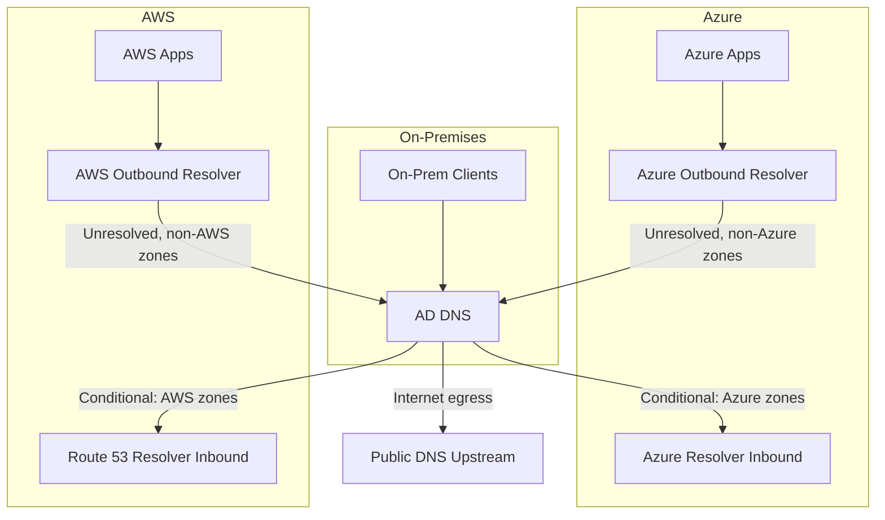
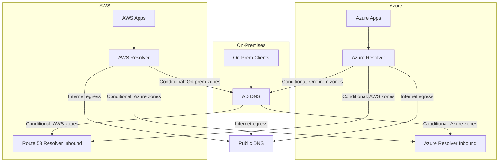
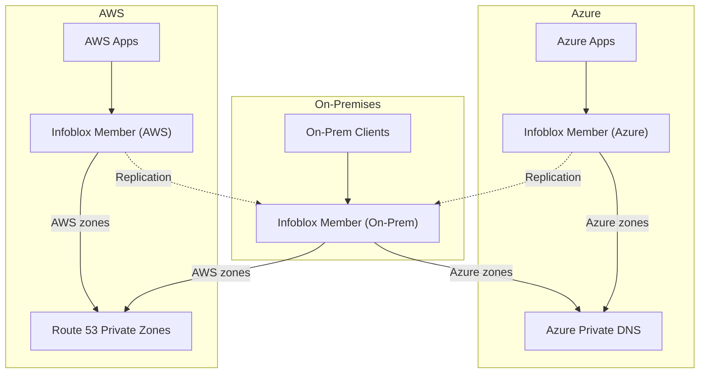

I've spent some time helping organisations move their DNS infrastructure from legacy on-premises Active Directory (AD) DNS to modern hybrid cloud environments. They're all different, but they all share some common threads.

If you're planning to migrate to a hybrid cloud environment, it's common to think about the connectivity first: expressroute/direct connect, VPN, SDWAN etc. But DNS should be top of the list. It's the foundation of your network. If your DNS isn't designed for hybrid it doesn't matter how good your connectivity is. Your applications won't be able to find each other, and your users won't be able to access services.

<!-- truncate -->

## Current State: Legacy On-Premise AD DNS

Most organisations I work with have been running Active Directory integrated DNS for fifteen or twenty years, I put a few in back in the early noughties. It's reliable, integrated with their domain infrastructure, and frankly, most people haven't thought about it in a decade. It has led to the anomaly where DNS in many companies lives with the server team or the identity team, not the network team.

But AD DNS has some limitations when you're trying to build a hybrid cloud infrastructure.

### The Pain Points with Active Directory DNS

The main issue is coupling. With AD integrated zones, DNS is tied to domain controller placement, so in hybrid you usually choose between keeping DNS anchored on-premises (which adds WAN dependency for cloud workloads) or deploying domain controllers in your cloud mostly to make AD DNS replication and locality work properly. In practice, that often pushes identity infrastructure decisions before teams are ready to move identity itself.

Replication delays are usually a consequence of that design, not a separate root cause. If the authoritative path still crosses WAN links, AD replication latency shows up as DNS convergence lag, and cloud and on-prem clients can briefly see different answers. At the same time, teams often introduce split responsibility by hosting some zones in AD DNS and others in cloud DNS platforms, which raises the risk of inconsistent records, harder troubleshooting, and more manual coordination.

Cloud platforms like Azure DNS, AWS Route 53, and Google Cloud DNS don't speak Active Directory. They speak DNS, but they don't do AD replication. Forwarding resolvers while keeping your AD zones authoritive and on premise is a mess that just hasn't happened yet.

Making sure that on-premises systems can resolve cloud hostnames, and cloud systems can resolve on-premises hostnames, requires careful configuration of conditional forwarders, zone transfers, or custom DNS deployments. Each approach has different security and performance implications.

## Why Migrate? Business Drivers

So why move away from something that's been stable for two decades? The biggest one is operational separation. When DNS moves off domain controllers, teams can manage DNS as a network platform service instead of a Tier 0 identity dependency. That changes approval paths, ownership, and delivery speed in a very practical way.

It also gives you a cleaner operating model for hybrid and multi-cloud. Rather than maintaining separate DNS tooling and workflows for on-prem and cloud, you can run one platform and one process. In most organisations that reduces friction and removes a hidden blocker to cloud adoption.

## Official Reference Architectures

Let me show you the official reference architectures that Infoblox and Microsoft have published. These are based on thousands of deployments.

### Microsoft Azure Hybrid DNS Architecture

Microsoft's official hybrid DNS architecture (from their Azure Architecture Center) emphasises several key principles that matter for any hybrid DNS design.

First, they recommend a hub-and-spoke topology. You've got a central hub VNet that hosts your connectivity resources (VPN/ExpressRoute gateways, firewalls). The DNS resolver sits in a separate shared services VNet, not in the hub itself. This reduces the blast radius if something goes wrong with your centralised infrastructure.

Second, the resolver itself is Azure DNS Private Resolver—a managed service which uses the [Azure Magic IP](azure-magic-ip.md). You don't run your own DNS resolver VMs. Azure manages the infrastructure, redundancy, and patching for you.

The resolver has two endpoints:

- **Inbound endpoint** (`/28` subnet minimum): This is where on-premises DNS servers send queries for Azure zones. You configure your on-premises AD DNS with conditional forwarders pointing to this endpoint. When an on-premises client needs to resolve a cloud-hosted service, the on-premises DNS server forwards that query to the inbound endpoint. The resolver resolves it from Azure's private DNS zones.

- **Outbound endpoint** (`/28` subnet minimum): This is where the resolver sends DNS queries to external targets. You configure DNS forwarding rulesets—rules that say "when someone queries for a zone in my on-premises domain, forward it to my on-premises DNS servers."

For the on-premises side, Microsoft recommends putting Azure DNS Private Resolver behind Azure Firewall. Azure Firewall acts as a DNS proxy. It receives DNS queries from workloads in Azure (configured as the VNet's custom DNS server), forwards them to the resolver's inbound endpoint, and enforces FQDN-based firewall rules. This gives you centralized DNS logging and control.

For multi-region deployments, Microsoft recommends using a single global private DNS zone (simpler) rather than regional zones. The global zone doesn't depend on any single region's infrastructure. In a catastrophic regional failure, the zone continues to operate. You do deploy one DNS Private Resolver per region, and each resolver's outbound forwarding rules include forwarders to all your on-premises DNS servers (so regional failures don't block on-premises lookups).

This is the official architecture. It's enterprise-grade, highly available, and clean. But it assumes you want Azure to be your primary DNS authority for all cloud zones.

### Infoblox Best Practices Reference Architecture

Infoblox's official guidance is different. It's designed for organisations that want Infoblox to be the primary authority.

The core model is Grid Master/Member. You deploy a Grid Master (typically on-premises, sometimes highly available with Grid Master redundancy). This Grid Master manages all DNS zones, policies, and configuration across your entire hybrid environment.

You then deploy Grid Members—DNS servers that report to the Grid Master. You've got Grid Members in your on-premises data centres, and you deploy Grid Members (as virtual NIOS instances) in Azure, AWS, and GCP. Every Grid Member synchronises zones with the Grid Master using TSIG-secured zone transfers.

For resilience, Infoblox recommends Anycast IPs. An Anycast IP is a single IP address that multiple DNS servers advertise. Queries to that IP go to the nearest healthy responder. It works [really well using BGP and Azure Route Server](azure-route-server-nios.md) and is easy to set up.

Threat protection is built-in. Infoblox can block malicious domains at the DNS layer, protecting your entire network. Policies are enforced across all Grid Members, so you get consistent behaviour everywhere.

IPAM is tightly integrated. You're managing your entire IP address space from the same console where you manage DNS. This matters for hybrid environments where on-premises and cloud IP space can easily collide.

This architecture keeps control on-premises. Azure has Grid Members, but the Grid Master stays on-premises. If you've got a team that's comfortable with Infoblox and wants to stay in control, this is the natural path.

### AWS Hybrid DNS Architecture

AWS's approach is philosophically similar to Azure's but uses different terminology and different tooling, so it's worth understanding the distinctions, especially in the [AWS Prescriptive Guidance hybrid DNS reference pattern](https://docs.aws.amazon.com/prescriptive-guidance/latest/patterns/set-up-dns-resolution-for-hybrid-networks-in-a-multi-account-aws-environment.html).

AWS uses Route 53 Resolver endpoints instead of managed resolver services. Resolver is the default recursive DNS resolver in every VPC, so it's already there, you just configure it with endpoints and forwarding rules.

Like Azure, AWS distinguishes between inbound and outbound endpoints. An **outbound endpoint** is where your VPC instances send DNS queries for on-premises zones. You configure forwarding rules (conditional forwarding) in Route 53 Resolver: "When you see a query for `corp.local`, forward it to these on-premises DNS server IPs." The outbound endpoint sends that query over your VPN or AWS Direct Connect link.

An **inbound endpoint** is the reverse. It's an IP address (in your VPC's subnets) that on-premises DNS servers can reach and query. You configure it to answer queries for zones hosted in Route 53 Private Hosted Zones. Your on-premises DNS servers point a conditional forwarder at the inbound endpoint IP, and on-premises clients get answers for your AWS-hosted zones.

The multi-account architecture in AWS is more complex than Azure because AWS environments typically use multiple accounts. AWS publishes a recommended pattern that centralises DNS endpoints in a "Shared Services" account in its [hybrid multi-account DNS guidance](https://docs.aws.amazon.com/prescriptive-guidance/latest/patterns/set-up-dns-resolution-for-hybrid-networks-in-a-multi-account-aws-environment.html). Route 53 Resolver rules and private hosted zones are created there and shared across accounts using AWS Resource Access Manager (RAM). This solves a practical problem: Route 53 quotas limit how many VPCs you can associate with a private hosted zone (300 per zone), so centralising in one account prevents you from hitting those limits as you scale.

For larger organisations, AWS recommends Route 53 Profiles. Profiles are a relatively recent feature that package DNS configurations (private hosted zones, forwarding rules, DNS firewall policies) into a single, shareable unit. Instead of manually associating zones and rules with dozens of VPCs, you create a Profile in your Shared Services account, add your zones and rules to it, share it via RAM, and apply it to target VPCs. This dramatically reduces operational overhead at scale.

The key difference from Azure is that AWS doesn't have a managed resolver service like Azure DNS Private Resolver. Instead, you're working with a more infrastructure-as-code model where you provision endpoints, configure rules, and manage associations yourself. This gives you more control but also more responsibility for capacity planning (Route 53 Resolver has per-endpoint throughput limits: 10,000 queries per second per network interface) and automation.

Where Infoblox fits in AWS is similar to Azure. You can deploy Infoblox Grid Members in AWS (as EC2 instances), and they communicate back to your on-premises Grid Master. Alternatively, you can use BloxOne Hosts in AWS, which sync with the BloxOne cloud console. For on-premises zones, both approaches work—Infoblox becomes the authoritative source, and AWS Route 53 Resolver forwards queries to it via the outbound endpoint.

The operational model is also similar: you're managing conditional forwarders and zone authorities. Pattern A keeps transition risk low by routing unresolved cloud queries back through on-premises DNS. Pattern B keeps internet egress local to each cloud while requiring explicit conditional rules for every remote zone family. Pattern C places resolver control in Infoblox-hosted cloud VMs and forwards cloud zones by rule to Route 53 or Azure DNS.

## AWS and Azure Comparison

The two clouds are more similar than different when it comes to hybrid DNS, but the details matter.

**Naming and terminology:** Azure calls it "DNS Private Resolver" with "inbound/outbound endpoints." AWS calls it "Route 53 Resolver endpoints" with the same concept. Azure has a managed service; AWS gives you more of a configuration service.

**Multi-account/multi-workspace complexity:** Azure's hub-and-spoke model is simpler for most organisations—one hub VNet, one shared services VNet, everything else is spokes. AWS requires thinking about account boundaries and using Shared Services accounts and RAM sharing. This isn't harder, just different.

**Conditional forwarding rules:** Both clouds support it. Azure calls them "DNS Forwarding Rulesets." AWS calls them "Route 53 Resolver Rules." Functionally identical.

**Scalability and performance:** Both have quotas and limits. Azure DNS Private Resolver handles extremely high query volumes by default. AWS Route 53 Resolver can also handle high volumes but you need to monitor per-ENI throughput (10,000 QPS per ENI) and add more ENIs if you exceed that. Both are highly available and multi-AZ by default.

**Cost:** AWS Route 53 Resolver charges per rule, per VPC association, per million queries. Azure DNS Private Resolver charges per hour per endpoint plus queries. At scale, you'll want to model the economics for your query volume. Generally, if you're running massive query volumes across many VPCs, AWS Profiles (for bulk associations) can be more cost-efficient. For smaller environments, Azure's per-endpoint model might be cheaper.

**Managed vs self-service:** Azure manages most of the infrastructure for you. AWS gives you more levers to pull, which is good if you need control and bad if you want things simple.

For hybrid DNS specifically, the architectural principles are identical: on-premises DNS talks to a cloud endpoint (inbound), cloud workloads talk to a resolver that forwards on-premises queries (outbound), and your own DNS infrastructure can be the source of truth for all zones or just for on-premises zones. The three patterns apply equally to both clouds.

If you're managing a multi-cloud environment (some workloads on AWS, some on Azure), the main operational difference is that you're managing two separate DNS control planes. Azure DNS and Route 53 don't talk to each other. Your zone taxonomy, conditional forwarding rules, and Infoblox sync configuration need to be maintained across both clouds independently. This is manageable but requires discipline.

## DNS Resolution Strategy: Three Patterns

The right model depends on how much change your teams can absorb. Most organisations need a transition pattern first, then decide if they stay there or move to a cloud-local egress pattern later.

### Pattern A: Transitional Forwarding with On-Premises DNS Egress

This is the low-impact starting state for many migrations. On-premises AD DNS keeps internet egress, and cloud platforms are added through conditional forwarding. You keep existing operational controls while introducing Azure and AWS resolution paths.

On-premises AD DNS forwards cloud zones (`*.azure.internal`, `*.aws.internal`, or your own cloud subdomains) to cloud resolver endpoints. Cloud resolvers use unconditional forwarding for anything non-local back to on-premises DNS. That means unresolved cloud queries still return to on-premises first, and on-premises decides whether to send them to AWS, Azure, or internet resolvers.

In a hybrid multi-cloud setup, Azure resolver forwards unresolved, non-Azure zones to on-premises DNS. On-premises DNS then conditionally forwards AWS zones to Route 53 Resolver endpoints. This creates cloud-to-cloud name resolution without creating direct Azure-to-AWS resolver coupling.

Benefits: lowest migration risk, no immediate internet egress change in cloud, centralised visibility during transition.

Pitfalls: on-premises DNS owns the forwarder burden, every new cloud zone needs conditional forwarder updates, and on-premises resolver outages affect all environments.

### Pattern B: Local Cloud Egress with Full Conditional Forwarding

This model keeps zone resolution explicit everywhere. Azure and AWS workloads use local cloud resolvers for internet DNS egress, while conditional forwarding rules are defined for each remote zone family (on-premises, Azure-private, AWS-private, and any delegated application zones).

It can perform well and gives local control per environment, but it is maintenance-heavy. Every new zone often means updates in multiple places: on-premises forwarders, Azure forwarding rulesets, and AWS Route 53 Resolver rules.

Benefits: local cloud internet egress, predictable zone routing, clearer cloud autonomy.

Pitfalls: high operational overhead, elevated risk of configuration drift, and slower change velocity when teams must coordinate rule updates for every new zone.

### Pattern C: DHCP-Directed DNS via Infoblox/VM Resolvers

This model uses custom DHCP options so cloud clients query VM-based resolvers first, commonly Infoblox NIOS members on EC2 or Azure VMs. These resolvers are authoritative for on-premises zones and use conditional forwarding rules for cloud zones in Azure and AWS.

The goal is policy consistency and deep control from a DNS platform your team already knows. Cloud DNS services still host cloud-native zones where needed, but the resolver decision point sits with Infoblox-hosted resolvers.

Benefits: consistent policy enforcement, central logging and security controls, strong fit for organisations already invested in Infoblox operations.

Pitfalls: you now run DNS infrastructure in cloud VMs, resolver scaling and HA become your responsibility, and DHCP misconfiguration can break resolution broadly.

## Summary

The architecture you choose comes down to where you want to carry operational load.

**Pattern A** keeps risk low during transition by preserving on-premises internet egress and central forwarding control.

**Pattern B** gives local cloud egress and explicit control, but costs more in day-to-day rule maintenance.

**Pattern C** centralises control through Infoblox-style resolvers in cloud VMs, but shifts responsibility for DNS runtime operations to your team.

There is no universal winner. The right answer is the one your teams can operate well at scale.

## Best Practices & Lessons Learned

The most important thing is understanding zone behaviour before you pick an architecture. If you classify zones by ownership and change frequency first, the design choices become clearer and you avoid expensive mid-project reversals. After that, tune TTLs to match actual change patterns instead of copying defaults from other environments. Stable zones can carry longer TTLs, while fast-moving service zones usually need shorter TTLs.

Zone delegation is your friend. It lets you migrate gradually and safely. Figure out your subdomain strategy before you start. If you're using pattern A, automate conditional forwarder management and zone registration updates so cloud zone onboarding does not depend on manual edits. Use Terraform or Ansible to manage your forwarder configurations. The less manual work you're doing, the less drift you'll have.

The rest is execution discipline. Plan delegation early so migration can happen in safe slices, automate sync and forwarder configuration where possible, and test failover paths deliberately instead of assuming they will work. Don't assume failover works. Simulate Azure-to-Infoblox link failures. Simulate Infoblox downtime. Test on-premises-to-cloud resolution with resolvers offline. Document what happens. Write runbooks. Once you have traffic on the new platform, measure real change rates and resolver behaviour for a few weeks, then tune policy and alerting from evidence rather than assumptions.

## Common Pitfalls to Avoid

I've seen these mistakes enough times that they deserve their own section.

The most common failure pattern is choosing architecture before understanding zone dynamics. Teams optimise for a clean diagram, then discover they signed up for constant rule maintenance or cross-team handoffs they cannot sustain. You choose pattern A because it feels safest, then never automate forwarder updates and slowly create a backlog of missing cloud zones. You choose pattern B for local egress, then underestimate how quickly conditional rules grow across both clouds. You choose pattern C for central control, then skip DNS VM capacity planning and find out during an incident.

Close behind that are migration hygiene issues. Your load balancer is configured to use a specific DNS server IP. During migration, that IP goes away. The load balancer can't resolve anything. You migrate with 24-hour TTLs. A record changes in Infoblox, but clients are still caching the old record for another 23 hours. They can't reach the service. Search your entire infrastructure for hard-coded DNS IPs beforehand. Replace them with DHCP-assigned DNS where possible. Lower TTLs 24-48 hours before cutover and raise them back up after.

Resilience mistakes are also common. You deploy one Azure DNS Private Resolver instance. It fails, and your entire hybrid DNS infrastructure collapses. Deploy resolver instances in multiple availability zones. Configure failover. Test it.

Another trap is underestimating operational overhead for your chosen pattern. Pattern A looks low risk but still needs disciplined forwarder lifecycle management. Pattern B gives local cloud egress but multiplies rule administration points. Pattern C gives central control but requires you to run and scale resolver VMs in cloud environments. Be honest about your team's operational maturity. Pick a pattern you can actually sustain.

Compressed migration timelines create avoidable outages. You want to get this over with. You speed up the migration. Suddenly you've got resolution failures in production that take hours to debug. Build in buffer time. Test each phase thoroughly. Incremental migration beats fast migration every time.

Finally, don't forget to plan how internet DNS queries work. You've planned how internal zones are resolved. But where do internet DNS queries go? If they go to Infoblox and Infoblox isn't configured for internet resolution, external DNS stops working. Explicitly map where internet DNS queries go. Test reaching external sites from both on-premises and cloud.

## Conclusion

Migrating from Active Directory DNS to Infoblox in a hybrid cloud environment is a significant change, but it's absolutely doable. The key to success is understanding your zone lifecycle (especially zone change frequency), picking an architecture pattern that matches your operational reality, and being patient with the migration.

Don't try to migrate everything at once. Use zone delegation to migrate gradually. Measure. Monitor. Document. Test failover scenarios explicitly.

The three patterns I've described, transitional forwarding, local cloud egress with full conditional forwarding, and DHCP-directed Infoblox resolvers, are not the only possible designs, but they cover most real-world scenarios. One of them likely matches your situation.

The organisations I work with that get this right have one thing in common: they understand the operational trade-offs of their chosen pattern and they've planned accordingly. They're not trying to be something they're not.

You'll get there. And once you do, you'll have DNS infrastructure that actually scales with your hybrid cloud, rather than fighting against it.
