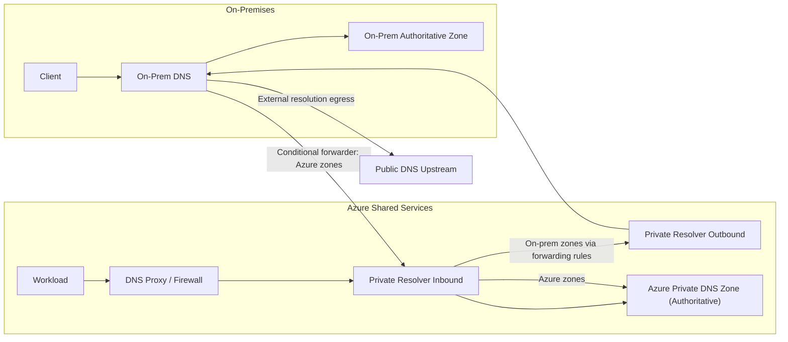
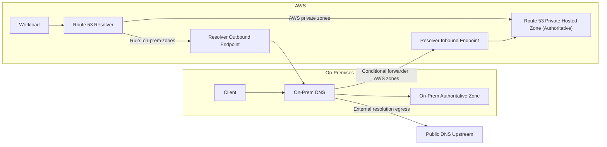
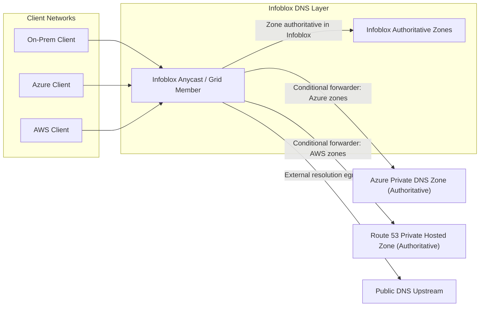

I've spent some time helping organisations move their DNS infrastructure from legacy on-premises Active Directory (AD) DNS to modern hybrid cloud environments. They're all different, but they all share some common threads.

If you're planning to migrate to a hybrid cloud environment, it's common to think about connectivity first: ExpressRoute, Direct Connect, VPN, SD-WAN, and so on. But DNS should be top of the list. It's the foundation of your network. If your DNS isn't designed for hybrid, it doesn't matter how good your connectivity is. Your applications won't be able to find each other, and your users won't be able to access services.

<!-- truncate -->

## Current State: Legacy On-Premises AD DNS

Most organisations I work with have been running Active Directory integrated DNS for fifteen or twenty years. I put a few in back in the early noughties. It's reliable, integrated with their identity infrastructure, and frankly, most people haven't thought about it in a decade. It has led to the anomaly where DNS in many companies lives with the server team or the identity team, not the network team.

But AD DNS has some limitations when you're trying to build a hybrid cloud infrastructure.

### The Pain Points with Active Directory DNS

The main issue is coupling. With AD integrated zones, DNS is tied to domain controller placement, so in hybrid you usually choose between keeping DNS anchored on-premises (which adds WAN dependency for cloud workloads) or deploying domain controllers in your cloud mostly to make AD DNS replication and locality work properly. In practice, that often pushes identity infrastructure decisions before teams are ready to move identity itself.

Replication delays are usually a consequence of that design, not a separate root cause. If the authoritative path still crosses WAN links, AD replication latency shows up as DNS convergence lag, and cloud and on-prem clients can briefly see different answers. At the same time, teams often introduce split responsibility by hosting some zones in AD DNS and others in cloud DNS platforms, which raises the risk of inconsistent records, harder troubleshooting, and more manual coordination.

Some of this is fixed by tiering your DNS so that you have resolvers for clients that are separate from your authoritative servers. This then introduces the potential for two teams managing different parts of the DNS infrastructure.

Cloud platforms like Azure DNS, AWS Route 53, and Google Cloud DNS don't speak Active Directory. They speak DNS, but they don't do AD replication. Running forwarding resolvers while keeping your AD zones authoritative and on-premises is possible, but it gets messy quickly without clear zone ownership and forwarding standards.

Making sure that on-premises systems can resolve cloud hostnames, and cloud systems can resolve on-premises hostnames, requires careful configuration of conditional forwarders, zone transfers, or custom DNS deployments. Each approach has different security and performance implications.

## Official Reference Architectures

Let's look at some of the official reference architectures from Microsoft Azure, AWS, and Infoblox. For the most part Azure and AWS have a similar philosophy, while Infoblox takes a different approach that assumes you want to keep Infoblox as the primary DNS authority across your entire hybrid environment.

### Microsoft Azure Hybrid DNS Architecture

Microsoft's official hybrid DNS architecture (from their [Azure hybrid DNS infrastructure reference architecture](https://learn.microsoft.com/en-us/azure/architecture/hybrid/hybrid-dns-infra)) emphasises several key principles that matter for any hybrid DNS design.

First, they recommend a hub-and-spoke topology. You've got a central hub VNet that hosts your connectivity resources (VPN/ExpressRoute gateways, firewalls). The DNS resolver sits in a separate shared services VNet, not in the hub itself. This reduces the blast radius if something goes wrong with your centralised infrastructure.

Second, Azure DNS Private Resolver is the managed resolver service. Azure Firewall DNS proxy is a separate optional component that can forward queries to Private Resolver when you want DNS inspection and FQDN-based policy enforcement in your firewall path.

The reason your queries need to hit the firewall first (and it doesn't have to be an Azure Firewall) is that many firewalls need to see DNS queries to enforce FQDN-based rules. If you put the resolver behind the firewall, you can enforce policies like "block access to `*.malicious.com`" at the firewall layer, which gives you better security and visibility.

The resolver has two endpoints:

- **Inbound endpoint** (`/28` subnet minimum): This is where on-premises DNS servers send queries for Azure zones. You configure your on-premises AD DNS with conditional forwarders pointing to this endpoint. When an on-premises client needs to resolve a cloud-hosted service, the on-premises DNS server forwards that query to the inbound endpoint. The resolver resolves it from Azure's private DNS zones.

- **Outbound endpoint** (`/28` subnet minimum): This is where the resolver sends DNS queries to external targets. You configure DNS forwarding rulesets—rules that say "when someone queries for a zone in my on-premises domain, forward it to my on-premises DNS servers."

For multi-region deployments, Microsoft recommends using a single global private DNS zone (simpler) rather than regional zones. The global zone doesn't depend on any single region's infrastructure. In a catastrophic regional failure, the zone continues to operate. You do deploy one DNS Private Resolver per region, and each resolver's outbound forwarding rules include forwarders to all your on-premises DNS servers (so regional failures don't block on-premises lookups).

Linking your zones to the shared services VNet ensures they can be resolved using the shared services inbound resolver.

> Time for a side note about the difference between the original simple DNS resolver service provided via the [magic IP](azure-magic-ip.md) and the new Azure DNS Private Resolver. The magic IP is the default DNS resolver for all Azure VMs unless you have custom DNS configured. It is reachable from any VNET but is not available from outside of Azure. An inbound resolver can answer queries from on-premises, but the magic IP cannot.

This is the official architecture. It's enterprise-grade, highly available, and clean. But it assumes you want Azure to be your primary DNS authority for all cloud zones.

#### Resolution Path Flow

### AWS Hybrid DNS Architecture

AWS's approach is philosophically similar to Azure's but uses different terminology and different tooling, so it's worth understanding the distinctions, especially in the [AWS Prescriptive Guidance hybrid DNS reference pattern](https://docs.aws.amazon.com/prescriptive-guidance/latest/patterns/set-up-dns-resolution-for-hybrid-networks-in-a-multi-account-aws-environment.html).

AWS uses Route 53 Resolver endpoints instead of managed resolver services. Resolver is the default recursive DNS resolver in every VPC, so it's already there, you just configure it with endpoints and forwarding rules.

Like Azure, AWS distinguishes between inbound and outbound endpoints. An **outbound endpoint** is where your VPC instances send DNS queries for on-premises zones. You configure forwarding rules (conditional forwarding) in Route 53 Resolver: "When you see a query for `corp.local`, forward it to these on-premises DNS server IPs." The outbound endpoint sends that query over your VPN or AWS Direct Connect link.

An **inbound endpoint** is the reverse. It's an IP address (in your VPC's subnets) that on-premises DNS servers can reach and query. You configure it to answer queries for zones hosted in Route 53 Private Hosted Zones. Your on-premises DNS servers point a conditional forwarder at the inbound endpoint IP, and on-premises clients get answers for your AWS-hosted zones.

The multi-account architecture in AWS is more complex than Azure because AWS environments typically use multiple accounts. AWS publishes a recommended pattern that centralises DNS endpoints in a "Shared Services" account in its [hybrid multi-account DNS guidance](https://docs.aws.amazon.com/prescriptive-guidance/latest/patterns/set-up-dns-resolution-for-hybrid-networks-in-a-multi-account-aws-environment.html). Route 53 Resolver rules and private hosted zones are created there and shared across accounts using AWS Resource Access Manager (RAM). This helps with governance and consistency at scale, but it doesn't remove private hosted zone association limits on its own.

For larger organisations, Route 53 Profiles are worth considering. Profiles are a relatively recent feature that package DNS configurations (private hosted zones, forwarding rules, DNS firewall policies) into a single, shareable unit. Instead of manually associating zones and rules with dozens of VPCs, you create a Profile in your Shared Services account, add your zones and rules to it, share it via RAM, and apply it to target VPCs. This can reduce operational overhead at scale.

The key difference from Azure is operational ownership. Azure DNS Private Resolver is a managed resolver platform, while AWS Route 53 Resolver gives you resolver building blocks that you assemble and operate. In AWS, teams usually define endpoint placement, security groups, route reachability, forwarding rules, and VPC associations as code, then manage that lifecycle continuously as accounts and VPCs change.

That model is powerful, but it shifts day-two work onto your platform team. Capacity planning is a good example: Route 53 Resolver throughput is tied to endpoint ENIs (10,000 QPS per ENI), so growth means adding ENIs and validating subnet/IP capacity, not just trusting a fully abstracted service limit. Rule sprawl is another example: as zone count and account count grow, association management and drift detection become just as important as the rules themselves.

In practice, AWS DNS at scale works best when you treat it like a product, not a one-time setup. Keep resolver endpoints, forwarding rules, and VPC associations in IaC, enforce naming and ownership standards for rules, and monitor query volume per endpoint so scaling decisions are proactive rather than incident-driven.

The operational model is also similar: you're managing conditional forwarders and zone authorities.

#### Resolution Path Flow

#### AWS and Azure Comparison

The two clouds are more similar than different when it comes to hybrid DNS, but the details matter.

**Naming and terminology:** Azure calls it "DNS Private Resolver" with "inbound/outbound endpoints." AWS calls it "Route 53 Resolver endpoints" with the same concept. Azure has a managed service; AWS gives you more of a configuration service.

**Multi-account/multi-workspace complexity:** Azure's hub-and-spoke model is simpler for most organisations—one hub VNet, one shared services VNet, everything else is spokes. AWS requires thinking about account boundaries and using Shared Services accounts and RAM sharing. This isn't harder, just different.

**Conditional forwarding rules:** Both clouds support it. Azure calls them "DNS Forwarding Rulesets." AWS calls them "Route 53 Resolver Rules." Functionally identical.

**Scalability and performance:** Both have quotas and limits. Azure DNS Private Resolver is designed to scale without you managing resolver hosts directly. AWS Route 53 Resolver can also handle high volumes but you need to monitor per-ENI throughput (10,000 QPS per ENI) and add more ENIs if you exceed that. Both can be highly available when you deploy endpoints across multiple availability zones.

**Cost:** AWS Route 53 Resolver pricing is primarily endpoint-hours (per endpoint ENI) and query volume. Azure DNS Private Resolver pricing is also endpoint-hours plus queries. At scale, you'll want to model the economics for your own query volume, endpoint footprint, and topology. Profiles can simplify operations in AWS, but they are not a direct pricing optimisation feature by themselves.

**Managed vs self-service:** Azure manages most of the infrastructure for you. AWS gives you more levers to pull, which is good if you need control and bad if you want things simple.

For hybrid DNS specifically, the architectural principles are very similar: on-premises DNS talks to a cloud endpoint (inbound), cloud workloads talk to a resolver that forwards on-premises queries (outbound), and your own DNS infrastructure can be the source of truth for all zones or just for on-premises zones. The same core pattern applies to both clouds.

If you're managing a multi-cloud environment (some workloads on AWS, some on Azure), the main operational difference is that you're managing two separate DNS control planes. Azure DNS and Route 53 don't talk to each other. Your zone taxonomy, conditional forwarding rules, and Infoblox sync configuration need to be maintained across both clouds independently. This is manageable but requires discipline.

### Infoblox Best Practices Reference Architecture

Infoblox's official guidance is different. It's designed for organisations that want Infoblox to be the primary authority, as shown in the [Infoblox NIOS DDI reference architecture and best practices](https://insights.infoblox.com/resources-reference-architectures/infoblox-reference-architecture-and-best-practices-for-nios-ddi).

The core model is Grid Master/Member. You deploy a Grid Master (typically on-premises, sometimes highly available with Grid Master redundancy). This Grid Master manages all DNS zones, policies, and configuration across your entire hybrid environment.

You then deploy Grid Members—DNS servers that report to the Grid Master. You've got Grid Members in your on-premises data centres, and you deploy Grid Members (as virtual NIOS instances) in Azure, AWS, and GCP. Every Grid Member synchronises zones with the Grid Master using TSIG-secured zone transfers.

For resilience, Infoblox recommends Anycast IPs. An Anycast IP is a single IP address that multiple DNS servers advertise. Queries to that IP go to the nearest healthy responder. It works [really well using BGP and Azure Route Server](azure-route-server-nios.md) and is easy to set up.

#### Resolution Path Flow

The practical design choice in this model is where authority sits for each zone family. Corporate and shared service zones are usually authoritative in Infoblox, so every environment gets one consistent answer for those names. Cloud-native zones can still stay authoritative in Azure Private DNS or Route 53 Private Hosted Zones when service integration or platform behaviour requires it. Infoblox then becomes the policy and control point that decides whether to answer directly or forward to the right cloud authority.

That separation is what makes the model scalable in hybrid environments. Clients keep a simple resolver path, usually to a local Anycast Infoblox endpoint. The complexity sits in controlled forwarding rules and zone ownership policy, not in every application team. In day-to-day operations, your DNS team manages one authoritative workflow for shared zones, one forwarding workflow for cloud-native zones, and one egress policy for external lookups.

Another benefit is operational guardrails. Because everything enters through the Infoblox DNS layer, you can apply consistent controls for logging, threat policy, and change management across on-premises, Azure, and AWS. The trade-off is that this architecture needs mature automation and clear ownership boundaries. If your zone lifecycle, forwarding rules, and cloud onboarding process are not documented and version controlled, drift builds quickly.