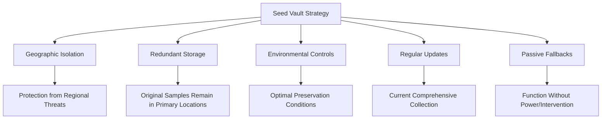

---

title: Lessons from Svalbard
authors: simonpainter
tags:
  - educational
  - personal
  - opinion
  - business

date: 2025-05-09

---

The Arctic wind whipped across my face as I looked up at the entrance of what might be humanity's most important insurance policy. It has been a place that has fascianted me since I read a New Scientist article about it many years ago, and there I was, staring at the concrete wedge jutting from the mountainside, its façade glittering with an art installation that catches the summer Arctic sunlight.

## An Unexpected Lesson in Disaster Recovery

My recent visit to Svalbard, home of the Global Seed Vault, offered surprising insights into IT disaster recovery practices - and a stark reminder of its real-world importance.

This "doomsday" seed bank, nestled deep in Arctic permafrost, safeguards millions of crop seeds. Its mission? To preserve agricultural biodiversity against global catastrophes.

I'm not a botanist or agricultural expert. I'm an IT professional who happened to be on holiday in one of the world's most remote locations. But standing there, I couldn't help but see the striking similarities between this frozen fortress and the backup strategies we implement in our digital worlds.

## The Architecture of Resilience

The parallels to IT backup strategies aren't just coincidental - they're fundamental principles of resilience:

### Geographic Isolation

The vault sits 800 miles inside the Arctic Circle on the Norwegian island of Spitsbergen. This remote location provides natural protection from many threats that might affect multiple locations simultaneously.

It's the physical equivalent of air-gapping critical backups - keeping them completely disconnected from potentially compromised networks.

### Redundancy by Design

The vault doesn't hold original samples - it stores duplicates from gene banks worldwide. This approach preserves the original specimens in their primary locations while creating an additional safety net.

In IT terms, this is like maintaining your primary data stores while creating offline backups that remain untouched until needed.

### Environmental Controls with Passive Fallbacks

While the vault has cooling systems to maintain the optimal -18°C temperature for seed preservation, it's also built to take advantage of natural cooling. The permafrost and thick rock provide passive temperature regulation if systems fail.

This reminds me of the best disaster recovery setups, which don't rely solely on active systems that can fail but incorporate passive measures that continue working without power or intervention.

### Regular Updates

The vault receives new deposits from around the world, keeping its collection current and comprehensive. It's not a static resource but a living archive that grows and evolves.

Just like our backup systems shouldn't be "set and forget" solutions but regularly updated repositories that reflect our changing data landscape.

## From Theoretical to Practical: The Syrian Withdrawal

Recent events have proven the vault's critical value. In 2015, the Syrian civil war led to the first-ever withdrawal from the vault. The International Center for Agricultural Research in the Dry Areas (ICARDA) requested the return of some of its samples after its Aleppo facility became inaccessible due to conflict.

This wasn't a hypothetical doomsday scenario from a disaster planning exercise. It was a real organisation facing a real crisis that had compromised their primary facility.

The seeds from Svalbard allowed ICARDA to establish new gene banks in Morocco and Lebanon, effectively "restoring from backup" their invaluable collection of drought-resistant crops from the Fertile Crescent - the birthplace of agriculture.

This real-world example underscores a crucial lesson for IT professionals: disasters aren't just hypothetical scenarios. They can and do happen, often in unexpected ways.

## The Vault's Design Philosophy

The Svalbard vault's design mirrors best practices in data protection:



The vault relies on multiple layers of protection:

- It's built high above sea level to protect against rising waters and flooding
- It uses permafrost and thick rock for natural cooling, reducing dependency on artificial systems
- Its contents are duplicates, preserving original samples in their primary locations when possible
- The facility is designed to run with minimal human intervention

Standing in that frozen landscape, I couldn't help but think about our own backup strategies. How many of these principles do we truly incorporate?

## Lessons for IT Professionals

As IT professionals, we should ask ourselves:

### Are our backups truly isolated?

The vault is physically isolated from the facilities it's backing up. In IT terms, this means having backups that can't be compromised by the same threats that might affect your primary systems.

It's not enough to back up to another server in the same data centre. True isolation means geographic separation and network separation.

### Do we have passive protections?

The vault uses natural cooling from permafrost as a backup to its mechanical cooling systems. What passive protections do your backup systems have?

Could your recovery processes still function if primary infrastructure were completely unavailable? Do you have documentation accessible outside your normal systems?

### Have we tested real restoration?

ICARDA successfully restored their seed collection from the vault. When was the last time you tested a full restoration from your backups?

Not just verifying that the backup completed successfully, but actually restoring the data and confirming it works as expected.

### Do we plan for physical inaccessibility?

The Syrian withdrawal happened because the original facility became physically inaccessible due to conflict. In our increasingly uncertain world, how would you access your backups if your primary facility were suddenly inaccessible?

This might sound far-fetched, but disasters from flooding to fire to civil unrest can make facilities temporarily or permanently inaccessible.

## Implementation in Practice

What might these principles look like in a practical IT context? Here's a simplified approach:

```python
def implement_seed_vault_principles(organisation_data):
    """Apply Svalbard Seed Vault principles to data protection.
    
    This function creates a resilient backup strategy based on
    the principles observed at the Global Seed Vault.
    """
    # Create geographically isolated backups
    primary_backups = create_local_backups(organisation_data)
    offsite_backups = send_to_remote_location(primary_backups)
    
    # Ensure environmental controls with passive fallbacks
    for backup_location in all_backup_locations:
        if not has_passive_cooling(backup_location):
            add_passive_cooling(backup_location)
        
        if not has_backup_power(backup_location):
            add_backup_power(backup_location)
    
    # Schedule regular updates
    schedule_regular_backups(organisation_data, frequency='daily')
    
    # Test restoration processes
    for critical_system in organisation_data.critical_systems:
        test_restoration(critical_system)
        document_restoration_process(critical_system)
    
    # Create physical access contingency plans
    backup_access_methods = create_contingency_access(all_backup_locations)
    distribute_access_methods(trusted_personnel)
    
    return resilient_backup_strategy
```

The key is thinking beyond traditional backup approaches to create truly resilient systems that can withstand not just technical failures but real-world disasters.

## A Reminder of Real Stakes

The Seed Vault reminds us: Whether it's crops or data, robust backup strategies are essential for our collective future. And as the Syrian example shows, these aren't just theoretical precautions - they're practical necessities in an unpredictable world.

As I left Svalbard, I carried with me not just photos of a unique facility but a renewed perspective on my role as an IT professional. Our work in creating resilient systems isn't just about meeting compliance requirements or following best practices - it's about creating safety nets that might one day prove as crucial as those frozen seeds.

In IT, we often talk about disaster recovery in abstract terms. The Global Seed Vault makes it concrete. It's a physical manifestation of hope and foresight - qualities we should all bring to our work in protecting the digital resources that power our world.

What backup principles from the Seed Vault could you apply to your own systems? I'd love to hear your thoughts.
