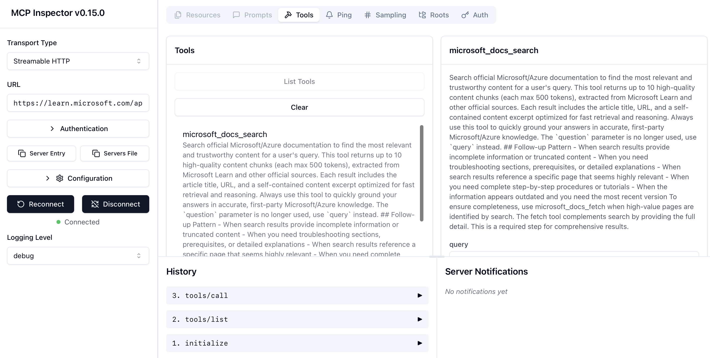

---

title: MCP Inspector
authors: simonpainter
tags:
  - ai
  - python
  - mcp
date: 2025-08-19

---

While rage coding a [python MCP server for NetBox](netbox-mcp-server.md) I realised I needed a better way to test it. You can use CURL to make requests of course but it turns out that there is a handy node.js package that provides comprehensive test capabilities for MCP servers.
<!-- truncate -->
The `npx @modelcontextprotocol/inspector` command is the **official visual testing and debugging tool** for Model Context Protocol (MCP) servers, providing users with an interactive interface to test, debug, and validate MCP implementations. Created by Anthropic as part of the open MCP ecosystem, this tool is useful for anyone building AI applications that connect to external data sources and tools.

The MCP Inspector serves as a development and debugging platform for MCP servers. It functions like a browser developer console specifically designed for the Model Context Protocol, allowing people to inspect server capabilities, test tool execution, examine resources, and monitor real-time protocol communications.

### Zero-installation approach

The inspector requires no local installation - npx handles all dependency management:

```bash
# Direct execution downloads and runs latest version
npx @modelcontextprotocol/inspector
```

This zero-installation approach makes it easy to get started quickly without worrying about version conflicts or local dependencies. It also ensures you always run the latest version of the inspector.

There are plenty of CLI options you can investigate but the web interface provides a more user-friendly way to interact with the inspector's features.



Open the web interface, click around, see what tools are available. Test them with different inputs. Watch the protocol messages in the logs. That's how I learned my way around MCP - not by reading specs, but by playing with real servers and seeing what happens.
