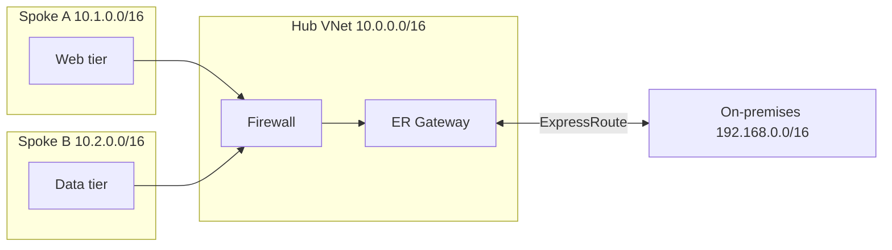
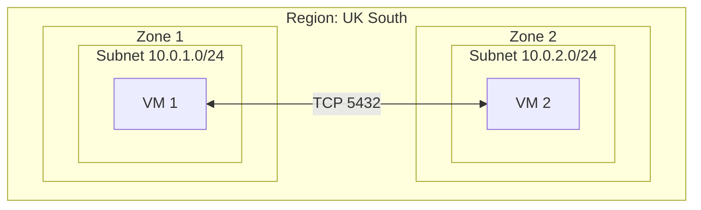

---

title: Why I draw network diagrams in Mermaid
authors: simonpainter
tags:
  - opinion
  - documentation
  - github
date: 2026-09-11

---

I've drawn a lot of network diagrams over the years. Visio, Lucidchart, draw.io, the back of a napkin and, on one or two occasions, a whiteboard with the wrong marker. These days I keep a whiteboard in my office for sketches and a Wacom tablet for Teams calls. But the ones that matter I draw in Mermaid, and I've come to think it's the right tool for most of what network engineers need to say with a picture.
<!-- truncate -->
This isn't a tutorial. There are plenty of those, and the [Mermaid docs](https://mermaid.js.org/) are good. This is an argument for why diagram-as-code suits network diagrams in particular, and why I think we've been getting our priorities wrong for a long time.

## We judge the icons, not the information

Here's a test. Think about the last time you sat in a design review and someone put a network diagram on the screen. What was the first comment? I'd bet it wasn't about the routing design. It was about whether the firewall icon was the right vendor's, or why the cloud was the wrong shade of blue, or that the arrows didn't line up.

I've watched a room spend twenty minutes debating whether to use the official Azure icon set or the "nicer looking" one from a third party. I've actually written standards documents saying we must use the [Visio 3015 stencil set](https://www.cisco.com/c/en/us/about/brand-center/network-topology-icons.html) for all Cisco design documents, something that makes me facepalm now. Nobody reading that standard would have asked whether the diagram answered the question it was drawn to answer. We've built a culture where a network diagram is judged as a piece of graphic design before it's judged as a piece of communication.

The trouble is that style gets in the way of content. A diagram covered in glossy vendor icons looks finished and authoritative, so nobody questions it. A plain boxes-and-lines sketch looks like a draft, so it gets picked apart. That's backwards. The sketch is often the more honest of the two because it hasn't been dressed up.

Mermaid takes most of that choice away from you, and I think that's a feature. You get boxes, lines, labels and groupings. You can tweak colours if you must, but the tool pushes you towards spending your effort on what connects to what. When the only thing you can change is the content, the content is what people look at.



That diagram took me about two minutes and it tells you everything you need to know about how traffic gets from a spoke to the data centre. I didn't have to pick an icon, align anything or decide how big the boxes should be.

## Diagrams that live in version control

The second argument is the one that convinced me in the first place. Mermaid is text. It lives in a `.md` file (or a `.mmd` file) alongside the rest of the documentation, which means it lives in git alongside the rest of your documentation-as-code.

Think about what happens when a diagram is a PNG exported from Visio. Somebody changes the design, opens the original file (if they can find it), moves a box, exports a new PNG and commits it over the top of the old one. The diff in the pull request shows you a binary blob changed. You have no idea what's different unless you open both images side by side and play spot the difference. And if the original Visio file was on someone's laptop, the whole thing is a dead end the day they leave.

With Mermaid the diff shows you exactly what changed. A new line for a new peering. A changed label when a subnet was resized. A deleted block when a firewall was decommissioned. You change the part, not the whole.

```text
     subgraph SpokeB["Spoke B 10.2.0.0/16"]
         B["Data tier"]
     end
+    subgraph SpokeC["Spoke C 10.3.0.0/16"]
+        C["Batch tier"]
+    end
     OnPrem["On-premises 192.168.0.0/16"]

     A --> FW
     B --> FW
+    C --> FW
```

That's a real review. A colleague can look at that diff and see that a new spoke was added and it routes through the firewall like the others. They can comment on the specific line. They can ask why it's not going somewhere else. Try doing that with two PNGs.

It also means the diagram can go through the same pipeline as everything else. I've written before about [accessibility checks in CI](accessibility-and-ci.md) and the same idea applies here. If your diagram is code, you can lint it, test that it renders, and fail the build if someone breaks it. My blog does exactly that.

The other thing this buys you is that the diagram and the thing it describes can change in the same commit. If I add a VNet in Terraform I can add it to the diagram in the same pull request. The reviewer sees both. The documentation stops drifting from reality because the two are never more than one commit apart.

## Networks are links between nested things

The third argument is the one I've come to believe most strongly. Ask yourself what a network engineer does. Strip away the vendor names and the acronyms and it comes down to this: we connect things. Physical connections between devices. Logical connections between subnets. Peerings between VNets. Tunnels between sites. Sessions between routers.

Sure, we secure the network too, but we do that by enabling the right connectivity and not the wrong connectivity. I don't want to boil down a decade of pulling cables and pulling my hair out, or trivialise the complexities involved, but everything we build is a graph. Nodes and edges. Some of the nodes contain other nodes: a rack contains switches, a VNet contains subnets, a region contains availability zones. That's it. That's the whole job when you squint at it.

Mermaid's flowchart syntax is a graph with nested groups. You declare nodes, you put them inside subgraphs, and you draw edges between them. It maps onto how I think about a network so well that writing the diagram often feels like writing the design itself.



I didn't have to think about layout. I described the containment and the connection and the tool worked out the rest. Compare that to Visio where I'd have drawn a big rectangle, then two smaller ones, then two smaller ones again, then resized everything three times when the labels didn't fit.

When the layout is automatic, you stop making decisions about where things go and start making decisions about what things are. That's a much better use of an engineer's time. And when a diagram gets too busy to read, that's usually a sign the design is too busy too. Mermaid is honest about that in a way a hand-tidied Visio drawing isn't.

## What it's not good at

I'll be fair. Mermaid isn't the answer to everything. If you need a rack elevation with exact port numbers, it's the wrong tool. If you need a customer-facing diagram for a sales deck, the auto layout will annoy you and you'll want something you can nudge by hand. If you've got a couple of hundred nodes, the rendered output becomes a hairball and you should be splitting it into several diagrams anyway.

There's also a learning curve for anyone who's never written markup before. It's shallow, but it's there, and asking a project manager to edit a `.md` file to fix a typo in a diagram is a harder sell than asking them to open Visio.

None of that changes my mind for the diagrams I draw most often. Design documents, runbooks, pull requests, blog posts. Anywhere the diagram sits next to text that also lives in git, the diagram should be code too.

## The point

I don't like Mermaid because it makes pretty pictures. It doesn't, really. I like it because it makes me focus on the right things. It stops me [fiddling with icons](mermaid-icons.md) and forces me to describe connections. It puts my diagrams under the same review process as my code. And it models a network the way I already think about one: things inside things, joined by lines.

If you're still exporting PNGs from Visio and committing them next to your Terraform, try describing one of them in Mermaid instead. You'll spend less time on it, and the next person to change it will thank you.
