```mermaid
architecture-beta

  service git(logos:git-icon)[Git]
  service github(logos:github-icon)[GitHub]
  service github-action(logos:github-actions)[GitHub Action]
  service s3(logos:aws-s3)[S3 Bucket]
  service docusaurus(logos:docusaurus)[Docusaurus]

  git:R --> L:github
  github:R --> L:github-action
  github-action:R --> L:docusaurus
  docusaurus:R --> L:s3
```

---

title: Custom icons for Mermaid diagrams in Docusaurus
authors: 
  - simonpainter
tags:
  - github
  - github-actions
  - docusaurus
  - cicd
date: 2025-09-24

---

I have tried to move to exclusively using Mermaid for diagrams in my blog posts and documentation. It is a great tool for creating diagrams in a text based format that can be version controlled and easily edited. One of the limitations I have found is the lack of custom icons. This has been addressed by using the Iconify library which has a large collection of open source icons. Combined with the architecture-beta diagram type in Mermaid it is possible to create some great looking diagrams that go beyond the basic flow diagrams I have been using until now.
<!-- truncate -->
I have added support in my Docusaurus site for one of the icon sets. Unfortunately these icons are not supported in Github and some other markdown renderers so the diagrams will only render correctly on my site. There is an edit button at the bottom of each post so you can see the source and the Github rendered version.

To get started I needed to add a logo set to my development environment. I chose [the logos collection](https://icon-sets.iconify.design/logos/) which has a good selection of common icons including some AWS icons. To install it in your Docusaurus project run the following command in the root of your project.

`npm install @iconify-json/logos`

There are many other [icon sets available](https://icon-sets.iconify.design) which cover a wide range of use cases and they all rely on the [Iconify](https://iconify.design/docs/types/iconify-json.html) framework.

As I had installed a package I needed to add it to my Docusaurus packages.json file.

```json
{
  "dependencies": {
    "@iconify-json/logos": "^1.2.9"
  }
}
```

Next I needed to add a script to load the icons into Mermaid. I created a new file in `src/scripts/mermaid_icons.js` and added the following code.

```javascript
import mermaid from 'mermaid';
import { icons } from '@iconify-json/logos';
mermaid.registerIconPacks([
  {
    name: icons.prefix, // To use the prefix defined in the icon pack
    icons,
  },
]);
```

Finally I needed to import the script in my `docusaurus.config.js` file so that it is loaded when the site is built.

```javascript
  clientModules: [require.resolve('./src/scripts/mermaid_icons.js')]
```

The whole change was implemented in [this PR](https://github.com/simonpainter/www.simonpainter.com/pull/159/files?new_files_changed=true) which you can use as a reference.

>Now when I merge a new pull request the Github action installs the icon library as a dependency and then the diagrams are rendered directly into the site. As you may know from my [previous post](s3-docusaurus.md) the Github action then deploys the site to an S3 bucket for hosting.

Here's an example of a diagram using the new icon set:

```text
architecture-beta

  service git(logos:git-icon)[Git]
  service github(logos:github-icon)[GitHub]
  service github-action(logos:github-actions)[GitHub Action]
  service s3(logos:aws-s3)[S3 Bucket]
  service docusaurus(logos:docusaurus)[Docusaurus]

  git:R --> L:github
  github:R --> L:github-action
  github-action:R --> L:docusaurus
  docusaurus:R --> L:s3
```


