---

title: Custom icons for Mermaid diagrams in Docusaurus
authors: 
  - simonpainter
tags:
  - github
  - github-actions
  - docusaurus
date: 2025-09-24

---

I have tried to move to exclusively using Mermaid for diagrams in my blog posts and documentation. It is a great tool for creating diagrams in a text based format that can be version controlled and easily edited. One of the limitations I have found is the lack of custom icons. This has been addressed by using the Iconify library which has a large collection of open source icons. Combined with the architecture-beta diagram type in Mermaid it is possible to create some great looking diagrams that go beyond the basic flow diagrams I have been using until now.
<!-- truncate -->
I have added support in my Docusaurus site 

Implemented by [this PR](https://github.com/simonpainter/www.simonpainter.com/pull/159/files?new_files_changed=true)

`npm install @iconify-json/logos`


```text
architecture-beta

  service git(logos:git-icon)[Git]
  service github(logos:github-icon)[GitHub]
  service github-action(logos:github-actions)[GitHub Action]
  service s3(logos:aws-s3)[S3 Bucket]
  service docusaurus(logos:docusaurus)[Docusaurus]

  git:R --> L:github
  github:R --> L:github-action
  github-action:R --> L:docusaurus
  docusaurus:R --> L:s3
```

```mermaid
architecture-beta

  service git(logos:git-icon)[Git]
  service github(logos:github-icon)[GitHub]
  service github-action(logos:github-actions)[GitHub Action]
  service s3(logos:aws-s3)[S3 Bucket]
  service docusaurus(logos:docusaurus)[Docusaurus]

  git:R --> L:github
  github:R --> L:github-action
  github-action:R --> L:docusaurus
  docusaurus:R --> L:s3
```


