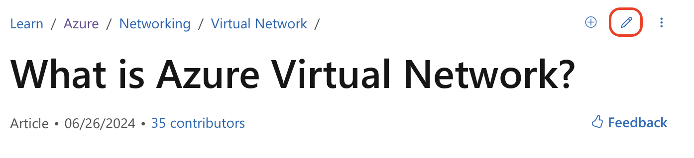
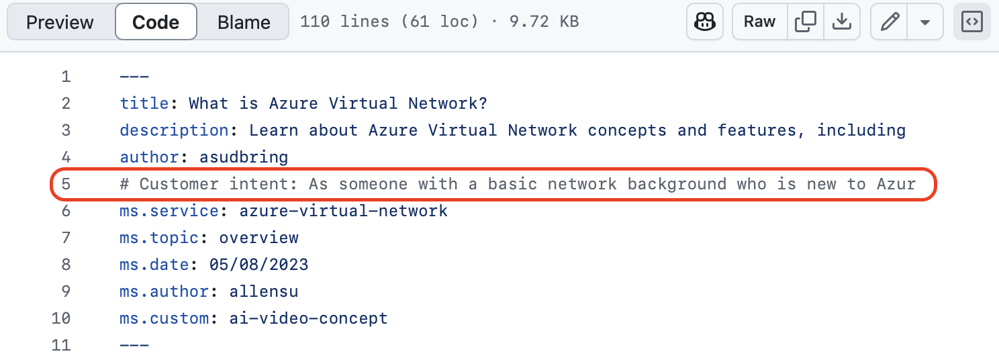

---

title: Microsoft documentation hidden intent
authors: simonpainter
tags:
  - business
  - cloud
  - azure
  - github
  - personal
date: 2025-02-18

---

I found an interesting little field hidden in plain sight in Microsoft documentation. A clever chap recently said this to me: 'if you can figure out what problem the engineers were trying to solve then it makes it easier to understand why the product works the way it does'.
<!--truncate-->

Microsoft documentation is now pretty much all backed by a [GitHub](https://github.com/MicrosoftDocs) repository, much like this site is. The idea is that anyone can improve on it by submitting pull requests as you might do on an open source software project. Also much like this site, there's an easy button to link from each page to the markdown file that the page is generated from - you can see it in the top right of the page below; you'll also see that [this particular page](https://learn.microsoft.com/en-us/azure/virtual-network/virtual-networks-overview) has had contributions from a fair few people.



The [markdown renders pretty well in GitHub](https://github.com/MicrosoftDocs/azure-docs/blob/main/articles/virtual-network/virtual-networks-overview.md) and you get access to the full version history of the document including the brilliant [Blame view](https://github.com/MicrosoftDocs/azure-docs/blame/main/articles/virtual-network/virtual-networks-overview.md) which shows you who wrote what and when. What I found most interesting though is tucked away as a comment in the markdown and only visible if you look at the [unrendered code](https://github.com/MicrosoftDocs/azure-docs/blob/main/articles/virtual-network/virtual-networks-overview.md?plain=1).



The quality of the intent field does vary but it gives an excellent view of what the document is trying to convey, and with some features it gives an insight into what problem the feature itself is trying to solve.

```markdown
# Customer intent: As someone with a basic network background who is 
new to Azure, I want to understand the capabilities of Azure Virtual
Network so that my Azure resources can securely communicate with each
other, the internet, and my on-premises resources.
```

I've found this little discovery incredibly useful when I'm trying to get my head around complex Azure features. It's like getting a peek inside the minds of the docs team and understanding who they were writing for and what problems they thought their readers needed to solve.

For instance, when I was grappling with understanding Azure Private Link (which can be a bit tricky!), looking at the customer intent helped me realize they were targeting network engineers who already understood VPNs and VNet peering but needed to understand this new concept in that context. It completely changed how I approached the documentation.

I've also started using this approach in my own technical writing. Before I start a new article, I now write down a similar "reader intent" statement to help me focus on what problem I'm helping my readers solve.

If you're studying Microsoft documentation a lot, it's definitely worth checking this field out. It might just give you the context you need to really understand what they're trying to explain. And if you're writing technical documentation yourself, consider adding your own "intent" comments - even if they're just for your own reference.

Have you found any other hidden gems in technical documentation? I'd love to hear about them!