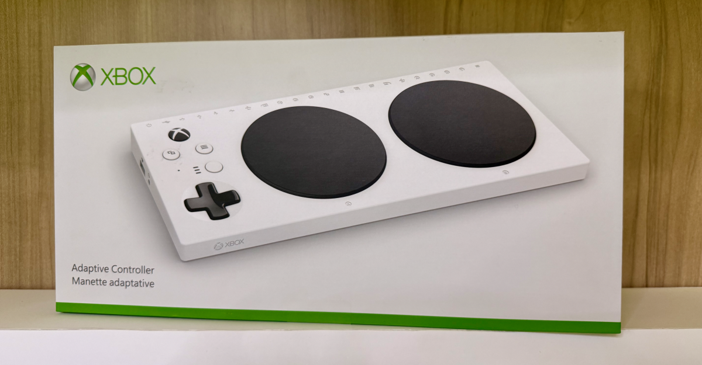

---

title: A visit to the Microsoft Inclusive Tech Lab
authors: simonpainter
tags: 
  - personal
  - opinion
date: 2026-03-26

---

This week I have been fortunate enough to visit the Microsoft Campus in Redmond, Washington, for [MVP Summit](most-valuable-professional.md). Most of what goes on at Summit is under a very strict NDA because we have had the chance to meet the product teams, get an understanding of the roadmap and provide some, often unvarnished, feedback on the products. One of the other opportunities we got was to go on some tours of the campus which is steeped in a history of innovation that has been going on for all of my life. In addition to the excellent tour of the Microsoft Archives, I was able to visit the Inclusive Tech Lab and was introduced to some of the things that Microsoft is doing to break down barriers to tech for people with a range of abilities.
<!-- truncate -->

At the [Inclusive Tech Lab](https://www.microsoft.com/en-us/inclusive-tech-lab) we met Bryce. Bryce is a man with a mission. Actually he's a man with at least two missions. The first is to make technology more inclusive and accessible to everyone. The second is to make sure that people know about it.

Bryce is the co-creator of the [Xbox Adaptive Controller](https://www.xbox.com/en-US/accessories/controllers/xbox-adaptive-controller) which is something I first saw yesterday in the Microsoft Store on Campus and didn't really understand what it was. The name actually gives a lot of it away. It's a controller for the Xbox that looks to the Xbox like any other controller but to the user it can be adapted to their needs. The back of the controller has a number of ports which can be connected to switches (that's buttons to you and me, but Bryce is a stickler for the right terminology) and these switches come in a range of sizes, shapes and configurations to be laid out exactly how the gamer needs them to be.

Bryce showed us how the typical controller has evolved to suit a very specific set of needs and the designers have made assumptions on fine motor capabilities, strength, range of motion and so on. The adaptive controller is designed to be used by gamers who don't have the same capabilities as the typical gamer and so it can be adapted to suit their needs.

Born in 2017 as part of the Xbox devices team, the Inclusive Tech Lab has now spread into many different areas of tech adoption across software and hardware. A smaller [adaptive hub](https://www.microsoft.com/en-us/store/b/accessible-adaptive-devices-accessories) brings the same flexibility to the PC in order to enable people for whom the usual human interface devices are not suitable to be able to use a PC. What is incredible, and a real testament to the way Microsoft has embraced the idea of open source, is that there are a [range of STL files available to download for free](https://support.microsoft.com/en-us/surface/accessories/3d-printable-designs-for-microsoft-adaptive-accessories-surface-pen-and-microsoft-pens) so that anyone with access to a 3D printer can adapt the switches and adaptive mouse to suit their needs. This captures the idea of inclusive technology design being about solving the problem for one person at a time and not trying to always find a one size fits all solution.

But solving problems is only part of the story, the other part is ensuring that everyone who needs to know about these solutions does know about them. Bryce and the team have done 25,000 tours of the lab to reach as many people as they can. They have a banner on their site to encourage people to [book a tour](https://www.microsoft.com/en-us/inclusive-tech-lab) and do these both in person on the Microsoft Campus and virtually.

The Xbox Adaptive Controller and the work of the Inclusive Tech Lab represent something that should be obvious but isn't: technology belongs to everyone. Not because we're being charitable, but because problems come in infinite varieties and so do solutions. One person needs larger switches, another needs to arrange them differently, and someone else needs an entirely different way to interact with their devices. The genius isn't in building something that works for everyone—it's in building a system flexible enough to work for anyone.
