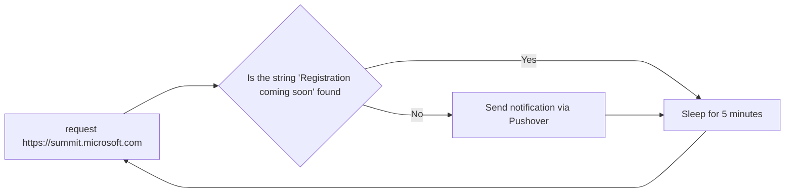
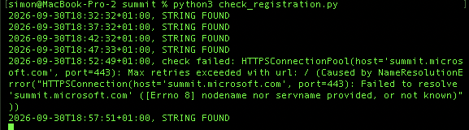

---

title: Watching for MVP Summit Registration With a Python Script
authors: simonpainter
tags:
  - python
  - automation
  - personal
date: 2026-03-01

---

[MVP Summit](/most-valuable-professional) registration for in-person places opens with no warning whatsoever. No countdown, no email, no "registration opens Tuesday at 9am" - the page just quietly changes one day and the places go on a first come, first served basis. I booked my flights before getting my spot last year, so I wrote a small Python script to watch the page for me. It's back on duty again this year, so here's how it works.
<!-- truncate -->

## The Problem It Solves

The [Summit site](https://summit.microsoft.com/) carries a holding message until registration opens, something like "Registration coming soon." When that phrase disappears, it means the form has gone live and the clock is ticking on a limited number of seats. Sitting there hitting refresh every few minutes for days on end isn't a great use of anyone's time, and it's exactly the kind of repetitive checking a computer is better at than I am.

> This is, of course, also a great example of something an AI agent could also do: it could monitor the page and interpret the intent behind any content changes. It's also a reminder that not every automation needs to be AI-powered; sometimes a simple deterministic script is enough to solve a simple deterministic problem.

So the script does the boring bit: it fetches the page on a timer, looks for the phrase, and only bothers me the moment it's gone.



## Fetching the Page

The core loop is deliberately unexciting. Every five minutes it makes a plain HTTP GET request to the Summit homepage using the `requests` library:

```python
response = requests.get(URL, timeout=20)
```

There are a couple of safety checks around that call worth pointing out. First, it wraps the request in a `try/except` for `requests.RequestException`, so a dropped connection or a timeout just gets logged and the script quietly waits for the next cycle rather than crashing at 3am. Second, it checks the HTTP status code and the final URL the browser was redirected to:

```python
if response.url not in EXPECTED_URLS:
    print(f"{timestamp}, check failed: unexpected destination {response.url}", flush=True)
    return alert_sent
```

That second check matters more than it looks. Microsoft sometimes redirects visitors to a locale-specific URL like `/en-us/`, and if the site ever redirected somewhere unexpected - a maintenance page, a different campaign, whatever - I'd rather the script say "something's changed here, I'm not sure what I'm looking at" than silently search the wrong page and stay quiet forever.

Here's the script running on my laptop this week, quietly logging "STRING FOUND" every five minutes:



Notice the one line in the middle that doesn't match the pattern - my Wi-Fi dropped for a moment and the DNS lookup for `summit.microsoft.com` failed outright. That's exactly the `requests.RequestException` branch doing its job: it logged `check failed` with the underlying error and carried straight on to the next cycle, rather than crashing and leaving me with a dead script and no idea why.

## Looking for the Phrase

Once it has a valid response, the check itself is a one-line substring search:

```python
if PHRASE in response.text:
    print(f"{timestamp}, STRING FOUND", flush=True)
    return alert_sent
```

`PHRASE` is `"Registration coming soon"`. While that phrase is still in the page, nothing else happens - the function returns and the main loop sleeps for another five minutes. The moment it's absent, the script assumes registration has opened and moves on to the interesting part.

I could have used a proper HTML parser to target a specific element, but a plain substring match is robust here. The page content genuinely either has that sentence or it doesn't, and a raw string search doesn't break if Microsoft tweaks the page's markup or CSS classes between now and registration.

## Sending a Push Notification

This is the bit that actually gets me out of a meeting and onto my laptop. The script uses [Pushover](https://pushover.net/), a paid but very cheap service that sends a notification straight to my phone from a simple API call:

```python
response = requests.post(
    PUSHOVER_URL,
    data={
        "token": app_token,
        "user": user_key,
        "message": f"{PHRASE!r} is no longer on {URL}",
    },
    timeout=20,
)
response.raise_for_status()
result = response.json()
if not isinstance(result, dict) or result.get("status") != 1:
    raise ValueError("Pushover did not accept the alert")
```

The credentials for that call - an app token and a user key - come from either environment variables or a local `.pushover.json` file that never gets committed anywhere. `get_credentials()` checks the environment first and only falls back to the file if the variables aren't set, which makes it just as happy running on my own machine as it would in a scheduled cloud job.

There's also an `alert_sent` flag threaded through the whole loop. Once a notification has gone out successfully, the script stops sending more on every subsequent check - I only need to know once, not every five minutes until I register.

## Testing It Without Waiting for the Real Thing

The one problem with a script that only does something interesting when a rare event happens is that you can't easily tell if the "something interesting" part still works. So there's a `--test-alert` flag:

```python
if args.test_alert:
    if not check_once(False, app_token, user_key, simulate_missing=True):
        raise SystemExit(1)
    return
```

This skips the actual page fetch, pretends the phrase is missing, and fires a real Pushover notification marked "TEST" so I can confirm my phone, credentials, and network are all still cooperating - without needing registration to actually open first. It's the same reason you test a smoke alarm rather than waiting for an actual fire to find out if the battery's dead.

## Running It

The whole thing sits in a `while True` loop with a five-minute sleep, wrapped in a `try/except KeyboardInterrupt` so it shuts down cleanly with a Ctrl-C rather than a stack trace. I run it in a terminal on a machine that's on anyway, and the Pushover notification means I don't have to be watching that terminal at all - just my phone.

It's a small script, and that's rather the point. The problem was narrow - tell me the instant one specific sentence disappears from one specific page - so the solution didn't need to be anything more than a loop, a string check, and a phone notification. Fingers crossed it does its job again this year.
