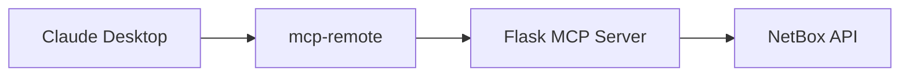

---

title: MCP Server for Netbox
authors: simonpainter
tags:
  - ai
  - networks
  - python
  - mcp
  - netbox
date: 2025-08-19

---

Netbox open sourced their [STDIO MCP server](https://github.com/netboxlabs/netbox-mcp-server) a while back and [I have been playing around with it since then](netbox-mcp.md). The installation requires some local dependencies and the setup process was a bit tricky, but I managed to get it up and running with some trial and error. I found it substantially harder to set up and wouldn't necessarily trust that the sort of people who would benefit from having access to it would be able to easily set it up so I wanted to create a more user-friendly installation process by building an [MCP server that runs remotely as a proxy to the Netbox API](https://github.com/simonpainter/netbox-mcp).
<!-- truncate -->
### MCP - remind me

MCP, or model context protocol, is the next big thing for AI. It's an [open standard for enabling AI models to understand and interact with their environment](https://github.com/modelcontextprotocol/modelcontextprotocol) more effectively. Large Language Models can query and interact with datasets with a model language that is effectively the AI equivalent of an API but with the ability for the LLMs to discover the tools at their disposal - a self documenting API of sorts.

```python
def get_mcp_tools():
    """Return MCP tool definitions"""
    return [
        {
            "name": "search_devices",
            "description": "Search for devices in NetBox",
            "inputSchema": {
                "type": "object",
                "properties": {
                    "name": {"type": "string", "description": "Device name (partial match)"},
                    "site": {"type": "string", "description": "Site name"},
                    "device_type": {"type": "string", "description": "Device type"},
                    "role": {"type": "string", "description": "Device role"},
                    "status": {"type": "string", "description": "Device status"},
                    "limit": {"type": "integer", "description": "Max results (default: 10)", "default": 10}
                }
            }
        },
        {
            "name": "get_device_details",
            "description": "Get detailed information about a specific device",
            "inputSchema": {
                "type": "object",
                "properties": {
                    "device_id": {"type": "integer", "description": "NetBox device ID"},
                    "device_name": {"type": "string", "description": "Device name (alternative to ID)"}
                }
            }
        },
        {
            "name": "get_sites",
            "description": "List all sites in NetBox",
            "inputSchema": {
                "type": "object",
                "properties": {
                    "name": {"type": "string", "description": "Site name filter"},
                    "region": {"type": "string", "description": "Region filter"},
                    "limit": {"type": "integer", "description": "Max results (default: 10)", "default": 10}
                }
            }
        },
        {
            "name": "search_ip_addresses",
            "description": "Search for IP addresses in NetBox",
            "inputSchema": {
                "type": "object",
                "properties": {
                    "address": {"type": "string", "description": "IP address or network"},
                    "vrf": {"type": "string", "description": "VRF name"},
                    "status": {"type": "string", "description": "IP status"},
                    "limit": {"type": "integer", "description": "Max results (default: 10)", "default": 10}
                }
            }
        }
    ]
```

You'll see I have only implemented 4 tools so far and the [Netbox API has many more](https://netboxlabs.com/docs/netbox/integrations/rest-api/) but the benefit of a centralised model is that it is easier to deploy and update new tools in future.

### Architectural Overview



>Here's how each component contributes:
>
> **Claude Desktop**: The AI interface where users ask natural language questions
>
> **mcp-remote**: An official adapter that bridges Claude's stdio transport to HTTP
>
> **Flask MCP Server**: My custom server implementing the MCP protocol
>
> **NetBox API**: The source of truth for network infrastructure data

The beauty of MCP is that once you build a server for your data source, any MCP-compatible AI application can use it. It's infrastructure for the AI-powered workplace.

### What Makes This Powerful

The real magic happens when you start using natural language to query complex network data. Instead of remembering NetBox's web interface or API syntax, you can ask:

`What devices do we have at the Manchester office?`

`Find devices with 'core' in their name`

Claude doesn't just return raw data—it understands context, formats responses clearly, and can even suggest next steps or identify potential issues.

We're entering an era where AI assistants will become integral to infrastructure management. The ability to query, analyse, and act on network data using natural language will change how we interact with our systems.

MCP provides the foundation for this transformation. As more organisations build MCP servers for their internal tools, we'll see AI assistants that truly understand our environments—not just as external observers, but as integral parts of our operational workflows.

The NetBox integration I've built is a proof of concept for this future. It demonstrates that with modest engineering effort, we can bridge the gap between AI capabilities and our existing infrastructure tools.

### What's Next?

The server is pretty basic at present and proxies a few of the capabilities of the Netbox API. I'll be adding to and extending it as time goes on. Contributions are of course welcome.

> Since writing this post I have expanded the MCP server capabilities so there are tools across the whole NetBox data model. Documentation of each one is in the [GitHub repository](https://github.com/simonpainter/netbox-mcp).
