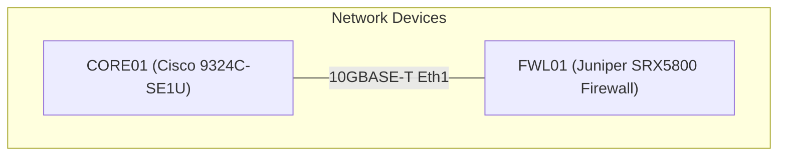

---

title: MCP for Netbox
authors: simonpainter
tags:
  - ai
  - networks
  - python
  - mcp
  - netbox
  - scripting
date: 2025-07-17

---

I've had some [concerns](mcp-server-document.md) around Model Context Protocol being a new fad to put another front end on poorly managed data, like the search appliances Google sold a decade and a half ago, but I had a play with the [MCP server for Netbox](https://github.com/netboxlabs/netbox-mcp-server) and it's pretty handy.
<!-- truncate -->
> Since writing this blog post I have created an open source Flask implementation of an MCP server for Netbox which you can find on [Github](https://github.com/simonpainter/netbox-mcp). This makes it easier to deploy as a standalone service that multiple users can connect to within your organisation. There is a bit more information in this [follow up blog post](netbox-mcp-server.md)

I have been a little busy since Easter but finally found some time today to dive into one of the two AI options that [NetBox released back in March](https://netboxlabs.com/blog/new-ways-use-ai-netbox-open-sourced/). The NetBox local MCP server installation was surprisingly straightforward (at least it is on a MacBook). All told, getting a fresh instance of NetBox with some dummy data and the MCP server up and running took only a couple of hours.

> If you have not used Netbox then shame on you, it's one of the
> best tools you can use for keeping track of all the physical stuff
> across your networks. It hold inventory information about pretty
> much everything from circuits to hardware, cable plans to rack
> locations and includes vlan information, IPAM and much more.

### Initial setup

I created a VM in Azure, for that is the quickest way to do anything, and then followed the excellent [Netbox quickstart installation instructions](https://netboxlabs.com/docs/netbox/installation/). The instructions included generating a self signed certificate and that posed a problem later but I'll come back to that. I then created a few random objects including switches and firewalls across a handful of sites. The names and inventory bear no relationship to anything factual and are mostly places I have visited in my travels.

Next came installing the MCP server itself. I just cloned [the repository](https://github.com/netboxlabs/netbox-mcp-server) and followed the instructions to install the required dependencies with `uv add -r requirements.txt`.

Within Netbox it is pretty trivial to create an API Token, that is one of only three bits of information you need to configure your LLM, in my case Claude Desktop, to connect to the MCP server.

> It's also worth pointing out at this point that there is a full
> featured [Netbox Teraform provider](https://registry.terraform.io/providers/ns1-infra/netbox/latest/docs) for those who want to
> combine their documentation-as-code with their
> infrastructure-as-code.

Within Claude Desktop you can use the developer extensions and then drop in config with the `path to the netbox server`, the `netbox URL` and your `API token`.

```json
{
  "mcpServers": {
        "netbox": {
            "command": "uv",
            "args": [
                "--directory",
                "/path/to/netbox-mcp-server",
                "run",
                "server.py"
            ],
            "env": {
                "NETBOX_URL": "https://netbox.example.com/",
                "NETBOX_TOKEN": "<your-api-token>"
            }
        }
    }
}
```

### It didn't work

The thing is, it's a bit of a pain to troubleshoot when it doesn't work. When it didn't work the error messages were pretty useless and unless you trawl logs it's hard to figure out what's wrong. I eventually figured out that the MCP server was using Python [requests](https://requests.readthedocs.io/en/latest/) which is understandably a bit fussy about self signed certificates by default. I could have tweaked the code to flag it to not check the cert or installed a trusted certificate but was already using Cloudflare so used the TLS enabled proxy capability. I had to do a bit of tweaking with CORS and switch to using http rather than https on the origin server (again something that a trusted cert could have fixed) but that was eventually enough to get it working. As I said, about two hours total.

### Starter for 10

I thought I would start simple

```in my netbox how many sites do I have```

Claude understood the intent of my questions and gave an accurate response.

```text
I'll check your NetBox to see how many sites you have configured.

You have 3 sites configured in your NetBox:

Ilkley (Stores group)
Winnersh Triangle (Datacentres group)
Skipton (Stores group)
All sites are in the UK region and have an active status. 
The sites are organized across two different site groups: 
Stores (2 sites), Datacentres (1 site)
```

### OK, but why

From time to time people want to know stuff right? Your boss wants to know if we have any of a certain device type because he as been asked by the CISO who is worried about a bug. Or they want to know if there is enough bandwidth in a site because the CEO is going to do an event there and wants to stream it. Over the last couple of decades I have spent many hours gathering data for request that have little or no context and wished I could give direct and easy user friendly access for the people asking the questions to get the information they need. Sure you can give them access to Netbox but if you'd met some of the people I have had queries like this from you wouldn't trust them to run a tap let alone a report on network inventory.

### Getting into it

```I want to know what firewalls I have```

This was a bit more reliant on the LLM to do some inference. I hadn't specifically listed anything as a firewall, just used real firewall models and given them roles that included the word firewall. I also didn't mention netbox explicitly in my prompt.

```text
I'll check your NetBox to see what firewalls you have configured.
Let me search for devices that might be firewalls.

Based on your NetBox inventory, you have 1 firewall:
FWL01 - Juniper SRX5800

Location: Winnersh Triangle (Datacentre)
Role: Datacentre Firewall
Status: Active
Interfaces: 2 configured interfaces

The rest of your devices are network switches:

2x Cisco Catalyst 3850-24U-L switches (Edge Switches at 
Skipton and Ilkley stores)
2x Cisco Nexus switches (Datacentre Switches at Winnersh 
Triangle location)

So currently you have a single enterprise-grade Juniper 
SRX5800 firewall deployed at your main datacentre location.
```

This was an excellent response and one that I could see being really useful for people outside of the engineering teams.

I decided to get even more involved with Claude and ask for more useful detail.

```what is that firewall connected to```

This uses the context of the previous prompt to gather more detail about the firewall.

```text
I'll check what the firewall (FWL01) is connected to by looking at its interfaces and any cable connections.
Now let me get more details about the cable connection to see the full topology:
Based on the NetBox data, here's what your firewall FWL01 (Juniper SRX5800) is connected to:

Connected Interface:
Inside interface → Connected via Cable #1 to CORE01 (Cisco 9324C-SE1U switch) interface Eth1
Connection type: 10GBASE-T (10GE)
Status: Connected and active

Unconnected Interface:
Outside interface → Not connected to anything currently
Connection type: 10GBASE-T (10GE)
Status: Available but no cable connection

So your firewall is currently connected on the inside/LAN side to your core datacentre switch (CORE01) at Winnersh Triangle, but the outside/WAN interface appears to be available for connection to your internet provider or upstream network. This is a typical setup where the inside interface handles internal network traffic and the outside interface would connect to your internet service provider or external network.
```

I really can't fault the additional information around that response. I think I have heard that sort of conversation a dozen times before.

### Now for something a bit tougher

```what end of life switches should I replace```

Again this is a prompt that doesn't explicitly mention Netbox. I am running the latest Claude model and it has web search and research turn on so I was optimistic about it performing one of those tasks that we do pretty regularly around budget time.

```text
Let me search for information about the current end-of-life status of your Cisco 
switches to help you determine which ones need replacement.
Now let me check the status of your Cisco Nexus switches.

Based on my research, here are the end-of-life switches you should prioritize
for replacement:
Critical Priority - Replace Immediately
Cisco Catalyst 3850-24U-L Switches (SW01 & SW02)
End of Support: October 31, 2025
Locations: Skipton and Ilkley (your store locations)
Status: Cisco hardware warranty ends October 31, 2025, and they will no longer 
receive security patches or vulnerability support.
```

I further refined the query to check the dates and format it into a table; it worked flawlessly. I also asked for a diagram which created something pretty cluttered but once I clarified it a bit the results were good.

```redraw it only showing connected interfaces```



### The big questions

So is it ready for production use? For most network teams, yes. The MCP server transforms NetBox from a technical database into a conversational interface that non-technical stakeholders can actually use. While the initial setup required some troubleshooting and the error messages could be clearer, the time investment pays off quickly. I was particularly impressed when it generated a comprehensive KTLO roadmap in under two minutes — a task that typically takes me hours and that I genuinely dislike doing.

My initial skepticism about MCP being _just another front-end_ might be unfounded. This one isn't about putting lipstick on poorly managed data; it's about making well-structured NetBox data accessible to people who wouldn't otherwise use it. If your organisation is comfortable with LLM usage and you're already maintaining quality data in NetBox, this tool will save significant time for both technical and business users.
