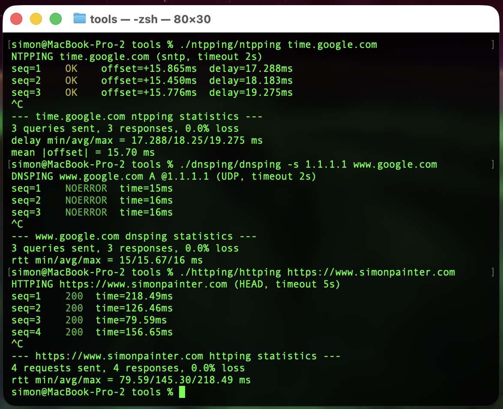

I saw a clever little tool on LinkedIn the other week. Someone had written a "ping" in Go that fired HTTP requests instead of ICMP echoes. I sent it over to Zain and we both agreed the idea was great. But writing it in Go felt like a lot of effort for what is, at heart, a loop around `curl`. So I wrote a Bash version in about ten minutes. Then I wrote one for DNS. Then one for NTP. They all live here now: [@simonpainter/network-tools](https://github.com/simonpainter/network-tools).

<!-- truncate -->



## Why not just use ping?

ICMP `ping` is the first thing most of us reach for when something feels slow or broken. It's quick, it's everywhere, and it gives you a number. The trouble is that number tells you about ICMP, and ICMP isn't what your users are actually doing.

A load balancer might happily reply to ICMP while the backend pool is on fire. A firewall might rate-limit or drop ICMP entirely while letting TCP through. A DNS resolver might be reachable but refusing to answer queries. An NTP server might be up but giving you a clock that's drifted. In each case `ping` says "fine" and the application says "broken".

TCP ping (things like `tcping`, `hping3 -S`, or `nc -z` in a loop) gets you closer. It opens a TCP connection on the right port, so a firewall blocking ICMP can't fool you and a dead listener shows up as a refused connection. That's a real improvement over ICMP. But it stops at the handshake. A successful TCP ping tells you the socket opened. It doesn't tell you the web server returned a 200, the resolver answered `NOERROR`, or the time source gave you a sane offset. The application layer is still hidden from you.

The fix isn't a cleverer ping. It's pinging with the protocol that actually matters.

## Three small tools

Each script does the same thing in spirit: send a request, time it, print a line, repeat. Then on Ctrl+C, print min/avg/max. Just like `ping`, but speaking a real protocol.

### httping

A loop around `curl` that sends `HEAD` requests by default and prints the status code and total time.

```bash
./httping/httping https://www.simonpainter.com
```

```text
HTTPING https://www.simonpainter.com (HEAD, timeout 5s)
seq=1    200  time=218.49ms
seq=2    200  time=126.46ms
seq=3    200  time=79.59ms
seq=4    200  time=156.65ms
^C
--- https://www.simonpainter.com httping statistics ---
4 requests sent, 4 responses, 0.0% loss
rtt min/avg/max = 79.59/145.30/218.49 ms
```

There's a `-d` flag for a detailed breakdown using curl's built-in `time_namelookup`, `time_connect`, `time_appconnect` and `time_starttransfer` variables, which is handy when you want to see whether the slow bit is DNS, the TCP handshake, TLS, or the server itself.

### dnsping

A loop around `dig`. It sends a query, reads the response code (`NOERROR`, `NXDOMAIN`, `SERVFAIL`...) and the query time `dig` already prints in its stats line.

```bash
./dnsping/dnsping -s 1.1.1.1 www.google.com
```

```text
DNSPING www.google.com A @1.1.1.1 (UDP, timeout 2s)
seq=1    NOERROR  time=15ms
seq=2    NOERROR  time=16ms
seq=3    NOERROR  time=16ms
^C
--- www.google.com dnsping statistics ---
3 queries sent, 3 responses, 0.0% loss
rtt min/avg/max = 15/15.67/16 ms
```

You can pick the resolver with `-s`, the record type with `-t`, force TCP with `-T`, or do a reverse lookup with `-x`. It's the same set of flags `dig` already gives you, just wrapped in a tighter loop.

### ntpping

A loop around `sntp`. NTP's a bit special because the response carries two useful numbers: the round-trip delay and the offset between your clock and the server's clock.

```bash
./ntpping/ntpping time.google.com
```

```text
NTPPING time.google.com (sntp, timeout 2s)
seq=1   OK      offset=+15.865ms        delay=17.288ms
seq=2   OK      offset=+15.450ms        delay=18.183ms
seq=3   OK      offset=+15.776ms        delay=19.275ms
^C
--- time.google.com ntpping statistics ---
3 queries sent, 3 responses, 0.0% loss
delay min/avg/max = 17.288/18.25/19.275 ms
mean |offset| = 15.70 ms
```

Lines are colour-coded by the size of the offset, so a server that's drifted is obvious at a glance.

## How they're built

There's no magic here. Each script parses its arguments, prints a header, sets a Ctrl+C trap to dump stats, then loops: run the protocol client, parse the response, print a line, update the running min/avg/max, sleep, repeat.

The only bit that changes between tools is the client call. For `httping` it's `curl -w` with a format string that asks for the status code and `time_total`. For `dnsping` it's `dig +stats` and a couple of `awk` lines to pull the status and the "Query time" field. For `ntpping` it's `sntp` with `-K /dev/null` and a regex for the offset and delay.

The maths is done with `awk` because Bash can't do floating point natively. Stats are kept as plain shell variables and updated each iteration. The whole thing is under 200 lines per tool.

That's really the point. The hard work has already been done by `curl`, `dig` and `sntp`. They speak the protocols, handle TLS, retries, IPv6, all of it. Wrapping them in a `while` loop with a stats trap is a tiny amount of code for a tool you'll actually use.

## Where I think I will find them useful

I'm slap bang in the middle of a datacentre migration right now. The team is all over the application migrations but pretty soon the network part is going to get very noisy. Moving essential services like DNS, NTP and load balancers is always a bit nerve wracking and watching the pings is sometimes the only thing you can do.

### Server and load balancer migrations

When you're cutting traffic over to a new pool, ICMP tells you nothing useful. The old VIP and the new VIP both reply to pings whether the backend is healthy or not. `httping` against the actual health endpoint, run from a few different vantage points, gives you a real signal. You can leave it running through the change window and watch the status codes flip.

The `-d` flag is a quiet hero here. If response times jump after a cutover, the breakdown tells you whether it's DNS pointing at a stale record, a slow TLS handshake on a new certificate, or the application itself taking longer to respond.

### DNS migrations

Moving authoritative DNS, swapping resolvers, or rolling out a new DNS firewall? Point `dnsping` at the old server and the new one in two terminal panes and watch them side by side. You'll see propagation as it happens, spot any `SERVFAIL` responses the moment they appear, and get a feel for the latency difference between resolvers without having to script anything.

It's also brilliant for catching the resolver that's silently truncating responses. Force TCP with `-T` and compare the times.

### NTP migrations

NTP is the protocol nobody thinks about until clocks drift and Kerberos breaks. `ntpping` lets you quickly verify a new time source before you point production at it. If the offset is bouncing around or the delay is wildly variable, that server isn't ready to be a stratum source for anything that matters.

It's also handy when you're moving workloads between regions or clouds and want to confirm the local NTP service is actually local and not a few hundred milliseconds away.

### Latency testing with the real protocol

This is the use case that started the whole thing. ICMP latency and application latency are not the same number. A path that's 5ms on `ping` can easily be 50ms on HTTPS once you add the TCP handshake, TLS negotiation and a server that's slow to respond. `httping` gives you the number your users actually experience. `dnsping` gives you the number that determines whether your page loads quickly. `ntpping` gives you the number that decides whether your distributed system stays in sync.

If you're measuring latency for an SLA, a capacity plan or a migration sign-off, measure it with the protocol the application uses. Not ICMP.

## Try them

The repo is at [@simonpainter/network-tools](https://github.com/simonpainter/network-tools). They're plain Bash, MIT licensed, and need only `curl`, `dig` and `sntp` which you almost certainly already have. Clone it, drop the scripts on your `PATH`, and the next time someone says "the network is slow" you'll have something better than `ping` to point at the problem.
